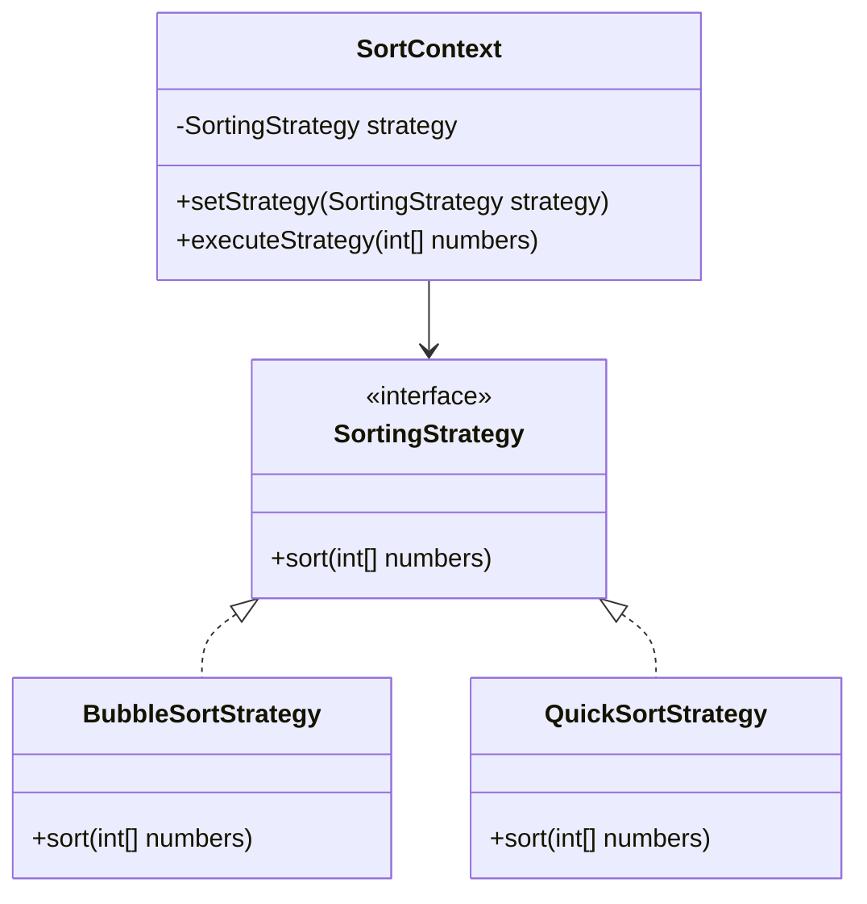

## 5.10.5 Use Cases and Examples

The Strategy Pattern is a powerful behavioral design pattern that enables an algorithm's behavior to be selected at runtime. It defines a family of algorithms, encapsulates each one, and makes them interchangeable. This pattern is particularly useful in scenarios where multiple algorithms can be applied to a problem, and the choice of algorithm is determined by the context in which it is used.

### Real-World Scenarios Utilizing the Strategy Pattern

The Strategy Pattern is widely used in software development to promote flexibility and reusability. Let's explore some real-world scenarios where this pattern shines:

1. **Sorting Algorithms**: Different sorting algorithms can be applied based on the data size and characteristics. For instance, quicksort is efficient for large datasets, while insertion sort might be more suitable for small or nearly sorted datasets.

2. **Validation Mechanisms**: Validation rules can vary based on the context, such as user input validation, data format validation, or business rule validation. The Strategy Pattern allows for dynamic selection of validation strategies.

3. **Payment Processing Systems**: In e-commerce applications, different payment methods (credit card, PayPal, cryptocurrency) can be implemented as strategies, allowing the system to switch between them seamlessly.

4. **Compression Algorithms**: Applications that handle file compression can use different algorithms (e.g., ZIP, RAR, GZIP) as strategies, enabling users to choose the most suitable one for their needs.

5. **Game Development**: In games, different AI behaviors (aggressive, defensive, neutral) can be implemented as strategies, allowing for dynamic changes in gameplay.

### Implementing Sorting Strategies with the Strategy Pattern

Sorting algorithms are a classic example where the Strategy Pattern can be effectively applied. Let's consider a scenario where we need to sort a collection of integers using different algorithms based on the context.

#### Code Example: Sorting Strategies

```java
// Strategy interface
interface SortingStrategy {
    void sort(int[] numbers);
}

// Concrete strategy for Bubble Sort
class BubbleSortStrategy implements SortingStrategy {
    @Override
    public void sort(int[] numbers) {
        int n = numbers.length;
        for (int i = 0; i < n - 1; i++) {
            for (int j = 0; j < n - i - 1; j++) {
                if (numbers[j] > numbers[j + 1]) {
                    // Swap numbers[j] and numbers[j+1]
                    int temp = numbers[j];
                    numbers[j] = numbers[j + 1];
                    numbers[j + 1] = temp;
                }
            }
        }
    }
}

// Concrete strategy for Quick Sort
class QuickSortStrategy implements SortingStrategy {
    @Override
    public void sort(int[] numbers) {
        quickSort(numbers, 0, numbers.length - 1);
    }

    private void quickSort(int[] numbers, int low, int high) {
        if (low < high) {
            int pi = partition(numbers, low, high);
            quickSort(numbers, low, pi - 1);
            quickSort(numbers, pi + 1, high);
        }
    }

    private int partition(int[] numbers, int low, int high) {
        int pivot = numbers[high];
        int i = (low - 1);
        for (int j = low; j < high; j++) {
            if (numbers[j] < pivot) {
                i++;
                int temp = numbers[i];
                numbers[i] = numbers[j];
                numbers[j] = temp;
            }
        }
        int temp = numbers[i + 1];
        numbers[i + 1] = numbers[high];
        numbers[high] = temp;
        return i + 1;
    }
}

// Context class
class SortContext {
    private SortingStrategy strategy;

    public void setStrategy(SortingStrategy strategy) {
        this.strategy = strategy;
    }

    public void executeStrategy(int[] numbers) {
        strategy.sort(numbers);
    }
}

// Client code
public class StrategyPatternExample {
    public static void main(String[] args) {
        int[] numbers = {5, 3, 8, 6, 2};

        SortContext context = new SortContext();

        // Using Bubble Sort
        context.setStrategy(new BubbleSortStrategy());
        context.executeStrategy(numbers);
        System.out.println("Bubble Sorted: " + Arrays.toString(numbers));

        // Using Quick Sort
        context.setStrategy(new QuickSortStrategy());
        context.executeStrategy(numbers);
        System.out.println("Quick Sorted: " + Arrays.toString(numbers));
    }
}
```

In this example, we define a `SortingStrategy` interface with a `sort` method. Two concrete strategies, `BubbleSortStrategy` and `QuickSortStrategy`, implement this interface. The `SortContext` class maintains a reference to a `SortingStrategy` and delegates the sorting task to the current strategy. The client code demonstrates how to switch between different sorting strategies at runtime.

### Validation Mechanisms Using the Strategy Pattern

Validation is another area where the Strategy Pattern can be applied effectively. Consider a scenario where we need to validate user input based on different criteria.

#### Code Example: Validation Strategies

```java
// Strategy interface
interface ValidationStrategy {
    boolean validate(String data);
}

// Concrete strategy for email validation
class EmailValidationStrategy implements ValidationStrategy {
    @Override
    public boolean validate(String data) {
        return data.matches("^[A-Za-z0-9+_.-]+@(.+)$");
    }
}

// Concrete strategy for phone number validation
class PhoneNumberValidationStrategy implements ValidationStrategy {
    @Override
    public boolean validate(String data) {
        return data.matches("\\d{10}");
    }
}

// Context class
class ValidationContext {
    private ValidationStrategy strategy;

    public void setStrategy(ValidationStrategy strategy) {
        this.strategy = strategy;
    }

    public boolean executeStrategy(String data) {
        return strategy.validate(data);
    }
}

// Client code
public class ValidationExample {
    public static void main(String[] args) {
        ValidationContext context = new ValidationContext();

        // Validate email
        context.setStrategy(new EmailValidationStrategy());
        System.out.println("Email valid: " + context.executeStrategy("example@example.com"));

        // Validate phone number
        context.setStrategy(new PhoneNumberValidationStrategy());
        System.out.println("Phone number valid: " + context.executeStrategy("1234567890"));
    }
}
```

In this example, we define a `ValidationStrategy` interface with a `validate` method. Two concrete strategies, `EmailValidationStrategy` and `PhoneNumberValidationStrategy`, implement this interface. The `ValidationContext` class maintains a reference to a `ValidationStrategy` and delegates the validation task to the current strategy. The client code demonstrates how to switch between different validation strategies at runtime.

### Try It Yourself

Experiment with the provided code examples by modifying the strategies or adding new ones. For instance, try implementing a `MergeSortStrategy` or a `PostalCodeValidationStrategy`. Observe how easy it is to integrate new strategies without altering the existing codebase.

### Visualizing the Strategy Pattern

To better understand the Strategy Pattern, let's visualize the relationships between the context, strategy interface, and concrete strategies.



In this diagram, the `SortContext` class is associated with the `SortingStrategy` interface, and the concrete strategies (`BubbleSortStrategy` and `QuickSortStrategy`) implement the `SortingStrategy` interface. This structure allows the context to switch strategies dynamically.

### Knowledge Check

- **Question**: What are the benefits of using the Strategy Pattern in sorting algorithms?
  - **Answer**: The Strategy Pattern allows for flexible swapping of sorting algorithms at runtime, enabling the selection of the most efficient algorithm based on the data characteristics.

- **Question**: How does the Strategy Pattern enhance validation mechanisms?
  - **Answer**: The Strategy Pattern enables dynamic selection of validation rules, allowing for context-specific validation without modifying the existing codebase.

### Summary of Key Takeaways

- The Strategy Pattern promotes flexibility and reusability by allowing algorithms to be selected at runtime.
- It is particularly useful in scenarios where multiple algorithms can be applied, such as sorting and validation.
- The pattern consists of a strategy interface, concrete strategies, and a context class that delegates tasks to the current strategy.
- Visualizing the pattern helps in understanding the relationships between the components and how they interact.

### Embrace the Journey

Remember, the Strategy Pattern is just one of many design patterns that can enhance your software development skills. As you continue to explore and experiment with different patterns, you'll gain a deeper understanding of how to build flexible, maintainable, and scalable applications. Keep experimenting, stay curious, and enjoy the journey!

## Quiz Time!



### What is the primary benefit of using the Strategy Pattern?

- [x] It allows algorithms to be selected at runtime.
- [ ] It reduces the number of classes in a program.
- [ ] It simplifies the user interface.
- [ ] It eliminates the need for interfaces.

> **Explanation:** The Strategy Pattern allows for flexible swapping of algorithms at runtime, making it ideal for scenarios where different strategies may be needed.

### Which of the following is a real-world use case for the Strategy Pattern?

- [x] Sorting algorithms
- [ ] Singleton instances
- [ ] Database connections
- [ ] Thread synchronization

> **Explanation:** Sorting algorithms are a classic example of where the Strategy Pattern can be applied to choose the most efficient algorithm based on the context.

### How does the Strategy Pattern enhance validation mechanisms?

- [x] By enabling dynamic selection of validation rules
- [ ] By reducing the number of validation rules
- [ ] By simplifying the user interface
- [ ] By eliminating the need for validation

> **Explanation:** The Strategy Pattern allows for context-specific validation by dynamically selecting the appropriate validation strategy.

### In the provided code example, what is the role of the `SortContext` class?

- [x] It maintains a reference to a `SortingStrategy` and delegates sorting tasks.
- [ ] It implements the sorting algorithms.
- [ ] It provides user input for sorting.
- [ ] It defines the sorting strategy interface.

> **Explanation:** The `SortContext` class is responsible for maintaining a reference to a `SortingStrategy` and delegating sorting tasks to the current strategy.

### Which of the following is a concrete strategy in the sorting example?

- [x] BubbleSortStrategy
- [ ] SortingStrategy
- [ ] SortContext
- [ ] ValidationStrategy

> **Explanation:** `BubbleSortStrategy` is a concrete strategy that implements the `SortingStrategy` interface.

### What is the purpose of the `ValidationStrategy` interface in the validation example?

- [x] It defines a method for validating data.
- [ ] It provides user input for validation.
- [ ] It implements the validation rules.
- [ ] It maintains a reference to a validation context.

> **Explanation:** The `ValidationStrategy` interface defines a method for validating data, allowing different validation strategies to be implemented.

### How can new strategies be integrated into the existing codebase?

- [x] By implementing the strategy interface and adding the new strategy to the context
- [ ] By modifying the existing strategies
- [ ] By changing the context class
- [ ] By eliminating the need for a strategy interface

> **Explanation:** New strategies can be integrated by implementing the strategy interface and adding the new strategy to the context, without altering existing code.

### What is the relationship between the context and strategy in the Strategy Pattern?

- [x] The context maintains a reference to the strategy and delegates tasks to it.
- [ ] The strategy maintains a reference to the context and delegates tasks to it.
- [ ] The context implements the strategy interface.
- [ ] The strategy defines the context class.

> **Explanation:** In the Strategy Pattern, the context maintains a reference to the strategy and delegates tasks to it, allowing for dynamic strategy selection.

### Which of the following is NOT a benefit of the Strategy Pattern?

- [ ] Flexibility in algorithm selection
- [ ] Reusability of code
- [x] Reduction in the number of classes
- [ ] Separation of concerns

> **Explanation:** While the Strategy Pattern provides flexibility and reusability, it does not necessarily reduce the number of classes, as each strategy is typically implemented as a separate class.

### True or False: The Strategy Pattern can be used to implement different payment methods in an e-commerce application.

- [x] True
- [ ] False

> **Explanation:** True. The Strategy Pattern can be used to implement different payment methods, allowing the system to switch between them seamlessly.


