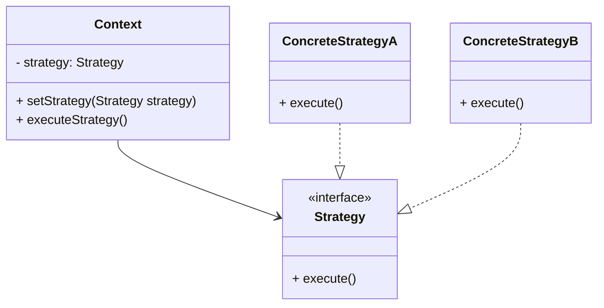
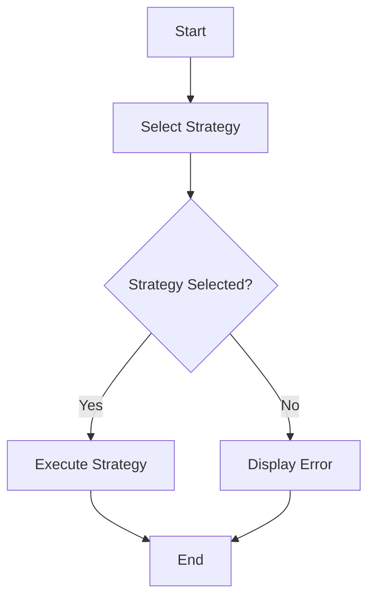

## 5.10 Strategy Pattern

### Introduction

The Strategy Pattern is a powerful behavioral design pattern that enables you to define a family of algorithms, encapsulate each one, and make them interchangeable. This pattern allows the algorithm to vary independently from the clients that use it, promoting flexibility and reusability in software design. By decoupling the algorithm from the context in which it is used, the Strategy Pattern provides a way to define a set of interchangeable behaviors that can be selected at runtime.

### Problem Addressed by the Strategy Pattern

In software development, it's common to encounter scenarios where multiple algorithms can be applied to solve a problem. For instance, consider a sorting application that needs to support different sorting algorithms like QuickSort, MergeSort, and BubbleSort. Hardcoding these algorithms into the application would lead to a rigid and inflexible design, making it difficult to add new algorithms or modify existing ones.

The Strategy Pattern addresses this problem by allowing you to define a family of algorithms and encapsulate each one in a separate class. This encapsulation makes it easy to switch between algorithms without altering the client code that uses them. The pattern also promotes the Open/Closed Principle, which states that software entities should be open for extension but closed for modification.

### Key Components of the Strategy Pattern

The Strategy Pattern consists of the following key components:

1. **Strategy Interface**: This interface defines a common method that all concrete strategies must implement. It represents the family of algorithms.

2. **Concrete Strategy Classes**: These classes implement the Strategy interface, providing specific implementations of the algorithm.

3. **Context Class**: This class maintains a reference to a Strategy object and delegates the algorithm's execution to the strategy object. The context is not aware of the specific strategy it uses, which allows for interchangeable strategies.

### UML Diagram of the Strategy Pattern

Below is a UML diagram illustrating the Strategy Pattern:



### Implementing the Strategy Pattern in Java

Let's delve into a practical example to understand how the Strategy Pattern can be implemented in Java. We'll create a simple application that performs different types of sorting based on the strategy selected.

#### Step 1: Define the Strategy Interface

First, we define the `Strategy` interface, which declares a method for executing the algorithm.

```java
public interface SortingStrategy {
    void sort(int[] numbers);
}
```

#### Step 2: Implement Concrete Strategy Classes

Next, we implement concrete strategies that provide specific sorting algorithms.

```java
public class BubbleSortStrategy implements SortingStrategy {
    @Override
    public void sort(int[] numbers) {
        // Bubble sort algorithm
        int n = numbers.length;
        for (int i = 0; i < n - 1; i++) {
            for (int j = 0; j < n - i - 1; j++) {
                if (numbers[j] > numbers[j + 1]) {
                    // Swap numbers[j] and numbers[j+1]
                    int temp = numbers[j];
                    numbers[j] = numbers[j + 1];
                    numbers[j + 1] = temp;
                }
            }
        }
        System.out.println("Sorted using Bubble Sort");
    }
}

public class QuickSortStrategy implements SortingStrategy {
    @Override
    public void sort(int[] numbers) {
        quickSort(numbers, 0, numbers.length - 1);
        System.out.println("Sorted using Quick Sort");
    }

    private void quickSort(int[] arr, int low, int high) {
        if (low < high) {
            int pi = partition(arr, low, high);
            quickSort(arr, low, pi - 1);
            quickSort(arr, pi + 1, high);
        }
    }

    private int partition(int[] arr, int low, int high) {
        int pivot = arr[high];
        int i = (low - 1);
        for (int j = low; j < high; j++) {
            if (arr[j] <= pivot) {
                i++;
                // Swap arr[i] and arr[j]
                int temp = arr[i];
                arr[i] = arr[j];
                arr[j] = temp;
            }
        }
        // Swap arr[i+1] and arr[high] (or pivot)
        int temp = arr[i + 1];
        arr[i + 1] = arr[high];
        arr[high] = temp;
        return i + 1;
    }
}
```

#### Step 3: Implement the Context Class

The `Context` class maintains a reference to a `Strategy` object and delegates the sorting task to the strategy.

```java
public class SortingContext {
    private SortingStrategy strategy;

    public void setStrategy(SortingStrategy strategy) {
        this.strategy = strategy;
    }

    public void sortArray(int[] numbers) {
        if (strategy != null) {
            strategy.sort(numbers);
        } else {
            System.out.println("No sorting strategy set");
        }
    }
}
```

#### Step 4: Using the Strategy Pattern

Finally, let's see how we can use the Strategy Pattern in a client application.

```java
public class StrategyPatternDemo {
    public static void main(String[] args) {
        SortingContext context = new SortingContext();

        int[] numbers = {5, 2, 9, 1, 5, 6};

        // Set BubbleSortStrategy
        context.setStrategy(new BubbleSortStrategy());
        context.sortArray(numbers);

        // Set QuickSortStrategy
        context.setStrategy(new QuickSortStrategy());
        context.sortArray(numbers);
    }
}
```

### Benefits of the Strategy Pattern

The Strategy Pattern offers several benefits:

- **Flexibility**: It allows you to switch between different algorithms at runtime without modifying the client code.

- **Reusability**: By encapsulating algorithms in separate classes, you can reuse them across different contexts.

- **Maintainability**: The pattern promotes the Single Responsibility Principle by separating the algorithm's implementation from the context.

- **Extensibility**: Adding new algorithms is straightforward and does not require changes to existing code.

### Try It Yourself

To deepen your understanding of the Strategy Pattern, try modifying the code examples provided. Here are some suggestions:

- Implement additional sorting algorithms, such as MergeSort or InsertionSort, and integrate them into the existing framework.

- Experiment with different data types, such as sorting strings or custom objects, by modifying the `SortingStrategy` interface.

- Create a user interface that allows users to select the sorting algorithm at runtime.

### Visualizing the Strategy Pattern

To further illustrate the Strategy Pattern, let's visualize the process of selecting and executing a strategy using a flowchart.



### Knowledge Check

Before we wrap up, let's test your understanding of the Strategy Pattern with a few questions:

1. What is the primary purpose of the Strategy Pattern?
2. How does the Strategy Pattern promote the Open/Closed Principle?
3. What are the key components of the Strategy Pattern?
4. How can you add a new algorithm to a system that uses the Strategy Pattern?
5. What are some real-world scenarios where the Strategy Pattern can be applied?

### Conclusion

The Strategy Pattern is a versatile and powerful design pattern that enhances the flexibility and reusability of software systems. By encapsulating algorithms in separate classes, it allows you to switch between different behaviors at runtime, promoting a clean and maintainable design. As you continue to explore design patterns, remember that the Strategy Pattern is just one tool in your toolkit for building robust and adaptable software.

## Quiz Time!



### What is the primary purpose of the Strategy Pattern?

- [x] To define a family of algorithms and make them interchangeable
- [ ] To encapsulate object creation
- [ ] To provide a simplified interface to a complex subsystem
- [ ] To allow incompatible interfaces to work together

> **Explanation:** The Strategy Pattern is designed to define a family of algorithms, encapsulate each one, and make them interchangeable.

### How does the Strategy Pattern promote the Open/Closed Principle?

- [x] By allowing new algorithms to be added without modifying existing code
- [ ] By encapsulating object creation
- [ ] By providing a simplified interface to a complex subsystem
- [ ] By allowing incompatible interfaces to work together

> **Explanation:** The Strategy Pattern promotes the Open/Closed Principle by allowing new algorithms to be added without changing the existing code structure.

### What are the key components of the Strategy Pattern?

- [x] Strategy Interface, Concrete Strategy Classes, Context Class
- [ ] Singleton, Factory, Observer
- [ ] Adapter, Facade, Proxy
- [ ] Command, Chain of Responsibility, Mediator

> **Explanation:** The key components of the Strategy Pattern are the Strategy Interface, Concrete Strategy Classes, and the Context Class.

### How can you add a new algorithm to a system that uses the Strategy Pattern?

- [x] Implement a new Concrete Strategy Class
- [ ] Modify the existing Context Class
- [ ] Change the Strategy Interface
- [ ] Alter the existing Concrete Strategy Classes

> **Explanation:** To add a new algorithm, you simply implement a new Concrete Strategy Class without modifying existing code.

### What are some real-world scenarios where the Strategy Pattern can be applied?

- [x] Sorting algorithms, payment methods, route planning
- [ ] Object creation, resource management, data access
- [ ] Event handling, state management, command execution
- [ ] Data transformation, input validation, output formatting

> **Explanation:** The Strategy Pattern can be applied in scenarios like sorting algorithms, payment methods, and route planning where interchangeable behaviors are needed.

### Which principle does the Strategy Pattern help to achieve?

- [x] Single Responsibility Principle
- [ ] Dependency Inversion Principle
- [ ] Interface Segregation Principle
- [ ] Liskov Substitution Principle

> **Explanation:** The Strategy Pattern helps achieve the Single Responsibility Principle by separating the algorithm's implementation from the context.

### What is the role of the Context class in the Strategy Pattern?

- [x] To maintain a reference to a Strategy object and delegate algorithm execution
- [ ] To define the algorithm interface
- [ ] To implement specific algorithms
- [ ] To provide a simplified interface to a complex subsystem

> **Explanation:** The Context class maintains a reference to a Strategy object and delegates the execution of the algorithm to it.

### In the Strategy Pattern, how are algorithms encapsulated?

- [x] In separate Concrete Strategy Classes
- [ ] In the Context Class
- [ ] In the Strategy Interface
- [ ] In the Client Code

> **Explanation:** Algorithms are encapsulated in separate Concrete Strategy Classes, allowing them to be interchangeable.

### What is a benefit of using the Strategy Pattern?

- [x] Enhanced flexibility and reusability
- [ ] Simplified object creation
- [ ] Reduced memory usage
- [ ] Improved data access

> **Explanation:** The Strategy Pattern enhances flexibility and reusability by allowing interchangeable algorithms.

### True or False: The Strategy Pattern allows algorithms to vary independently from clients that use them.

- [x] True
- [ ] False

> **Explanation:** True. The Strategy Pattern allows algorithms to vary independently from the clients that use them, promoting flexibility.



Remember, this is just the beginning. As you progress, you'll build more complex and interactive applications using the Strategy Pattern. Keep experimenting, stay curious, and enjoy the journey!
