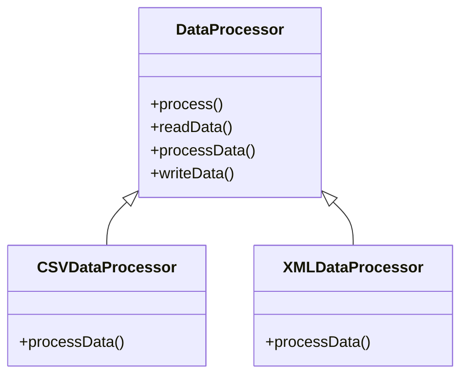

## 5.11.1 Implementing Template Method in Java

The Template Method Pattern is a powerful behavioral design pattern that defines the skeleton of an algorithm in an abstract class, allowing subclasses to override specific steps without changing the algorithm's structure. This pattern is particularly useful when you have multiple classes that follow the same algorithm but implement some steps differently.

### Understanding the Template Method Pattern

The Template Method Pattern is all about defining a method in a base class that outlines the steps of an algorithm. Some of these steps are implemented in the base class, while others are left abstract, allowing subclasses to provide their own implementations. This approach promotes code reuse and ensures consistency across different implementations.

#### Key Concepts

- **Template Method**: A method in the base class that defines the algorithm's structure. It calls other methods, some of which may be abstract.
- **Abstract Methods**: Methods declared in the base class but implemented in subclasses. These represent the variable parts of the algorithm.
- **Concrete Methods**: Methods that have a fixed implementation in the base class and are called by the template method.

### Implementing the Template Method Pattern

Let's walk through the implementation of the Template Method Pattern in Java with a step-by-step guide.

#### Step 1: Define the Abstract Class

The abstract class will contain the template method and any concrete methods. It will also declare abstract methods that subclasses must implement.

```java
abstract class DataProcessor {
    
    // Template method
    public final void process() {
        readData();
        processData();
        writeData();
    }

    // Concrete method
    void readData() {
        System.out.println("Reading data from source...");
    }

    // Abstract methods
    abstract void processData();

    void writeData() {
        System.out.println("Writing data to destination...");
    }
}
```

In this example, `DataProcessor` is an abstract class with a template method `process()`. The `process()` method outlines the steps of the algorithm: reading data, processing data, and writing data. The `readData()` and `writeData()` methods are concrete, while `processData()` is abstract, allowing subclasses to provide specific implementations.

#### Step 2: Create Subclasses

Subclasses will extend the abstract class and provide implementations for the abstract methods.

```java
class CSVDataProcessor extends DataProcessor {

    @Override
    void processData() {
        System.out.println("Processing CSV data...");
    }
}

class XMLDataProcessor extends DataProcessor {

    @Override
    void processData() {
        System.out.println("Processing XML data...");
    }
}
```

Here, `CSVDataProcessor` and `XMLDataProcessor` are subclasses of `DataProcessor`. They provide specific implementations for the `processData()` method.

#### Step 3: Use the Template Method

To use the template method, create instances of the subclasses and call the template method.

```java
public class TemplateMethodDemo {
    public static void main(String[] args) {
        DataProcessor csvProcessor = new CSVDataProcessor();
        csvProcessor.process();

        DataProcessor xmlProcessor = new XMLDataProcessor();
        xmlProcessor.process();
    }
}
```

When you run this code, it will output:

```
Reading data from source...
Processing CSV data...
Writing data to destination...
Reading data from source...
Processing XML data...
Writing data to destination...
```

### Best Practices for Designing Template Methods

1. **Keep Template Methods Simple**: The template method should be as simple as possible, focusing on the algorithm's structure. Avoid adding complex logic within the template method itself.

2. **Use Final Modifier**: Declare the template method as `final` to prevent subclasses from overriding it. This ensures that the algorithm's structure remains unchanged.

3. **Minimize Concrete Methods**: While concrete methods can be part of the base class, aim to keep them minimal. The focus should be on defining abstract methods that subclasses can implement.

4. **Document the Algorithm**: Clearly document the purpose of each step in the template method. This helps maintainers understand the algorithm's flow and the role of each method.

5. **Consider Hook Methods**: Hook methods are optional methods in the base class that subclasses can override. They provide additional flexibility without altering the template method's structure.

### Visualizing the Template Method Pattern

To better understand the Template Method Pattern, let's visualize it using a class diagram.



In this diagram, `DataProcessor` is the abstract class with the template method `process()`. `CSVDataProcessor` and `XMLDataProcessor` are subclasses that implement the `processData()` method.

### Try It Yourself

Experiment with the Template Method Pattern by modifying the code examples. Here are some suggestions:

- **Add a New Subclass**: Create a new subclass, such as `JSONDataProcessor`, and implement the `processData()` method to handle JSON data.
- **Modify Concrete Methods**: Change the implementation of `readData()` or `writeData()` to simulate reading from or writing to different sources.
- **Introduce Hook Methods**: Add a hook method in the `DataProcessor` class that subclasses can override to perform additional actions before or after processing data.

### Knowledge Check

Let's reinforce what we've learned with a few questions:

1. What is the purpose of the template method in the Template Method Pattern?
2. Why should the template method be declared as `final`?
3. How do hook methods enhance the Template Method Pattern?

### Further Reading

For more information on the Template Method Pattern and other design patterns, consider exploring the following resources:

- [Design Patterns: Elements of Reusable Object-Oriented Software](https://en.wikipedia.org/wiki/Design_Patterns) by Erich Gamma, Richard Helm, Ralph Johnson, and John Vlissides.
- [Java Design Patterns](https://www.journaldev.com/1827/java-design-patterns-example-tutorial) by JournalDev.

### Embrace the Journey

Remember, the Template Method Pattern is just one of many design patterns that can help you write more maintainable and scalable code. As you continue your journey in software development, keep exploring new patterns and techniques. Stay curious, and enjoy the process of learning and growing as a developer!

## Quiz Time!



### What is the main purpose of the Template Method Pattern?

- [x] To define the skeleton of an algorithm in a base class
- [ ] To allow subclasses to completely override the algorithm
- [ ] To eliminate the need for subclasses
- [ ] To provide a single implementation for all subclasses

> **Explanation:** The Template Method Pattern defines the skeleton of an algorithm in a base class, allowing subclasses to override specific steps.

### Why should the template method be declared as `final`?

- [x] To prevent subclasses from changing the algorithm's structure
- [ ] To allow subclasses to modify the algorithm
- [ ] To make the method private
- [ ] To improve performance

> **Explanation:** Declaring the template method as `final` ensures that subclasses cannot change the algorithm's structure, maintaining consistency.

### What is the role of abstract methods in the Template Method Pattern?

- [x] To allow subclasses to provide specific implementations
- [ ] To provide default implementations
- [ ] To prevent subclasses from overriding them
- [ ] To define the algorithm's structure

> **Explanation:** Abstract methods allow subclasses to provide specific implementations for the variable parts of the algorithm.

### What is a hook method?

- [x] An optional method that subclasses can override
- [ ] A method that must be implemented by all subclasses
- [ ] A method that changes the algorithm's structure
- [ ] A method that is always called by the template method

> **Explanation:** A hook method is an optional method in the base class that subclasses can override to perform additional actions.

### How can you enhance the Template Method Pattern?

- [x] By introducing hook methods
- [ ] By making all methods final
- [ ] By removing abstract methods
- [ ] By allowing subclasses to override the template method

> **Explanation:** Introducing hook methods provides additional flexibility without altering the template method's structure.

### What should be minimized in the base class of the Template Method Pattern?

- [x] Concrete methods
- [ ] Abstract methods
- [ ] Hook methods
- [ ] Template methods

> **Explanation:** While concrete methods can be part of the base class, they should be minimized to focus on defining abstract methods for subclasses.

### What is the benefit of documenting the algorithm in the Template Method Pattern?

- [x] It helps maintainers understand the algorithm's flow
- [ ] It allows subclasses to change the algorithm
- [ ] It makes the code run faster
- [ ] It prevents subclasses from overriding methods

> **Explanation:** Documenting the algorithm helps maintainers understand the flow and the role of each method, aiding in maintenance.

### What is the relationship between the base class and subclasses in the Template Method Pattern?

- [x] The base class defines the algorithm's structure, and subclasses implement specific steps
- [ ] Subclasses define the algorithm's structure, and the base class implements specific steps
- [ ] Both the base class and subclasses implement the same steps
- [ ] There is no relationship between the base class and subclasses

> **Explanation:** The base class defines the algorithm's structure, while subclasses implement specific steps, allowing for flexibility and reuse.

### Can the Template Method Pattern be used to implement different algorithms?

- [x] Yes, by creating different subclasses for each algorithm
- [ ] No, it can only implement one algorithm
- [ ] Yes, by changing the template method
- [ ] No, it is not designed for algorithm implementation

> **Explanation:** Different subclasses can implement different algorithms by providing specific implementations for the abstract methods.

### The Template Method Pattern is a type of which design pattern?

- [x] Behavioral
- [ ] Creational
- [ ] Structural
- [ ] Singleton

> **Explanation:** The Template Method Pattern is a behavioral design pattern, as it defines the skeleton of an algorithm and allows subclasses to define specific behaviors.


