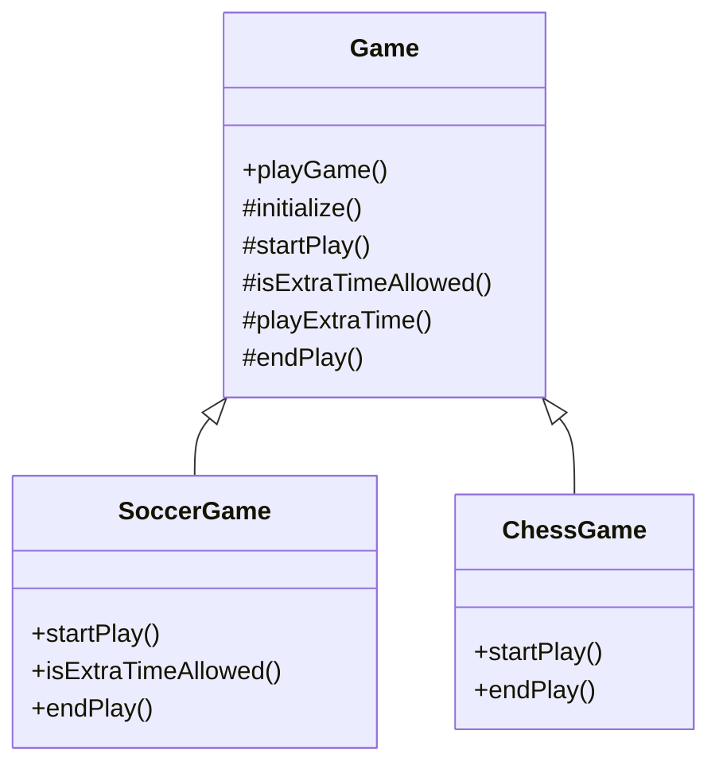

## 5.11.2 Hook Methods

In the realm of software design patterns, the Template Method Pattern stands out as a powerful tool for defining the skeleton of an algorithm in a base class while allowing subclasses to refine specific steps. At the heart of this pattern lies the concept of **hook methods**. These optional methods provide a mechanism for subclasses to extend or modify the behavior of the template method without altering its structure. Let's delve into the intricacies of hook methods, their purpose, and how they enhance the flexibility of the Template Method Pattern.

### Understanding Hook Methods

Hook methods are a crucial component of the Template Method Pattern. They are defined in the abstract class and can be optionally overridden by subclasses. These methods act as "hooks" where subclasses can inject additional behavior or modify existing behavior without changing the template method's algorithm. By providing default implementations, hook methods offer flexibility and customization opportunities for subclasses.

#### Purpose of Hook Methods

The primary purpose of hook methods is to allow subclasses to customize certain steps of an algorithm defined in the template method. They provide a way to extend or modify the behavior of the template method without altering its structure. This ensures that the algorithm's core logic remains intact while allowing subclasses to adapt specific steps to their needs.

### Example of Hook Methods in the Template Method Pattern

To illustrate the concept of hook methods, let's consider a simple example of a `Game` class that defines the skeleton of a game algorithm. The `Game` class provides a template method called `playGame()`, which outlines the steps of playing a game. Subclasses can override specific hook methods to customize the game's behavior.

```java
abstract class Game {
    // Template method
    public final void playGame() {
        initialize();
        startPlay();
        if (isExtraTimeAllowed()) {
            playExtraTime();
        }
        endPlay();
    }

    // Concrete method
    protected void initialize() {
        System.out.println("Game initialized.");
    }

    // Abstract method
    protected abstract void startPlay();

    // Hook method
    protected boolean isExtraTimeAllowed() {
        return false;
    }

    // Concrete method
    protected void playExtraTime() {
        System.out.println("Playing extra time.");
    }

    // Abstract method
    protected abstract void endPlay();
}

class SoccerGame extends Game {
    @Override
    protected void startPlay() {
        System.out.println("Soccer game started.");
    }

    @Override
    protected boolean isExtraTimeAllowed() {
        return true;
    }

    @Override
    protected void endPlay() {
        System.out.println("Soccer game ended.");
    }
}

class ChessGame extends Game {
    @Override
    protected void startPlay() {
        System.out.println("Chess game started.");
    }

    @Override
    protected void endPlay() {
        System.out.println("Chess game ended.");
    }
}

public class TemplateMethodExample {
    public static void main(String[] args) {
        Game soccer = new SoccerGame();
        soccer.playGame();

        Game chess = new ChessGame();
        chess.playGame();
    }
}
```

### Explanation of the Example

In this example, the `Game` class defines the template method `playGame()`, which outlines the steps of playing a game. The `isExtraTimeAllowed()` method is a hook method that provides a default implementation returning `false`. Subclasses can override this method to customize the behavior.

The `SoccerGame` class overrides the `isExtraTimeAllowed()` method to return `true`, allowing extra time to be played. The `ChessGame` class uses the default implementation, which does not allow extra time.

### How Hook Methods Enhance Flexibility

Hook methods play a vital role in enhancing the flexibility of the Template Method Pattern. By providing optional methods that subclasses can override, hook methods allow for customization without altering the template method's structure. This flexibility is crucial in scenarios where subclasses need to adapt specific steps of an algorithm to their needs.

#### Benefits of Hook Methods

1. **Customization**: Hook methods allow subclasses to customize specific steps of an algorithm without changing its structure.
2. **Extensibility**: By providing default implementations, hook methods make it easy to extend the behavior of the template method.
3. **Maintainability**: Hook methods promote code reuse and maintainability by encapsulating common behavior in the base class.
4. **Flexibility**: Subclasses can choose to override hook methods as needed, providing flexibility in implementing specific behavior.

### Considerations When Designing Hook Methods

When designing hook methods, it's essential to consider the following factors:

1. **Default Implementations**: Provide sensible default implementations for hook methods to ensure that subclasses can choose whether to override them.
2. **Method Visibility**: Determine the appropriate visibility for hook methods. Typically, they are protected to allow access by subclasses while preventing access from outside the class hierarchy.
3. **Method Naming**: Use descriptive names for hook methods to convey their purpose and intended use.
4. **Documentation**: Document the purpose and behavior of hook methods to guide developers in their usage and customization.

### Visualizing Hook Methods in the Template Method Pattern

To better understand the role of hook methods in the Template Method Pattern, let's visualize the relationship between the template method, hook methods, and subclasses using a class diagram.



### Try It Yourself

Now that we've explored the concept of hook methods, let's encourage you to experiment with the code example provided. Try the following modifications:

1. **Add a New Hook Method**: Introduce a new hook method in the `Game` class, such as `beforeStartPlay()`, and override it in the `SoccerGame` and `ChessGame` classes to add custom behavior before the game starts.

2. **Modify the Default Implementation**: Change the default implementation of the `isExtraTimeAllowed()` method to return `true` and observe how it affects the behavior of the `ChessGame` class.

3. **Create a New Subclass**: Implement a new subclass, `BasketballGame`, that overrides the necessary methods to simulate a basketball game. Use the hook methods to customize its behavior.

### Knowledge Check

To reinforce your understanding of hook methods, consider the following questions:

1. What is the primary purpose of hook methods in the Template Method Pattern?
2. How do hook methods enhance the flexibility of the Template Method Pattern?
3. What are some considerations when designing hook methods?
4. How can hook methods promote code reuse and maintainability?

### Conclusion

Hook methods are a powerful tool in the Template Method Pattern, providing flexibility and customization opportunities for subclasses. By allowing subclasses to override specific steps of an algorithm, hook methods enable developers to adapt behavior without altering the template method's structure. As you continue to explore design patterns in Java, remember the importance of hook methods in enhancing flexibility and promoting maintainability.

## Quiz Time!



### What is the primary purpose of hook methods in the Template Method Pattern?

- [x] To allow subclasses to customize specific steps of an algorithm
- [ ] To define the entire algorithm in the base class
- [ ] To enforce strict adherence to the base class implementation
- [ ] To prevent subclasses from modifying the algorithm

> **Explanation:** Hook methods provide a mechanism for subclasses to customize specific steps of an algorithm without altering its structure.

### How do hook methods enhance the flexibility of the Template Method Pattern?

- [x] By allowing subclasses to override specific steps of an algorithm
- [ ] By enforcing a strict algorithm structure
- [ ] By preventing subclasses from making changes
- [ ] By defining all steps in the base class

> **Explanation:** Hook methods allow subclasses to override specific steps, providing flexibility in implementing custom behavior.

### What is a key consideration when designing hook methods?

- [x] Providing sensible default implementations
- [ ] Making all hook methods public
- [ ] Ensuring hook methods cannot be overridden
- [ ] Using generic method names

> **Explanation:** Providing default implementations ensures that subclasses can choose whether to override hook methods.

### In the provided example, what does the `isExtraTimeAllowed()` method represent?

- [x] A hook method that can be overridden by subclasses
- [ ] A concrete method that cannot be changed
- [ ] An abstract method that must be implemented
- [ ] A method that defines the entire algorithm

> **Explanation:** The `isExtraTimeAllowed()` method is a hook method that provides a default implementation but can be overridden by subclasses.

### Which of the following is a benefit of using hook methods?

- [x] Customization of specific steps
- [ ] Enforcing a single implementation
- [ ] Preventing code reuse
- [ ] Reducing flexibility

> **Explanation:** Hook methods allow for customization of specific steps, enhancing flexibility and code reuse.

### What is the visibility typically used for hook methods?

- [x] Protected
- [ ] Public
- [ ] Private
- [ ] Package-private

> **Explanation:** Hook methods are typically protected to allow access by subclasses while preventing access from outside the class hierarchy.

### How can hook methods promote maintainability?

- [x] By encapsulating common behavior in the base class
- [ ] By requiring all subclasses to implement them
- [ ] By preventing any customization
- [ ] By making them public

> **Explanation:** Encapsulating common behavior in the base class promotes code reuse and maintainability.

### What is a potential modification you can try with the provided code example?

- [x] Add a new hook method and override it in subclasses
- [ ] Remove all hook methods
- [ ] Make all methods final
- [ ] Prevent subclasses from overriding any methods

> **Explanation:** Adding a new hook method and overriding it in subclasses allows for further customization and experimentation.

### In the class diagram, what does the arrow from `SoccerGame` to `Game` represent?

- [x] Inheritance
- [ ] Composition
- [ ] Aggregation
- [ ] Association

> **Explanation:** The arrow represents inheritance, indicating that `SoccerGame` is a subclass of `Game`.

### True or False: Hook methods must always be overridden by subclasses.

- [ ] True
- [x] False

> **Explanation:** Hook methods provide default implementations and can be optionally overridden by subclasses.


