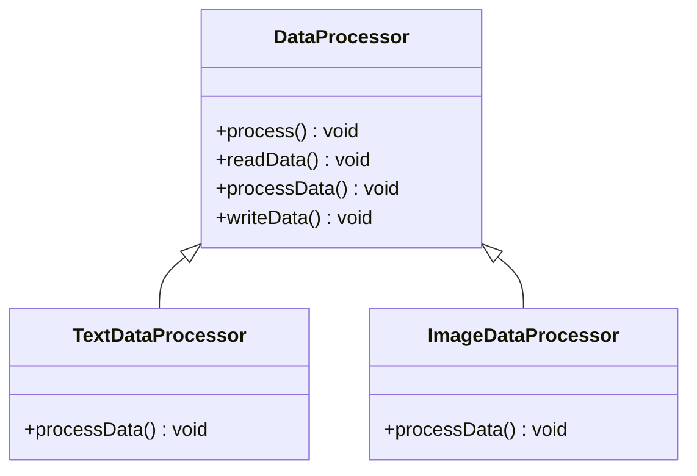

## 5.11.3 Fixed Algorithm Structure

In the realm of software engineering, maintaining a consistent processing flow while allowing for customization is a crucial aspect of designing robust and flexible systems. The Template Method Pattern in Java provides a powerful mechanism to achieve this balance through the concept of a fixed algorithm structure. This section delves into the intricacies of this pattern, emphasizing the importance of invariant parts, showcasing examples, and discussing the benefits of code reuse and reduced duplication.

### Understanding the Fixed Algorithm Structure

The Template Method Pattern is a behavioral design pattern that defines the skeleton of an algorithm in a method, deferring some steps to subclasses. This pattern allows subclasses to redefine certain steps of an algorithm without changing its structure. The fixed algorithm structure is the backbone of this pattern, ensuring that the overall processing flow remains unchanged while providing flexibility in specific parts.

#### Key Concepts

1. **Invariant Parts**: These are the steps in the algorithm that remain constant across all implementations. They define the core logic and sequence of operations that must be followed.

2. **Variable Parts**: These are the customizable steps that subclasses can override to provide specific behavior. This flexibility allows for different implementations without altering the algorithm's structure.

3. **Template Method**: This is the method that defines the algorithm's structure. It calls the invariant and variable parts in a specific order, ensuring consistency in the processing flow.

### Importance of Invariant Parts

The invariant parts of an algorithm are crucial because they ensure that the core logic and sequence of operations are maintained across different implementations. This consistency is vital for several reasons:

- **Predictability**: By keeping the core logic unchanged, developers can predict the behavior of the algorithm, making it easier to understand and maintain.

- **Reliability**: Invariant parts ensure that critical operations are performed in the correct order, reducing the risk of errors and inconsistencies.

- **Reusability**: By defining a common structure, the Template Method Pattern promotes code reuse, allowing developers to leverage existing logic without duplicating code.

### Ensuring Unchanged Structure with the Template Method

The template method is the cornerstone of the Template Method Pattern. It defines the fixed algorithm structure by calling a series of methods, some of which are invariant and others that can be overridden by subclasses. This approach ensures that the overall structure remains unchanged while allowing for customization.

```java
abstract class DataProcessor {
    // Template method defining the algorithm structure
    public final void process() {
        readData();
        processData();
        writeData();
    }

    // Invariant method
    protected void readData() {
        System.out.println("Reading data from source");
    }

    // Variable method to be overridden by subclasses
    protected abstract void processData();

    // Invariant method
    protected void writeData() {
        System.out.println("Writing data to destination");
    }
}

class TextDataProcessor extends DataProcessor {
    @Override
    protected void processData() {
        System.out.println("Processing text data");
    }
}

class ImageDataProcessor extends DataProcessor {
    @Override
    protected void processData() {
        System.out.println("Processing image data");
    }
}
```

In this example, the `DataProcessor` class defines a template method `process()` that outlines the algorithm's structure. The `readData()` and `writeData()` methods are invariant, while `processData()` is a variable method that subclasses like `TextDataProcessor` and `ImageDataProcessor` can override.

### Balancing Fixed and Variable Parts

Achieving the right balance between fixed and variable parts is essential for the effectiveness of the Template Method Pattern. The fixed parts provide stability and consistency, while the variable parts offer flexibility and customization.

#### Example: Coffee Brewing Process

Consider a coffee brewing process where the steps are fixed, but the specifics can vary based on the type of coffee being brewed.

```java
abstract class CoffeeTemplate {
    // Template method defining the fixed algorithm structure
    public final void brewCoffee() {
        boilWater();
        brew();
        pourInCup();
        addCondiments();
    }

    // Invariant method
    private void boilWater() {
        System.out.println("Boiling water");
    }

    // Variable method to be overridden by subclasses
    protected abstract void brew();

    // Invariant method
    private void pourInCup() {
        System.out.println("Pouring into cup");
    }

    // Variable method to be overridden by subclasses
    protected abstract void addCondiments();
}

class BlackCoffee extends CoffeeTemplate {
    @Override
    protected void brew() {
        System.out.println("Brewing black coffee");
    }

    @Override
    protected void addCondiments() {
        System.out.println("Adding sugar");
    }
}

class Latte extends CoffeeTemplate {
    @Override
    protected void brew() {
        System.out.println("Brewing espresso");
    }

    @Override
    protected void addCondiments() {
        System.out.println("Adding milk and sugar");
    }
}
```

In this example, the `CoffeeTemplate` class defines the fixed algorithm structure for brewing coffee. The `boilWater()` and `pourInCup()` methods are invariant, while `brew()` and `addCondiments()` are variable methods that subclasses like `BlackCoffee` and `Latte` can override to provide specific behavior.

### Promoting Code Reuse and Reducing Duplication

The Template Method Pattern is instrumental in promoting code reuse and reducing duplication. By defining a common structure, developers can leverage existing logic and focus on implementing specific behavior in subclasses. This approach offers several benefits:

- **Efficiency**: By reusing existing logic, developers can save time and effort, allowing them to focus on more critical tasks.

- **Maintainability**: With a common structure, maintaining and updating code becomes more manageable, reducing the risk of errors and inconsistencies.

- **Scalability**: As new requirements emerge, developers can easily extend the existing structure by adding new subclasses, ensuring that the system can grow and adapt to changing needs.

### Visualizing the Template Method Pattern

To better understand the Template Method Pattern and its fixed algorithm structure, let's visualize the process using a class diagram.



This diagram illustrates the relationship between the `DataProcessor` class and its subclasses `TextDataProcessor` and `ImageDataProcessor`. The `process()` method in `DataProcessor` defines the fixed algorithm structure, while `processData()` is a variable method that subclasses can override.

### Try It Yourself

To deepen your understanding of the Template Method Pattern and its fixed algorithm structure, try modifying the code examples provided. Here are some suggestions:

- **Add a new subclass**: Create a new subclass of `DataProcessor` or `CoffeeTemplate` and implement the variable methods to handle a different type of data or coffee.

- **Modify the invariant methods**: Change the implementation of the invariant methods in `DataProcessor` or `CoffeeTemplate` to see how it affects the overall algorithm structure.

- **Experiment with different sequences**: Rearrange the order of method calls in the template method to explore how it impacts the processing flow.

### Knowledge Check

To reinforce your understanding of the Template Method Pattern and its fixed algorithm structure, consider the following questions:

- What are the benefits of maintaining a fixed algorithm structure in the Template Method Pattern?
- How do invariant and variable parts contribute to the effectiveness of the Template Method Pattern?
- In what scenarios would you choose to use the Template Method Pattern over other design patterns?

### Conclusion

The Template Method Pattern, with its fixed algorithm structure, is a powerful tool for designing flexible and reusable systems. By maintaining a consistent processing flow while allowing for customization, this pattern promotes code reuse, reduces duplication, and enhances maintainability. As you continue to explore design patterns in Java, remember the importance of balancing fixed and variable parts to achieve the desired level of flexibility and consistency.

## Quiz Time!



### What is the primary purpose of the Template Method Pattern?

- [x] To define the skeleton of an algorithm and allow subclasses to customize certain steps.
- [ ] To encapsulate a request as an object.
- [ ] To provide a way to access elements of a collection sequentially.
- [ ] To define a one-to-many dependency between objects.

> **Explanation:** The Template Method Pattern defines the skeleton of an algorithm, allowing subclasses to customize specific steps while maintaining the overall structure.

### Which part of the algorithm remains unchanged in the Template Method Pattern?

- [x] Invariant parts
- [ ] Variable parts
- [ ] Both invariant and variable parts
- [ ] None of the above

> **Explanation:** Invariant parts remain unchanged, ensuring the core logic and sequence of operations are consistent across implementations.

### What is the role of the template method in the Template Method Pattern?

- [x] To define the algorithm's structure and call invariant and variable methods in a specific order.
- [ ] To encapsulate data for transfer.
- [ ] To provide a simplified interface to a complex subsystem.
- [ ] To handle service requests by dispatching them synchronously to handlers.

> **Explanation:** The template method defines the algorithm's structure, calling invariant and variable methods in a specific order to maintain consistency.

### How does the Template Method Pattern promote code reuse?

- [x] By defining a common structure that can be reused across different implementations.
- [ ] By encapsulating a request as an object.
- [ ] By providing a way to access elements of a collection sequentially.
- [ ] By defining a one-to-many dependency between objects.

> **Explanation:** The Template Method Pattern promotes code reuse by defining a common structure that can be reused across different implementations, reducing duplication.

### In the coffee brewing example, which methods are considered variable?

- [x] brew() and addCondiments()
- [ ] boilWater() and pourInCup()
- [ ] brew() and pourInCup()
- [ ] boilWater() and addCondiments()

> **Explanation:** In the coffee brewing example, `brew()` and `addCondiments()` are variable methods that subclasses can override to provide specific behavior.

### What is a key benefit of maintaining invariant parts in an algorithm?

- [x] Predictability and reliability in the algorithm's behavior.
- [ ] Increased complexity in the codebase.
- [ ] Reduced flexibility in implementation.
- [ ] Increased risk of errors and inconsistencies.

> **Explanation:** Maintaining invariant parts ensures predictability and reliability in the algorithm's behavior, reducing the risk of errors and inconsistencies.

### Which of the following is a subclass in the coffee brewing example?

- [x] BlackCoffee
- [ ] CoffeeTemplate
- [ ] DataProcessor
- [ ] TextDataProcessor

> **Explanation:** `BlackCoffee` is a subclass of `CoffeeTemplate`, providing specific behavior for the variable methods.

### How does the Template Method Pattern reduce duplication?

- [x] By allowing subclasses to reuse the fixed algorithm structure while customizing specific steps.
- [ ] By encapsulating data for transfer.
- [ ] By providing a simplified interface to a complex subsystem.
- [ ] By handling service requests by dispatching them synchronously to handlers.

> **Explanation:** The Template Method Pattern reduces duplication by allowing subclasses to reuse the fixed algorithm structure while customizing specific steps.

### What is the relationship between invariant and variable parts in the Template Method Pattern?

- [x] Invariant parts provide stability, while variable parts offer flexibility.
- [ ] Invariant parts offer flexibility, while variable parts provide stability.
- [ ] Both invariant and variable parts offer flexibility.
- [ ] Both invariant and variable parts provide stability.

> **Explanation:** Invariant parts provide stability by maintaining the core logic, while variable parts offer flexibility by allowing customization.

### True or False: The Template Method Pattern allows for complete customization of the algorithm's structure.

- [ ] True
- [x] False

> **Explanation:** False. The Template Method Pattern allows for customization of specific steps, but the overall algorithm's structure remains fixed.


