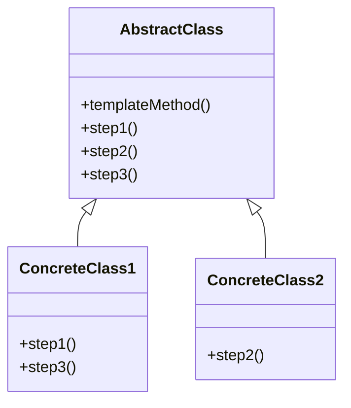

## 5.11.4 Use Cases and Examples

The Template Method pattern is a powerful behavioral design pattern that defines the skeleton of an algorithm in a method, deferring some steps to subclasses. It allows subclasses to redefine certain steps of an algorithm without changing its structure. This pattern is particularly effective in scenarios where you want to implement invariant parts of an algorithm once and allow subclasses to provide specific behaviors.

### Real-World Examples of the Template Method Pattern

Let's delve into some real-world applications of the Template Method pattern, particularly in processing frameworks and data parsers. These examples will illustrate how the pattern enhances code reusability, flexibility, and maintainability.

#### 1. Testing Frameworks

Testing frameworks like JUnit use the Template Method pattern extensively. In these frameworks, the setup, execution, and teardown of tests follow a common structure, but the actual test logic varies.

**Example: JUnit Testing Framework**

In JUnit, the `TestCase` class provides a template method for running tests. The framework defines the sequence of steps to set up the test environment, execute the test, and clean up afterward. Subclasses of `TestCase` override the `runTest` method to provide specific test logic.

```java
public abstract class TestCase {
    public final void run() {
        setUp();
        try {
            runTest();
        } finally {
            tearDown();
        }
    }

    protected abstract void runTest();

    protected void setUp() {
        // Default setup code
    }

    protected void tearDown() {
        // Default teardown code
    }
}

public class MyTest extends TestCase {
    @Override
    protected void runTest() {
        // Specific test logic
        System.out.println("Running test logic");
    }

    @Override
    protected void setUp() {
        // Custom setup
        System.out.println("Setting up test environment");
    }

    @Override
    protected void tearDown() {
        // Custom teardown
        System.out.println("Cleaning up test environment");
    }
}
```

In this example, `MyTest` extends `TestCase` and provides specific implementations for `runTest`, `setUp`, and `tearDown`. The `run` method in `TestCase` is the template method that orchestrates the test execution sequence.

**Benefits:**

- **Code Reusability**: Common setup and teardown logic are reused across multiple tests.
- **Flexibility**: Test-specific logic is encapsulated in subclasses, allowing easy modification and extension.
- **Maintainability**: Changes to the test execution flow can be made in one place (the `TestCase` class) without affecting individual tests.

#### 2. Data Parsers

Data parsers often need to process different types of data files while maintaining a consistent parsing structure. The Template Method pattern is ideal for defining the parsing process while allowing subclasses to handle specific data formats.

**Example: CSV and XML Parser**

Consider a scenario where we need to parse CSV and XML files. We can define a template method for the parsing process and let subclasses handle the specifics of reading and processing each file type.

```java
public abstract class DataParser {
    public final void parseData() {
        readData();
        processData();
        writeData();
    }

    protected abstract void readData();

    protected abstract void processData();

    protected void writeData() {
        // Default implementation for writing data
        System.out.println("Writing data to output");
    }
}

public class CSVParser extends DataParser {
    @Override
    protected void readData() {
        System.out.println("Reading data from CSV file");
    }

    @Override
    protected void processData() {
        System.out.println("Processing CSV data");
    }
}

public class XMLParser extends DataParser {
    @Override
    protected void readData() {
        System.out.println("Reading data from XML file");
    }

    @Override
    protected void processData() {
        System.out.println("Processing XML data");
    }
}
```

In this example, `CSVParser` and `XMLParser` extend `DataParser` and provide specific implementations for `readData` and `processData`. The `parseData` method in `DataParser` is the template method that defines the parsing sequence.

**Benefits:**

- **Code Reusability**: Common parsing steps are reused across different file formats.
- **Flexibility**: New file formats can be supported by adding new subclasses without modifying existing code.
- **Maintainability**: Changes to the parsing sequence can be made in one place (the `DataParser` class).

### Frameworks Utilizing the Template Method Pattern

Several frameworks leverage the Template Method pattern to provide extensible and customizable functionality. Let's explore how this pattern is used in some popular frameworks.

#### 1. Spring Framework

The Spring Framework uses the Template Method pattern in various components, such as the `JdbcTemplate` class for database operations. The `JdbcTemplate` class provides a template method for executing SQL queries, allowing developers to focus on query-specific logic.

**Example: JdbcTemplate**

```java
public class JdbcTemplate {
    public final void execute(String sql) {
        try {
            // Establish connection
            Connection connection = getConnection();
            // Execute query
            Statement statement = connection.createStatement();
            statement.execute(sql);
            // Process results
            processResults(statement.getResultSet());
        } catch (SQLException e) {
            handleException(e);
        } finally {
            // Close resources
            closeConnection();
        }
    }

    protected void processResults(ResultSet resultSet) throws SQLException {
        // Default implementation
    }

    protected void handleException(SQLException e) {
        // Default exception handling
    }

    private Connection getConnection() {
        // Obtain database connection
        return null;
    }

    private void closeConnection() {
        // Close database connection
    }
}
```

In this example, `execute` is the template method that defines the sequence of steps for executing a SQL query. Subclasses can override `processResults` and `handleException` to provide specific logic for processing query results and handling exceptions.

**Benefits:**

- **Code Reusability**: Common database operation steps are reused across different queries.
- **Flexibility**: Query-specific logic is encapsulated in subclasses, allowing easy modification and extension.
- **Maintainability**: Changes to the query execution flow can be made in one place (the `JdbcTemplate` class).

#### 2. Apache Struts

Apache Struts, a popular web application framework, uses the Template Method pattern in its request processing lifecycle. The framework defines a template method for handling HTTP requests, allowing developers to customize specific steps.

**Example: Request Processing in Struts**

```java
public abstract class Action {
    public final void execute(HttpServletRequest request, HttpServletResponse response) {
        try {
            preProcess(request);
            processRequest(request, response);
            postProcess(response);
        } catch (Exception e) {
            handleError(e);
        }
    }

    protected abstract void processRequest(HttpServletRequest request, HttpServletResponse response);

    protected void preProcess(HttpServletRequest request) {
        // Default pre-processing logic
    }

    protected void postProcess(HttpServletResponse response) {
        // Default post-processing logic
    }

    protected void handleError(Exception e) {
        // Default error handling
    }
}
```

In this example, `execute` is the template method that defines the request processing sequence. Subclasses can override `processRequest`, `preProcess`, `postProcess`, and `handleError` to provide specific logic for handling HTTP requests.

**Benefits:**

- **Code Reusability**: Common request processing steps are reused across different actions.
- **Flexibility**: Action-specific logic is encapsulated in subclasses, allowing easy modification and extension.
- **Maintainability**: Changes to the request processing flow can be made in one place (the `Action` class).

### Benefits of Using the Template Method Pattern

The Template Method pattern offers several benefits that make it a valuable tool in software development:

- **Code Reusability**: By defining common algorithm steps in a base class, the pattern promotes code reuse across different implementations.
- **Flexibility**: Subclasses can customize specific steps of the algorithm without altering the overall structure, allowing for easy extension and modification.
- **Maintainability**: Changes to the algorithm's structure can be made in one place, reducing the risk of introducing errors and improving maintainability.
- **Consistency**: The pattern enforces a consistent algorithm structure across different implementations, enhancing code readability and understanding.

### Try It Yourself

To deepen your understanding of the Template Method pattern, try modifying the code examples provided. Here are some suggestions:

- **Extend the `MyTest` class** to add more test cases with different setup and teardown logic.
- **Create a new parser** for a different file format (e.g., JSON) by extending the `DataParser` class.
- **Customize the `JdbcTemplate` class** to handle specific query results and exceptions.
- **Implement a new action** in the Apache Struts example with custom request processing logic.

### Visualizing the Template Method Pattern

Let's visualize the Template Method pattern using a class diagram. This diagram illustrates the relationship between the abstract class and its subclasses, highlighting the template method and the steps that subclasses can override.



**Diagram Description:**

- **AbstractClass**: Defines the `templateMethod` that outlines the algorithm's structure. It includes steps (`step1`, `step2`, `step3`) that can be overridden by subclasses.
- **ConcreteClass1**: Overrides `step1` and `step3` to provide specific implementations.
- **ConcreteClass2**: Overrides `step2` to provide a specific implementation.

### Knowledge Check

Take a moment to reflect on what you've learned about the Template Method pattern. Consider the following questions:

- How does the Template Method pattern promote code reusability and flexibility?
- What are some real-world scenarios where the Template Method pattern is beneficial?
- How can you apply the Template Method pattern in your own projects?

### Embrace the Journey

Remember, mastering design patterns like the Template Method pattern is a journey. As you continue to explore and apply these patterns, you'll gain valuable insights into creating more maintainable and flexible software. Keep experimenting, stay curious, and enjoy the process!

## Quiz Time!



### What is the primary purpose of the Template Method pattern?

- [x] To define the skeleton of an algorithm and allow subclasses to implement specific steps.
- [ ] To encapsulate a request as an object, allowing parameterization of clients.
- [ ] To provide a way to access elements of a collection sequentially.
- [ ] To define a one-to-many dependency between objects.

> **Explanation:** The Template Method pattern defines the skeleton of an algorithm in a method, deferring some steps to subclasses.

### In the JUnit example, which method is the template method?

- [x] run
- [ ] setUp
- [ ] runTest
- [ ] tearDown

> **Explanation:** The `run` method in the `TestCase` class is the template method that orchestrates the test execution sequence.

### How does the Template Method pattern enhance maintainability?

- [x] By allowing changes to the algorithm's structure in one place.
- [ ] By encapsulating a request as an object.
- [ ] By providing a way to access elements of a collection sequentially.
- [ ] By defining a one-to-many dependency between objects.

> **Explanation:** The Template Method pattern enhances maintainability by allowing changes to the algorithm's structure in one place, reducing the risk of introducing errors.

### Which of the following is a benefit of using the Template Method pattern?

- [x] Code reusability
- [ ] Increased coupling
- [ ] Reduced flexibility
- [ ] Inconsistent algorithm structure

> **Explanation:** The Template Method pattern promotes code reusability by defining common algorithm steps in a base class.

### In the data parser example, what is the role of the `parseData` method?

- [x] It is the template method that defines the parsing sequence.
- [ ] It reads data from a file.
- [ ] It processes data.
- [ ] It writes data to output.

> **Explanation:** The `parseData` method is the template method that defines the sequence of steps for parsing data.

### How does the Template Method pattern promote flexibility?

- [x] By allowing subclasses to customize specific steps of the algorithm.
- [ ] By encapsulating a request as an object.
- [ ] By providing a way to access elements of a collection sequentially.
- [ ] By defining a one-to-many dependency between objects.

> **Explanation:** The Template Method pattern promotes flexibility by allowing subclasses to customize specific steps of the algorithm without altering the overall structure.

### Which framework uses the Template Method pattern for database operations?

- [x] Spring Framework
- [ ] Apache Struts
- [ ] Hibernate
- [ ] JUnit

> **Explanation:** The Spring Framework uses the Template Method pattern in components like `JdbcTemplate` for database operations.

### What is the benefit of using the Template Method pattern in testing frameworks?

- [x] It allows common setup and teardown logic to be reused across multiple tests.
- [ ] It increases the complexity of test cases.
- [ ] It reduces the flexibility of test logic.
- [ ] It introduces inconsistent test execution flow.

> **Explanation:** The Template Method pattern allows common setup and teardown logic to be reused across multiple tests, enhancing code reusability.

### In the Apache Struts example, which method is the template method?

- [x] execute
- [ ] preProcess
- [ ] processRequest
- [ ] postProcess

> **Explanation:** The `execute` method in the `Action` class is the template method that defines the request processing sequence.

### True or False: The Template Method pattern enforces a consistent algorithm structure across different implementations.

- [x] True
- [ ] False

> **Explanation:** True. The Template Method pattern enforces a consistent algorithm structure across different implementations, enhancing code readability and understanding.


