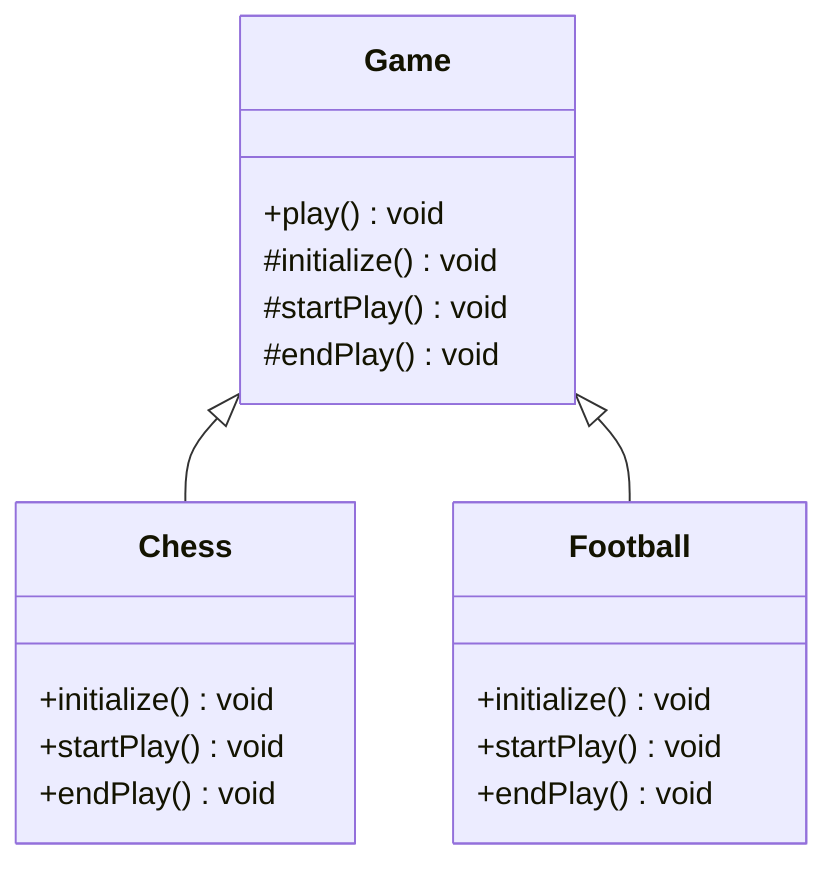

## 5.11 Template Method Pattern

In the realm of software design, achieving code reuse and consistency while maintaining flexibility is a common challenge. The Template Method Pattern offers a solution by defining the skeleton of an algorithm in a method, allowing subclasses to redefine certain steps without altering the algorithm's overall structure. This pattern is a cornerstone of behavioral design patterns, enabling developers to create robust and flexible codebases.

### Understanding the Template Method Pattern

The Template Method Pattern is a behavioral design pattern that defines the program skeleton of an algorithm in a method, called the template method. This method defers some steps to subclasses, allowing them to redefine certain steps of the algorithm without changing its structure. The pattern promotes code reuse and consistency by encapsulating invariant parts of the algorithm in a base class, while allowing subclasses to customize specific behaviors.

#### Intent of the Template Method Pattern

The primary intent of the Template Method Pattern is to:

- Define the skeleton of an algorithm in an operation, deferring some steps to subclasses.
- Allow subclasses to redefine certain steps of an algorithm without changing the algorithm's structure.
- Promote code reuse and consistency by encapsulating invariant parts of the algorithm in a base class.

### Problem Addressed by the Template Method Pattern

In software development, it's common to encounter scenarios where multiple classes share a similar algorithmic structure but differ in specific steps. Without a structured approach, this can lead to code duplication, inconsistency, and maintenance challenges. The Template Method Pattern addresses these issues by:

- **Code Reuse**: By defining the common structure in a base class, the pattern promotes code reuse, reducing duplication across subclasses.
- **Consistency**: Ensures that the algorithm's structure remains consistent across different implementations, enhancing maintainability.
- **Flexibility**: Allows subclasses to customize specific steps of the algorithm, providing flexibility without altering the overall structure.

### Key Components of the Template Method Pattern

The Template Method Pattern involves the following key components:

1. **Abstract Class**: Defines the template method and declares abstract methods for steps that need customization.
2. **Concrete Subclasses**: Implement the abstract methods, providing specific behaviors for the customized steps.
3. **Template Method**: The method in the abstract class that defines the algorithm's skeleton, calling the abstract methods at appropriate points.

### Implementing the Template Method Pattern in Java

Let's explore how to implement the Template Method Pattern in Java through a practical example. Consider a scenario where we have a `Game` class that defines the structure of a game, but different games have unique implementations for starting, playing, and ending the game.

```java
// Abstract class defining the template method
abstract class Game {
    // Template method defining the skeleton of the algorithm
    public final void play() {
        initialize();
        startPlay();
        endPlay();
    }

    // Abstract methods to be implemented by subclasses
    abstract void initialize();
    abstract void startPlay();
    abstract void endPlay();
}

// Concrete subclass implementing the abstract methods
class Chess extends Game {
    @Override
    void initialize() {
        System.out.println("Chess Game Initialized! Start playing.");
    }

    @Override
    void startPlay() {
        System.out.println("Game Started. Welcome to Chess.");
    }

    @Override
    void endPlay() {
        System.out.println("Game Finished!");
    }
}

// Another concrete subclass
class Football extends Game {
    @Override
    void initialize() {
        System.out.println("Football Game Initialized! Start playing.");
    }

    @Override
    void startPlay() {
        System.out.println("Game Started. Welcome to Football.");
    }

    @Override
    void endPlay() {
        System.out.println("Game Finished!");
    }
}

// Client code
public class TemplateMethodPatternDemo {
    public static void main(String[] args) {
        Game game = new Chess();
        game.play();
        System.out.println();
        game = new Football();
        game.play();
    }
}
```

In this example, the `Game` class defines the `play` method as the template method, which outlines the steps of the game. The `Chess` and `Football` classes are concrete subclasses that implement the abstract methods `initialize`, `startPlay`, and `endPlay`, providing specific behaviors for each game.

### UML Diagram of the Template Method Pattern

To better understand the structure of the Template Method Pattern, let's visualize it using a UML diagram:



In the UML diagram, the `Game` class is the abstract class that defines the template method `play`. The `Chess` and `Football` classes are concrete subclasses that implement the abstract methods.

### Benefits of the Template Method Pattern

The Template Method Pattern offers several benefits:

- **Code Reuse**: By defining the common algorithm structure in a base class, the pattern promotes code reuse, reducing duplication across subclasses.
- **Consistency**: Ensures that the algorithm's structure remains consistent across different implementations, enhancing maintainability.
- **Flexibility**: Allows subclasses to customize specific steps of the algorithm, providing flexibility without altering the overall structure.
- **Ease of Maintenance**: Changes to the algorithm's structure can be made in the base class, automatically propagating to all subclasses.

### When to Use the Template Method Pattern

Consider using the Template Method Pattern when:

- You have multiple classes that share a similar algorithmic structure but differ in specific steps.
- You want to promote code reuse and consistency across subclasses.
- You need to provide flexibility for subclasses to customize specific behaviors without altering the overall algorithm structure.

### Try It Yourself

To deepen your understanding of the Template Method Pattern, try modifying the code example provided. Experiment with adding new games, such as `Basketball` or `Tennis`, and implement the abstract methods to customize their behaviors. Observe how the template method ensures consistency across different game implementations.

### Knowledge Check

As you explore the Template Method Pattern, consider the following questions:

- How does the Template Method Pattern promote code reuse and consistency?
- What are the key components of the Template Method Pattern?
- How can the Template Method Pattern enhance flexibility in software design?

### Conclusion

The Template Method Pattern is a powerful tool in the software engineer's toolkit, enabling code reuse, consistency, and flexibility. By defining the skeleton of an algorithm in a base class and allowing subclasses to customize specific steps, the pattern promotes maintainable and scalable code. As you continue your journey in mastering design patterns, remember to leverage the Template Method Pattern to create robust and flexible software solutions.

## Quiz Time!



### What is the primary intent of the Template Method Pattern?

- [x] To define the skeleton of an algorithm, deferring some steps to subclasses.
- [ ] To allow subclasses to completely override the algorithm.
- [ ] To encapsulate all steps of an algorithm in a single class.
- [ ] To eliminate the need for subclasses.

> **Explanation:** The Template Method Pattern defines the skeleton of an algorithm, allowing subclasses to redefine specific steps without changing the algorithm's structure.

### Which component of the Template Method Pattern defines the algorithm's skeleton?

- [x] Template Method
- [ ] Concrete Subclass
- [ ] Abstract Method
- [ ] Interface

> **Explanation:** The Template Method in the abstract class defines the algorithm's skeleton, calling abstract methods at appropriate points.

### What is a key benefit of using the Template Method Pattern?

- [x] It promotes code reuse and consistency.
- [ ] It eliminates the need for abstract classes.
- [ ] It allows complete algorithm customization by subclasses.
- [ ] It simplifies the algorithm's structure.

> **Explanation:** The Template Method Pattern promotes code reuse and consistency by encapsulating invariant parts of the algorithm in a base class.

### In the Template Method Pattern, what role do concrete subclasses play?

- [x] They implement abstract methods to customize specific steps.
- [ ] They define the algorithm's skeleton.
- [ ] They eliminate the need for a base class.
- [ ] They override the template method.

> **Explanation:** Concrete subclasses implement abstract methods to provide specific behaviors for the customized steps of the algorithm.

### When should you consider using the Template Method Pattern?

- [x] When you have multiple classes sharing a similar algorithmic structure.
- [ ] When you need to eliminate subclasses.
- [ ] When you want to encapsulate all steps in a single class.
- [ ] When you need to completely change the algorithm's structure.

> **Explanation:** Use the Template Method Pattern when multiple classes share a similar algorithmic structure but differ in specific steps.

### What is the role of the abstract class in the Template Method Pattern?

- [x] It defines the template method and declares abstract methods.
- [ ] It implements all steps of the algorithm.
- [ ] It eliminates the need for concrete subclasses.
- [ ] It provides complete algorithm customization.

> **Explanation:** The abstract class defines the template method and declares abstract methods for steps that need customization.

### How does the Template Method Pattern enhance flexibility?

- [x] By allowing subclasses to customize specific steps without altering the overall structure.
- [ ] By eliminating the need for abstract methods.
- [ ] By allowing complete algorithm customization.
- [ ] By simplifying the algorithm's structure.

> **Explanation:** The pattern enhances flexibility by allowing subclasses to customize specific steps while maintaining the overall algorithm structure.

### What is a common problem addressed by the Template Method Pattern?

- [x] Code duplication and inconsistency.
- [ ] Lack of algorithm customization.
- [ ] Complexity in algorithm design.
- [ ] Elimination of subclasses.

> **Explanation:** The Template Method Pattern addresses code duplication and inconsistency by defining common algorithm structures in a base class.

### Which of the following is NOT a benefit of the Template Method Pattern?

- [ ] Code reuse
- [ ] Consistency
- [x] Complete algorithm customization
- [ ] Flexibility

> **Explanation:** The Template Method Pattern does not allow complete algorithm customization; it maintains a consistent structure while allowing specific steps to be customized.

### True or False: The Template Method Pattern allows subclasses to redefine the entire algorithm.

- [ ] True
- [x] False

> **Explanation:** False. The Template Method Pattern allows subclasses to redefine specific steps, not the entire algorithm.



Remember, mastering design patterns is a journey. As you continue to explore and apply the Template Method Pattern, you'll gain deeper insights into creating maintainable and scalable software solutions. Keep experimenting, stay curious, and enjoy the journey!
