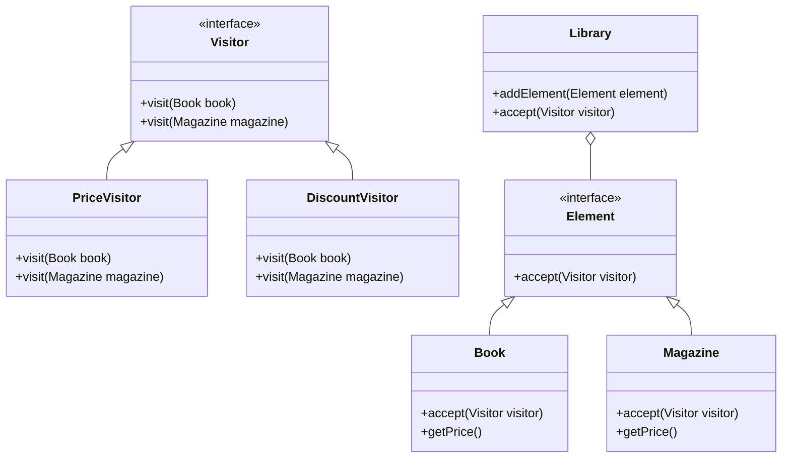

## 5.12.1 Implementing Visitor Pattern in Java

In this section, we delve into the Visitor Pattern, a powerful design pattern that allows us to separate algorithms from the objects on which they operate. This pattern is particularly useful when we need to perform operations across a set of objects with different interfaces, without modifying their classes. Let's explore how to implement the Visitor Pattern in Java, understand its components, and discuss best practices and common pitfalls.

### Understanding the Visitor Pattern

The Visitor Pattern is a behavioral design pattern that enables adding new operations to existing object structures without altering the structures. It achieves this by allowing a visitor object to traverse the structure and perform operations on its elements. This pattern is particularly beneficial when dealing with complex object structures or when the operations need to be extended frequently.

#### Key Components of the Visitor Pattern

1. **Visitor Interface**: Declares a visit method for each type of element in the object structure.
2. **Concrete Visitor**: Implements the operations defined in the Visitor interface.
3. **Element Interface**: Declares an accept method that takes a visitor as an argument.
4. **Concrete Element**: Implements the accept method and allows the visitor to perform operations on it.
5. **Object Structure**: A collection of elements that can be visited by the visitor.

### Implementing the Visitor Pattern in Java

Let's start by defining the Visitor interface and its concrete implementations.

#### Step 1: Define the Visitor Interface

The Visitor interface declares a visit method for each type of element. This allows the visitor to perform different operations based on the element type.

```java
// Visitor.java
public interface Visitor {
    void visit(Book book);
    void visit(Magazine magazine);
}
```

#### Step 2: Implement Concrete Visitors

Concrete visitors implement the Visitor interface and define the operations to be performed on each element type.

```java
// PriceVisitor.java
public class PriceVisitor implements Visitor {
    @Override
    public void visit(Book book) {
        System.out.println("Book Price: $" + book.getPrice());
    }

    @Override
    public void visit(Magazine magazine) {
        System.out.println("Magazine Price: $" + magazine.getPrice());
    }
}

// DiscountVisitor.java
public class DiscountVisitor implements Visitor {
    @Override
    public void visit(Book book) {
        System.out.println("Book Discounted Price: $" + (book.getPrice() * 0.9));
    }

    @Override
    public void visit(Magazine magazine) {
        System.out.println("Magazine Discounted Price: $" + (magazine.getPrice() * 0.8));
    }
}
```

#### Step 3: Define the Element Interface

The Element interface declares the accept method, which takes a visitor as an argument.

```java
// Element.java
public interface Element {
    void accept(Visitor visitor);
}
```

#### Step 4: Implement Concrete Elements

Concrete elements implement the Element interface and define how they accept a visitor.

```java
// Book.java
public class Book implements Element {
    private String title;
    private double price;

    public Book(String title, double price) {
        this.title = title;
        this.price = price;
    }

    public double getPrice() {
        return price;
    }

    @Override
    public void accept(Visitor visitor) {
        visitor.visit(this);
    }
}

// Magazine.java
public class Magazine implements Element {
    private String name;
    private double price;

    public Magazine(String name, double price) {
        this.name = name;
        this.price = price;
    }

    public double getPrice() {
        return price;
    }

    @Override
    public void accept(Visitor visitor) {
        visitor.visit(this);
    }
}
```

#### Step 5: Create the Object Structure

The object structure is a collection of elements that can be visited by the visitor.

```java
// Library.java
import java.util.ArrayList;
import java.util.List;

public class Library {
    private List<Element> elements = new ArrayList<>();

    public void addElement(Element element) {
        elements.add(element);
    }

    public void accept(Visitor visitor) {
        for (Element element : elements) {
            element.accept(visitor);
        }
    }
}
```

### Demonstrating Double Dispatch

Double dispatch is a technique used in the Visitor Pattern to determine the correct method to invoke at runtime. It involves two method calls: one to the accept method of the element and another to the visit method of the visitor.

#### How Double Dispatch Works

1. The client invokes the accept method on an element, passing a visitor as an argument.
2. The element calls the visit method on the visitor, passing itself as an argument.
3. The visitor performs the operation specific to the element type.

This mechanism allows the visitor to perform operations based on both the visitor type and the element type.

### Best Practices for Implementing the Visitor Pattern

- **Use Visitor Pattern for Stable Structures**: The Visitor Pattern is ideal for object structures that rarely change but require frequent new operations.
- **Avoid Modifying Elements**: The Visitor Pattern is best suited for operations that do not modify the elements. If modifications are necessary, consider other patterns.
- **Leverage Double Dispatch**: Ensure that the accept and visit methods are correctly implemented to achieve double dispatch.
- **Keep Visitors Focused**: Each concrete visitor should focus on a specific operation or set of related operations.

### Common Pitfalls and How to Avoid Them

- **Complexity with Many Element Types**: As the number of element types increases, the Visitor Pattern can become complex. Consider using other patterns if the structure changes frequently.
- **Visitor Interface Changes**: Adding new element types requires changes to the Visitor interface, which can lead to maintenance challenges.
- **Performance Overhead**: The Visitor Pattern can introduce performance overhead due to the multiple method calls involved in double dispatch.

### Try It Yourself

Experiment with the Visitor Pattern by modifying the code examples. Here are some suggestions:

- **Add a New Element Type**: Introduce a new element type, such as `Newspaper`, and update the Visitor interface and concrete visitors to handle it.
- **Create a New Visitor**: Implement a new visitor that performs a different operation, such as calculating the total price of all elements.
- **Optimize the Object Structure**: Experiment with different data structures for managing elements in the `Library` class.

### Visualizing the Visitor Pattern

To better understand the Visitor Pattern, let's visualize the interaction between elements and visitors using a class diagram.



### References and Further Reading

- [Design Patterns: Elements of Reusable Object-Oriented Software](https://en.wikipedia.org/wiki/Design_Patterns) - A foundational book on design patterns.
- [Java Design Patterns](https://www.journaldev.com/1827/java-design-patterns-example-tutorial) - A comprehensive guide to Java design patterns.
- [Visitor Pattern on Wikipedia](https://en.wikipedia.org/wiki/Visitor_pattern) - An overview of the Visitor Pattern.

### Knowledge Check

Let's reinforce our understanding of the Visitor Pattern with some questions and exercises.

1. **What is the primary purpose of the Visitor Pattern?**
   - To separate algorithms from the objects on which they operate.

2. **How does double dispatch work in the Visitor Pattern?**
   - By using two method calls: one to the accept method of the element and another to the visit method of the visitor.

3. **What are the key components of the Visitor Pattern?**
   - Visitor interface, Concrete Visitor, Element interface, Concrete Element, Object Structure.

4. **What are some common pitfalls of the Visitor Pattern?**
   - Complexity with many element types, Visitor interface changes, Performance overhead.

5. **How can you extend the Visitor Pattern to handle new element types?**
   - By updating the Visitor interface and implementing the new visit methods in concrete visitors.

### Embrace the Journey

Remember, this is just the beginning. As you progress, you'll build more complex and interactive systems using the Visitor Pattern. Keep experimenting, stay curious, and enjoy the journey!

## Quiz Time!



### What is the primary purpose of the Visitor Pattern?

- [x] To separate algorithms from the objects on which they operate.
- [ ] To encapsulate object creation.
- [ ] To simplify object interactions.
- [ ] To manage object lifecycles.

> **Explanation:** The Visitor Pattern is designed to separate algorithms from the objects on which they operate, allowing new operations to be added without modifying the objects.

### How does double dispatch work in the Visitor Pattern?

- [x] By using two method calls: one to the accept method of the element and another to the visit method of the visitor.
- [ ] By using a single method call to the visitor.
- [ ] By using reflection to determine the method to call.
- [ ] By using a switch statement to select the method.

> **Explanation:** Double dispatch involves two method calls: the element's accept method and the visitor's visit method, allowing operations based on both types.

### What are the key components of the Visitor Pattern?

- [x] Visitor interface, Concrete Visitor, Element interface, Concrete Element, Object Structure.
- [ ] Singleton, Factory, Adapter, Observer.
- [ ] Controller, Model, View, Router.
- [ ] Strategy, Context, State, Transition.

> **Explanation:** The Visitor Pattern consists of the Visitor interface, Concrete Visitor, Element interface, Concrete Element, and Object Structure.

### What is a common pitfall of the Visitor Pattern?

- [x] Complexity with many element types.
- [ ] Difficulty in object creation.
- [ ] Lack of encapsulation.
- [ ] Inefficient memory usage.

> **Explanation:** As the number of element types increases, the Visitor Pattern can become complex, requiring updates to the Visitor interface.

### How can you extend the Visitor Pattern to handle new element types?

- [x] By updating the Visitor interface and implementing the new visit methods in concrete visitors.
- [ ] By adding new methods to the Element interface.
- [ ] By modifying the Object Structure.
- [ ] By using inheritance to create new visitors.

> **Explanation:** To handle new element types, update the Visitor interface and implement the new visit methods in concrete visitors.

### What is the role of the Element interface in the Visitor Pattern?

- [x] To declare the accept method that takes a visitor as an argument.
- [ ] To define the operations performed by the visitor.
- [ ] To manage the object structure.
- [ ] To encapsulate the visitor's logic.

> **Explanation:** The Element interface declares the accept method, allowing elements to accept visitors.

### What is the benefit of using the Visitor Pattern for stable structures?

- [x] It allows adding new operations without modifying the structure.
- [ ] It simplifies object creation.
- [ ] It enhances encapsulation.
- [ ] It reduces memory usage.

> **Explanation:** The Visitor Pattern is ideal for stable structures, enabling new operations without altering the structure.

### What is a disadvantage of the Visitor Pattern?

- [x] Visitor interface changes require updates to all concrete visitors.
- [ ] It complicates object creation.
- [ ] It reduces code readability.
- [ ] It limits object interactions.

> **Explanation:** Adding new element types requires changes to the Visitor interface, affecting all concrete visitors.

### What is the primary challenge when using the Visitor Pattern with many element types?

- [x] Increased complexity and maintenance overhead.
- [ ] Difficulty in object creation.
- [ ] Lack of encapsulation.
- [ ] Inefficient memory usage.

> **Explanation:** As the number of element types grows, the Visitor Pattern can become complex and challenging to maintain.

### True or False: The Visitor Pattern is best suited for operations that modify elements.

- [ ] True
- [x] False

> **Explanation:** The Visitor Pattern is best suited for operations that do not modify elements, as it focuses on separating algorithms from objects.




