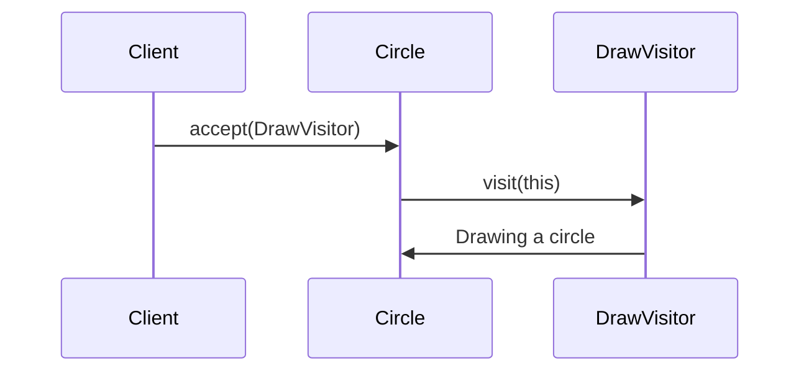

## 5.12.2 Double Dispatch Mechanism

In the realm of object-oriented programming, method dispatch is a fundamental concept that determines which method implementation is executed when a method is called. Java, like many other object-oriented languages, primarily uses single dispatch, where the method that gets executed is determined by the runtime type of the object on which the method is called. However, there are scenarios where single dispatch falls short, particularly when the operation to be performed depends on the runtime types of multiple objects. This is where the concept of double dispatch comes into play, and it is a crucial mechanism in implementing the Visitor pattern effectively.

### Understanding Double Dispatch

**Double dispatch** is a technique that allows a program to select the correct method to execute based on the runtime types of two objects involved in the method call. Unlike single dispatch, which only considers the receiver object, double dispatch takes into account both the receiver and the parameter objects to determine the appropriate method to invoke.

#### Importance in the Visitor Pattern

The Visitor pattern is a behavioral design pattern that allows you to add new operations to existing object structures without modifying the structures themselves. It achieves this by separating the operation from the object structure, encapsulating it in a visitor object. The Visitor pattern heavily relies on double dispatch to ensure that the correct operation is executed for each element in the object structure.

In a typical Visitor pattern implementation, the object structure (often a collection of elements) accepts a visitor object. The visitor then "visits" each element, performing operations specific to the element's type. Double dispatch is essential here because it allows the visitor to determine the exact type of the element it is visiting and execute the corresponding operation.

### Single Dispatch Limitations in Java

Java's method dispatch mechanism is inherently single dispatch. This means that when a method is called, the method that gets executed is determined by the runtime type of the object on which the method is invoked. This can lead to limitations when the desired behavior depends on the types of multiple objects involved in the interaction.

Consider a scenario where you have a hierarchy of shapes (e.g., `Circle`, `Square`, `Triangle`) and a hierarchy of operations (e.g., `Draw`, `Resize`). If you want to perform operations that depend on both the shape and the operation type, single dispatch falls short because it only considers the type of the shape.

### How the Visitor Pattern Overcomes Single Dispatch Limitations

The Visitor pattern overcomes the limitations of single dispatch by employing double dispatch. It achieves this by defining a visitor interface with a visit method for each element type in the object structure. Each element class implements an `accept` method that takes a visitor as an argument and calls the appropriate visit method on the visitor, passing itself as an argument. This two-step process ensures that both the element type and the visitor type are considered when selecting the method to execute.

Here's a simple illustration of the Visitor pattern using double dispatch in Java:

```java
// Step 1: Define the Visitor interface
interface ShapeVisitor {
    void visit(Circle circle);
    void visit(Square square);
    void visit(Triangle triangle);
}

// Step 2: Define the Element interface
interface Shape {
    void accept(ShapeVisitor visitor);
}

// Step 3: Implement concrete elements
class Circle implements Shape {
    @Override
    public void accept(ShapeVisitor visitor) {
        visitor.visit(this); // Double dispatch: calls visit(Circle)
    }
}

class Square implements Shape {
    @Override
    public void accept(ShapeVisitor visitor) {
        visitor.visit(this); // Double dispatch: calls visit(Square)
    }
}

class Triangle implements Shape {
    @Override
    public void accept(ShapeVisitor visitor) {
        visitor.visit(this); // Double dispatch: calls visit(Triangle)
    }
}

// Step 4: Implement concrete visitors
class DrawVisitor implements ShapeVisitor {
    @Override
    public void visit(Circle circle) {
        System.out.println("Drawing a circle.");
    }

    @Override
    public void visit(Square square) {
        System.out.println("Drawing a square.");
    }

    @Override
    public void visit(Triangle triangle) {
        System.out.println("Drawing a triangle.");
    }
}

class ResizeVisitor implements ShapeVisitor {
    @Override
    public void visit(Circle circle) {
        System.out.println("Resizing a circle.");
    }

    @Override
    public void visit(Square square) {
        System.out.println("Resizing a square.");
    }

    @Override
    public void visit(Triangle triangle) {
        System.out.println("Resizing a triangle.");
    }
}

// Client code
public class VisitorPatternDemo {
    public static void main(String[] args) {
        Shape[] shapes = {new Circle(), new Square(), new Triangle()};
        ShapeVisitor drawVisitor = new DrawVisitor();
        ShapeVisitor resizeVisitor = new ResizeVisitor();

        for (Shape shape : shapes) {
            shape.accept(drawVisitor);
            shape.accept(resizeVisitor);
        }
    }
}
```

### How Double Dispatch Ensures the Correct Method is Called

In the example above, the `accept` method in each shape class calls the `visit` method on the visitor, passing itself as an argument. This is the first dispatch, where the method to be called is determined by the runtime type of the shape. The second dispatch occurs when the visitor's `visit` method is called, which is determined by the runtime type of the visitor. This two-step dispatch process ensures that the correct method is executed based on the types of both the shape and the visitor.

### Visualizing Double Dispatch

To better understand how double dispatch works, let's visualize the process using a sequence diagram.



In this diagram, the client initiates the process by calling the `accept` method on a `Circle` object, passing a `DrawVisitor`. The `Circle` then calls the `visit` method on the `DrawVisitor`, passing itself (`this`) as an argument. The `DrawVisitor` executes the `visit(Circle)` method, which contains the logic for drawing a circle.

### Limitations and Considerations

While double dispatch is a powerful mechanism, it comes with certain limitations and considerations:

1. **Complexity**: Implementing double dispatch can increase the complexity of your code, especially when dealing with large hierarchies of elements and visitors.

2. **Performance**: The additional method calls involved in double dispatch can introduce a slight performance overhead, although this is usually negligible in most applications.

3. **Extensibility**: Adding new element types requires modifying the visitor interface and all concrete visitors, which can be cumbersome. However, this is a trade-off for the flexibility and separation of concerns provided by the Visitor pattern.

4. **Type Safety**: Double dispatch relies on method overloading, which can lead to runtime errors if not implemented carefully. It's important to ensure that all necessary visit methods are defined and correctly implemented.

### Try It Yourself

To gain a deeper understanding of double dispatch and the Visitor pattern, try modifying the code example above:

- Add a new shape class, such as `Rectangle`, and update the visitor interface and concrete visitors to handle the new shape.
- Implement a new visitor, such as `ColorVisitor`, that assigns colors to shapes.
- Experiment with different combinations of shapes and visitors to see how double dispatch ensures the correct method is called.

### Further Reading

For more information on double dispatch and the Visitor pattern, consider exploring the following resources:

- [Design Patterns: Elements of Reusable Object-Oriented Software](https://en.wikipedia.org/wiki/Design_Patterns) by Erich Gamma, Richard Helm, Ralph Johnson, and John Vlissides
- [Java Design Patterns](https://www.journaldev.com/1827/java-design-patterns-example-tutorial) by JournalDev
- [Visitor Pattern in Java](https://refactoring.guru/design-patterns/visitor/java/example) by Refactoring Guru

### Knowledge Check

Before we wrap up, let's reinforce what we've learned with some questions:

1. What is double dispatch, and how does it differ from single dispatch?
2. Why is double dispatch important in the Visitor pattern?
3. How does the Visitor pattern overcome the limitations of single dispatch in Java?
4. What are some potential drawbacks of using double dispatch?
5. How can you extend the Visitor pattern to support new element types?

### Conclusion

Double dispatch is a powerful mechanism that enhances the flexibility and extensibility of object-oriented designs, particularly in the context of the Visitor pattern. By allowing method selection based on the runtime types of multiple objects, double dispatch enables developers to implement complex operations without modifying existing object structures. As you continue to explore design patterns and object-oriented programming, remember that double dispatch is just one of many tools at your disposal for creating robust and maintainable software.

## Quiz Time!



### What is double dispatch?

- [x] A mechanism that selects a method based on the runtime types of two objects.
- [ ] A mechanism that selects a method based on the compile-time types of two objects.
- [ ] A mechanism that selects a method based on the runtime type of one object.
- [ ] A mechanism that selects a method based on the compile-time type of one object.

> **Explanation:** Double dispatch selects a method based on the runtime types of two objects involved in the call.

### How does double dispatch differ from single dispatch?

- [x] Double dispatch considers the runtime types of two objects, while single dispatch considers only one.
- [ ] Double dispatch considers the compile-time types of two objects, while single dispatch considers only one.
- [ ] Double dispatch considers the runtime types of one object, while single dispatch considers two.
- [ ] Double dispatch considers the compile-time types of one object, while single dispatch considers two.

> **Explanation:** Double dispatch involves two objects' runtime types, whereas single dispatch involves only one object's runtime type.

### Why is double dispatch important in the Visitor pattern?

- [x] It allows the visitor to execute operations based on the element's type.
- [ ] It allows the visitor to execute operations based on the visitor's type.
- [ ] It allows the visitor to execute operations based on the compile-time type of the element.
- [ ] It allows the visitor to execute operations based on the compile-time type of the visitor.

> **Explanation:** Double dispatch enables the visitor to execute operations based on the runtime type of the element it visits.

### What is a potential drawback of using double dispatch?

- [x] Increased complexity and potential for runtime errors.
- [ ] Decreased flexibility and maintainability.
- [ ] Reduced performance due to compile-time checks.
- [ ] Limited support for multiple programming languages.

> **Explanation:** Double dispatch can increase complexity and introduce runtime errors if not implemented carefully.

### How does the Visitor pattern overcome single dispatch limitations?

- [x] By using double dispatch to select methods based on multiple object types.
- [ ] By using single dispatch to select methods based on one object type.
- [ ] By using compile-time checks to select methods based on object types.
- [ ] By using runtime checks to select methods based on object types.

> **Explanation:** The Visitor pattern uses double dispatch to select methods based on the types of both the element and the visitor.

### What is a key benefit of the Visitor pattern?

- [x] It allows adding new operations without modifying existing structures.
- [ ] It allows adding new structures without modifying existing operations.
- [ ] It allows modifying existing structures without adding new operations.
- [ ] It allows modifying existing operations without adding new structures.

> **Explanation:** The Visitor pattern enables adding new operations without altering existing object structures.

### What is a potential limitation of the Visitor pattern?

- [x] Difficulty in adding new element types.
- [ ] Difficulty in adding new visitor types.
- [ ] Difficulty in modifying existing operations.
- [ ] Difficulty in modifying existing structures.

> **Explanation:** Adding new element types requires updating the visitor interface and all concrete visitors.

### How can you extend the Visitor pattern to support new element types?

- [x] Update the visitor interface and all concrete visitors to handle the new element.
- [ ] Update only the visitor interface to handle the new element.
- [ ] Update only the concrete visitors to handle the new element.
- [ ] Update the element classes to handle new visitors.

> **Explanation:** To support new element types, you must update the visitor interface and all concrete visitors.

### In the provided code example, what role does the `accept` method play?

- [x] It initiates the double dispatch process by calling the visitor's `visit` method.
- [ ] It completes the double dispatch process by calling the visitor's `visit` method.
- [ ] It initiates the single dispatch process by calling the visitor's `visit` method.
- [ ] It completes the single dispatch process by calling the visitor's `visit` method.

> **Explanation:** The `accept` method starts the double dispatch by invoking the visitor's `visit` method.

### True or False: Double dispatch can be used to implement operations that depend on the types of multiple objects.

- [x] True
- [ ] False

> **Explanation:** Double dispatch is specifically designed to handle operations that depend on the runtime types of multiple objects.


