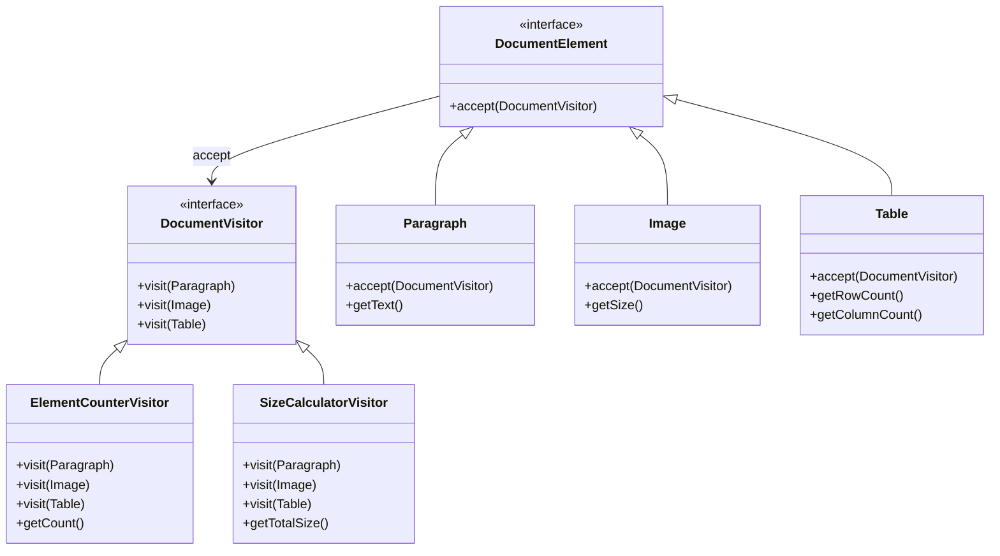

## 5.12.3 Extensibility with Visitors

In the realm of software engineering, the ability to extend functionality without modifying existing code is a hallmark of robust design. The Visitor pattern is a powerful tool in achieving this goal, particularly in Java. This pattern allows developers to add new operations to existing object structures without altering the structures themselves, thus adhering to the open/closed principle. In this section, we will explore how the Visitor pattern facilitates extensibility, provide examples of extending functionality using visitors, and discuss considerations for maintaining and updating visitor and element classes.

### Understanding the Visitor Pattern

The Visitor pattern is a behavioral design pattern that separates an algorithm from the objects on which it operates. This separation allows new operations to be added without modifying the objects' classes. The pattern involves two main components:

1. **Visitor Interface**: Defines a visit operation for each type of element in the object structure.
2. **Concrete Visitor**: Implements the visitor interface and provides the specific operations to be performed on each element.
3. **Element Interface**: Defines an accept method that takes a visitor as an argument.
4. **Concrete Element**: Implements the element interface and calls the visitor's visit method.

### Promoting the Open/Closed Principle

The open/closed principle states that software entities should be open for extension but closed for modification. The Visitor pattern embodies this principle by allowing new operations to be added to an object structure without changing the classes of the elements in that structure. This is achieved by introducing new visitor classes that implement additional operations.

#### Example: Extending Functionality with Visitors

Consider a simple example of a document processing system where different types of document elements need to be processed. We have elements like `Paragraph`, `Image`, and `Table`. Initially, we might have a visitor that counts the number of elements. Later, we might want to add a visitor that calculates the total size of all elements.

```java
// Visitor interface
interface DocumentVisitor {
    void visit(Paragraph paragraph);
    void visit(Image image);
    void visit(Table table);
}

// Concrete visitor for counting elements
class ElementCounterVisitor implements DocumentVisitor {
    private int count = 0;

    @Override
    public void visit(Paragraph paragraph) {
        count++;
    }

    @Override
    public void visit(Image image) {
        count++;
    }

    @Override
    public void visit(Table table) {
        count++;
    }

    public int getCount() {
        return count;
    }
}

// Concrete visitor for calculating size
class SizeCalculatorVisitor implements DocumentVisitor {
    private int totalSize = 0;

    @Override
    public void visit(Paragraph paragraph) {
        totalSize += paragraph.getText().length();
    }

    @Override
    public void visit(Image image) {
        totalSize += image.getSize();
    }

    @Override
    public void visit(Table table) {
        totalSize += table.getRowCount() * table.getColumnCount();
    }

    public int getTotalSize() {
        return totalSize;
    }
}

// Element interface
interface DocumentElement {
    void accept(DocumentVisitor visitor);
}

// Concrete elements
class Paragraph implements DocumentElement {
    private String text;

    public Paragraph(String text) {
        this.text = text;
    }

    public String getText() {
        return text;
    }

    @Override
    public void accept(DocumentVisitor visitor) {
        visitor.visit(this);
    }
}

class Image implements DocumentElement {
    private int size;

    public Image(int size) {
        this.size = size;
    }

    public int getSize() {
        return size;
    }

    @Override
    public void accept(DocumentVisitor visitor) {
        visitor.visit(this);
    }
}

class Table implements DocumentElement {
    private int rows;
    private int columns;

    public Table(int rows, int columns) {
        this.rows = rows;
        this.columns = columns;
    }

    public int getRowCount() {
        return rows;
    }

    public int getColumnCount() {
        return columns;
    }

    @Override
    public void accept(DocumentVisitor visitor) {
        visitor.visit(this);
    }
}
```

In this example, we can easily add new operations by creating new visitor classes without modifying the existing element classes. This makes the system highly extensible and maintainable.

### Considerations for Maintaining and Updating Visitor and Element Classes

While the Visitor pattern offers significant benefits in terms of extensibility, there are considerations to keep in mind:

1. **Complexity**: As the number of element types grows, the visitor interface and its implementations can become complex. It is important to manage this complexity by organizing code effectively and documenting it well.

2. **Element Interface Changes**: If the element interface changes, all visitor implementations must be updated. This can be mitigated by ensuring that the element interface is stable and changes are made judiciously.

3. **Double Dispatch**: The Visitor pattern relies on double dispatch, which can be less intuitive for developers unfamiliar with the concept. It is crucial to ensure that team members understand how double dispatch works.

4. **Performance**: The pattern can introduce performance overhead due to the additional method calls. Profiling and optimization may be necessary in performance-critical applications.

### Visualizing the Visitor Pattern

To better understand the Visitor pattern, let's visualize the interaction between visitors and elements using a class diagram.



This diagram illustrates how the visitor pattern separates operations from the elements, allowing new operations to be added without modifying the elements themselves.

### Try It Yourself

To gain a deeper understanding of the Visitor pattern, try modifying the code examples provided:

1. **Add a New Element**: Introduce a new element type, such as `Chart`, and implement its accept method. Update the existing visitors to handle this new element.

2. **Create a New Visitor**: Develop a new visitor that performs a different operation, such as generating a summary report of the document elements.

3. **Optimize Performance**: Profile the application and identify any performance bottlenecks introduced by the Visitor pattern. Experiment with optimizations to improve performance.

### Knowledge Check

- Explain how the Visitor pattern adheres to the open/closed principle.
- Describe the role of double dispatch in the Visitor pattern.
- Discuss the potential performance implications of using the Visitor pattern.

### Further Reading

For more information on the Visitor pattern and its applications, consider exploring the following resources:

- [Design Patterns: Elements of Reusable Object-Oriented Software](https://www.amazon.com/Design-Patterns-Elements-Reusable-Object-Oriented/dp/0201633612) by Erich Gamma, Richard Helm, Ralph Johnson, and John Vlissides.
- [Refactoring: Improving the Design of Existing Code](https://www.amazon.com/Refactoring-Improving-Design-Existing-Code/dp/0134757599) by Martin Fowler.

### Embrace the Journey

Remember, mastering design patterns is a journey. As you continue to explore and apply these patterns, you'll gain deeper insights into creating flexible, maintainable, and extensible software. Keep experimenting, stay curious, and enjoy the journey!

## Quiz Time!



### How does the Visitor pattern adhere to the open/closed principle?

- [x] By allowing new operations to be added without modifying existing classes.
- [ ] By modifying existing classes to add new operations.
- [ ] By using inheritance to extend functionality.
- [ ] By encapsulating data within classes.

> **Explanation:** The Visitor pattern allows new operations to be added by creating new visitor classes, without modifying the existing classes, thus adhering to the open/closed principle.

### What is the role of double dispatch in the Visitor pattern?

- [x] It allows the correct method to be called based on both visitor and element types.
- [ ] It enables single dispatch based on the visitor type.
- [ ] It allows elements to be modified directly by the visitor.
- [ ] It simplifies the visitor interface by reducing method overloads.

> **Explanation:** Double dispatch in the Visitor pattern ensures that the correct method is called based on both the visitor and the element types, allowing for the appropriate operation to be performed.

### What is a potential drawback of the Visitor pattern?

- [x] Complexity increases with the number of element types.
- [ ] It tightly couples visitors and elements.
- [ ] It limits the number of operations that can be performed.
- [ ] It requires modifying element classes for each new visitor.

> **Explanation:** As the number of element types increases, the complexity of the visitor interface and its implementations can grow, making it harder to manage.

### How can you add a new operation to an object structure using the Visitor pattern?

- [x] By creating a new visitor class.
- [ ] By modifying existing element classes.
- [ ] By extending the element interface.
- [ ] By adding methods to the visitor interface.

> **Explanation:** New operations can be added by creating new visitor classes that implement the desired operations, without modifying the existing element classes.

### What is a key benefit of using the Visitor pattern?

- [x] It separates algorithms from the objects they operate on.
- [ ] It reduces the number of classes in a system.
- [ ] It simplifies the object structure.
- [ ] It eliminates the need for interfaces.

> **Explanation:** The Visitor pattern separates algorithms from the objects they operate on, allowing for more flexible and maintainable code.

### What should be considered when updating visitor and element classes?

- [x] Ensuring the element interface remains stable.
- [ ] Reducing the number of visitor classes.
- [ ] Avoiding the use of interfaces.
- [ ] Minimizing the number of methods in visitor classes.

> **Explanation:** Ensuring that the element interface remains stable helps prevent the need to update all visitor implementations when changes are made.

### How does the Visitor pattern impact performance?

- [x] It can introduce performance overhead due to additional method calls.
- [ ] It always improves performance by reducing method calls.
- [ ] It has no impact on performance.
- [ ] It eliminates the need for method calls.

> **Explanation:** The Visitor pattern can introduce performance overhead due to the additional method calls required for double dispatch.

### What is an example of a new visitor that could be added to the document processing system?

- [x] A visitor that generates a summary report.
- [ ] A visitor that modifies element text.
- [ ] A visitor that deletes elements.
- [ ] A visitor that changes element types.

> **Explanation:** A new visitor could be added to perform operations such as generating a summary report, without modifying the existing element classes.

### How can you visualize the interaction between visitors and elements?

- [x] By using a class diagram.
- [ ] By writing pseudocode.
- [ ] By creating a flowchart.
- [ ] By listing method calls.

> **Explanation:** A class diagram can effectively visualize the interaction between visitors and elements, showing how operations are separated from the objects they operate on.

### True or False: The Visitor pattern requires modifying element classes for each new visitor.

- [ ] True
- [x] False

> **Explanation:** False. The Visitor pattern allows new operations to be added by creating new visitor classes, without modifying the existing element classes.


