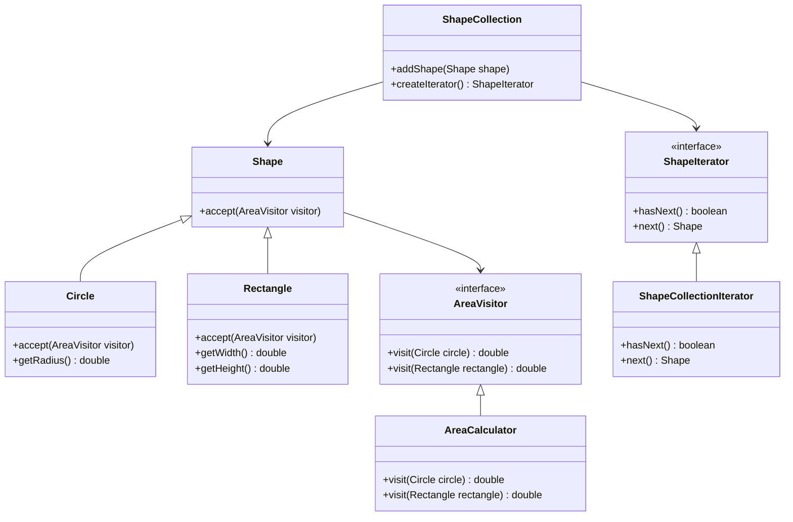

## 5.12.4 Visitor vs. Iterator Pattern

Design patterns are essential tools in a software engineer's toolkit, providing reusable solutions to common problems in software design. Among these, the Visitor and Iterator patterns are two behavioral patterns that, while distinct in their purposes and applications, can sometimes be confused due to their involvement with collections and object structures. In this section, we will delve into the nuances of these patterns, compare their intents, and explore scenarios where each is more appropriate. Additionally, we will discuss how these patterns can be used together in complex structures.

### Understanding the Visitor Pattern

The Visitor pattern is a design pattern that allows you to separate algorithms from the objects on which they operate. It involves creating a visitor class that implements a specific operation on elements of an object structure. The Visitor pattern is particularly useful when you want to perform operations across a set of objects with different interfaces or classes without modifying their code.

#### Key Components of the Visitor Pattern

- **Visitor Interface**: Declares a visit operation for each type of element in the object structure.
- **Concrete Visitor**: Implements the operations defined in the Visitor interface.
- **Element Interface**: Declares an accept method that takes a visitor as an argument.
- **Concrete Element**: Implements the accept method, which calls the appropriate visit method on the visitor.
- **Object Structure**: A collection of elements that can be iterated over and visited by the visitor.

#### Example of the Visitor Pattern

Consider a scenario where we have a collection of different types of shapes, and we want to perform operations like drawing and calculating the area without modifying the shape classes.

```java
// Visitor Interface
interface ShapeVisitor {
    void visit(Circle circle);
    void visit(Rectangle rectangle);
}

// Concrete Visitor
class ShapeDrawer implements ShapeVisitor {
    public void visit(Circle circle) {
        System.out.println("Drawing a circle.");
    }
    public void visit(Rectangle rectangle) {
        System.out.println("Drawing a rectangle.");
    }
}

// Element Interface
interface Shape {
    void accept(ShapeVisitor visitor);
}

// Concrete Elements
class Circle implements Shape {
    public void accept(ShapeVisitor visitor) {
        visitor.visit(this);
    }
}

class Rectangle implements Shape {
    public void accept(ShapeVisitor visitor) {
        visitor.visit(this);
    }
}

// Object Structure
class ShapeCollection {
    private List<Shape> shapes = new ArrayList<>();

    public void addShape(Shape shape) {
        shapes.add(shape);
    }

    public void accept(ShapeVisitor visitor) {
        for (Shape shape : shapes) {
            shape.accept(visitor);
        }
    }
}

// Client Code
public class VisitorPatternDemo {
    public static void main(String[] args) {
        ShapeCollection collection = new ShapeCollection();
        collection.addShape(new Circle());
        collection.addShape(new Rectangle());

        ShapeDrawer drawer = new ShapeDrawer();
        collection.accept(drawer);
    }
}
```

### Understanding the Iterator Pattern

The Iterator pattern provides a way to access the elements of an aggregate object sequentially without exposing its underlying representation. It is particularly useful for traversing collections like lists, stacks, or trees.

#### Key Components of the Iterator Pattern

- **Iterator Interface**: Defines methods for accessing and traversing elements.
- **Concrete Iterator**: Implements the Iterator interface and keeps track of the current position in the traversal.
- **Aggregate Interface**: Defines a method to create an iterator.
- **Concrete Aggregate**: Implements the Aggregate interface and returns an instance of the Concrete Iterator.

#### Example of the Iterator Pattern

Let's consider a simple example of an iterator for a collection of integers.

```java
// Iterator Interface
interface Iterator {
    boolean hasNext();
    int next();
}

// Concrete Iterator
class IntegerIterator implements Iterator {
    private int[] numbers;
    private int position = 0;

    public IntegerIterator(int[] numbers) {
        this.numbers = numbers;
    }

    public boolean hasNext() {
        return position < numbers.length;
    }

    public int next() {
        return numbers[position++];
    }
}

// Aggregate Interface
interface IterableCollection {
    Iterator createIterator();
}

// Concrete Aggregate
class NumberCollection implements IterableCollection {
    private int[] numbers;

    public NumberCollection(int[] numbers) {
        this.numbers = numbers;
    }

    public Iterator createIterator() {
        return new IntegerIterator(numbers);
    }
}

// Client Code
public class IteratorPatternDemo {
    public static void main(String[] args) {
        NumberCollection collection = new NumberCollection(new int[]{1, 2, 3, 4, 5});
        Iterator iterator = collection.createIterator();

        while (iterator.hasNext()) {
            System.out.println(iterator.next());
        }
    }
}
```

### Comparing Visitor and Iterator Patterns

#### Intent and Purpose

- **Visitor Pattern**: The primary intent is to define new operations on an object structure without changing the classes of the elements on which it operates. It is particularly useful when the object structure is stable, but new operations are frequently added.
  
- **Iterator Pattern**: The main purpose is to provide a standard way to traverse a collection of elements without exposing its internal structure. It focuses on traversal rather than operations on elements.

#### Use Cases

- **Visitor Pattern**: Use when you need to perform multiple distinct operations across a set of objects with different interfaces. It is ideal for scenarios where operations need to be added or modified frequently.

- **Iterator Pattern**: Use when you need to traverse a collection of elements in a uniform manner. It is suitable for scenarios where the focus is on accessing elements sequentially.

#### Code Structure

- **Visitor Pattern**: Involves multiple classes for visitors and elements, with each element class implementing an accept method.

- **Iterator Pattern**: Involves a single iterator class that implements methods for traversal, such as `hasNext()` and `next()`.

#### Flexibility

- **Visitor Pattern**: Offers flexibility in adding new operations without modifying existing element classes, but adding new element classes requires changes to the visitor interface.

- **Iterator Pattern**: Provides a flexible way to traverse collections, but adding new traversal methods requires changes to the iterator interface.

### Scenarios for Using Visitor and Iterator Patterns

#### When to Use the Visitor Pattern

- When you have a complex object structure and need to perform multiple operations on it.
- When the operations on the object structure are likely to change frequently.
- When you want to separate the algorithm from the object structure to enhance maintainability.

#### When to Use the Iterator Pattern

- When you need to traverse a collection of elements without exposing its internal structure.
- When you want to provide a uniform interface for accessing elements of different collections.
- When you need to support multiple traversal methods for a collection.

### Combining Visitor and Iterator Patterns

In complex systems, there are scenarios where both the Visitor and Iterator patterns can be used together to leverage their strengths. For instance, you might use an iterator to traverse a collection and a visitor to perform operations on each element.

#### Example: Combining Visitor and Iterator

Consider a scenario where we have a collection of shapes, and we want to calculate the total area of all shapes using both patterns.

```java
// Visitor Interface
interface AreaVisitor {
    double visit(Circle circle);
    double visit(Rectangle rectangle);
}

// Concrete Visitor
class AreaCalculator implements AreaVisitor {
    public double visit(Circle circle) {
        return Math.PI * circle.getRadius() * circle.getRadius();
    }
    public double visit(Rectangle rectangle) {
        return rectangle.getWidth() * rectangle.getHeight();
    }
}

// Shape Interface
interface Shape {
    void accept(AreaVisitor visitor);
}

// Concrete Elements
class Circle implements Shape {
    private double radius;

    public Circle(double radius) {
        this.radius = radius;
    }

    public double getRadius() {
        return radius;
    }

    public void accept(AreaVisitor visitor) {
        visitor.visit(this);
    }
}

class Rectangle implements Shape {
    private double width;
    private double height;

    public Rectangle(double width, double height) {
        this.width = width;
        this.height = height;
    }

    public double getWidth() {
        return width;
    }

    public double getHeight() {
        return height;
    }

    public void accept(AreaVisitor visitor) {
        visitor.visit(this);
    }
}

// Iterator Interface
interface ShapeIterator {
    boolean hasNext();
    Shape next();
}

// Concrete Iterator
class ShapeCollectionIterator implements ShapeIterator {
    private List<Shape> shapes;
    private int position = 0;

    public ShapeCollectionIterator(List<Shape> shapes) {
        this.shapes = shapes;
    }

    public boolean hasNext() {
        return position < shapes.size();
    }

    public Shape next() {
        return shapes.get(position++);
    }
}

// Shape Collection
class ShapeCollection {
    private List<Shape> shapes = new ArrayList<>();

    public void addShape(Shape shape) {
        shapes.add(shape);
    }

    public ShapeIterator createIterator() {
        return new ShapeCollectionIterator(shapes);
    }
}

// Client Code
public class VisitorIteratorDemo {
    public static void main(String[] args) {
        ShapeCollection collection = new ShapeCollection();
        collection.addShape(new Circle(5));
        collection.addShape(new Rectangle(4, 6));

        ShapeIterator iterator = collection.createIterator();
        AreaCalculator calculator = new AreaCalculator();
        double totalArea = 0;

        while (iterator.hasNext()) {
            Shape shape = iterator.next();
            totalArea += shape.accept(calculator);
        }

        System.out.println("Total Area: " + totalArea);
    }
}
```

### Visualizing the Interaction

To better understand how the Visitor and Iterator patterns can work together, let's visualize the interaction using a class diagram.



### Key Takeaways

- The Visitor pattern is ideal for performing operations on a stable object structure with frequently changing operations.
- The Iterator pattern is best suited for traversing collections without exposing their internal structure.
- Both patterns can be combined to traverse a collection and perform operations on its elements, leveraging the strengths of each pattern.
- Understanding the differences and appropriate use cases for each pattern is crucial for designing flexible and maintainable software systems.

### Try It Yourself

Experiment with the provided code examples by adding new shapes or operations. Try implementing a new visitor that calculates the perimeter of each shape. Modify the iterator to support reverse traversal and observe how it affects the overall design.

## Quiz Time!



### What is the primary intent of the Visitor pattern?

- [x] To define new operations on an object structure without changing the classes of the elements.
- [ ] To provide a standard way to traverse a collection of elements.
- [ ] To encapsulate a request as an object.
- [ ] To separate the construction of a complex object from its representation.

> **Explanation:** The Visitor pattern allows new operations to be defined on an object structure without modifying the element classes.

### Which pattern is more suitable for traversing a collection of elements?

- [ ] Visitor Pattern
- [x] Iterator Pattern
- [ ] Command Pattern
- [ ] Strategy Pattern

> **Explanation:** The Iterator pattern provides a standard way to traverse a collection of elements without exposing its internal structure.

### When should you use the Visitor pattern?

- [x] When you have a complex object structure and need to perform multiple operations on it.
- [ ] When you need to traverse a collection of elements.
- [ ] When you need to encapsulate a request as an object.
- [ ] When you need to define a family of algorithms.

> **Explanation:** The Visitor pattern is useful for performing multiple operations on a complex object structure.

### What is a key difference between the Visitor and Iterator patterns?

- [x] Visitor focuses on operations, while Iterator focuses on traversal.
- [ ] Visitor focuses on traversal, while Iterator focuses on operations.
- [ ] Both focus on encapsulating requests.
- [ ] Both focus on defining families of algorithms.

> **Explanation:** The Visitor pattern focuses on performing operations on elements, while the Iterator pattern focuses on traversing collections.

### How can the Visitor and Iterator patterns be used together?

- [x] Use an iterator to traverse a collection and a visitor to perform operations on each element.
- [ ] Use a visitor to traverse a collection and an iterator to perform operations on each element.
- [ ] Use both to encapsulate requests as objects.
- [ ] Use both to define a family of algorithms.

> **Explanation:** An iterator can be used to traverse a collection, while a visitor can perform operations on each element.

### What is a potential drawback of the Visitor pattern?

- [x] Adding new element classes requires changes to the visitor interface.
- [ ] It exposes the internal structure of collections.
- [ ] It cannot be used with complex object structures.
- [ ] It does not support multiple operations on elements.

> **Explanation:** Adding new element classes requires changes to the visitor interface, which can be a drawback.

### What is a potential drawback of the Iterator pattern?

- [x] Adding new traversal methods requires changes to the iterator interface.
- [ ] It cannot be used with collections.
- [ ] It does not support sequential access to elements.
- [ ] It cannot be used with complex object structures.

> **Explanation:** Adding new traversal methods requires changes to the iterator interface, which can be a drawback.

### Which pattern is more flexible in adding new operations without modifying existing classes?

- [x] Visitor Pattern
- [ ] Iterator Pattern
- [ ] Command Pattern
- [ ] Strategy Pattern

> **Explanation:** The Visitor pattern allows new operations to be added without modifying existing element classes.

### Which pattern is more focused on providing a uniform interface for accessing elements?

- [ ] Visitor Pattern
- [x] Iterator Pattern
- [ ] Command Pattern
- [ ] Strategy Pattern

> **Explanation:** The Iterator pattern provides a uniform interface for accessing elements of different collections.

### True or False: The Visitor pattern is ideal for scenarios where operations need to be added or modified frequently.

- [x] True
- [ ] False

> **Explanation:** The Visitor pattern is ideal for scenarios where operations need to be added or modified frequently, as it allows new operations to be defined without changing the element classes.


