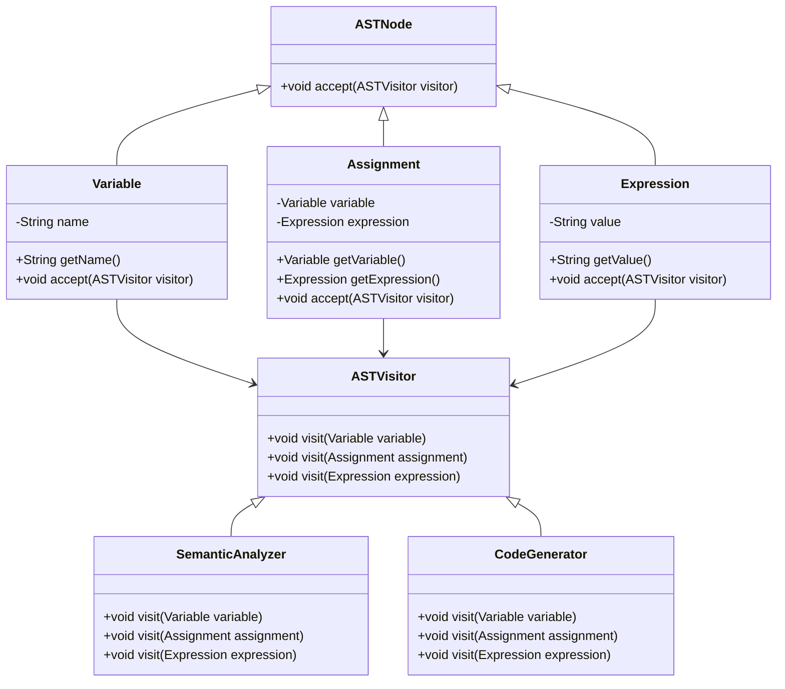

## 5.12.5 Use Cases and Examples

The Visitor Pattern is a powerful design pattern that allows you to separate algorithms from the objects on which they operate. This separation is particularly useful in scenarios where you need to perform operations on a complex object structure, such as an abstract syntax tree (AST) in a compiler. In this section, we will explore real-world applications of the Visitor Pattern, focusing on its use in compilers and syntax trees. We will provide detailed explanations, code snippets, and discuss the advantages of using the Visitor Pattern in these contexts.

### Introduction to the Visitor Pattern

The Visitor Pattern is a behavioral design pattern that lets you define a new operation without changing the classes of the elements on which it operates. It involves two main components: the Visitor and the Element. The Element interface defines an `accept` method that takes a visitor as an argument, while the Visitor interface declares a visit method for each type of element.

#### Key Concepts

- **Visitor**: An interface or abstract class that declares a visit method for each type of element.
- **Element**: An interface or abstract class that declares an `accept` method, which takes a visitor as an argument.
- **Concrete Visitor**: Implements the visitor interface and defines the operations to be performed on elements.
- **Concrete Element**: Implements the element interface and defines the `accept` method.

### Real-World Scenario: Compilers and Syntax Trees

Compilers are complex software systems that translate source code written in a high-level programming language into machine code. One of the key components of a compiler is the abstract syntax tree (AST), which represents the hierarchical structure of the source code. The Visitor Pattern is particularly useful in compilers for traversing and manipulating the AST.

#### How Compilers Use the Visitor Pattern

In a compiler, the AST is a tree structure where each node represents a construct in the source code. The Visitor Pattern allows you to define operations on the nodes of the AST without modifying their classes. This is particularly useful for implementing various phases of the compilation process, such as semantic analysis, optimization, and code generation.

Let's explore how the Visitor Pattern can be used in a compiler to traverse and manipulate an AST.

### Example: Implementing the Visitor Pattern in a Compiler

Consider a simple programming language with constructs like variables, assignments, and expressions. We will define an AST for this language and use the Visitor Pattern to implement a semantic analysis phase.

#### Step 1: Define the Element Interface

First, we define the `Element` interface, which declares the `accept` method.

```java
public interface ASTNode {
    void accept(ASTVisitor visitor);
}
```

#### Step 2: Define Concrete Elements

Next, we define concrete elements for different constructs in the language, such as `Variable`, `Assignment`, and `Expression`.

```java
public class Variable implements ASTNode {
    private String name;

    public Variable(String name) {
        this.name = name;
    }

    public String getName() {
        return name;
    }

    @Override
    public void accept(ASTVisitor visitor) {
        visitor.visit(this);
    }
}

public class Assignment implements ASTNode {
    private Variable variable;
    private Expression expression;

    public Assignment(Variable variable, Expression expression) {
        this.variable = variable;
        this.expression = expression;
    }

    public Variable getVariable() {
        return variable;
    }

    public Expression getExpression() {
        return expression;
    }

    @Override
    public void accept(ASTVisitor visitor) {
        visitor.visit(this);
    }
}

public class Expression implements ASTNode {
    private String value;

    public Expression(String value) {
        this.value = value;
    }

    public String getValue() {
        return value;
    }

    @Override
    public void accept(ASTVisitor visitor) {
        visitor.visit(this);
    }
}
```

#### Step 3: Define the Visitor Interface

Now, we define the `Visitor` interface, which declares a visit method for each type of element.

```java
public interface ASTVisitor {
    void visit(Variable variable);
    void visit(Assignment assignment);
    void visit(Expression expression);
}
```

#### Step 4: Implement a Concrete Visitor

We implement a concrete visitor for the semantic analysis phase. This visitor checks for undefined variables and type mismatches.

```java
import java.util.HashSet;
import java.util.Set;

public class SemanticAnalyzer implements ASTVisitor {
    private Set<String> definedVariables = new HashSet<>();

    @Override
    public void visit(Variable variable) {
        if (!definedVariables.contains(variable.getName())) {
            System.out.println("Error: Undefined variable " + variable.getName());
        }
    }

    @Override
    public void visit(Assignment assignment) {
        definedVariables.add(assignment.getVariable().getName());
        assignment.getExpression().accept(this);
    }

    @Override
    public void visit(Expression expression) {
        // Perform type checking or other analysis
    }
}
```

#### Step 5: Traverse the AST

Finally, we create an AST and traverse it using the semantic analyzer.

```java
public class Compiler {
    public static void main(String[] args) {
        Variable x = new Variable("x");
        Expression expr = new Expression("42");
        Assignment assignment = new Assignment(x, expr);

        ASTNode[] nodes = {x, assignment, expr};

        SemanticAnalyzer analyzer = new SemanticAnalyzer();
        for (ASTNode node : nodes) {
            node.accept(analyzer);
        }
    }
}
```

### Advantages of Using the Visitor Pattern in Compilers

The Visitor Pattern offers several advantages in the context of compilers:

1. **Separation of Concerns**: The Visitor Pattern separates the operations performed on the AST from the structure of the AST itself. This makes it easier to add new operations without modifying the AST classes.

2. **Extensibility**: You can add new operations to the AST by simply creating new visitor classes. This is particularly useful in compilers, where you may need to implement different phases of the compilation process.

3. **Maintainability**: By encapsulating operations in visitor classes, you can keep the AST classes simple and focused on representing the structure of the source code. This improves the maintainability of the compiler codebase.

4. **Flexibility**: The Visitor Pattern allows you to define complex operations on the AST without cluttering the AST classes with multiple methods. This makes it easier to implement and modify operations as needed.

### Case Study: Using the Visitor Pattern for Code Generation

In addition to semantic analysis, the Visitor Pattern can be used for code generation in a compiler. Let's explore how this can be done.

#### Step 1: Define a Code Generation Visitor

We define a concrete visitor for code generation. This visitor generates machine code or intermediate code for each node in the AST.

```java
public class CodeGenerator implements ASTVisitor {
    @Override
    public void visit(Variable variable) {
        System.out.println("LOAD " + variable.getName());
    }

    @Override
    public void visit(Assignment assignment) {
        assignment.getExpression().accept(this);
        System.out.println("STORE " + assignment.getVariable().getName());
    }

    @Override
    public void visit(Expression expression) {
        System.out.println("PUSH " + expression.getValue());
    }
}
```

#### Step 2: Generate Code from the AST

We traverse the AST using the code generator to produce machine code.

```java
public class Compiler {
    public static void main(String[] args) {
        Variable x = new Variable("x");
        Expression expr = new Expression("42");
        Assignment assignment = new Assignment(x, expr);

        ASTNode[] nodes = {x, assignment, expr};

        CodeGenerator generator = new CodeGenerator();
        for (ASTNode node : nodes) {
            node.accept(generator);
        }
    }
}
```

### Visualizing the Visitor Pattern in a Compiler

To better understand how the Visitor Pattern works in a compiler, let's visualize the interactions between the components using a class diagram.



### Try It Yourself

Now that we have explored the Visitor Pattern in the context of compilers and syntax trees, let's encourage you to experiment with the code examples. Here are some suggestions:

- **Extend the Language**: Add new constructs to the language, such as `IfStatement` or `WhileLoop`, and update the visitor classes to handle these constructs.
- **Implement Optimization**: Create a new visitor class for optimization, such as constant folding or dead code elimination.
- **Enhance Error Reporting**: Modify the `SemanticAnalyzer` to provide more detailed error messages, including line numbers and suggestions for fixing errors.

### Knowledge Check

Before we conclude, let's pose a few questions to reinforce your understanding of the Visitor Pattern and its applications in compilers.

1. **What is the main advantage of using the Visitor Pattern in a compiler?**
   - Separation of concerns between operations and data structures.
   - Ability to add new operations without modifying existing classes.

2. **How does the Visitor Pattern improve maintainability in a compiler?**
   - By encapsulating operations in visitor classes, keeping AST classes simple.

3. **What are some potential use cases for the Visitor Pattern in a compiler?**
   - Semantic analysis, code generation, optimization.

### Conclusion

The Visitor Pattern is a versatile design pattern that offers significant advantages in scenarios where you need to perform operations on complex object structures, such as abstract syntax trees in compilers. By separating the operations from the data structures, the Visitor Pattern enhances extensibility, maintainability, and flexibility, making it an invaluable tool in the design of compilers and other software systems.

Remember, this is just the beginning. As you progress, you'll discover more ways to leverage the Visitor Pattern in your projects. Keep experimenting, stay curious, and enjoy the journey!

## Quiz Time!



### What is the primary benefit of using the Visitor Pattern in a compiler?

- [x] Separation of concerns between operations and data structures.
- [ ] Reduces the number of classes needed in the compiler.
- [ ] Simplifies the syntax of the programming language.
- [ ] Increases the speed of the compilation process.

> **Explanation:** The Visitor Pattern separates operations from the data structures they operate on, allowing for easier addition of new operations without modifying existing classes.

### How does the Visitor Pattern improve maintainability in a compiler?

- [x] By encapsulating operations in visitor classes, keeping AST classes simple.
- [ ] By reducing the number of lines of code in the compiler.
- [ ] By eliminating the need for a parser in the compiler.
- [ ] By making the compiler run faster.

> **Explanation:** The Visitor Pattern keeps AST classes focused on representing the structure, while visitor classes handle operations, improving maintainability.

### Which phase of the compilation process can benefit from the Visitor Pattern?

- [x] Semantic analysis
- [x] Code generation
- [ ] Lexical analysis
- [ ] Syntax parsing

> **Explanation:** The Visitor Pattern is useful in phases like semantic analysis and code generation, where operations on the AST are needed.

### What is the role of the `accept` method in the Visitor Pattern?

- [x] It allows an element to accept a visitor and perform the visit operation.
- [ ] It initializes the visitor with default values.
- [ ] It compiles the source code into machine code.
- [ ] It parses the source code into tokens.

> **Explanation:** The `accept` method is used by elements to accept a visitor and invoke the appropriate visit method.

### In the provided example, what does the `SemanticAnalyzer` visitor do?

- [x] Checks for undefined variables and type mismatches.
- [ ] Generates machine code for the AST.
- [ ] Parses the source code into an AST.
- [ ] Optimizes the machine code for performance.

> **Explanation:** The `SemanticAnalyzer` checks for errors like undefined variables and type mismatches during semantic analysis.

### What is a potential use case for adding a new visitor in a compiler?

- [x] Implementing optimization techniques like constant folding.
- [ ] Reducing the number of AST nodes.
- [ ] Simplifying the syntax of the programming language.
- [ ] Increasing the speed of the compilation process.

> **Explanation:** New visitors can be added for tasks like optimization, which involves transforming the AST for better performance.

### How can the Visitor Pattern be extended to handle new language constructs?

- [x] By adding new concrete element classes and updating visitor classes.
- [ ] By modifying the existing AST classes directly.
- [ ] By changing the syntax of the programming language.
- [ ] By reducing the number of visitor classes.

> **Explanation:** New constructs can be handled by adding new element classes and updating visitors to process them.

### What is the role of the `visit` method in the Visitor Pattern?

- [x] It defines the operation to be performed on an element.
- [ ] It initializes the AST with default values.
- [ ] It compiles the source code into machine code.
- [ ] It parses the source code into tokens.

> **Explanation:** The `visit` method defines the operation that the visitor will perform on a specific element type.

### Which of the following is NOT a benefit of using the Visitor Pattern?

- [ ] Extensibility
- [ ] Maintainability
- [ ] Flexibility
- [x] Reducing the number of classes in the system

> **Explanation:** The Visitor Pattern often increases the number of classes due to the need for visitor and element classes.

### True or False: The Visitor Pattern is only useful in compilers.

- [ ] True
- [x] False

> **Explanation:** The Visitor Pattern is versatile and can be used in various scenarios beyond compilers, such as processing complex data structures.


