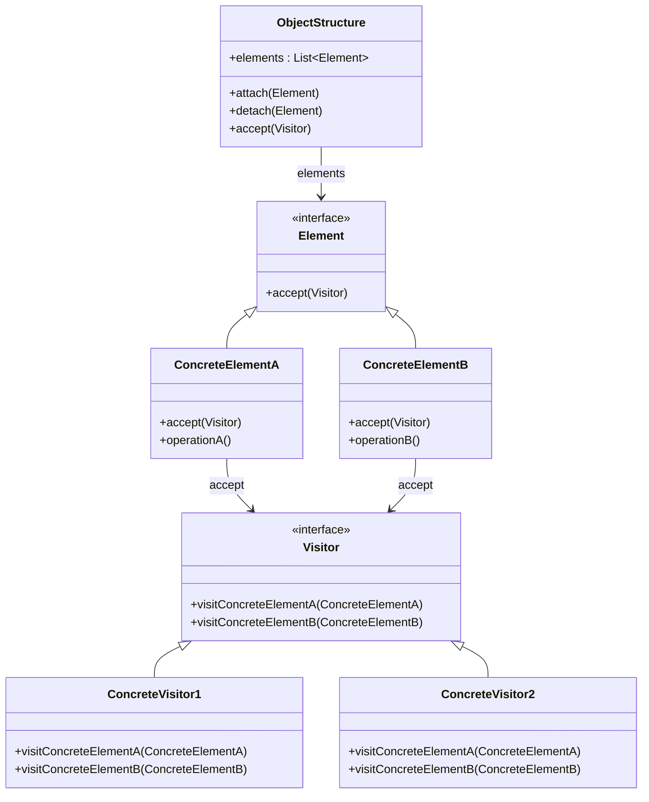
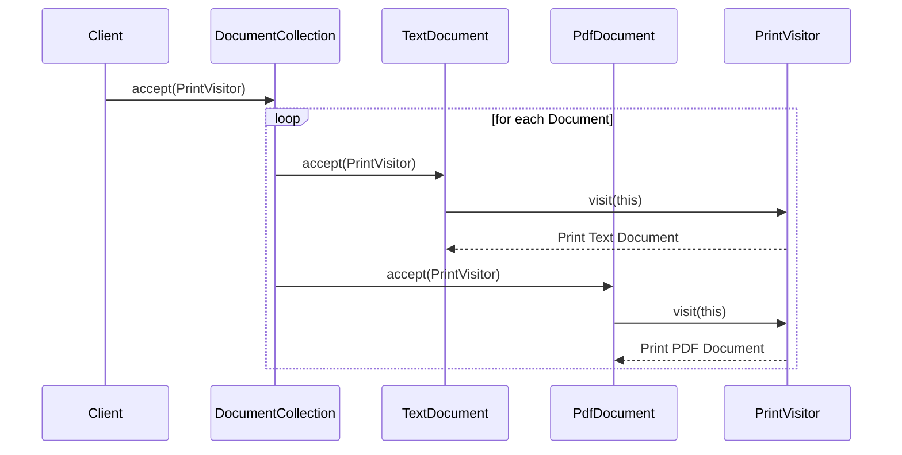

## 5.12 Visitor Pattern

The Visitor Pattern is a behavioral design pattern that allows you to separate algorithms from the objects on which they operate. This pattern is particularly useful when you need to perform various operations on objects of a complex structure, such as a composite object or a collection of objects, without changing their classes. By encapsulating the operations in a visitor object, you can add new operations without modifying the classes of the elements on which they operate.

### Understanding the Visitor Pattern

#### Intent of the Visitor Pattern

The primary intent of the Visitor Pattern is to define a new operation without changing the classes of the elements on which it operates. This is achieved by creating a visitor interface that declares a visit operation for each type of element. Concrete visitors implement these operations, allowing them to perform specific actions on the elements.

#### Problem Solved by the Visitor Pattern

In object-oriented programming, adding new functionality to an existing class hierarchy can be challenging. If you directly add methods to the classes, you risk violating the Open/Closed Principle, which states that classes should be open for extension but closed for modification. The Visitor Pattern addresses this issue by allowing you to define new operations separately from the object structure, thus avoiding modifications to the existing classes.

### Key Concepts: Double Dispatch

A crucial concept in the Visitor Pattern is Double Dispatch. In single dispatch systems, like Java, the method to be executed is determined by the runtime type of the object and the method signature. However, in some cases, you need to execute a method based on the runtime types of two objects. Double Dispatch achieves this by using two method calls: one to determine the type of the element and another to execute the appropriate method in the visitor.

### Structure of the Visitor Pattern

The Visitor Pattern involves several key components:

1. **Visitor Interface**: Declares a visit operation for each type of concrete element.
2. **Concrete Visitor**: Implements the visitor interface and defines specific actions for each element type.
3. **Element Interface**: Declares an accept operation that takes a visitor as an argument.
4. **Concrete Element**: Implements the element interface and defines the accept operation to call the appropriate visit operation on the visitor.
5. **Object Structure**: A collection of elements that can be visited by a visitor.

### UML Diagram of the Visitor Pattern

Below is a UML diagram illustrating the structure of the Visitor Pattern:



### Implementing the Visitor Pattern in Java

Let's explore how to implement the Visitor Pattern in Java with a practical example. We'll create a simple application that processes different types of documents, such as `TextDocument` and `PdfDocument`, using different visitors.

#### Step 1: Define the Visitor Interface

First, define the `Visitor` interface with visit methods for each type of document.

```java
public interface DocumentVisitor {
    void visit(TextDocument textDocument);
    void visit(PdfDocument pdfDocument);
}
```

#### Step 2: Implement Concrete Visitors

Next, implement concrete visitors that perform specific operations on the documents.

```java
public class PrintVisitor implements DocumentVisitor {
    @Override
    public void visit(TextDocument textDocument) {
        System.out.println("Printing Text Document: " + textDocument.getContent());
    }

    @Override
    public void visit(PdfDocument pdfDocument) {
        System.out.println("Printing PDF Document: " + pdfDocument.getContent());
    }
}

public class ExportVisitor implements DocumentVisitor {
    @Override
    public void visit(TextDocument textDocument) {
        System.out.println("Exporting Text Document: " + textDocument.getContent());
    }

    @Override
    public void visit(PdfDocument pdfDocument) {
        System.out.println("Exporting PDF Document: " + pdfDocument.getContent());
    }
}
```

#### Step 3: Define the Element Interface

Define the `Document` interface with an `accept` method that takes a visitor.

```java
public interface Document {
    void accept(DocumentVisitor visitor);
}
```

#### Step 4: Implement Concrete Elements

Implement concrete document classes that accept visitors.

```java
public class TextDocument implements Document {
    private String content;

    public TextDocument(String content) {
        this.content = content;
    }

    public String getContent() {
        return content;
    }

    @Override
    public void accept(DocumentVisitor visitor) {
        visitor.visit(this);
    }
}

public class PdfDocument implements Document {
    private String content;

    public PdfDocument(String content) {
        this.content = content;
    }

    public String getContent() {
        return content;
    }

    @Override
    public void accept(DocumentVisitor visitor) {
        visitor.visit(this);
    }
}
```

#### Step 5: Create the Object Structure

Create an object structure that holds the documents and allows visitors to process them.

```java
import java.util.ArrayList;
import java.util.List;

public class DocumentCollection {
    private List<Document> documents = new ArrayList<>();

    public void addDocument(Document document) {
        documents.add(document);
    }

    public void accept(DocumentVisitor visitor) {
        for (Document document : documents) {
            document.accept(visitor);
        }
    }
}
```

#### Step 6: Demonstrate the Visitor Pattern

Finally, demonstrate the Visitor Pattern by creating documents and processing them with different visitors.

```java
public class VisitorPatternDemo {
    public static void main(String[] args) {
        DocumentCollection documentCollection = new DocumentCollection();

        documentCollection.addDocument(new TextDocument("Hello, World!"));
        documentCollection.addDocument(new PdfDocument("Java Design Patterns"));

        DocumentVisitor printVisitor = new PrintVisitor();
        DocumentVisitor exportVisitor = new ExportVisitor();

        System.out.println("Using Print Visitor:");
        documentCollection.accept(printVisitor);

        System.out.println("\nUsing Export Visitor:");
        documentCollection.accept(exportVisitor);
    }
}
```

### Benefits of the Visitor Pattern

The Visitor Pattern offers several benefits:

- **Separation of Concerns**: It separates operations from the object structure, promoting cleaner code organization.
- **Open/Closed Principle**: New operations can be added without modifying existing classes.
- **Flexibility**: Different operations can be applied to the same object structure without altering the structure itself.

### Trade-offs of the Visitor Pattern

Despite its benefits, the Visitor Pattern has some trade-offs:

- **Complexity**: It can introduce complexity, especially when dealing with a large number of element types.
- **Element Interface Changes**: Adding new element types requires changes to the visitor interface and all concrete visitors.
- **Double Dispatch Overhead**: The pattern relies on double dispatch, which can be less intuitive for developers unfamiliar with the concept.

### Visualizing the Visitor Pattern

To further illustrate the Visitor Pattern, let's visualize the interaction between elements and visitors using a sequence diagram.



### Try It Yourself

To deepen your understanding of the Visitor Pattern, try modifying the code examples:

- **Add a New Document Type**: Implement a new document type, such as `WordDocument`, and update the visitors to handle it.
- **Create Additional Visitors**: Implement additional visitors that perform different operations, such as `CompressVisitor` or `AnalyzeVisitor`.
- **Experiment with Different Object Structures**: Modify the `DocumentCollection` to use different data structures or add filtering logic before accepting visitors.

### Knowledge Check

- **What is the primary intent of the Visitor Pattern?**
- **How does the Visitor Pattern adhere to the Open/Closed Principle?**
- **What is Double Dispatch, and why is it important in the Visitor Pattern?**

### Conclusion

The Visitor Pattern is a powerful tool for adding new operations to complex object structures without modifying their classes. By separating operations from the object structure, it promotes cleaner code organization and adherence to the Open/Closed Principle. However, it also introduces complexity and requires careful consideration when adding new element types. As you explore the Visitor Pattern, remember to experiment with different implementations and consider the trade-offs in your specific use cases.

## Quiz Time!



### What is the primary intent of the Visitor Pattern?

- [x] To define new operations without changing the classes of the elements on which it operates.
- [ ] To encapsulate the details of object creation.
- [ ] To allow incompatible interfaces to work together.
- [ ] To provide a simplified interface to a complex subsystem.

> **Explanation:** The Visitor Pattern's primary intent is to define new operations without changing the classes of the elements on which it operates, thus adhering to the Open/Closed Principle.

### Which concept is crucial in the Visitor Pattern for determining the method to execute?

- [ ] Single Dispatch
- [x] Double Dispatch
- [ ] Triple Dispatch
- [ ] Dynamic Dispatch

> **Explanation:** Double Dispatch is crucial in the Visitor Pattern as it allows the method to be executed to be determined by the runtime types of two objects: the element and the visitor.

### In the Visitor Pattern, what role does the `accept` method play?

- [x] It allows an element to accept a visitor and call the appropriate visit method.
- [ ] It creates a new visitor instance.
- [ ] It modifies the element's internal state.
- [ ] It removes an element from the object structure.

> **Explanation:** The `accept` method allows an element to accept a visitor and call the appropriate visit method, facilitating Double Dispatch.

### What is a potential trade-off of using the Visitor Pattern?

- [ ] It simplifies the code structure.
- [x] It can introduce complexity, especially with many element types.
- [ ] It reduces the number of classes needed.
- [ ] It eliminates the need for interfaces.

> **Explanation:** A potential trade-off of the Visitor Pattern is that it can introduce complexity, especially when dealing with a large number of element types.

### How does the Visitor Pattern adhere to the Open/Closed Principle?

- [x] By allowing new operations to be added without modifying existing classes.
- [ ] By using inheritance to extend functionality.
- [ ] By encapsulating object creation details.
- [ ] By providing a simplified interface to complex subsystems.

> **Explanation:** The Visitor Pattern adheres to the Open/Closed Principle by allowing new operations to be added without modifying existing classes, thus keeping them closed for modification but open for extension.

### What is the role of a Concrete Visitor in the Visitor Pattern?

- [x] To implement specific actions for each element type.
- [ ] To define the structure of the object hierarchy.
- [ ] To encapsulate the details of object creation.
- [ ] To manage the lifecycle of elements.

> **Explanation:** A Concrete Visitor implements specific actions for each element type, defining the operations to be performed on the elements.

### Which of the following is NOT a benefit of the Visitor Pattern?

- [ ] Separation of concerns
- [ ] Flexibility in adding new operations
- [x] Simplification of element interfaces
- [ ] Adherence to the Open/Closed Principle

> **Explanation:** While the Visitor Pattern offers separation of concerns and flexibility in adding new operations, it does not necessarily simplify element interfaces, as new element types require changes to the visitor interface.

### What is a common use case for the Visitor Pattern?

- [ ] Managing object creation
- [ ] Simplifying complex subsystems
- [x] Performing operations on a composite object structure
- [ ] Allowing incompatible interfaces to work together

> **Explanation:** A common use case for the Visitor Pattern is performing operations on a composite object structure, allowing new operations to be added without modifying the structure.

### What is the relationship between the Visitor and Element interfaces in the Visitor Pattern?

- [x] The Visitor interface declares visit methods for each element type, while the Element interface declares the accept method.
- [ ] The Visitor interface manages the lifecycle of elements, while the Element interface defines operations.
- [ ] The Visitor interface encapsulates object creation, while the Element interface provides a simplified interface.
- [ ] The Visitor interface defines the structure of the object hierarchy, while the Element interface manages visitor instances.

> **Explanation:** In the Visitor Pattern, the Visitor interface declares visit methods for each element type, while the Element interface declares the accept method to facilitate Double Dispatch.

### True or False: The Visitor Pattern is ideal for adding new element types without modifying existing visitors.

- [ ] True
- [x] False

> **Explanation:** False. The Visitor Pattern is ideal for adding new operations without modifying existing element classes, but adding new element types requires changes to the visitor interface and all concrete visitors.


