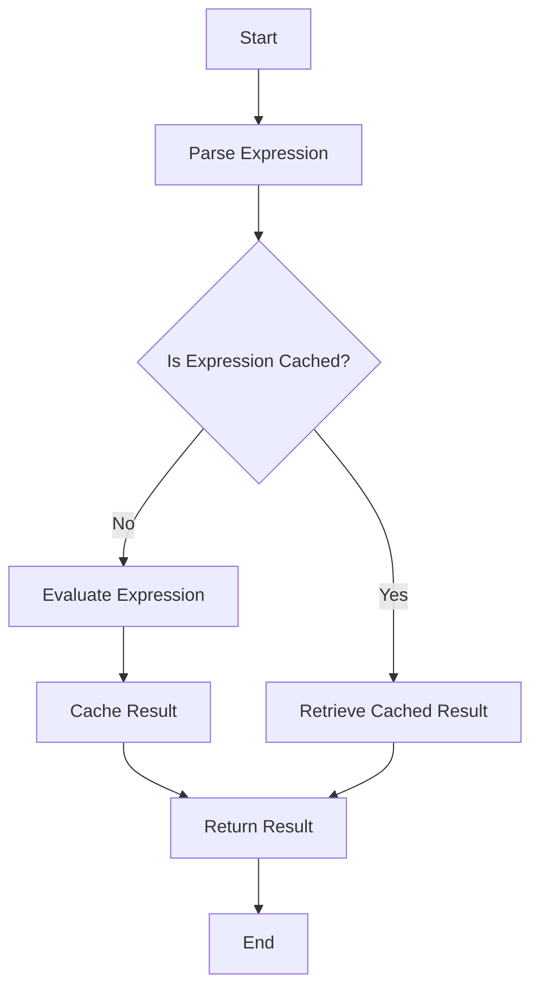

## 5.13.2 Performance Considerations

As we delve into the intricacies of the Interpreter Pattern in Java, it is crucial to address the performance considerations that come with interpretive processing. The Interpreter Pattern, while powerful for defining and evaluating language grammars, can introduce performance bottlenecks, especially in scenarios involving complex expressions or large datasets. In this section, we will explore common performance issues associated with interpreters and discuss strategies to optimize parsing and interpretation. We will also examine techniques such as caching and precompilation to enhance efficiency, while considering the impact of these optimizations on code maintainability.

### Understanding Performance Bottlenecks in Interpreters

Interpreters are designed to evaluate expressions or execute instructions written in a specific language. However, this flexibility often comes at the cost of performance. Here are some common bottlenecks encountered in interpreters:

1. **Repeated Parsing**: Interpreters often parse the same expressions multiple times, leading to redundant computations.
2. **Complex Expression Evaluation**: Evaluating complex expressions can be computationally expensive, especially if they involve nested operations or recursive evaluations.
3. **Memory Overhead**: Storing intermediate representations of expressions can consume significant memory, especially for large input sizes.
4. **Dynamic Typing**: If the language being interpreted is dynamically typed, the interpreter may spend additional time resolving types at runtime.

### Techniques for Optimizing Parsing and Interpretation

To mitigate these performance issues, several optimization techniques can be employed:

#### 1. **Memoization**

Memoization involves caching the results of expensive function calls and reusing the cached result when the same inputs occur again. In the context of interpreters, memoization can be particularly useful for avoiding redundant parsing and evaluation of expressions.

```java
import java.util.HashMap;
import java.util.Map;

public class ExpressionMemoizer {
    private Map<String, Integer> cache = new HashMap<>();

    public int evaluate(String expression) {
        if (cache.containsKey(expression)) {
            return cache.get(expression);
        }
        int result = parseAndEvaluate(expression);
        cache.put(expression, result);
        return result;
    }

    private int parseAndEvaluate(String expression) {
        // Simulate parsing and evaluation
        return expression.length(); // Placeholder for actual evaluation logic
    }
}
```

In this example, the `ExpressionMemoizer` class caches the results of expression evaluations, reducing the need for repeated parsing and computation.

#### 2. **Precompilation**

Precompilation involves converting expressions into an intermediate representation that can be executed more efficiently. This approach can significantly reduce the overhead of parsing at runtime.

```java
import java.util.HashMap;
import java.util.Map;

interface Expression {
    int interpret(Map<String, Integer> context);
}

class Number implements Expression {
    private int number;

    public Number(int number) {
        this.number = number;
    }

    @Override
    public int interpret(Map<String, Integer> context) {
        return number;
    }
}

class Plus implements Expression {
    private Expression leftOperand;
    private Expression rightOperand;

    public Plus(Expression left, Expression right) {
        leftOperand = left;
        rightOperand = right;
    }

    @Override
    public int interpret(Map<String, Integer> context) {
        return leftOperand.interpret(context) + rightOperand.interpret(context);
    }
}

public class PrecompiledExpression {
    public static void main(String[] args) {
        // Precompile expression: 5 + 10
        Expression expression = new Plus(new Number(5), new Number(10));

        // Interpret the expression
        int result = expression.interpret(new HashMap<>());
        System.out.println("Result: " + result); // Output: Result: 15
    }
}
```

In this example, expressions are precompiled into a tree of `Expression` objects, which can be interpreted efficiently without the need for repeated parsing.

#### 3. **Just-In-Time (JIT) Compilation**

JIT compilation involves compiling parts of the code at runtime, optimizing the execution of frequently used code paths. This technique can be applied to interpreters to improve performance by compiling hot spots into native code.

```java
// Pseudo-code for JIT compilation
class JITCompiler {
    public void compile(Expression expression) {
        // Analyze expression and compile to native code
    }

    public int executeCompiledCode() {
        // Execute the compiled native code
        return 0; // Placeholder for actual execution result
    }
}
```

While implementing a full-fledged JIT compiler can be complex, leveraging existing JIT capabilities in the Java Virtual Machine (JVM) can provide significant performance benefits.

### Caching and Precompilation Strategies

Caching and precompilation are powerful techniques for optimizing interpreters. Let's explore these strategies in more detail:

#### Caching Strategies

1. **Expression Caching**: Cache the results of evaluated expressions to avoid redundant computations. This is particularly useful for expressions that are evaluated multiple times with the same inputs.

2. **Intermediate Representation Caching**: Cache the intermediate representation of expressions to avoid repeated parsing. This can be achieved by storing the parsed abstract syntax tree (AST) or bytecode.

3. **Contextual Caching**: Cache results based on the context in which expressions are evaluated. This involves maintaining separate caches for different execution contexts.

#### Precompilation Strategies

1. **Static Precompilation**: Precompile expressions at compile time, converting them into a form that can be executed efficiently at runtime. This approach is suitable for expressions that are known at compile time.

2. **Dynamic Precompilation**: Precompile expressions at runtime, converting them into an optimized form based on runtime profiling. This approach can adapt to changing execution patterns.

3. **Hybrid Precompilation**: Combine static and dynamic precompilation techniques to achieve a balance between compile-time and runtime optimization.

### Impact of Optimization on Maintainability

While optimization can significantly improve the performance of interpreters, it is important to consider the impact on code maintainability. Here are some factors to keep in mind:

1. **Complexity**: Optimization techniques such as caching and precompilation can introduce additional complexity into the codebase. It is important to strike a balance between performance gains and code readability.

2. **Debugging**: Optimized code can be more challenging to debug, especially if it involves dynamic compilation or caching mechanisms. Ensure that debugging tools and techniques are in place to handle these scenarios.

3. **Flexibility**: Precompiled expressions may be less flexible than dynamically interpreted expressions, as changes to the expression language may require recompilation. Consider the trade-offs between performance and flexibility.

4. **Testing**: Optimized code may require additional testing to ensure that performance improvements do not introduce bugs or regressions. Automated testing frameworks can help manage this complexity.

### Try It Yourself

To gain a deeper understanding of these optimization techniques, try modifying the code examples provided in this section. Experiment with different caching strategies, such as contextual caching, and observe the impact on performance. Additionally, consider implementing a simple JIT compiler for a subset of expressions to explore the benefits of runtime compilation.

### Visualizing Optimization Strategies

To better understand the flow of optimization strategies in interpreters, let's visualize the process using a flowchart.



This flowchart illustrates the process of parsing, evaluating, and caching expressions in an interpreter. By caching results, we can avoid redundant computations and improve performance.

### Conclusion

Optimizing the performance of interpreters in Java involves a careful balance between efficiency and maintainability. By employing techniques such as memoization, precompilation, and JIT compilation, we can address common performance bottlenecks and enhance the efficiency of interpretive processing. However, it is important to consider the impact of these optimizations on code complexity, debugging, and flexibility. As you continue to explore the Interpreter Pattern and its applications, remember to experiment with different optimization strategies and find the right balance for your specific use case.

## Quiz Time!



### What is a common performance bottleneck in interpreters?

- [x] Repeated parsing of expressions
- [ ] Excessive use of static methods
- [ ] Lack of comments in code
- [ ] Overuse of inheritance

> **Explanation:** Repeated parsing of expressions can lead to redundant computations, making it a common performance bottleneck in interpreters.


### Which technique involves caching the results of expensive function calls?

- [x] Memoization
- [ ] Serialization
- [ ] Reflection
- [ ] Encapsulation

> **Explanation:** Memoization involves caching the results of expensive function calls to avoid redundant computations.


### What is precompilation in the context of interpreters?

- [x] Converting expressions into an intermediate representation for efficient execution
- [ ] Writing code in a higher-level language
- [ ] Using a debugger to optimize code
- [ ] Compiling code at compile time

> **Explanation:** Precompilation involves converting expressions into an intermediate representation that can be executed more efficiently.


### What is the main advantage of using JIT compilation in interpreters?

- [x] Improved performance by compiling hot spots into native code
- [ ] Easier debugging of code
- [ ] Reduced memory usage
- [ ] Increased code readability

> **Explanation:** JIT compilation improves performance by compiling frequently used code paths into native code.


### How can caching improve the performance of interpreters?

- [x] By avoiding redundant computations
- [ ] By increasing memory usage
- [ ] By simplifying code structure
- [ ] By reducing code readability

> **Explanation:** Caching improves performance by avoiding redundant computations, thus speeding up repeated operations.


### What is a potential downside of optimizing interpreters?

- [x] Increased code complexity
- [ ] Reduced execution speed
- [ ] Decreased memory usage
- [ ] Simplified debugging

> **Explanation:** Optimization techniques can introduce additional complexity into the codebase, making it harder to maintain.


### Which caching strategy involves maintaining separate caches for different execution contexts?

- [x] Contextual Caching
- [ ] Expression Caching
- [ ] Intermediate Representation Caching
- [ ] Static Caching

> **Explanation:** Contextual Caching involves maintaining separate caches for different execution contexts to optimize performance.


### What is a challenge associated with debugging optimized code?

- [x] It can be more difficult due to dynamic compilation or caching mechanisms.
- [ ] It is easier because of reduced code complexity.
- [ ] Debugging tools are not required.
- [ ] Optimized code has fewer bugs.

> **Explanation:** Optimized code can be more challenging to debug, especially if it involves dynamic compilation or caching mechanisms.


### What is a benefit of using automated testing frameworks for optimized code?

- [x] Ensuring performance improvements do not introduce bugs
- [ ] Reducing code readability
- [ ] Increasing code complexity
- [ ] Simplifying code structure

> **Explanation:** Automated testing frameworks help ensure that performance improvements do not introduce bugs or regressions.


### True or False: Precompiled expressions are always more flexible than dynamically interpreted expressions.

- [ ] True
- [x] False

> **Explanation:** Precompiled expressions may be less flexible than dynamically interpreted expressions, as changes to the expression language may require recompilation.


