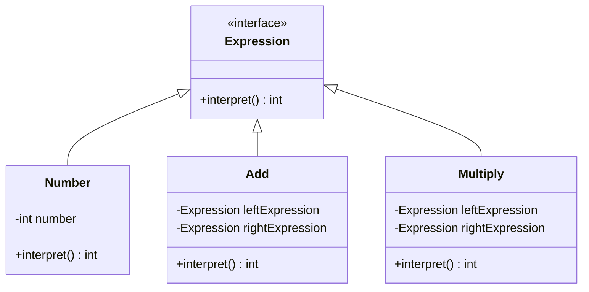

## 5.13.3 Use Cases and Examples

In this section, we delve into the practical applications of the Interpreter pattern, focusing on the creation and use of Domain-Specific Languages (DSLs) in Java. We'll explore what DSLs are, their benefits, and how they can be implemented using the Interpreter pattern. We'll also provide detailed code examples to illustrate these concepts.

### Understanding Domain-Specific Languages (DSLs)

Domain-Specific Languages (DSLs) are specialized mini-languages tailored to a specific application domain. Unlike general-purpose programming languages, DSLs are designed to express solutions in a particular domain more succinctly and understandably. They can be classified into two types:

1. **Internal DSLs**: Embedded within a host language, leveraging its syntax and capabilities.
2. **External DSLs**: Standalone languages with their own syntax and parsing mechanisms.

#### Benefits of DSLs

- **Expressiveness**: DSLs allow domain experts to express concepts in their language, making the code more intuitive and easier to understand.
- **Productivity**: By reducing boilerplate code and focusing on domain-specific logic, DSLs can significantly speed up development.
- **Maintainability**: DSLs can simplify complex logic, making it easier to maintain and evolve the codebase.
- **Error Reduction**: By constraining the language to domain-specific constructs, DSLs can reduce the likelihood of errors.

### Implementing a DSL Using the Interpreter Pattern

The Interpreter pattern is well-suited for implementing DSLs, as it provides a way to evaluate sentences in a language. Let's walk through the process of creating a simple DSL for arithmetic expressions using the Interpreter pattern in Java.

#### Step 1: Define the Grammar

First, we need to define the grammar of our DSL. For this example, we'll create a simple arithmetic language that supports addition and multiplication.

```
expression ::= number | expression "+" expression | expression "*" expression
number ::= [0-9]+
```

#### Step 2: Create the Abstract Expression

The abstract expression defines the interface for interpreting expressions. In our case, it will be an interface with an `interpret` method.

```java
interface Expression {
    int interpret();
}
```

#### Step 3: Implement Terminal and Non-Terminal Expressions

Terminal expressions represent the leaves of the grammar, such as numbers. Non-terminal expressions represent the operators, such as addition and multiplication.

```java
class Number implements Expression {
    private final int number;

    public Number(int number) {
        this.number = number;
    }

    @Override
    public int interpret() {
        return number;
    }
}

class Add implements Expression {
    private final Expression leftExpression;
    private final Expression rightExpression;

    public Add(Expression leftExpression, Expression rightExpression) {
        this.leftExpression = leftExpression;
        this.rightExpression = rightExpression;
    }

    @Override
    public int interpret() {
        return leftExpression.interpret() + rightExpression.interpret();
    }
}

class Multiply implements Expression {
    private final Expression leftExpression;
    private final Expression rightExpression;

    public Multiply(Expression leftExpression, Expression rightExpression) {
        this.leftExpression = leftExpression;
        this.rightExpression = rightExpression;
    }

    @Override
    public int interpret() {
        return leftExpression.interpret() * rightExpression.interpret();
    }
}
```

#### Step 4: Parse and Interpret the Expression

To interpret an expression, we need to parse it into an expression tree and then evaluate it.

```java
public class InterpreterDemo {
    public static void main(String[] args) {
        String expression = "3 + 5 * 2";
        Expression parsedExpression = parse(expression);
        int result = parsedExpression.interpret();
        System.out.println("Result: " + result);
    }

    private static Expression parse(String expression) {
        // Simplified parser for demonstration purposes
        String[] tokens = expression.split(" ");
        Expression left = new Number(Integer.parseInt(tokens[0]));
        Expression right = new Number(Integer.parseInt(tokens[2]));
        switch (tokens[1]) {
            case "+":
                return new Add(left, right);
            case "*":
                return new Multiply(left, right);
            default:
                throw new IllegalArgumentException("Unknown operator: " + tokens[1]);
        }
    }
}
```

### Use Cases for DSLs

#### Configuration Languages

DSLs are often used for configuration purposes, allowing users to specify settings in a human-readable format. For example, a DSL could be used to configure a web server, specifying routes, middleware, and other settings.

#### Scripting Within Applications

DSLs can be embedded within applications to provide scripting capabilities. This allows users to automate tasks or extend the application's functionality without modifying the source code. For instance, a game engine might use a DSL to define game logic or AI behavior.

#### Business Rule Engines

In business applications, DSLs can be used to define business rules. This allows non-technical users to specify rules in a language they understand, which can then be interpreted and executed by the application.

### Code Example: A Simple Configuration DSL

Let's create a simple configuration DSL for a hypothetical web server. The DSL will allow users to specify routes and their corresponding handlers.

#### Step 1: Define the Grammar

```
configuration ::= route+
route ::= "route" path "->" handler
path ::= "/" [a-zA-Z0-9]+
handler ::= [a-zA-Z0-9]+
```

#### Step 2: Implement the DSL

```java
interface ConfigExpression {
    void interpret(WebServerContext context);
}

class Route implements ConfigExpression {
    private final String path;
    private final String handler;

    public Route(String path, String handler) {
        this.path = path;
        this.handler = handler;
    }

    @Override
    public void interpret(WebServerContext context) {
        context.addRoute(path, handler);
    }
}

class Configuration implements ConfigExpression {
    private final List<ConfigExpression> routes = new ArrayList<>();

    public void addRoute(ConfigExpression route) {
        routes.add(route);
    }

    @Override
    public void interpret(WebServerContext context) {
        for (ConfigExpression route : routes) {
            route.interpret(context);
        }
    }
}

class WebServerContext {
    private final Map<String, String> routes = new HashMap<>();

    public void addRoute(String path, String handler) {
        routes.put(path, handler);
    }

    public void printRoutes() {
        routes.forEach((path, handler) -> System.out.println("Path: " + path + ", Handler: " + handler));
    }
}

public class ConfigInterpreterDemo {
    public static void main(String[] args) {
        String config = "route /home -> HomeHandler\nroute /about -> AboutHandler";
        Configuration configuration = parseConfig(config);
        WebServerContext context = new WebServerContext();
        configuration.interpret(context);
        context.printRoutes();
    }

    private static Configuration parseConfig(String config) {
        Configuration configuration = new Configuration();
        String[] lines = config.split("\n");
        for (String line : lines) {
            String[] tokens = line.split(" ");
            if (tokens.length == 4 && "route".equals(tokens[0]) && "->".equals(tokens[2])) {
                configuration.addRoute(new Route(tokens[1], tokens[3]));
            }
        }
        return configuration;
    }
}
```

### Try It Yourself

To gain a deeper understanding of the Interpreter pattern and DSLs, try modifying the examples above:

- **Extend the Arithmetic DSL**: Add support for subtraction and division operations.
- **Enhance the Configuration DSL**: Introduce support for middleware or nested routes.
- **Create a New DSL**: Design a DSL for a different domain, such as a simple query language for filtering data.

### Visualizing the Interpreter Pattern

To help visualize the structure of the Interpreter pattern, consider the following class diagram:



This diagram illustrates the relationship between the `Expression` interface and its concrete implementations, `Number`, `Add`, and `Multiply`.

### References and Further Reading

- [Domain-Specific Languages](https://martinfowler.com/books/dsl.html) by Martin Fowler
- [Interpreter Pattern](https://refactoring.guru/design-patterns/interpreter) on Refactoring Guru
- [Java Design Patterns](https://www.journaldev.com/1827/java-design-patterns-example-tutorial) on JournalDev

### Knowledge Check

Before we conclude, let's reinforce what we've learned:

- What are the benefits of using DSLs in software development?
- How does the Interpreter pattern facilitate the creation of DSLs?
- Can you identify a real-world application where a DSL might be beneficial?

Remember, mastering design patterns and DSLs is a journey. Keep experimenting, stay curious, and enjoy the process!

## Quiz Time!



### What is a Domain-Specific Language (DSL)?

- [x] A specialized language tailored to a specific application domain.
- [ ] A general-purpose programming language.
- [ ] A language used for system-level programming.
- [ ] A language used exclusively for web development.

> **Explanation:** A DSL is a specialized language designed to express solutions in a specific domain, making it more intuitive and understandable for domain experts.

### Which of the following is a benefit of using DSLs?

- [x] Increased expressiveness and readability.
- [ ] Increased complexity and boilerplate code.
- [ ] Decreased productivity.
- [ ] Decreased maintainability.

> **Explanation:** DSLs increase expressiveness by allowing domain experts to express concepts in their language, making the code more intuitive and easier to understand.

### What is the primary role of the Interpreter pattern in DSLs?

- [x] To evaluate sentences in a language.
- [ ] To compile code into machine language.
- [ ] To provide a graphical user interface.
- [ ] To manage database connections.

> **Explanation:** The Interpreter pattern evaluates sentences in a language, making it suitable for implementing DSLs.

### In the provided arithmetic DSL example, what does the `interpret` method do?

- [x] Evaluates the expression and returns the result.
- [ ] Parses the expression into tokens.
- [ ] Compiles the expression into bytecode.
- [ ] Converts the expression into a string.

> **Explanation:** The `interpret` method evaluates the expression and returns the result, which is the primary function of the Interpreter pattern.

### Which of the following is a use case for DSLs?

- [x] Configuration languages.
- [x] Scripting within applications.
- [ ] System-level programming.
- [ ] Hardware design.

> **Explanation:** DSLs are often used for configuration languages and scripting within applications, allowing users to specify settings or automate tasks in a human-readable format.

### What is the difference between internal and external DSLs?

- [x] Internal DSLs are embedded within a host language, while external DSLs are standalone.
- [ ] Internal DSLs are standalone, while external DSLs are embedded within a host language.
- [ ] Internal DSLs are used for web development, while external DSLs are used for system programming.
- [ ] Internal DSLs are used for system programming, while external DSLs are used for web development.

> **Explanation:** Internal DSLs are embedded within a host language, leveraging its syntax and capabilities, while external DSLs are standalone languages with their own syntax.

### Which class in the arithmetic DSL example represents a terminal expression?

- [x] Number
- [ ] Add
- [ ] Multiply
- [ ] Expression

> **Explanation:** The `Number` class represents a terminal expression, which is a leaf node in the expression tree.

### What is the purpose of the `WebServerContext` class in the configuration DSL example?

- [x] To store and manage routes and their handlers.
- [ ] To parse configuration files.
- [ ] To compile configuration into bytecode.
- [ ] To provide a user interface for configuration.

> **Explanation:** The `WebServerContext` class stores and manages routes and their handlers, serving as the context for interpreting the configuration DSL.

### How can you extend the arithmetic DSL example to support subtraction?

- [x] Add a new class implementing the `Expression` interface for subtraction.
- [ ] Modify the `Number` class to handle subtraction.
- [ ] Add a new method to the `Expression` interface for subtraction.
- [ ] Modify the `interpret` method to handle subtraction.

> **Explanation:** To support subtraction, you can add a new class implementing the `Expression` interface specifically for subtraction, similar to the `Add` and `Multiply` classes.

### True or False: DSLs can reduce the likelihood of errors by constraining the language to domain-specific constructs.

- [x] True
- [ ] False

> **Explanation:** True. By constraining the language to domain-specific constructs, DSLs can reduce the likelihood of errors, as they limit the possibilities for incorrect usage.


