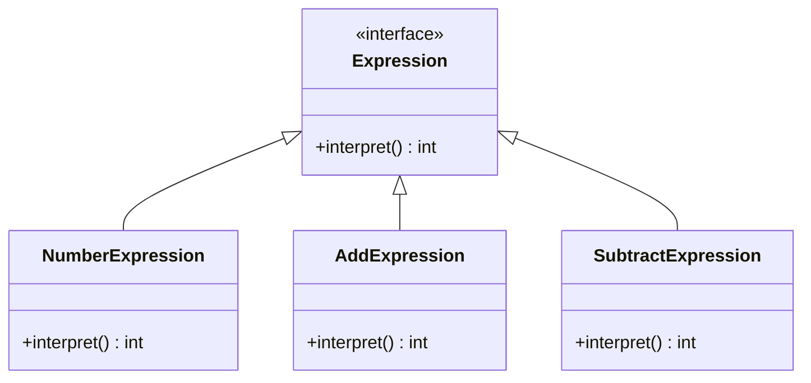

## 5.13 Interpreter Pattern (Revisited)

The Interpreter Pattern is a powerful design pattern used to define a grammar for a language and provide an interpreter to evaluate sentences in that language. In this section, we will delve deeper into the Interpreter Pattern, exploring advanced parsing techniques, building custom expression evaluators, and understanding performance considerations. We will also discuss scenarios where custom interpreters are necessary and beneficial.

### Understanding the Interpreter Pattern

The Interpreter Pattern is part of the behavioral design patterns family. It is used to interpret a language or a set of instructions. The pattern defines a representation for the grammar of the language and an interpreter that uses this representation to interpret sentences in the language.

**Key Components of the Interpreter Pattern:**

1. **Abstract Expression**: This is the interface or abstract class that defines the interpret operation.
2. **Terminal Expression**: Implements the interpret operation for terminal symbols in the grammar.
3. **Non-Terminal Expression**: Implements the interpret operation for non-terminal symbols in the grammar.
4. **Context**: Contains information that is global to the interpreter.
5. **Client**: Builds (or is given) an abstract syntax tree representing a particular sentence in the language defined by the grammar.

### Advanced Insights into the Interpreter Pattern

#### Complex Implementation Strategies

When implementing the Interpreter Pattern for complex languages, several strategies can be employed to enhance the design and functionality:

1. **Recursive Descent Parsing**: This is a top-down parsing technique that uses a set of recursive procedures to process the input. Each non-terminal in the grammar is represented by a procedure.

2. **Backus-Naur Form (BNF)**: BNF is a notation technique for context-free grammars, often used to describe the syntax of languages. It can be used to define the grammar for the language being interpreted.

3. **Abstract Syntax Trees (ASTs)**: ASTs are tree representations of the abstract syntactic structure of source code. Each node in the tree denotes a construct occurring in the source code.

4. **Visitor Pattern**: The Visitor Pattern can be used in conjunction with the Interpreter Pattern to separate the algorithm from the objects on which it operates, making it easier to add new operations without changing the classes of the elements.

#### Example: Building a Simple Expression Evaluator

Let's build a simple arithmetic expression evaluator using the Interpreter Pattern. The evaluator will support addition and subtraction operations.

```java
// Abstract Expression
interface Expression {
    int interpret();
}

// Terminal Expression for Numbers
class NumberExpression implements Expression {
    private int number;

    public NumberExpression(int number) {
        this.number = number;
    }

    @Override
    public int interpret() {
        return number;
    }
}

// Non-Terminal Expression for Addition
class AddExpression implements Expression {
    private Expression leftExpression;
    private Expression rightExpression;

    public AddExpression(Expression leftExpression, Expression rightExpression) {
        this.leftExpression = leftExpression;
        this.rightExpression = rightExpression;
    }

    @Override
    public int interpret() {
        return leftExpression.interpret() + rightExpression.interpret();
    }
}

// Non-Terminal Expression for Subtraction
class SubtractExpression implements Expression {
    private Expression leftExpression;
    private Expression rightExpression;

    public SubtractExpression(Expression leftExpression, Expression rightExpression) {
        this.leftExpression = leftExpression;
        this.rightExpression = rightExpression;
    }

    @Override
    public int interpret() {
        return leftExpression.interpret() - rightExpression.interpret();
    }
}

// Client
public class InterpreterPatternDemo {
    public static void main(String[] args) {
        Expression ten = new NumberExpression(10);
        Expression twenty = new NumberExpression(20);

        Expression addExpression = new AddExpression(ten, twenty);
        Expression subtractExpression = new SubtractExpression(twenty, ten);

        System.out.println("10 + 20 = " + addExpression.interpret());
        System.out.println("20 - 10 = " + subtractExpression.interpret());
    }
}
```

**Explanation:**

- **NumberExpression**: This is a terminal expression that returns the number it represents.
- **AddExpression** and **SubtractExpression**: These are non-terminal expressions that perform addition and subtraction, respectively.
- **InterpreterPatternDemo**: This is the client that constructs the expression tree and interprets it.

### Performance Considerations

When using the Interpreter Pattern, performance can become a concern, especially with complex grammars and large input sizes. Here are some considerations to keep in mind:

1. **Efficiency**: Recursive descent parsing can be inefficient for large inputs due to the overhead of recursive calls. Consider using iterative parsing techniques or optimizing recursive calls with memoization.

2. **Scalability**: The Interpreter Pattern can lead to a large number of classes for each grammar rule, which can become difficult to manage. Consider using a more scalable approach like a parser generator for complex languages.

3. **Memory Usage**: Abstract Syntax Trees can consume a significant amount of memory, especially for large expressions. Optimize memory usage by sharing common subtrees or using flyweight patterns.

4. **Complexity**: The complexity of the interpreter can grow with the complexity of the language. Keep the grammar simple and modular to manage complexity effectively.

### Scenarios for Custom Interpreters

Custom interpreters are necessary in scenarios where a domain-specific language (DSL) is required. DSLs are specialized languages tailored to a specific application domain. Here are some scenarios where custom interpreters are beneficial:

1. **Configuration Languages**: Custom interpreters can be used to parse and interpret configuration files written in a DSL.

2. **Scripting Languages**: Interpreters can be used to execute scripts written in a DSL, allowing for dynamic behavior in applications.

3. **Data Transformation**: Custom interpreters can be used to transform data from one format to another using a DSL.

4. **Business Rule Engines**: Interpreters can be used to evaluate business rules written in a DSL, allowing for flexible and dynamic rule management.

### Advanced Implementation Techniques

#### Using Parser Generators

Parser generators like ANTLR can be used to automatically generate parsers for complex languages. They allow you to define the grammar of the language in a high-level syntax and generate the parser code automatically.

**Example: Using ANTLR for Expression Parsing**

```antlr
grammar Expression;

expression: term (('+' | '-') term)*;
term: NUMBER;

NUMBER: [0-9]+;
```

In this example, we define a simple grammar for arithmetic expressions using ANTLR. The grammar defines an `expression` as a sequence of `term`s separated by `+` or `-` operators, and a `term` as a `NUMBER`.

#### Optimizing Interpretive Processing

To optimize interpretive processing, consider the following techniques:

1. **Memoization**: Cache the results of expensive operations to avoid redundant calculations.

2. **Lazy Evaluation**: Delay the evaluation of expressions until their results are needed.

3. **Parallel Processing**: Use parallel processing techniques to evaluate independent expressions concurrently.

4. **JIT Compilation**: Use Just-In-Time (JIT) compilation techniques to compile frequently executed expressions into native code for improved performance.

### Try It Yourself

Experiment with the provided code examples by:

1. **Extending the Grammar**: Add support for multiplication and division operations.
2. **Implementing Variables**: Modify the interpreter to support variables and variable assignments.
3. **Enhancing Performance**: Implement memoization to cache the results of previously evaluated expressions.

### Visualizing the Interpreter Pattern

To better understand the structure and flow of the Interpreter Pattern, let's visualize it using a class diagram.



**Diagram Explanation:**

- The **Expression** interface defines the `interpret` method.
- **NumberExpression**, **AddExpression**, and **SubtractExpression** implement the **Expression** interface.
- This diagram illustrates the relationship between the different components of the Interpreter Pattern.

### Knowledge Check

To reinforce your understanding of the Interpreter Pattern, consider the following questions:

1. What are the key components of the Interpreter Pattern?
2. How can recursive descent parsing be used in the Interpreter Pattern?
3. What are some performance considerations when using the Interpreter Pattern?
4. In what scenarios are custom interpreters beneficial?
5. How can parser generators like ANTLR be used to simplify the implementation of the Interpreter Pattern?

### Embrace the Journey

Remember, mastering the Interpreter Pattern is just one step in your journey as a software engineer. As you continue to explore design patterns, you'll gain a deeper understanding of how to build flexible and maintainable software systems. Keep experimenting, stay curious, and enjoy the journey!

## Quiz Time!



### What is the primary purpose of the Interpreter Pattern?

- [x] To define a grammar for a language and provide an interpreter to evaluate sentences in that language.
- [ ] To separate the construction of a complex object from its representation.
- [ ] To provide a way to access elements of a collection sequentially.
- [ ] To encapsulate a request as an object, allowing parameterization and queuing.

> **Explanation:** The Interpreter Pattern is used to define a grammar for a language and provide an interpreter to evaluate sentences in that language.

### Which component of the Interpreter Pattern represents terminal symbols in the grammar?

- [ ] Abstract Expression
- [x] Terminal Expression
- [ ] Non-Terminal Expression
- [ ] Context

> **Explanation:** The Terminal Expression implements the interpret operation for terminal symbols in the grammar.

### What is a common performance consideration when using the Interpreter Pattern?

- [x] Recursive descent parsing can be inefficient for large inputs.
- [ ] The pattern is inherently thread-safe.
- [ ] It always requires a large number of classes.
- [ ] It cannot be used with abstract syntax trees.

> **Explanation:** Recursive descent parsing can be inefficient for large inputs due to the overhead of recursive calls.

### In what scenario is a custom interpreter beneficial?

- [x] When a domain-specific language (DSL) is required.
- [ ] When a simple configuration file needs to be parsed.
- [ ] When a language has a fixed syntax.
- [ ] When performance is not a concern.

> **Explanation:** Custom interpreters are beneficial when a domain-specific language (DSL) is required.

### How can parser generators like ANTLR simplify the implementation of the Interpreter Pattern?

- [x] By automatically generating parsers for complex languages.
- [ ] By providing a runtime environment for the language.
- [ ] By optimizing the performance of the interpreter.
- [ ] By eliminating the need for abstract syntax trees.

> **Explanation:** Parser generators like ANTLR can automatically generate parsers for complex languages, simplifying the implementation of the Interpreter Pattern.

### Which of the following is NOT a technique to optimize interpretive processing?

- [ ] Memoization
- [ ] Lazy Evaluation
- [ ] Parallel Processing
- [x] Synchronous Evaluation

> **Explanation:** Synchronous Evaluation is not a technique to optimize interpretive processing; it often leads to inefficiencies.

### What is the role of the Visitor Pattern in conjunction with the Interpreter Pattern?

- [x] To separate the algorithm from the objects on which it operates.
- [ ] To define a grammar for a language.
- [ ] To encapsulate a request as an object.
- [ ] To provide a way to access elements of a collection sequentially.

> **Explanation:** The Visitor Pattern can be used with the Interpreter Pattern to separate the algorithm from the objects on which it operates.

### What is an Abstract Syntax Tree (AST)?

- [x] A tree representation of the abstract syntactic structure of source code.
- [ ] A list of all terminal symbols in a language.
- [ ] A sequence of recursive procedures.
- [ ] A set of rules for a context-free grammar.

> **Explanation:** An Abstract Syntax Tree (AST) is a tree representation of the abstract syntactic structure of source code.

### Which of the following is a benefit of using custom interpreters?

- [x] They allow for dynamic behavior in applications.
- [ ] They always improve performance.
- [ ] They eliminate the need for configuration files.
- [ ] They are easier to implement than other patterns.

> **Explanation:** Custom interpreters allow for dynamic behavior in applications, especially when using domain-specific languages (DSLs).

### True or False: The Interpreter Pattern is part of the structural design patterns family.

- [ ] True
- [x] False

> **Explanation:** The Interpreter Pattern is part of the behavioral design patterns family, not the structural design patterns family.


