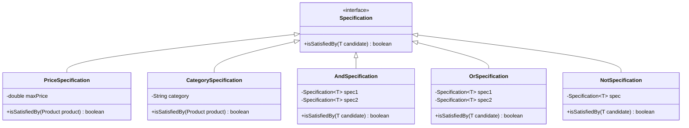

## 5.14.1 Implementing Specification in Java

In the realm of software engineering, the Specification Pattern is a powerful tool for encapsulating business logic into reusable components. This pattern allows developers to define business rules and logic in a declarative and reusable manner. In this section, we will delve into the Specification Pattern, exploring its implementation in Java, complete with code examples and best practices.

### Understanding the Specification Pattern

The Specification Pattern is a design pattern used to define business rules and logic in a reusable and composable way. It allows you to encapsulate the logic that determines whether a particular object satisfies certain criteria. This pattern is particularly useful in scenarios where business rules are complex and subject to frequent changes.

#### Key Concepts

- **Specification Interface**: The core of the pattern, defining a method to check if an object meets the criteria.
- **Concrete Specifications**: Implementations of the Specification interface, representing specific business rules.
- **Composite Specifications**: Combinations of multiple specifications using logical operators like AND, OR, and NOT.
- **Evaluation**: The process of checking if an object satisfies a specification.

### Implementing the Specification Pattern in Java

Let's walk through the process of implementing the Specification Pattern in Java, step by step.

#### Step 1: Define the Specification Interface

The first step is to define a generic Specification interface. This interface will declare a method to evaluate whether an object satisfies the specification.

```java
public interface Specification<T> {
    boolean isSatisfiedBy(T candidate);
}
```

- **Generic Type `T`**: Allows the specification to be applied to any type of object.
- **`isSatisfiedBy` Method**: Evaluates whether the candidate object meets the specification criteria.

#### Step 2: Implement Concrete Specifications

Next, we implement concrete specifications by creating classes that implement the Specification interface. Let's consider a simple example where we have a `Product` class, and we want to implement specifications to filter products based on price and category.

```java
public class Product {
    private String name;
    private double price;
    private String category;

    // Constructors, getters, and setters
}

public class PriceSpecification implements Specification<Product> {
    private double maxPrice;

    public PriceSpecification(double maxPrice) {
        this.maxPrice = maxPrice;
    }

    @Override
    public boolean isSatisfiedBy(Product product) {
        return product.getPrice() <= maxPrice;
    }
}

public class CategorySpecification implements Specification<Product> {
    private String category;

    public CategorySpecification(String category) {
        this.category = category;
    }

    @Override
    public boolean isSatisfiedBy(Product product) {
        return product.getCategory().equalsIgnoreCase(category);
    }
}
```

- **`PriceSpecification`**: Checks if a product's price is within a specified limit.
- **`CategorySpecification`**: Verifies if a product belongs to a specific category.

#### Step 3: Implement Composite Specifications

Composite specifications allow you to combine multiple specifications using logical operators. This is where the true power of the Specification Pattern shines.

```java
public class AndSpecification<T> implements Specification<T> {
    private Specification<T> spec1;
    private Specification<T> spec2;

    public AndSpecification(Specification<T> spec1, Specification<T> spec2) {
        this.spec1 = spec1;
        this.spec2 = spec2;
    }

    @Override
    public boolean isSatisfiedBy(T candidate) {
        return spec1.isSatisfiedBy(candidate) && spec2.isSatisfiedBy(candidate);
    }
}

public class OrSpecification<T> implements Specification<T> {
    private Specification<T> spec1;
    private Specification<T> spec2;

    public OrSpecification(Specification<T> spec1, Specification<T> spec2) {
        this.spec1 = spec1;
        this.spec2 = spec2;
    }

    @Override
    public boolean isSatisfiedBy(T candidate) {
        return spec1.isSatisfiedBy(candidate) || spec2.isSatisfiedBy(candidate);
    }
}

public class NotSpecification<T> implements Specification<T> {
    private Specification<T> spec;

    public NotSpecification(Specification<T> spec) {
        this.spec = spec;
    }

    @Override
    public boolean isSatisfiedBy(T candidate) {
        return !spec.isSatisfiedBy(candidate);
    }
}
```

- **`AndSpecification`**: Combines two specifications with a logical AND.
- **`OrSpecification`**: Combines two specifications with a logical OR.
- **`NotSpecification`**: Inverts the result of a specification.

#### Step 4: Evaluate Objects Against Specifications

With the specifications in place, you can now evaluate objects against them. Let's see how to filter a list of products using these specifications.

```java
import java.util.ArrayList;
import java.util.List;
import java.util.stream.Collectors;

public class ProductFilter {
    public List<Product> filter(List<Product> products, Specification<Product> specification) {
        return products.stream()
                .filter(specification::isSatisfiedBy)
                .collect(Collectors.toList());
    }
}

// Example usage
public class Main {
    public static void main(String[] args) {
        List<Product> products = new ArrayList<>();
        products.add(new Product("Laptop", 1200, "Electronics"));
        products.add(new Product("Smartphone", 800, "Electronics"));
        products.add(new Product("Coffee Maker", 150, "Home Appliances"));

        Specification<Product> electronicsSpec = new CategorySpecification("Electronics");
        Specification<Product> affordableSpec = new PriceSpecification(1000);

        Specification<Product> affordableElectronicsSpec = new AndSpecification<>(electronicsSpec, affordableSpec);

        ProductFilter filter = new ProductFilter();
        List<Product> affordableElectronics = filter.filter(products, affordableElectronicsSpec);

        affordableElectronics.forEach(product -> System.out.println(product.getName()));
    }
}
```

- **`ProductFilter`**: A utility class to filter products based on specifications.
- **`affordableElectronicsSpec`**: A composite specification combining category and price criteria.

### Best Practices for Organizing and Managing Specifications

Implementing the Specification Pattern effectively requires careful organization and management of specifications. Here are some best practices to consider:

#### 1. **Modular Design**

- **Encapsulate Business Logic**: Keep specifications focused and encapsulate business rules within them.
- **Reuse Specifications**: Design specifications to be reusable across different parts of the application.

#### 2. **Composite Specifications**

- **Combine Specifications**: Use composite specifications to combine simple specifications for complex business rules.
- **Avoid Complexity**: Keep composite specifications manageable by not nesting too deeply.

#### 3. **Testing and Validation**

- **Unit Testing**: Write unit tests for each specification to ensure they behave as expected.
- **Validation**: Validate specifications against a variety of scenarios to cover edge cases.

#### 4. **Performance Considerations**

- **Lazy Evaluation**: Consider lazy evaluation for specifications that involve expensive operations.
- **Optimize Composite Specifications**: Optimize composite specifications to minimize redundant checks.

#### 5. **Documentation**

- **Document Specifications**: Clearly document the purpose and logic of each specification for future reference.
- **Use Diagrams**: Visualize complex specifications using diagrams to aid understanding.

### Visualizing the Specification Pattern

To better understand the Specification Pattern, let's visualize the relationships between specifications and their compositions using a class diagram.



This diagram illustrates how different specifications implement the Specification interface and how composite specifications combine them.

### Try It Yourself

Now that we've covered the basics of implementing the Specification Pattern in Java, it's time to experiment. Try modifying the code examples to:

- **Add New Specifications**: Implement a new specification, such as a `BrandSpecification`, to filter products by brand.
- **Combine Specifications**: Create a composite specification that uses all three logical operators (AND, OR, NOT).
- **Optimize Performance**: Introduce caching mechanisms to optimize the evaluation of specifications.

### Conclusion

The Specification Pattern is a powerful tool for encapsulating business logic in a flexible and reusable manner. By following the steps outlined in this guide, you can implement this pattern in Java to create maintainable and scalable applications. Remember, the key to success with the Specification Pattern lies in its modularity and composability. Keep experimenting, stay curious, and enjoy the journey!

## Quiz Time!



### What is the primary purpose of the Specification Pattern?

- [x] To encapsulate business logic into reusable components.
- [ ] To manage object creation.
- [ ] To handle object interactions.
- [ ] To optimize performance.

> **Explanation:** The Specification Pattern is designed to encapsulate business logic into reusable components, allowing for flexible and maintainable code.

### Which method is defined in the Specification interface?

- [x] `isSatisfiedBy`
- [ ] `evaluate`
- [ ] `check`
- [ ] `validate`

> **Explanation:** The `isSatisfiedBy` method is defined in the Specification interface to evaluate whether an object meets the criteria.

### What is a composite specification?

- [x] A combination of multiple specifications using logical operators.
- [ ] A specification that applies to composite objects.
- [ ] A specification that uses complex algorithms.
- [ ] A specification that is immutable.

> **Explanation:** A composite specification combines multiple specifications using logical operators like AND, OR, and NOT.

### How can you optimize the performance of specifications?

- [x] Use lazy evaluation and caching mechanisms.
- [ ] Increase the complexity of specifications.
- [ ] Avoid unit testing.
- [ ] Use deep nesting of composite specifications.

> **Explanation:** Optimizing performance can be achieved through lazy evaluation and caching mechanisms to reduce redundant checks.

### What is the role of the `AndSpecification` class?

- [x] To combine two specifications with a logical AND.
- [ ] To negate a specification.
- [ ] To combine two specifications with a logical OR.
- [ ] To evaluate a single specification.

> **Explanation:** The `AndSpecification` class combines two specifications with a logical AND, meaning both must be satisfied.

### What is a best practice for managing specifications?

- [x] Keep specifications focused and encapsulate business rules.
- [ ] Avoid documentation.
- [ ] Use complex algorithms within specifications.
- [ ] Nest composite specifications deeply.

> **Explanation:** Keeping specifications focused and encapsulating business rules is a best practice for managing them effectively.

### What is the benefit of using composite specifications?

- [x] They allow for complex business rules by combining simple specifications.
- [ ] They reduce the need for unit testing.
- [ ] They increase the complexity of the code.
- [ ] They eliminate the need for documentation.

> **Explanation:** Composite specifications allow for complex business rules by combining simple specifications, enhancing flexibility and reusability.

### What should be included in the documentation of specifications?

- [x] The purpose and logic of each specification.
- [ ] The implementation details of other patterns.
- [ ] The history of the Specification Pattern.
- [ ] The names of the developers.

> **Explanation:** Documentation should include the purpose and logic of each specification for clarity and future reference.

### How can specifications be reused across an application?

- [x] By designing them to be generic and applicable to various scenarios.
- [ ] By hardcoding them into specific classes.
- [ ] By avoiding unit testing.
- [ ] By using them only in one module.

> **Explanation:** Specifications can be reused across an application by designing them to be generic and applicable to various scenarios.

### True or False: The Specification Pattern is only useful for simple business rules.

- [ ] True
- [x] False

> **Explanation:** False. The Specification Pattern is useful for both simple and complex business rules, providing flexibility and reusability.


