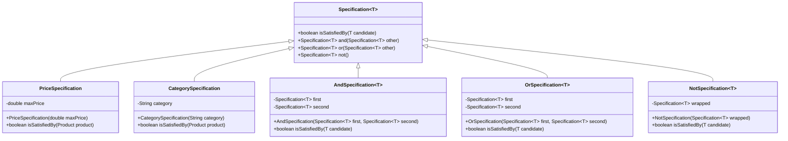

## 5.14.2 Composing Specifications

In the realm of software design, the Specification Pattern stands out as a powerful tool for defining business rules and logic in a clean, reusable manner. By composing specifications, we can build complex rules from simple, reusable components using logical operations like AND, OR, and NOT. This approach not only enhances code readability and maintainability but also promotes flexibility and reusability.

### Understanding the Specification Pattern

The Specification Pattern is a behavioral design pattern that allows us to encapsulate business logic into reusable components called specifications. Each specification represents a single rule or condition. By combining these specifications, we can create complex logic without resorting to hard-coded conditions scattered throughout the codebase.

### Why Compose Specifications?

Composing specifications offers several advantages over traditional hard-coded logic:

1. **Reusability**: Specifications can be reused across different parts of the application, reducing duplication.
2. **Flexibility**: New rules can be added or existing ones modified without altering the core logic.
3. **Readability**: The code becomes more readable as specifications are self-descriptive and encapsulate specific logic.
4. **Maintainability**: Changes to business rules are localized, making the system easier to maintain and evolve.

### Key Concepts in Composing Specifications

Before diving into code examples, let's explore the key concepts involved in composing specifications:

- **Specification Interface**: Defines the contract for evaluating conditions.
- **Concrete Specifications**: Implementations of the specification interface representing specific rules.
- **Composite Specifications**: Combine multiple specifications using logical operations (AND, OR, NOT).

### Implementing the Specification Pattern in Java

Let's start by defining a simple specification interface in Java:

```java
public interface Specification<T> {
    boolean isSatisfiedBy(T candidate);
    
    Specification<T> and(Specification<T> other);
    Specification<T> or(Specification<T> other);
    Specification<T> not();
}
```

This interface provides a method `isSatisfiedBy` to evaluate a condition and methods for combining specifications using logical operations.

#### Concrete Specifications

Now, let's implement some concrete specifications. Consider a scenario where we have a `Product` class, and we want to filter products based on certain criteria such as price and category.

```java
public class Product {
    private String name;
    private double price;
    private String category;

    // Constructors, getters, and setters
}

public class PriceSpecification implements Specification<Product> {
    private double maxPrice;

    public PriceSpecification(double maxPrice) {
        this.maxPrice = maxPrice;
    }

    @Override
    public boolean isSatisfiedBy(Product product) {
        return product.getPrice() <= maxPrice;
    }

    @Override
    public Specification<Product> and(Specification<Product> other) {
        return new AndSpecification<>(this, other);
    }

    @Override
    public Specification<Product> or(Specification<Product> other) {
        return new OrSpecification<>(this, other);
    }

    @Override
    public Specification<Product> not() {
        return new NotSpecification<>(this);
    }
}

public class CategorySpecification implements Specification<Product> {
    private String category;

    public CategorySpecification(String category) {
        this.category = category;
    }

    @Override
    public boolean isSatisfiedBy(Product product) {
        return product.getCategory().equalsIgnoreCase(category);
    }

    @Override
    public Specification<Product> and(Specification<Product> other) {
        return new AndSpecification<>(this, other);
    }

    @Override
    public Specification<Product> or(Specification<Product> other) {
        return new OrSpecification<>(this, other);
    }

    @Override
    public Specification<Product> not() {
        return new NotSpecification<>(this);
    }
}
```

#### Composite Specifications

Next, let's implement the composite specifications for AND, OR, and NOT operations:

```java
public class AndSpecification<T> implements Specification<T> {
    private Specification<T> first;
    private Specification<T> second;

    public AndSpecification(Specification<T> first, Specification<T> second) {
        this.first = first;
        this.second = second;
    }

    @Override
    public boolean isSatisfiedBy(T candidate) {
        return first.isSatisfiedBy(candidate) && second.isSatisfiedBy(candidate);
    }

    @Override
    public Specification<T> and(Specification<T> other) {
        return new AndSpecification<>(this, other);
    }

    @Override
    public Specification<T> or(Specification<T> other) {
        return new OrSpecification<>(this, other);
    }

    @Override
    public Specification<T> not() {
        return new NotSpecification<>(this);
    }
}

public class OrSpecification<T> implements Specification<T> {
    private Specification<T> first;
    private Specification<T> second;

    public OrSpecification(Specification<T> first, Specification<T> second) {
        this.first = first;
        this.second = second;
    }

    @Override
    public boolean isSatisfiedBy(T candidate) {
        return first.isSatisfiedBy(candidate) || second.isSatisfiedBy(candidate);
    }

    @Override
    public Specification<T> and(Specification<T> other) {
        return new AndSpecification<>(this, other);
    }

    @Override
    public Specification<T> or(Specification<T> other) {
        return new OrSpecification<>(this, other);
    }

    @Override
    public Specification<T> not() {
        return new NotSpecification<>(this);
    }
}

public class NotSpecification<T> implements Specification<T> {
    private Specification<T> wrapped;

    public NotSpecification(Specification<T> wrapped) {
        this.wrapped = wrapped;
    }

    @Override
    public boolean isSatisfiedBy(T candidate) {
        return !wrapped.isSatisfiedBy(candidate);
    }

    @Override
    public Specification<T> and(Specification<T> other) {
        return new AndSpecification<>(this, other);
    }

    @Override
    public Specification<T> or(Specification<T> other) {
        return new OrSpecification<>(this, other);
    }

    @Override
    public Specification<T> not() {
        return new NotSpecification<>(this);
    }
}
```

### Using Composed Specifications

With the specifications and combinators in place, we can now compose complex rules. Let's see how we can use these specifications to filter products:

```java
public class ProductFilter {
    public List<Product> filter(List<Product> products, Specification<Product> specification) {
        return products.stream()
                .filter(specification::isSatisfiedBy)
                .collect(Collectors.toList());
    }
}

public class Main {
    public static void main(String[] args) {
        List<Product> products = Arrays.asList(
            new Product("Laptop", 1500, "Electronics"),
            new Product("Coffee Maker", 80, "Home Appliances"),
            new Product("Smartphone", 700, "Electronics"),
            new Product("Blender", 50, "Home Appliances")
        );

        Specification<Product> electronicsSpec = new CategorySpecification("Electronics");
        Specification<Product> priceSpec = new PriceSpecification(1000);

        Specification<Product> complexSpec = electronicsSpec.and(priceSpec);

        ProductFilter filter = new ProductFilter();
        List<Product> filteredProducts = filter.filter(products, complexSpec);

        filteredProducts.forEach(product -> System.out.println(product.getName()));
    }
}
```

In this example, we compose a complex specification that filters products that are in the "Electronics" category and have a price less than or equal to 1000. The `ProductFilter` class uses the composed specification to filter the list of products.

### Advantages of Composing Specifications

1. **Modularity**: Each specification encapsulates a single rule, making it easy to understand and modify.
2. **Testability**: Specifications can be tested independently, ensuring that each rule behaves as expected.
3. **Extensibility**: New specifications can be added without altering existing ones, allowing the system to evolve with changing requirements.
4. **Separation of Concerns**: Business logic is separated from the core application logic, promoting cleaner code architecture.

### Visualizing Specification Composition

To better understand how specifications are composed, let's visualize the process using a class diagram:



### Try It Yourself

To deepen your understanding, try modifying the code examples:

- **Add a new specification**: Implement a `NameSpecification` that filters products by name.
- **Combine more specifications**: Create a specification that checks if a product is either in the "Electronics" category or costs less than 100.
- **Test different combinations**: Experiment with different logical combinations to see how they affect the filtering results.

### Knowledge Check

- **What is the primary advantage of using the Specification Pattern?**
- **How does composing specifications enhance code flexibility?**
- **Why is it beneficial to separate business logic from core application logic?**

### Conclusion

Composing specifications using the Specification Pattern is a powerful technique for building complex business rules in a modular, reusable manner. By encapsulating logic into specifications and combining them using logical operations, we achieve a flexible and maintainable codebase. This approach not only simplifies the implementation of complex conditions but also promotes clean architecture and separation of concerns.

Remember, this is just the beginning. As you progress, you'll build more complex and interactive systems. Keep experimenting, stay curious, and enjoy the journey!

## Quiz Time!



### What is the primary benefit of using the Specification Pattern?

- [x] Reusability and flexibility in defining business rules.
- [ ] Faster execution of business logic.
- [ ] Reduced memory usage.
- [ ] Simplified user interface design.

> **Explanation:** The Specification Pattern allows for reusability and flexibility by encapsulating business logic into reusable components.

### How does composing specifications improve code maintainability?

- [x] By localizing changes to business rules.
- [ ] By reducing the number of classes.
- [ ] By eliminating the need for comments.
- [ ] By increasing the complexity of the code.

> **Explanation:** Composing specifications localizes changes to business rules, making the code easier to maintain and evolve.

### What logical operations are typically used in composing specifications?

- [x] AND, OR, NOT
- [ ] ADD, SUBTRACT, MULTIPLY
- [ ] IF, ELSE, SWITCH
- [ ] FOR, WHILE, DO

> **Explanation:** AND, OR, and NOT are the logical operations used to compose specifications.

### What is the role of a composite specification?

- [x] To combine multiple specifications using logical operations.
- [ ] To execute business logic faster.
- [ ] To reduce the number of method calls.
- [ ] To simplify the user interface.

> **Explanation:** A composite specification combines multiple specifications using logical operations like AND, OR, and NOT.

### Which of the following is a benefit of separating business logic from core application logic?

- [x] Promotes cleaner code architecture.
- [ ] Increases execution speed.
- [ ] Reduces the number of lines of code.
- [ ] Simplifies user authentication.

> **Explanation:** Separating business logic from core application logic promotes cleaner code architecture and separation of concerns.

### What is an example of a concrete specification?

- [x] PriceSpecification
- [ ] ProductFilter
- [ ] Main
- [ ] Product

> **Explanation:** PriceSpecification is an example of a concrete specification that implements the Specification interface.

### How can new specifications be added without altering existing ones?

- [x] By implementing new classes that conform to the Specification interface.
- [ ] By modifying existing classes directly.
- [ ] By using global variables.
- [ ] By adding more if-else statements.

> **Explanation:** New specifications can be added by implementing new classes that conform to the Specification interface, without altering existing ones.

### What is the purpose of the `isSatisfiedBy` method in the Specification interface?

- [x] To evaluate whether a candidate meets the specification criteria.
- [ ] To print the candidate details.
- [ ] To modify the candidate object.
- [ ] To delete the candidate object.

> **Explanation:** The `isSatisfiedBy` method evaluates whether a candidate meets the specification criteria.

### What does the `and` method in the Specification interface do?

- [x] Combines two specifications using a logical AND operation.
- [ ] Combines two specifications using a logical OR operation.
- [ ] Negates a specification.
- [ ] Deletes a specification.

> **Explanation:** The `and` method combines two specifications using a logical AND operation.

### True or False: The Specification Pattern can be used to simplify user interface design.

- [ ] True
- [x] False

> **Explanation:** The Specification Pattern is primarily used for defining and composing business rules, not for simplifying user interface design.


