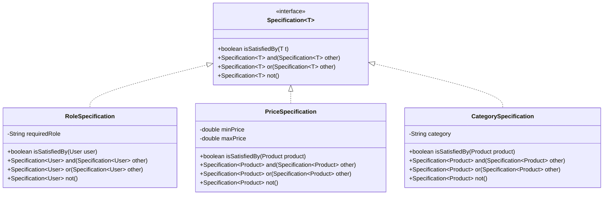

## 5.14.3 Use Cases and Examples

The Specification Pattern is a powerful tool in the software engineer's toolkit, particularly when dealing with complex business rules and dynamic filtering criteria. This pattern allows us to encapsulate business logic into reusable, combinable components, making our code more flexible and maintainable. In this section, we'll explore real-world applications of the Specification Pattern, focusing on scenarios like user authorization and product selection filters. We'll provide detailed explanations and code examples to illustrate how this pattern can be effectively implemented in Java.

### Understanding the Specification Pattern

Before diving into use cases, let's briefly revisit the Specification Pattern. This pattern is used to encapsulate business rules and logic into a single unit, known as a specification. A specification can be combined with other specifications to form complex logical operations, such as AND, OR, and NOT. This makes it ideal for scenarios where business rules are subject to frequent changes or need to be applied dynamically.

### Real-World Use Cases

#### 1. User Authorization Rules

In many applications, user authorization is a critical component. The Specification Pattern can be used to define complex authorization rules that determine whether a user has access to certain resources or actions. By encapsulating these rules into specifications, we can easily modify them without affecting other parts of the system.

##### Code Example: User Authorization

Let's consider a scenario where we have a system with different user roles, and we need to determine if a user has access to perform certain actions based on their role and permissions.

```java
// Specification interface
public interface Specification<T> {
    boolean isSatisfiedBy(T t);
    Specification<T> and(Specification<T> other);
    Specification<T> or(Specification<T> other);
    Specification<T> not();
}

// Concrete specification for checking user roles
public class RoleSpecification implements Specification<User> {
    private final String requiredRole;

    public RoleSpecification(String requiredRole) {
        this.requiredRole = requiredRole;
    }

    @Override
    public boolean isSatisfiedBy(User user) {
        return user.getRoles().contains(requiredRole);
    }

    @Override
    public Specification<User> and(Specification<User> other) {
        return new AndSpecification<>(this, other);
    }

    @Override
    public Specification<User> or(Specification<User> other) {
        return new OrSpecification<>(this, other);
    }

    @Override
    public Specification<User> not() {
        return new NotSpecification<>(this);
    }
}

// Example usage
public class AuthorizationExample {
    public static void main(String[] args) {
        User user = new User("John Doe", List.of("ADMIN", "USER"));

        Specification<User> isAdmin = new RoleSpecification("ADMIN");
        Specification<User> isUser = new RoleSpecification("USER");

        boolean canAccessAdminPanel = isAdmin.isSatisfiedBy(user);
        boolean canAccessUserPanel = isUser.isSatisfiedBy(user);

        System.out.println("Can access admin panel: " + canAccessAdminPanel);
        System.out.println("Can access user panel: " + canAccessUserPanel);
    }
}
```

In this example, we define a `RoleSpecification` that checks if a user has a specific role. We can easily combine this with other specifications to create more complex authorization rules.

#### 2. Product Selection Filters

Another common use case for the Specification Pattern is in e-commerce applications, where users need to filter products based on various criteria such as price, category, and availability. By using specifications, we can create flexible and dynamic filters that can be easily adjusted as business requirements change.

##### Code Example: Product Filtering

Consider an e-commerce application where we need to filter products based on price range and category.

```java
// Concrete specification for checking product price range
public class PriceSpecification implements Specification<Product> {
    private final double minPrice;
    private final double maxPrice;

    public PriceSpecification(double minPrice, double maxPrice) {
        this.minPrice = minPrice;
        this.maxPrice = maxPrice;
    }

    @Override
    public boolean isSatisfiedBy(Product product) {
        return product.getPrice() >= minPrice && product.getPrice() <= maxPrice;
    }

    @Override
    public Specification<Product> and(Specification<Product> other) {
        return new AndSpecification<>(this, other);
    }

    @Override
    public Specification<Product> or(Specification<Product> other) {
        return new OrSpecification<>(this, other);
    }

    @Override
    public Specification<Product> not() {
        return new NotSpecification<>(this);
    }
}

// Concrete specification for checking product category
public class CategorySpecification implements Specification<Product> {
    private final String category;

    public CategorySpecification(String category) {
        this.category = category;
    }

    @Override
    public boolean isSatisfiedBy(Product product) {
        return product.getCategory().equalsIgnoreCase(category);
    }

    @Override
    public Specification<Product> and(Specification<Product> other) {
        return new AndSpecification<>(this, other);
    }

    @Override
    public Specification<Product> or(Specification<Product> other) {
        return new OrSpecification<>(this, other);
    }

    @Override
    public Specification<Product> not() {
        return new NotSpecification<>(this);
    }
}

// Example usage
public class ProductFilterExample {
    public static void main(String[] args) {
        List<Product> products = List.of(
            new Product("Laptop", 999.99, "Electronics"),
            new Product("Coffee Maker", 49.99, "Home Appliances"),
            new Product("Smartphone", 699.99, "Electronics")
        );

        Specification<Product> electronicsCategory = new CategorySpecification("Electronics");
        Specification<Product> priceRange = new PriceSpecification(100, 1000);

        List<Product> filteredProducts = products.stream()
            .filter(electronicsCategory.and(priceRange)::isSatisfiedBy)
            .collect(Collectors.toList());

        filteredProducts.forEach(product -> System.out.println(product.getName()));
    }
}
```

In this example, we define `PriceSpecification` and `CategorySpecification` to filter products based on price and category. We then use these specifications to filter a list of products, demonstrating the flexibility and reusability of the Specification Pattern.

### Benefits of Using the Specification Pattern

The Specification Pattern offers several benefits, particularly in scenarios where business rules are complex and subject to change:

- **Reusability**: Specifications can be reused across different parts of the application, reducing code duplication.
- **Flexibility**: By combining specifications, we can easily create complex business rules without modifying existing code.
- **Maintainability**: Encapsulating business logic into specifications makes it easier to manage and update as requirements change.

### Try It Yourself

To deepen your understanding of the Specification Pattern, try modifying the code examples provided:

1. **Extend the User Authorization Example**: Add a new specification to check if a user has a specific permission, and combine it with role specifications to create more complex authorization rules.

2. **Enhance the Product Filtering Example**: Introduce a new specification for filtering products based on availability or rating, and combine it with existing specifications to create a more comprehensive filter.

### Visualizing the Specification Pattern

To better understand how the Specification Pattern works, let's visualize the process of combining specifications using a class diagram.



This diagram illustrates how different specifications implement the `Specification` interface, allowing them to be combined using logical operations.

### Further Reading and Resources

To explore more about the Specification Pattern and its applications, consider the following resources:

- [Martin Fowler's Enterprise Patterns](https://martinfowler.com/eaaCatalog/specification.html): A comprehensive guide to enterprise application patterns, including the Specification Pattern.
- [Java Design Patterns](https://java-design-patterns.com/patterns/specification/): An open-source repository of design pattern examples in Java.

### Knowledge Check

Let's reinforce what we've learned with a few questions:

1. What are the key benefits of using the Specification Pattern?
2. How can the Specification Pattern be used to enhance user authorization logic?
3. In what ways can specifications be combined to create complex business rules?

### Conclusion

The Specification Pattern is a versatile tool that can significantly enhance the flexibility and maintainability of your code. By encapsulating business rules into specifications, you can create dynamic, reusable components that adapt to changing requirements. Remember, this is just the beginning. As you continue to explore design patterns, you'll discover even more ways to improve your software design and architecture. Keep experimenting, stay curious, and enjoy the journey!

## Quiz Time!



### What is a primary benefit of using the Specification Pattern in software design?

- [x] It allows for dynamic combination of business rules.
- [ ] It simplifies database queries.
- [ ] It enhances user interface design.
- [ ] It reduces the need for error handling.

> **Explanation:** The Specification Pattern allows for dynamic combination and reuse of business rules, making it easier to adapt to changing requirements.

### How does the Specification Pattern improve code maintainability?

- [x] By encapsulating business logic into reusable components.
- [ ] By reducing the number of classes in a system.
- [ ] By eliminating the need for interfaces.
- [ ] By simplifying the user interface.

> **Explanation:** Encapsulating business logic into specifications makes it easier to manage and update as requirements change, improving maintainability.

### In the context of the Specification Pattern, what does the `and` method do?

- [x] Combines two specifications to create a new one that is satisfied only if both are satisfied.
- [ ] Negates the current specification.
- [ ] Checks if the specification is satisfied by a given object.
- [ ] Combines two specifications to create a new one that is satisfied if either is satisfied.

> **Explanation:** The `and` method combines two specifications to create a new one that is satisfied only if both original specifications are satisfied.

### Which of the following is a common use case for the Specification Pattern?

- [x] Filtering collections based on dynamic criteria.
- [ ] Enhancing graphical user interfaces.
- [ ] Managing database connections.
- [ ] Optimizing memory usage.

> **Explanation:** The Specification Pattern is commonly used for filtering collections based on dynamic criteria, such as user roles or product attributes.

### What is the role of the `isSatisfiedBy` method in a specification?

- [x] It checks if a given object satisfies the specification.
- [ ] It combines two specifications.
- [ ] It negates the current specification.
- [ ] It initializes the specification with default values.

> **Explanation:** The `isSatisfiedBy` method checks if a given object satisfies the specification, determining whether the specified criteria are met.

### How can the Specification Pattern be used in user authorization?

- [x] By defining rules that determine access based on user roles and permissions.
- [ ] By simplifying the user interface.
- [ ] By managing database transactions.
- [ ] By optimizing memory usage.

> **Explanation:** The Specification Pattern can define rules that determine access based on user roles and permissions, making it ideal for user authorization scenarios.

### What is a potential advantage of combining specifications using logical operations?

- [x] It allows for creating complex business rules without modifying existing code.
- [ ] It reduces the number of classes needed in a system.
- [ ] It simplifies user interface design.
- [ ] It enhances database performance.

> **Explanation:** Combining specifications using logical operations allows for creating complex business rules without modifying existing code, enhancing flexibility.

### Which method would you use to create a specification that is satisfied if either of two specifications is satisfied?

- [x] The `or` method.
- [ ] The `and` method.
- [ ] The `not` method.
- [ ] The `isSatisfiedBy` method.

> **Explanation:** The `or` method is used to combine two specifications to create a new one that is satisfied if either of the original specifications is satisfied.

### What is the purpose of the `not` method in a specification?

- [x] It creates a new specification that is satisfied if the original is not.
- [ ] It combines two specifications.
- [ ] It checks if a specification is satisfied by a given object.
- [ ] It initializes the specification with default values.

> **Explanation:** The `not` method creates a new specification that is satisfied if the original specification is not satisfied, effectively negating the original condition.

### True or False: The Specification Pattern can only be used for filtering collections.

- [x] False
- [ ] True

> **Explanation:** False. While the Specification Pattern is commonly used for filtering collections, it can also be applied to various scenarios involving complex business rules and dynamic criteria.


