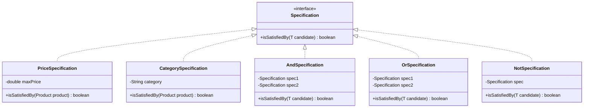
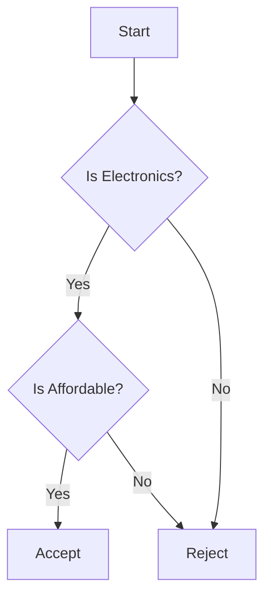

## 5.14 Specification Pattern

In the realm of software engineering, the Specification Pattern emerges as a powerful tool for managing complex business rules. This pattern allows developers to encapsulate business logic into reusable components that can be easily combined and modified. Let's delve into the intricacies of the Specification Pattern, its applications, and how it can be implemented effectively in Java.

### Understanding the Specification Pattern

The Specification Pattern is a behavioral design pattern that defines a business rule in a separate, reusable object. This pattern allows for the recombination of business logic by chaining together business rules in a flexible and reusable manner. The core idea is to encapsulate the logic that determines whether a given object satisfies certain criteria, making it easier to manage and extend.

#### Intent of the Specification Pattern

The primary intent of the Specification Pattern is to separate the logic of business rules from the objects they apply to. This separation allows for:

- **Reusability**: Specifications can be reused across different parts of an application.
- **Composability**: Multiple specifications can be combined using logical operations such as AND, OR, and NOT.
- **Maintainability**: Business rules are easier to manage and update when encapsulated in their own classes.

### The Problem Addressed by the Specification Pattern

In complex applications, business rules often become intertwined with the logic of the application, leading to code that is difficult to maintain and extend. This can result in:

- **Code Duplication**: Similar business rules may be implemented in multiple places.
- **Rigidity**: Changes to business rules require modifications to multiple parts of the codebase.
- **Complexity**: As business rules grow in complexity, the code becomes harder to understand and manage.

The Specification Pattern addresses these issues by providing a structured way to define and manage business rules.

### Implementing the Specification Pattern in Java

To implement the Specification Pattern in Java, we start by defining a `Specification` interface. This interface will include a method to determine if a given object satisfies the specification.

```java
public interface Specification<T> {
    boolean isSatisfiedBy(T candidate);
}
```

#### Creating Concrete Specifications

Concrete specifications implement the `Specification` interface and encapsulate specific business rules. For example, consider a scenario where we need to filter a list of products based on certain criteria, such as price and category.

```java
public class PriceSpecification implements Specification<Product> {
    private final double maxPrice;

    public PriceSpecification(double maxPrice) {
        this.maxPrice = maxPrice;
    }

    @Override
    public boolean isSatisfiedBy(Product product) {
        return product.getPrice() <= maxPrice;
    }
}

public class CategorySpecification implements Specification<Product> {
    private final String category;

    public CategorySpecification(String category) {
        this.category = category;
    }

    @Override
    public boolean isSatisfiedBy(Product product) {
        return product.getCategory().equalsIgnoreCase(category);
    }
}
```

#### Combining Specifications

One of the strengths of the Specification Pattern is the ability to combine specifications using logical operations. We can create composite specifications that represent complex business rules.

```java
public class AndSpecification<T> implements Specification<T> {
    private final Specification<T> spec1;
    private final Specification<T> spec2;

    public AndSpecification(Specification<T> spec1, Specification<T> spec2) {
        this.spec1 = spec1;
        this.spec2 = spec2;
    }

    @Override
    public boolean isSatisfiedBy(T candidate) {
        return spec1.isSatisfiedBy(candidate) && spec2.isSatisfiedBy(candidate);
    }
}

public class OrSpecification<T> implements Specification<T> {
    private final Specification<T> spec1;
    private final Specification<T> spec2;

    public OrSpecification(Specification<T> spec1, Specification<T> spec2) {
        this.spec1 = spec1;
        this.spec2 = spec2;
    }

    @Override
    public boolean isSatisfiedBy(T candidate) {
        return spec1.isSatisfiedBy(candidate) || spec2.isSatisfiedBy(candidate);
    }
}

public class NotSpecification<T> implements Specification<T> {
    private final Specification<T> spec;

    public NotSpecification(Specification<T> spec) {
        this.spec = spec;
    }

    @Override
    public boolean isSatisfiedBy(T candidate) {
        return !spec.isSatisfiedBy(candidate);
    }
}
```

### UML Diagram of the Specification Pattern

To better understand the structure of the Specification Pattern, let's visualize it using a UML class diagram.



### Applying the Specification Pattern

Let's see how we can apply the Specification Pattern in a real-world scenario. Suppose we have a list of products, and we want to filter them based on price and category.

```java
import java.util.ArrayList;
import java.util.List;

public class ProductFilter {
    public List<Product> filter(List<Product> products, Specification<Product> specification) {
        List<Product> result = new ArrayList<>();
        for (Product product : products) {
            if (specification.isSatisfiedBy(product)) {
                result.add(product);
            }
        }
        return result;
    }
}
```

#### Example Usage

```java
public class Main {
    public static void main(String[] args) {
        List<Product> products = List.of(
            new Product("Laptop", 1500, "Electronics"),
            new Product("Smartphone", 800, "Electronics"),
            new Product("Coffee Maker", 100, "Home Appliances")
        );

        Specification<Product> electronicsSpec = new CategorySpecification("Electronics");
        Specification<Product> affordableSpec = new PriceSpecification(1000);

        Specification<Product> affordableElectronicsSpec = new AndSpecification<>(electronicsSpec, affordableSpec);

        ProductFilter filter = new ProductFilter();
        List<Product> affordableElectronics = filter.filter(products, affordableElectronicsSpec);

        affordableElectronics.forEach(product -> System.out.println(product.getName()));
    }
}
```

In this example, we define specifications for electronics and affordable products, then combine them using the `AndSpecification`. The `ProductFilter` class uses these specifications to filter the list of products.

### Try It Yourself

To deepen your understanding of the Specification Pattern, try modifying the code examples:

- **Add New Specifications**: Create a new specification for filtering products based on their brand or rating.
- **Combine Specifications**: Experiment with different combinations of specifications using AND, OR, and NOT.
- **Extend Functionality**: Implement a `Specification` that checks multiple attributes, such as both price and rating.

### Visualizing Specification Combinations

To illustrate how specifications can be combined, let's use a flowchart to depict the decision-making process when evaluating a product against multiple specifications.



### Benefits of the Specification Pattern

The Specification Pattern offers several advantages:

- **Flexibility**: Easily adapt to changing business requirements by modifying or adding specifications.
- **Reusability**: Use the same specifications across different parts of an application.
- **Composability**: Combine specifications to form complex business rules without altering existing code.

### Challenges and Considerations

While the Specification Pattern is powerful, it also comes with challenges:

- **Complexity**: Overuse of specifications can lead to a complex and hard-to-manage codebase.
- **Performance**: Combining multiple specifications can impact performance, especially with large datasets.

### Conclusion

The Specification Pattern is a valuable tool for managing complex business rules in a flexible and reusable manner. By encapsulating business logic into specifications, developers can create maintainable and adaptable applications. As you continue to explore design patterns, consider how the Specification Pattern can enhance your projects.

### Further Reading

For more information on the Specification Pattern and related concepts, consider the following resources:

- [Design Patterns: Elements of Reusable Object-Oriented Software](https://en.wikipedia.org/wiki/Design_Patterns)
- [Java Design Patterns and Architecture](https://www.oracle.com/java/technologies/javase/javadesignpatterns.html)

## Quiz Time!



### What is the primary intent of the Specification Pattern?

- [x] To separate the logic of business rules from the objects they apply to.
- [ ] To encapsulate object creation logic.
- [ ] To provide a simplified interface to a complex subsystem.
- [ ] To allow incompatible interfaces to work together.

> **Explanation:** The Specification Pattern is designed to separate business rule logic from the objects they apply to, enhancing reusability and maintainability.

### Which logical operations can be used to combine specifications?

- [x] AND
- [x] OR
- [x] NOT
- [ ] XOR

> **Explanation:** Specifications can be combined using AND, OR, and NOT operations to form complex business rules.

### What is a key benefit of using the Specification Pattern?

- [x] Flexibility in adapting to changing business requirements.
- [ ] Simplifying object creation.
- [ ] Reducing the number of classes in a system.
- [ ] Improving performance by reducing method calls.

> **Explanation:** The Specification Pattern provides flexibility by allowing business rules to be easily modified or extended.

### In the UML diagram, which class implements the Specification interface?

- [x] PriceSpecification
- [ ] Product
- [ ] ProductFilter
- [ ] Main

> **Explanation:** The PriceSpecification class implements the Specification interface, encapsulating a specific business rule.

### How does the Specification Pattern improve maintainability?

- [x] By encapsulating business rules in separate classes.
- [ ] By reducing the number of lines of code.
- [ ] By using inheritance to share behavior.
- [ ] By minimizing the use of interfaces.

> **Explanation:** Encapsulating business rules in separate classes makes them easier to manage and update, improving maintainability.

### What is a potential challenge when using the Specification Pattern?

- [x] Increased complexity with overuse.
- [ ] Difficulty in creating new specifications.
- [ ] Inability to combine specifications.
- [ ] Lack of support for logical operations.

> **Explanation:** Overuse of specifications can lead to a complex and hard-to-manage codebase.

### Which class in the example is responsible for filtering products?

- [x] ProductFilter
- [ ] Main
- [ ] PriceSpecification
- [ ] CategorySpecification

> **Explanation:** The ProductFilter class is responsible for filtering products based on the provided specifications.

### What is the role of the AndSpecification class?

- [x] To combine two specifications using a logical AND.
- [ ] To negate a specification.
- [ ] To filter products by category.
- [ ] To encapsulate the logic for a single business rule.

> **Explanation:** The AndSpecification class combines two specifications using a logical AND operation.

### True or False: The Specification Pattern can only be used with product filtering.

- [ ] True
- [x] False

> **Explanation:** The Specification Pattern is versatile and can be used in various contexts beyond product filtering, such as user validation and access control.

### What should you consider when using the Specification Pattern with large datasets?

- [x] Performance impact due to multiple specifications.
- [ ] The number of classes in the system.
- [ ] The use of inheritance.
- [ ] The number of interfaces implemented.

> **Explanation:** Combining multiple specifications can impact performance, especially with large datasets.


