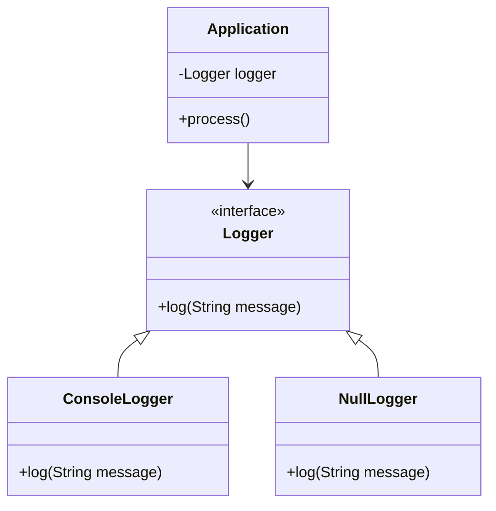

## 5.15.1 Implementing Null Object in Java

In the realm of software design patterns, the Null Object Pattern stands out as a simple yet powerful tool to manage the ubiquitous issue of null references. By providing a default behavior in place of null, this pattern helps eliminate the need for repetitive null checks, thereby enhancing code readability and reducing the risk of `NullPointerException`. In this section, we will delve into the implementation of the Null Object Pattern in Java, exploring its concepts, benefits, and best practices.

### Understanding the Null Object Pattern

The Null Object Pattern is a behavioral design pattern that uses an object with a neutral or default behavior in place of null references. This pattern is particularly useful in scenarios where an object is expected to perform certain operations, but a null reference would lead to errors or additional conditional checks.

**Key Concepts:**

- **Neutral Behavior**: The Null Object provides a default implementation that does nothing or returns a default value.
- **Polymorphism**: By implementing the same interface as the real object, the Null Object can be used interchangeably with actual instances.
- **Simplicity**: This pattern simplifies code by removing the need for explicit null checks.

### Implementing the Null Object Pattern in Java

Let's walk through a step-by-step guide to implementing the Null Object Pattern in Java. We'll use a simple example of a logging system where we want to avoid null checks for loggers.

#### Step 1: Define the Interface

First, define a common interface that both the real object and the Null Object will implement. This interface will declare the methods that the objects are expected to perform.

```java
public interface Logger {
    void log(String message);
}
```

#### Step 2: Implement the Real Object

Next, create a concrete class that implements the interface. This class will provide the actual functionality.

```java
public class ConsoleLogger implements Logger {
    @Override
    public void log(String message) {
        System.out.println("Logging to console: " + message);
    }
}
```

#### Step 3: Implement the Null Object

Now, create a Null Object class that also implements the interface. This class will provide a neutral implementation of the methods.

```java
public class NullLogger implements Logger {
    @Override
    public void log(String message) {
        // Do nothing
    }
}
```

#### Step 4: Utilize the Null Object

In your application, use the Null Object in place of null references. This approach eliminates the need for null checks.

```java
public class Application {
    private Logger logger;

    public Application(Logger logger) {
        this.logger = logger;
    }

    public void process() {
        logger.log("Processing started.");
        // Perform processing
        logger.log("Processing finished.");
    }

    public static void main(String[] args) {
        Logger logger = new ConsoleLogger();
        Application appWithLogger = new Application(logger);
        appWithLogger.process();

        Logger nullLogger = new NullLogger();
        Application appWithoutLogger = new Application(nullLogger);
        appWithoutLogger.process();
    }
}
```

### Best Practices and Considerations

When implementing the Null Object Pattern, consider the following best practices:

- **Consistency**: Ensure that the Null Object provides a consistent and neutral behavior across all methods.
- **Performance**: The Null Object should have minimal overhead, as its primary purpose is to avoid unnecessary operations.
- **Documentation**: Clearly document the behavior of the Null Object to avoid confusion among developers.
- **Use Cases**: This pattern is most effective in scenarios where null checks are frequent and the absence of an object is a valid state.

### Visualizing the Null Object Pattern

To better understand the Null Object Pattern, let's visualize the relationship between the real object, the Null Object, and the client code.



**Diagram Description**: This class diagram illustrates the relationship between the `Logger` interface, the `ConsoleLogger` and `NullLogger` implementations, and the `Application` class that uses a `Logger` instance.

### Try It Yourself

To deepen your understanding of the Null Object Pattern, try modifying the code examples:

- **Add More Methods**: Extend the `Logger` interface with additional methods and implement them in both `ConsoleLogger` and `NullLogger`.
- **Different Null Behaviors**: Experiment with different neutral behaviors in the `NullLogger`, such as logging to a file or a different output stream.
- **Combine with Other Patterns**: Integrate the Null Object Pattern with other design patterns, such as Singleton or Factory, to see how they complement each other.

### Knowledge Check

Before we conclude, let's reinforce your understanding with a few questions:

- **What is the primary purpose of the Null Object Pattern?**
- **How does the Null Object Pattern enhance code readability?**
- **In what scenarios is the Null Object Pattern most beneficial?**

### Conclusion

The Null Object Pattern is a valuable tool in the software engineer's toolkit, providing a simple yet effective way to manage null references and improve code quality. By implementing this pattern in Java, you can create more robust and maintainable applications.

Remember, this is just the beginning. As you progress, you'll discover more ways to leverage design patterns to solve complex problems. Keep experimenting, stay curious, and enjoy the journey!

## Quiz Time!



### What is the primary purpose of the Null Object Pattern?

- [x] To provide a default behavior in place of null references
- [ ] To enhance performance by reducing object creation
- [ ] To simplify complex algorithms
- [ ] To facilitate database transactions

> **Explanation:** The Null Object Pattern provides a default behavior to avoid null checks and prevent `NullPointerException`.

### How does the Null Object Pattern enhance code readability?

- [x] By eliminating the need for explicit null checks
- [ ] By reducing the number of classes in the codebase
- [ ] By simplifying method signatures
- [ ] By increasing the use of inheritance

> **Explanation:** The Null Object Pattern removes the need for null checks, making the code cleaner and easier to read.

### In what scenarios is the Null Object Pattern most beneficial?

- [x] When null checks are frequent and the absence of an object is a valid state
- [ ] When performance is the primary concern
- [ ] When working with large datasets
- [ ] When implementing complex algorithms

> **Explanation:** The pattern is beneficial when null checks are common and a null state is acceptable.

### What is a key characteristic of a Null Object?

- [x] It provides a neutral or default behavior
- [ ] It performs complex calculations
- [ ] It interacts with external systems
- [ ] It stores large amounts of data

> **Explanation:** A Null Object provides neutral behavior, often doing nothing or returning default values.

### Which design principle does the Null Object Pattern primarily leverage?

- [x] Polymorphism
- [ ] Encapsulation
- [ ] Inheritance
- [ ] Abstraction

> **Explanation:** The pattern uses polymorphism to allow the Null Object to be used interchangeably with real objects.

### What should be documented when using the Null Object Pattern?

- [x] The behavior of the Null Object
- [ ] The internal implementation details
- [ ] The memory usage statistics
- [ ] The network latency impact

> **Explanation:** Documenting the behavior of the Null Object helps developers understand its intended use.

### How can the Null Object Pattern be combined with other patterns?

- [x] By integrating with Singleton or Factory patterns
- [ ] By using it exclusively without other patterns
- [ ] By replacing all existing patterns
- [ ] By avoiding its use in large projects

> **Explanation:** The Null Object Pattern can complement other patterns like Singleton or Factory.

### What is a potential downside of the Null Object Pattern?

- [x] It may introduce unnecessary classes if overused
- [ ] It complicates the codebase significantly
- [ ] It reduces code performance drastically
- [ ] It increases the risk of runtime errors

> **Explanation:** Overuse can lead to unnecessary classes, but it generally simplifies code.

### How does the Null Object Pattern relate to error handling?

- [x] It helps prevent `NullPointerException`
- [ ] It catches exceptions automatically
- [ ] It logs errors to a file
- [ ] It retries failed operations

> **Explanation:** By providing a default behavior, it prevents `NullPointerException`.

### True or False: The Null Object Pattern is only applicable in Java.

- [ ] True
- [x] False

> **Explanation:** The Null Object Pattern is a general design pattern applicable in many programming languages, not just Java.


