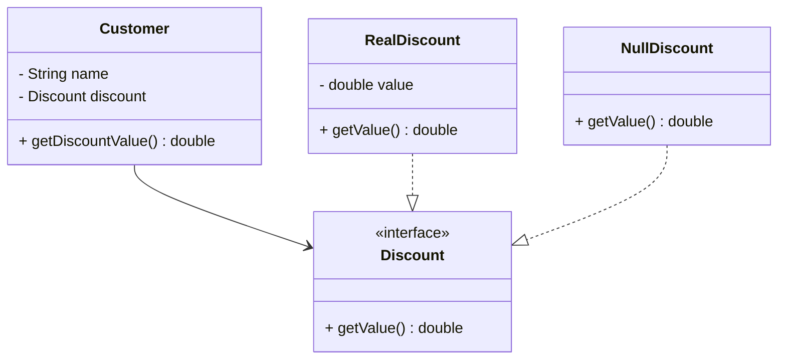

## 5.15.2 Simplifying Code Logic with the Null Object Pattern in Java

In the realm of software engineering, particularly in Java, managing null references can be a daunting task. Null checks litter codebases, leading to complex control flows and increased chances of bugs. The Null Object Pattern offers a compelling solution to this problem by providing a default behavior for null references. In this section, we will explore how the Null Object Pattern simplifies code logic, compare code examples with and without this pattern, and discuss its impact on code maintainability.

### Understanding the Null Object Pattern

The Null Object Pattern is a behavioral design pattern that provides an object as a surrogate for the absence of a value. Instead of using `null` to represent the absence of an object, a special "null object" is used. This object implements the expected interface but contains no meaningful behavior. By doing so, it eliminates the need for null checks and simplifies the control flow of the program.

#### Advantages of Reducing Conditional Logic

Reducing conditional logic in code has several advantages:

1. **Improved Readability**: Code becomes easier to read and understand when there are fewer conditional statements.
2. **Reduced Complexity**: Simplifying control flow reduces the cognitive load on developers, making it easier to reason about the code.
3. **Fewer Bugs**: Eliminating null checks reduces the risk of null pointer exceptions, a common source of bugs in Java applications.
4. **Enhanced Maintainability**: With less complex logic, code is easier to maintain and extend.

### Code Examples: With and Without the Null Object Pattern

Let's compare code examples to illustrate how the Null Object Pattern can simplify code logic.

#### Without the Null Object Pattern

Consider a simple example where we have a `Customer` class with a method `getDiscount()` that returns a discount value. Without the Null Object Pattern, we need to check for null references:

```java
public class Customer {
    private String name;
    private Discount discount;

    public Customer(String name, Discount discount) {
        this.name = name;
        this.discount = discount;
    }

    public double getDiscountValue() {
        if (discount != null) {
            return discount.getValue();
        } else {
            return 0.0; // No discount
        }
    }
}

public class Discount {
    private double value;

    public Discount(double value) {
        this.value = value;
    }

    public double getValue() {
        return value;
    }
}
```

In this example, the `getDiscountValue()` method includes a null check to handle cases where the `discount` might be `null`.

#### With the Null Object Pattern

Now, let's refactor the code using the Null Object Pattern:

```java
public interface Discount {
    double getValue();
}

public class RealDiscount implements Discount {
    private double value;

    public RealDiscount(double value) {
        this.value = value;
    }

    @Override
    public double getValue() {
        return value;
    }
}

public class NullDiscount implements Discount {
    @Override
    public double getValue() {
        return 0.0; // No discount
    }
}

public class Customer {
    private String name;
    private Discount discount;

    public Customer(String name, Discount discount) {
        this.name = name;
        this.discount = discount;
    }

    public double getDiscountValue() {
        return discount.getValue();
    }
}
```

In this refactored version, we define a `NullDiscount` class that implements the `Discount` interface. The `getDiscountValue()` method no longer needs to check for null, simplifying the code logic.

### Benefits of Using the Null Object Pattern

By adopting the Null Object Pattern, we achieve several benefits:

1. **Cleaner Code**: The absence of null checks results in cleaner and more concise code.
2. **Consistent Behavior**: The null object provides a consistent behavior for the absence of a value, reducing unexpected behavior.
3. **Ease of Extension**: Adding new behavior or modifying existing behavior becomes easier without altering the control flow logic.
4. **Improved Testing**: With predictable behavior, testing becomes more straightforward.

### Potential Downsides

While the Null Object Pattern offers many advantages, it is not without its potential downsides:

1. **Masking Errors**: There is a risk of masking unintended null assignments. Developers must ensure that the use of a null object is intentional and appropriate for the context.
2. **Increased Class Count**: Introducing null objects can increase the number of classes in the codebase, which may lead to complexity if not managed properly.
3. **Overhead**: In some cases, the overhead of creating additional classes may outweigh the benefits, especially in performance-critical applications.

### Visualizing the Null Object Pattern

To better understand the Null Object Pattern, let's visualize the class structure using a class diagram.



In this diagram, the `Customer` class depends on the `Discount` interface, which is implemented by both `RealDiscount` and `NullDiscount`. This structure illustrates how the Null Object Pattern provides a uniform interface for handling both real and null discounts.

### Try It Yourself

To gain a deeper understanding, try modifying the code examples:

1. **Add a New Discount Type**: Implement a new discount class, such as `SeasonalDiscount`, and integrate it with the existing structure.
2. **Experiment with Different Null Objects**: Create different null objects for various scenarios and observe how they simplify code logic.
3. **Test Edge Cases**: Write unit tests to verify the behavior of the null objects in different situations.

### References and Further Reading

- [Null Object Pattern on Wikipedia](https://en.wikipedia.org/wiki/Null_object_pattern)
- [Effective Java by Joshua Bloch](https://www.oreilly.com/library/view/effective-java-3rd/9780134686097/)
- [Design Patterns: Elements of Reusable Object-Oriented Software](https://www.amazon.com/Design-Patterns-Elements-Reusable-Object-Oriented/dp/0201633612)

### Knowledge Check

To reinforce your understanding, consider these questions:

1. What are the primary advantages of using the Null Object Pattern?
2. How does the Null Object Pattern improve code readability and maintainability?
3. What are some potential downsides of using the Null Object Pattern?
4. How can the Null Object Pattern be visualized in a class diagram?

### Embrace the Journey

Remember, simplifying code logic is a journey. As you continue to explore design patterns, you'll find new ways to write cleaner, more maintainable code. Keep experimenting, stay curious, and enjoy the process of refining your craft.

## Quiz Time!



### What is the primary purpose of the Null Object Pattern?

- [x] To eliminate null checks by providing a default behavior for null references.
- [ ] To increase the number of classes in a codebase.
- [ ] To replace all instances of null with exceptions.
- [ ] To enhance runtime performance by removing null references.

> **Explanation:** The Null Object Pattern aims to eliminate null checks by providing a default behavior for null references, simplifying code logic.

### How does the Null Object Pattern improve code readability?

- [x] By reducing the number of conditional statements in the code.
- [ ] By increasing the number of classes used in the application.
- [ ] By introducing more complex control flows.
- [ ] By adding more comments to explain null checks.

> **Explanation:** The Null Object Pattern improves code readability by reducing the number of conditional statements, making the code easier to understand.

### What is a potential downside of using the Null Object Pattern?

- [x] It can mask unintended null assignments.
- [ ] It always leads to performance improvements.
- [ ] It reduces the number of classes in a codebase.
- [ ] It eliminates the need for interfaces.

> **Explanation:** A potential downside of the Null Object Pattern is that it can mask unintended null assignments, leading to hidden bugs.

### In the Null Object Pattern, what role does the Null Object play?

- [x] It provides a default behavior for the absence of a value.
- [ ] It throws exceptions when accessed.
- [ ] It logs errors for null references.
- [ ] It replaces all instances of null with default values.

> **Explanation:** The Null Object provides a default behavior for the absence of a value, allowing the program to continue without null checks.

### Which of the following is a benefit of using the Null Object Pattern?

- [x] Cleaner code with fewer null checks.
- [ ] Increased complexity in control flow.
- [x] Consistent behavior for absent values.
- [ ] More conditional logic required.

> **Explanation:** The Null Object Pattern results in cleaner code with fewer null checks and provides consistent behavior for absent values.

### What is a common use case for the Null Object Pattern?

- [x] Simplifying control flow in applications with optional components.
- [ ] Increasing the number of null checks in a codebase.
- [ ] Enhancing performance by removing interfaces.
- [ ] Replacing all instances of null with exceptions.

> **Explanation:** The Null Object Pattern is commonly used to simplify control flow in applications with optional components, reducing the need for null checks.

### How can the Null Object Pattern be visualized in a class diagram?

- [x] By showing a class implementing an interface with both real and null implementations.
- [ ] By displaying a single class with multiple null checks.
- [ ] By illustrating a class with no interfaces.
- [ ] By depicting a class hierarchy without any null objects.

> **Explanation:** The Null Object Pattern can be visualized in a class diagram by showing a class implementing an interface with both real and null implementations.

### What is the impact of the Null Object Pattern on testing?

- [x] It simplifies testing by providing predictable behavior.
- [ ] It complicates testing by introducing more null checks.
- [ ] It eliminates the need for unit tests.
- [ ] It requires more complex test setups.

> **Explanation:** The Null Object Pattern simplifies testing by providing predictable behavior, making it easier to write and maintain tests.

### How does the Null Object Pattern affect code maintainability?

- [x] It enhances maintainability by reducing complex control flows.
- [ ] It decreases maintainability by increasing the number of classes.
- [ ] It has no impact on maintainability.
- [ ] It complicates maintainability by adding more null checks.

> **Explanation:** The Null Object Pattern enhances maintainability by reducing complex control flows, making the code easier to manage.

### True or False: The Null Object Pattern always improves performance.

- [ ] True
- [x] False

> **Explanation:** The Null Object Pattern does not always improve performance; its primary purpose is to simplify code logic by eliminating null checks.




