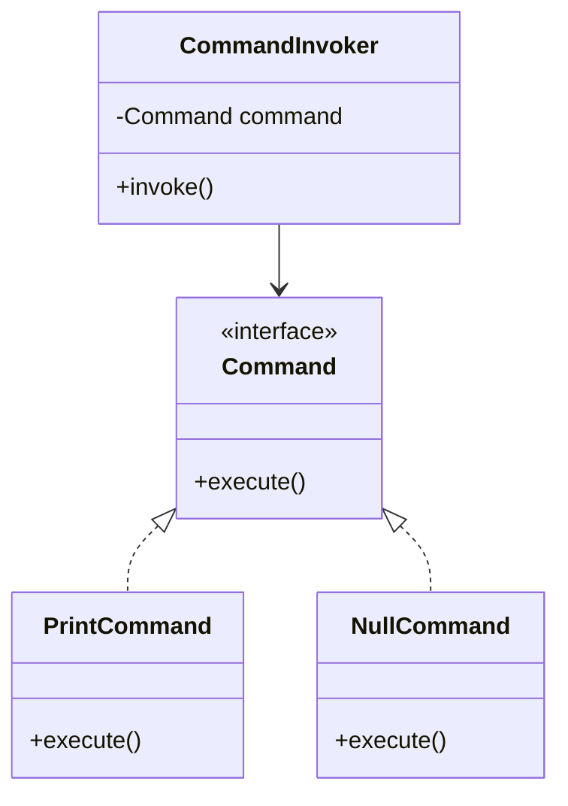

## 5.15.3 Use Cases and Examples

The Null Object Pattern is a behavioral design pattern that provides a default object to represent the absence of a real object. This pattern is particularly useful in scenarios where you want to avoid null checks and handle optional dependencies gracefully. In this section, we'll explore various use cases and examples of the Null Object Pattern in Java, demonstrating its effectiveness in real-world applications.

### Introduction to the Null Object Pattern

Before diving into use cases, let's briefly revisit the Null Object Pattern. The primary goal of this pattern is to encapsulate the absence of an object by providing a non-functional object that adheres to the expected interface. This approach eliminates the need for null checks and simplifies code logic.

**Key Characteristics:**
- **Implements the same interface** as the real object.
- **Performs no operation** or provides a default behavior.
- **Prevents null pointer exceptions** by avoiding null references.

### Use Cases for the Null Object Pattern

The Null Object Pattern can be applied in various scenarios where handling null references gracefully is crucial. Here are some common use cases:

#### 1. Default Command Implementations

In command-based systems, such as GUI applications, you often need to execute commands based on user actions. The Null Object Pattern can provide a default command that performs no operation, ensuring that the system remains stable even if a command is not explicitly assigned.

```java
// Command Interface
public interface Command {
    void execute();
}

// Real Command Implementation
public class PrintCommand implements Command {
    @Override
    public void execute() {
        System.out.println("Executing Print Command");
    }
}

// Null Command Implementation
public class NullCommand implements Command {
    @Override
    public void execute() {
        // Do nothing
    }
}

// Client Code
public class CommandInvoker {
    private Command command;

    public CommandInvoker(Command command) {
        this.command = command;
    }

    public void invoke() {
        command.execute();
    }
}

// Usage
public class Main {
    public static void main(String[] args) {
        Command printCommand = new PrintCommand();
        Command nullCommand = new NullCommand();

        CommandInvoker invoker = new CommandInvoker(printCommand);
        invoker.invoke(); // Output: Executing Print Command

        invoker = new CommandInvoker(nullCommand);
        invoker.invoke(); // No output
    }
}
```

In this example, the `NullCommand` acts as a placeholder, ensuring that the `CommandInvoker` can safely call `execute()` without worrying about null references.

#### 2. Handling Optional Dependencies

When designing systems with optional dependencies, the Null Object Pattern can provide a default implementation that gracefully handles the absence of a dependency. This approach is particularly useful in plugin architectures or when integrating third-party libraries.

```java
// Service Interface
public interface NotificationService {
    void sendNotification(String message);
}

// Real Service Implementation
public class EmailNotificationService implements NotificationService {
    @Override
    public void sendNotification(String message) {
        System.out.println("Sending email: " + message);
    }
}

// Null Service Implementation
public class NullNotificationService implements NotificationService {
    @Override
    public void sendNotification(String message) {
        // Do nothing
    }
}

// Client Code
public class NotificationClient {
    private NotificationService notificationService;

    public NotificationClient(NotificationService notificationService) {
        this.notificationService = notificationService;
    }

    public void notifyUser(String message) {
        notificationService.sendNotification(message);
    }
}

// Usage
public class Main {
    public static void main(String[] args) {
        NotificationService emailService = new EmailNotificationService();
        NotificationService nullService = new NullNotificationService();

        NotificationClient client = new NotificationClient(emailService);
        client.notifyUser("Welcome!"); // Output: Sending email: Welcome!

        client = new NotificationClient(nullService);
        client.notifyUser("Welcome!"); // No output
    }
}
```

Here, the `NullNotificationService` acts as a default implementation, ensuring that the `NotificationClient` can operate without a real service.

#### 3. Simplifying Conditional Logic

The Null Object Pattern can simplify conditional logic by providing a default behavior that eliminates the need for explicit null checks. This approach enhances code readability and maintainability.

```java
// Abstract Class
public abstract class Animal {
    public abstract void makeSound();
}

// Real Class Implementation
public class Dog extends Animal {
    @Override
    public void makeSound() {
        System.out.println("Woof!");
    }
}

// Null Object Implementation
public class NullAnimal extends Animal {
    @Override
    public void makeSound() {
        // Do nothing
    }
}

// Client Code
public class Zoo {
    private Animal animal;

    public Zoo(Animal animal) {
        this.animal = animal;
    }

    public void hearAnimalSound() {
        animal.makeSound();
    }
}

// Usage
public class Main {
    public static void main(String[] args) {
        Animal dog = new Dog();
        Animal nullAnimal = new NullAnimal();

        Zoo zoo = new Zoo(dog);
        zoo.hearAnimalSound(); // Output: Woof!

        zoo = new Zoo(nullAnimal);
        zoo.hearAnimalSound(); // No output
    }
}
```

In this example, the `NullAnimal` provides a default behavior, allowing the `Zoo` class to operate without additional null checks.

#### 4. Placeholders in Data Structures

The Null Object Pattern can be used as a placeholder in data structures, such as lists or maps, to represent the absence of a value. This approach is useful when you want to maintain a consistent data structure without introducing null references.

```java
import java.util.HashMap;
import java.util.Map;

// Data Structure with Null Object
public class UserPreferences {
    private Map<String, String> preferences;

    public UserPreferences() {
        preferences = new HashMap<>();
    }

    public void setPreference(String key, String value) {
        preferences.put(key, value != null ? value : NullPreference.INSTANCE.getValue());
    }

    public String getPreference(String key) {
        return preferences.getOrDefault(key, NullPreference.INSTANCE.getValue());
    }
}

// Null Preference Implementation
public enum NullPreference {
    INSTANCE;

    public String getValue() {
        return "Default";
    }
}

// Usage
public class Main {
    public static void main(String[] args) {
        UserPreferences preferences = new UserPreferences();
        preferences.setPreference("theme", "dark");
        preferences.setPreference("language", null);

        System.out.println(preferences.getPreference("theme")); // Output: dark
        System.out.println(preferences.getPreference("language")); // Output: Default
    }
}
```

In this example, the `NullPreference` acts as a placeholder, ensuring that the `UserPreferences` class can handle null values gracefully.

### Interactions with Other Patterns and Principles

The Null Object Pattern often interacts with other design patterns and principles to enhance software design. Here are some notable interactions:

#### 1. Strategy Pattern

The Null Object Pattern can be combined with the Strategy Pattern to provide a default strategy implementation. This approach allows for flexible behavior changes without introducing null checks.

```java
// Strategy Interface
public interface PaymentStrategy {
    void pay(int amount);
}

// Real Strategy Implementation
public class CreditCardPayment implements PaymentStrategy {
    @Override
    public void pay(int amount) {
        System.out.println("Paid " + amount + " using Credit Card");
    }
}

// Null Strategy Implementation
public class NullPaymentStrategy implements PaymentStrategy {
    @Override
    public void pay(int amount) {
        // Do nothing
    }
}

// Client Code
public class ShoppingCart {
    private PaymentStrategy paymentStrategy;

    public ShoppingCart(PaymentStrategy paymentStrategy) {
        this.paymentStrategy = paymentStrategy;
    }

    public void checkout(int amount) {
        paymentStrategy.pay(amount);
    }
}

// Usage
public class Main {
    public static void main(String[] args) {
        PaymentStrategy creditCard = new CreditCardPayment();
        PaymentStrategy nullPayment = new NullPaymentStrategy();

        ShoppingCart cart = new ShoppingCart(creditCard);
        cart.checkout(100); // Output: Paid 100 using Credit Card

        cart = new ShoppingCart(nullPayment);
        cart.checkout(100); // No output
    }
}
```

#### 2. Dependency Injection

The Null Object Pattern can be used in conjunction with Dependency Injection to provide default dependencies. This approach enhances testability and flexibility by allowing dependencies to be easily swapped.

```java
// Service Interface
public interface LoggingService {
    void log(String message);
}

// Real Service Implementation
public class ConsoleLoggingService implements LoggingService {
    @Override
    public void log(String message) {
        System.out.println("Log: " + message);
    }
}

// Null Service Implementation
public class NullLoggingService implements LoggingService {
    @Override
    public void log(String message) {
        // Do nothing
    }
}

// Client Code
public class Application {
    private LoggingService loggingService;

    public Application(LoggingService loggingService) {
        this.loggingService = loggingService;
    }

    public void run() {
        loggingService.log("Application started");
    }
}

// Usage
public class Main {
    public static void main(String[] args) {
        LoggingService consoleLogging = new ConsoleLoggingService();
        LoggingService nullLogging = new NullLoggingService();

        Application app = new Application(consoleLogging);
        app.run(); // Output: Log: Application started

        app = new Application(nullLogging);
        app.run(); // No output
    }
}
```

### Try It Yourself

To fully grasp the Null Object Pattern, try modifying the code examples above. Here are some suggestions:

- **Add New Commands or Services**: Extend the command or service examples by adding new implementations and see how the Null Object Pattern simplifies integration.
- **Experiment with Different Data Structures**: Use the Null Object Pattern in different data structures, such as lists or sets, to manage default values.
- **Combine with Other Patterns**: Try combining the Null Object Pattern with other patterns, such as Observer or Decorator, to see how they interact.

### Visualizing the Null Object Pattern

To better understand the Null Object Pattern, let's visualize its structure using a class diagram.



**Diagram Description**: This class diagram illustrates the relationship between the `Command` interface, its implementations (`PrintCommand` and `NullCommand`), and the `CommandInvoker` class. The `CommandInvoker` depends on the `Command` interface, allowing it to operate with any command implementation, including the `NullCommand`.

### Key Takeaways

- The Null Object Pattern provides a default object to represent the absence of a real object, eliminating null checks and enhancing code readability.
- It is particularly useful in scenarios involving default command implementations, optional dependencies, and simplifying conditional logic.
- The pattern can interact with other patterns, such as Strategy and Dependency Injection, to enhance software design.
- Experimenting with the Null Object Pattern in different contexts can deepen your understanding and reveal new applications.

Remember, the Null Object Pattern is a powerful tool in your design pattern arsenal. By leveraging its capabilities, you can create more robust and maintainable Java applications. Keep experimenting, stay curious, and enjoy the journey!

## Quiz Time!



### What is the primary goal of the Null Object Pattern?

- [x] To provide a default object to represent the absence of a real object.
- [ ] To create complex object hierarchies.
- [ ] To manage object creation.
- [ ] To enhance performance through caching.

> **Explanation:** The Null Object Pattern provides a default object to represent the absence of a real object, eliminating the need for null checks.

### In which scenario is the Null Object Pattern particularly useful?

- [x] Default command implementations.
- [ ] Data encryption.
- [ ] Network communication.
- [ ] Memory management.

> **Explanation:** The Null Object Pattern is useful for default command implementations, where a non-functional object can be used to handle the absence of a command.

### How does the Null Object Pattern enhance code readability?

- [x] By eliminating null checks.
- [ ] By adding more interfaces.
- [ ] By increasing the number of classes.
- [ ] By using complex algorithms.

> **Explanation:** The Null Object Pattern enhances code readability by eliminating the need for null checks, simplifying the code logic.

### Which design pattern can be combined with the Null Object Pattern to provide a default strategy implementation?

- [x] Strategy Pattern
- [ ] Singleton Pattern
- [ ] Factory Pattern
- [ ] Observer Pattern

> **Explanation:** The Null Object Pattern can be combined with the Strategy Pattern to provide a default strategy implementation, allowing for flexible behavior changes.

### What is a common use case for the Null Object Pattern in data structures?

- [x] Placeholders for absent values.
- [ ] Sorting algorithms.
- [ ] Data encryption.
- [ ] Network protocols.

> **Explanation:** The Null Object Pattern can be used as placeholders in data structures to represent absent values, maintaining consistency without null references.

### How does the Null Object Pattern interact with Dependency Injection?

- [x] It provides default dependencies.
- [ ] It creates new dependencies.
- [ ] It removes all dependencies.
- [ ] It complicates dependency management.

> **Explanation:** The Null Object Pattern can provide default dependencies, enhancing testability and flexibility in conjunction with Dependency Injection.

### What is a key characteristic of the Null Object Pattern?

- [x] It performs no operation or provides a default behavior.
- [ ] It requires complex algorithms.
- [ ] It increases code complexity.
- [ ] It reduces code readability.

> **Explanation:** A key characteristic of the Null Object Pattern is that it performs no operation or provides a default behavior, simplifying code logic.

### Which principle does the Null Object Pattern support by preventing null pointer exceptions?

- [x] Robustness
- [ ] Complexity
- [ ] Inheritance
- [ ] Encapsulation

> **Explanation:** The Null Object Pattern supports robustness by preventing null pointer exceptions, ensuring stable code execution.

### What is the benefit of using the Null Object Pattern in command-based systems?

- [x] It ensures stability even if a command is not explicitly assigned.
- [ ] It increases the number of commands.
- [ ] It complicates command execution.
- [ ] It reduces system stability.

> **Explanation:** The Null Object Pattern ensures stability in command-based systems by providing a default command that performs no operation.

### True or False: The Null Object Pattern can simplify conditional logic by providing a default behavior.

- [x] True
- [ ] False

> **Explanation:** True. The Null Object Pattern simplifies conditional logic by providing a default behavior, eliminating the need for explicit null checks.


