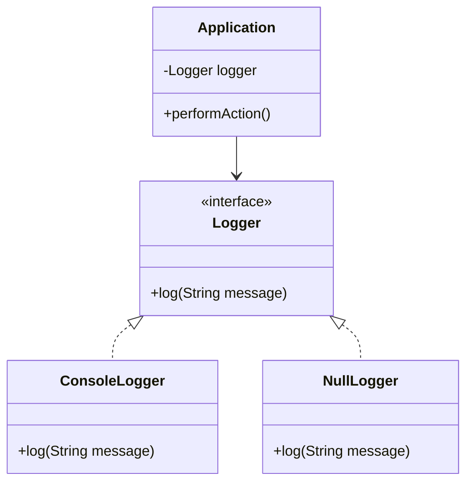
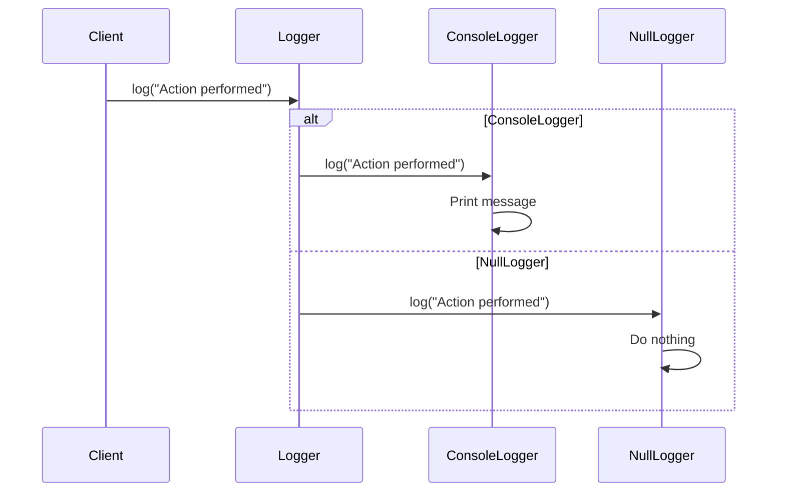

## 5.15 Null Object Pattern

In the realm of software development, dealing with null references is a common challenge that can lead to unexpected errors and increased complexity in code. The Null Object Pattern offers a solution by providing a default behavior in place of null references. This pattern is particularly useful in object-oriented programming, where it promotes polymorphism and cleaner code.

### Understanding the Null Object Pattern

The Null Object Pattern is a behavioral design pattern that uses a special object to represent the absence of an object. Instead of returning a null reference, which requires additional checks and can lead to `NullPointerException` errors, a null object provides a default, do-nothing behavior. This approach simplifies code and reduces the need for null checks, making the codebase more robust and easier to maintain.

#### Intent of the Null Object Pattern

The primary intent of the Null Object Pattern is to encapsulate the absence of an object with a special object that adheres to the expected interface but performs no operation. This pattern allows client code to operate on the null object without needing to check for null references, thus promoting a cleaner and more consistent design.

### The Problem It Solves

Null references are a notorious source of errors in software development. They require explicit checks and can lead to runtime exceptions if not handled correctly. By using the Null Object Pattern, developers can eliminate these checks and provide a default behavior, reducing the risk of errors and simplifying the code.

#### Avoiding Null Reference Checks

Consider a scenario where a method returns an object that might be null. The client code must check for null before invoking any methods on the returned object. This leads to repetitive and error-prone code:

```java
Customer customer = customerRepository.findCustomerById(id);
if (customer != null) {
    customer.sendPromotion();
}
```

With the Null Object Pattern, the `findCustomerById` method can return a null object that implements the `Customer` interface, allowing the client code to call `sendPromotion` without null checks:

```java
Customer customer = customerRepository.findCustomerById(id);
customer.sendPromotion();
```

### Promoting Polymorphism

The Null Object Pattern leverages polymorphism by ensuring that the null object conforms to the same interface as the real object. This allows the client code to treat the null object and real objects uniformly, adhering to the object-oriented principle of polymorphism.

#### Implementing the Null Object Pattern in Java

To implement the Null Object Pattern in Java, follow these steps:

1. **Define an Interface**: Create an interface that defines the methods expected by the client code.
2. **Implement Real Classes**: Create concrete classes that implement the interface and provide actual behavior.
3. **Create a Null Object Class**: Implement a class that adheres to the interface but provides default, do-nothing behavior.
4. **Modify Client Code**: Ensure the client code interacts with the interface, allowing it to work seamlessly with both real and null objects.

#### Example: Null Object Pattern in Action

Let's consider an example of a logging system where we want to avoid null checks for a logger object.

**Step 1: Define the Interface**

```java
public interface Logger {
    void log(String message);
}
```

**Step 2: Implement Real Logger**

```java
public class ConsoleLogger implements Logger {
    @Override
    public void log(String message) {
        System.out.println("Log: " + message);
    }
}
```

**Step 3: Create a Null Logger**

```java
public class NullLogger implements Logger {
    @Override
    public void log(String message) {
        // Do nothing
    }
}
```

**Step 4: Modify Client Code**

```java
public class Application {
    private Logger logger;

    public Application(Logger logger) {
        this.logger = logger;
    }

    public void performAction() {
        logger.log("Action performed");
        // Perform other actions
    }
}
```

**Usage**

```java
public class Main {
    public static void main(String[] args) {
        Logger logger = new ConsoleLogger(); // or new NullLogger()
        Application app = new Application(logger);
        app.performAction();
    }
}
```

### UML Diagram for the Null Object Pattern

To better understand the structure of the Null Object Pattern, let's visualize it using a UML class diagram.



In this diagram, the `Logger` interface defines the contract for logging. Both `ConsoleLogger` and `NullLogger` implement this interface, allowing the `Application` class to interact with either without needing to check for null.

### Benefits of the Null Object Pattern

The Null Object Pattern offers several benefits that enhance code quality and maintainability:

- **Eliminates Null Checks**: By using a null object, you eliminate the need for null checks, reducing code complexity and potential errors.
- **Promotes Polymorphism**: The pattern ensures that null objects conform to the same interface as real objects, promoting polymorphism and consistent code design.
- **Simplifies Client Code**: Client code becomes simpler and more readable, as it no longer needs to handle null references explicitly.
- **Enhances Maintainability**: With fewer conditional statements and a more uniform codebase, maintaining and extending the code becomes easier.

### Try It Yourself: Experiment with the Null Object Pattern

To solidify your understanding of the Null Object Pattern, try modifying the example code. Here are a few suggestions:

1. **Add More Methods**: Extend the `Logger` interface with additional methods, such as `logError` or `logWarning`, and implement them in both `ConsoleLogger` and `NullLogger`.
2. **Create a FileLogger**: Implement a `FileLogger` class that writes logs to a file. Ensure it adheres to the `Logger` interface.
3. **Switch Loggers Dynamically**: Modify the `Application` class to switch between different logger implementations at runtime based on a configuration setting.

### Visualizing the Null Object Pattern in Action

Let's visualize how the Null Object Pattern operates within a system using a sequence diagram.



In this sequence diagram, the client sends a log request to the `Logger`. Depending on the actual implementation (`ConsoleLogger` or `NullLogger`), the message is either logged to the console or ignored.

### Knowledge Check: Reinforce Your Understanding

1. **What is the primary intent of the Null Object Pattern?**
   - To provide a default behavior in place of null references, eliminating the need for null checks.

2. **How does the Null Object Pattern promote polymorphism?**
   - By ensuring that null objects conform to the same interface as real objects, allowing them to be used interchangeably.

3. **What are the key steps in implementing the Null Object Pattern?**
   - Define an interface, implement real classes, create a null object class, and modify client code to interact with the interface.

### Embrace the Journey

As you explore the Null Object Pattern, remember that this is just one of many design patterns that can enhance your code's robustness and maintainability. Keep experimenting, stay curious, and enjoy the journey of becoming a more proficient software engineer.

### References and Further Reading

- [Design Patterns: Elements of Reusable Object-Oriented Software](https://en.wikipedia.org/wiki/Design_Patterns) by Erich Gamma, Richard Helm, Ralph Johnson, and John Vlissides.
- [Java Design Patterns](https://www.journaldev.com/1827/java-design-patterns-example-tutorial) - JournalDev
- [Null Object Pattern on Refactoring Guru](https://refactoring.guru/design-patterns/null-object)

## Quiz Time!



### What is the primary intent of the Null Object Pattern?

- [x] To provide a default behavior in place of null references
- [ ] To enhance performance by reducing object creation
- [ ] To simplify the creation of complex objects
- [ ] To manage object lifecycle and memory

> **Explanation:** The Null Object Pattern aims to provide a default behavior instead of using null references, eliminating the need for null checks.

### How does the Null Object Pattern promote polymorphism?

- [x] By ensuring null objects conform to the same interface as real objects
- [ ] By using inheritance to extend the functionality of objects
- [ ] By allowing dynamic method dispatch
- [ ] By implementing multiple interfaces

> **Explanation:** The Null Object Pattern promotes polymorphism by ensuring that null objects adhere to the same interface as real objects, allowing them to be used interchangeably.

### Which of the following is NOT a benefit of the Null Object Pattern?

- [ ] Eliminates null checks
- [ ] Promotes polymorphism
- [x] Increases code complexity
- [ ] Simplifies client code

> **Explanation:** The Null Object Pattern simplifies code by eliminating null checks and promoting polymorphism, thus reducing complexity.

### In the Null Object Pattern, what does the null object do?

- [x] Provides a default, do-nothing behavior
- [ ] Throws an exception when accessed
- [ ] Logs a warning message
- [ ] Returns a default value

> **Explanation:** The null object provides a default, do-nothing behavior, allowing the client code to operate without null checks.

### What is a common use case for the Null Object Pattern?

- [x] Logging systems
- [ ] Database connections
- [ ] Network protocols
- [ ] User authentication

> **Explanation:** Logging systems often use the Null Object Pattern to avoid null checks when a logger is not available.

### Which class in the UML diagram represents the null object?

- [ ] Logger
- [ ] ConsoleLogger
- [x] NullLogger
- [ ] Application

> **Explanation:** The `NullLogger` class in the UML diagram represents the null object, providing a default behavior.

### What is the role of the Logger interface in the Null Object Pattern?

- [x] It defines the contract for logging behavior
- [ ] It manages the lifecycle of loggers
- [ ] It provides default logging behavior
- [ ] It stores log messages

> **Explanation:** The `Logger` interface defines the contract for logging behavior, which both real and null loggers implement.

### How can you switch between different logger implementations at runtime?

- [x] By modifying the Application class to use a configuration setting
- [ ] By using reflection to change class definitions
- [ ] By recompiling the application with different logger classes
- [ ] By using a factory pattern to create loggers

> **Explanation:** You can switch between different logger implementations at runtime by modifying the `Application` class to use a configuration setting.

### What is a potential downside of not using the Null Object Pattern?

- [x] Increased risk of NullPointerException
- [ ] Reduced performance due to object creation
- [ ] Increased memory usage
- [ ] Difficulty in implementing polymorphism

> **Explanation:** Not using the Null Object Pattern can lead to an increased risk of `NullPointerException` due to unchecked null references.

### True or False: The Null Object Pattern can be used to enhance performance by reducing the need for object creation.

- [ ] True
- [x] False

> **Explanation:** The Null Object Pattern is not primarily focused on enhancing performance through reduced object creation; it aims to provide default behavior and eliminate null checks.


