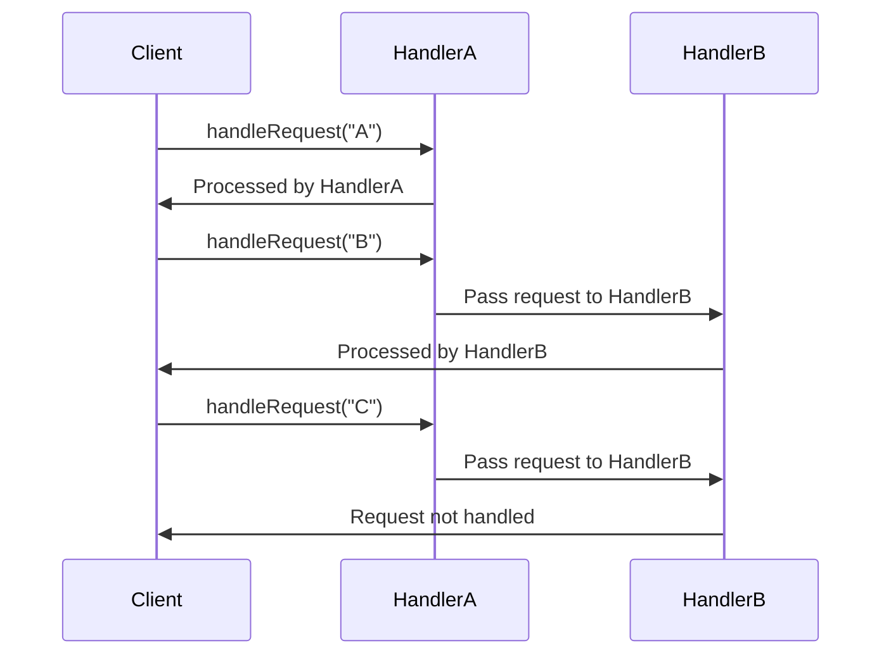

## 5.2.1 Implementing Chain of Responsibility in Java

In this section, we delve into the Chain of Responsibility pattern, a behavioral design pattern that allows an object to pass a request along a chain of potential handlers until one of them handles the request. This pattern promotes loose coupling in your code by allowing multiple objects to handle a request without the sender needing to know which object will handle it.

### Understanding the Chain of Responsibility Pattern

The Chain of Responsibility pattern is particularly useful when you have multiple handlers that can process a request, but you don't want to hard-code the handler logic into the request sender. Instead, you create a chain of handler objects, and each handler decides whether to process the request or pass it along to the next handler in the chain.

#### Key Components

1. **Handler Interface**: Defines an interface for handling requests. It typically includes a method for processing requests and a method for setting the next handler in the chain.
2. **Concrete Handler**: Implements the handler interface and processes requests it is responsible for. It can also pass the request to the next handler in the chain.
3. **Client**: Initiates the request and sends it to the first handler in the chain.

### Step-by-Step Implementation in Java

Let's walk through the process of implementing the Chain of Responsibility pattern in Java with a practical example.

#### Step 1: Define the Handler Interface

First, we define an interface that declares a method for processing requests and a method to set the next handler.

```java
public interface Handler {
    void setNextHandler(Handler handler);
    void handleRequest(String request);
}
```

#### Step 2: Create Concrete Handlers

Next, we create concrete handler classes that implement the `Handler` interface. Each handler will decide whether to process the request or pass it to the next handler.

```java
public class ConcreteHandlerA implements Handler {
    private Handler nextHandler;

    @Override
    public void setNextHandler(Handler handler) {
        this.nextHandler = handler;
    }

    @Override
    public void handleRequest(String request) {
        if (request.equals("A")) {
            System.out.println("ConcreteHandlerA handled the request.");
        } else if (nextHandler != null) {
            nextHandler.handleRequest(request);
        }
    }
}

public class ConcreteHandlerB implements Handler {
    private Handler nextHandler;

    @Override
    public void setNextHandler(Handler handler) {
        this.nextHandler = handler;
    }

    @Override
    public void handleRequest(String request) {
        if (request.equals("B")) {
            System.out.println("ConcreteHandlerB handled the request.");
        } else if (nextHandler != null) {
            nextHandler.handleRequest(request);
        }
    }
}
```

#### Step 3: Set Up the Chain

Now, let's set up the chain of handlers. We'll create a client that initializes the chain and sends requests.

```java
public class Client {
    public static void main(String[] args) {
        // Create handlers
        Handler handlerA = new ConcreteHandlerA();
        Handler handlerB = new ConcreteHandlerB();

        // Set up the chain
        handlerA.setNextHandler(handlerB);

        // Send requests
        handlerA.handleRequest("A");
        handlerA.handleRequest("B");
        handlerA.handleRequest("C");
    }
}
```

### How It Works

- **Handler Interface**: The `Handler` interface defines methods for setting the next handler and processing requests.
- **Concrete Handlers**: `ConcreteHandlerA` and `ConcreteHandlerB` implement the `Handler` interface. Each handler checks if it can process the request. If not, it passes the request to the next handler.
- **Client**: The client sets up the chain by linking handlers and sends requests to the first handler in the chain.

### Best Practices for Implementing the Chain of Responsibility

1. **Chain Order**: Carefully determine the order of handlers in the chain as it affects the processing logic.
2. **Null Checks**: Always check if the next handler is null before passing the request to avoid `NullPointerException`.
3. **Extensibility**: Design handlers to be easily extendable, allowing new handlers to be added without modifying existing code.
4. **Responsibility Separation**: Ensure each handler has a single responsibility to maintain clarity and simplicity.

### Visualizing the Chain of Responsibility

To better understand the flow of requests through the chain, let's visualize the process using a sequence diagram.



### Try It Yourself

To deepen your understanding, try modifying the code to include additional handlers. For example, create a `ConcreteHandlerC` that handles requests with the value "C". Experiment with different chain configurations and observe how requests are processed.

### References and Further Reading

- [Chain of Responsibility Pattern - Wikipedia](https://en.wikipedia.org/wiki/Chain-of-responsibility_pattern)
- [Java Design Patterns - Chain of Responsibility](https://www.journaldev.com/1617/chain-of-responsibility-design-pattern-in-java)

### Knowledge Check

- What is the primary purpose of the Chain of Responsibility pattern?
- How do you ensure that a request is passed to the next handler in the chain?
- What are the benefits of using the Chain of Responsibility pattern in software design?

### Embrace the Journey

Remember, mastering design patterns is a journey. As you continue to explore and implement different patterns, you'll gain a deeper understanding of how to write flexible and maintainable code. Keep experimenting, stay curious, and enjoy the process!

## Quiz Time!



### What is the primary purpose of the Chain of Responsibility pattern?

- [x] To allow multiple objects to handle a request without the sender knowing which object will handle it.
- [ ] To ensure that only one object handles a request.
- [ ] To hard-code the handler logic into the request sender.
- [ ] To create a single handler for all requests.

> **Explanation:** The Chain of Responsibility pattern allows multiple objects to handle a request without the sender needing to know which object will handle it.

### How do you ensure that a request is passed to the next handler in the chain?

- [x] By checking if the next handler is not null and then calling its handleRequest method.
- [ ] By directly calling the next handler's handleRequest method without any checks.
- [ ] By using a global variable to track the next handler.
- [ ] By hard-coding the next handler in the client code.

> **Explanation:** Before passing the request to the next handler, it's important to check if the next handler is not null to avoid `NullPointerException`.

### What is a key benefit of using the Chain of Responsibility pattern?

- [x] It promotes loose coupling between request senders and handlers.
- [ ] It ensures that all requests are handled by a single handler.
- [ ] It simplifies the request handling process by using a single handler.
- [ ] It requires the sender to know the exact handler for each request.

> **Explanation:** The Chain of Responsibility pattern promotes loose coupling by allowing requests to be handled by multiple handlers without the sender knowing which handler will process it.

### Which component in the Chain of Responsibility pattern initiates the request?

- [x] Client
- [ ] Handler Interface
- [ ] Concrete Handler
- [ ] Next Handler

> **Explanation:** The client is responsible for initiating the request and sending it to the first handler in the chain.

### What should you do to avoid `NullPointerException` when passing requests in the chain?

- [x] Check if the next handler is not null before passing the request.
- [ ] Always pass the request without any checks.
- [ ] Use a try-catch block to handle exceptions.
- [ ] Initialize all handlers to avoid null values.

> **Explanation:** To avoid `NullPointerException`, always check if the next handler is not null before passing the request.

### What is the role of the Handler Interface in the Chain of Responsibility pattern?

- [x] It defines methods for setting the next handler and processing requests.
- [ ] It processes all requests directly.
- [ ] It initializes the chain of handlers.
- [ ] It acts as the client in the pattern.

> **Explanation:** The Handler Interface defines the methods for setting the next handler and processing requests, which concrete handlers implement.

### How can you extend the Chain of Responsibility pattern?

- [x] By adding new concrete handlers without modifying existing code.
- [ ] By modifying existing handlers to handle more requests.
- [ ] By hard-coding new handlers in the client code.
- [ ] By using a single handler for all new requests.

> **Explanation:** The pattern is easily extendable by adding new concrete handlers without modifying existing code, promoting flexibility.

### What is the effect of the order of handlers in the chain?

- [x] It affects the processing logic and the order in which requests are handled.
- [ ] It has no effect on request processing.
- [ ] It determines the number of requests that can be handled.
- [ ] It ensures that all requests are handled by the first handler.

> **Explanation:** The order of handlers in the chain affects the processing logic and determines the sequence in which requests are handled.

### What is a common use case for the Chain of Responsibility pattern?

- [x] Logging systems
- [ ] Single-threaded applications
- [ ] Database connections
- [ ] User interface design

> **Explanation:** A common use case for the Chain of Responsibility pattern is logging systems, where different log levels can be handled by different handlers.

### True or False: The Chain of Responsibility pattern requires the sender to know the exact handler for each request.

- [ ] True
- [x] False

> **Explanation:** False. The Chain of Responsibility pattern allows requests to be handled by multiple handlers without the sender needing to know which handler will process it.


