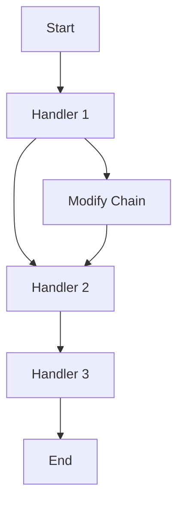
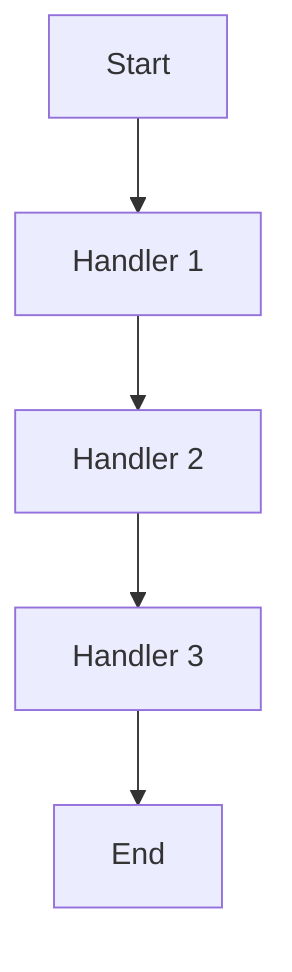

## 5.2.2 Dynamic vs. Static Chains

In the realm of software design patterns, the Chain of Responsibility pattern stands out as a powerful tool for decoupling senders and receivers of requests. This pattern allows multiple objects to handle a request without the sender needing to know which object will handle it. In Java, this pattern can be implemented using either dynamic or static chains. Understanding the differences between these two approaches is crucial for expert developers seeking to optimize their code for flexibility, maintainability, and performance.

### Understanding Dynamic and Static Chains

Before diving into the specifics of dynamic and static chains, let's briefly revisit the Chain of Responsibility pattern. This pattern involves a chain of handler objects, each capable of processing a request or passing it along to the next handler in the chain. The pattern is particularly useful when multiple handlers can process a request, or when the handler that processes a request is determined at runtime.

#### Dynamic Chains

Dynamic chains are configured at runtime, meaning the sequence of handlers can be modified as the program executes. This approach provides flexibility, allowing the system to adapt to changing conditions or requirements. Dynamic chains are particularly useful in scenarios where the set of handlers is not known at compile time or can change during the application's lifecycle.

**Advantages of Dynamic Chains:**

- **Flexibility:** Handlers can be added, removed, or reordered at runtime, allowing the system to adapt to new requirements or conditions.
- **Extensibility:** New handlers can be introduced without modifying existing code, facilitating easier maintenance and updates.
- **Runtime Configuration:** Dynamic chains can be configured based on runtime data, enabling more responsive and adaptable systems.

**Disadvantages of Dynamic Chains:**

- **Complexity:** Managing dynamic chains can introduce additional complexity, as the system must handle the configuration and reconfiguration of handlers.
- **Performance Overhead:** The flexibility of dynamic chains can come at the cost of performance, as the system may need to evaluate conditions or configurations at runtime.

#### Static Chains

Static chains, on the other hand, are configured at compile time. The sequence of handlers is fixed and cannot be changed during the execution of the program. This approach is suitable for scenarios where the set of handlers is known in advance and is unlikely to change.

**Advantages of Static Chains:**

- **Simplicity:** Static chains are easier to implement and understand, as the sequence of handlers is fixed and predictable.
- **Performance:** With a fixed configuration, static chains can offer better performance, as there is no need for runtime evaluation or configuration.
- **Reliability:** The fixed nature of static chains can lead to more reliable systems, as the behavior is consistent and predictable.

**Disadvantages of Static Chains:**

- **Inflexibility:** Static chains lack the flexibility to adapt to changing conditions or requirements, as the sequence of handlers is fixed.
- **Limited Extensibility:** Introducing new handlers or modifying the sequence requires changes to the code, which can be cumbersome and error-prone.

### Implementing Dynamic Chains in Java

Let's explore how to implement dynamic chains in Java using the Chain of Responsibility pattern. We'll create a simple logging system where different handlers process log messages based on their severity.

```java
// Define the Handler interface
interface LogHandler {
    void setNextHandler(LogHandler nextHandler);
    void handleRequest(LogMessage logMessage);
}

// Concrete handler for INFO level logs
class InfoLogHandler implements LogHandler {
    private LogHandler nextHandler;

    @Override
    public void setNextHandler(LogHandler nextHandler) {
        this.nextHandler = nextHandler;
    }

    @Override
    public void handleRequest(LogMessage logMessage) {
        if (logMessage.getSeverity() == LogSeverity.INFO) {
            System.out.println("INFO: " + logMessage.getMessage());
        } else if (nextHandler != null) {
            nextHandler.handleRequest(logMessage);
        }
    }
}

// Concrete handler for ERROR level logs
class ErrorLogHandler implements LogHandler {
    private LogHandler nextHandler;

    @Override
    public void setNextHandler(LogHandler nextHandler) {
        this.nextHandler = nextHandler;
    }

    @Override
    public void handleRequest(LogMessage logMessage) {
        if (logMessage.getSeverity() == LogSeverity.ERROR) {
            System.out.println("ERROR: " + logMessage.getMessage());
        } else if (nextHandler != null) {
            nextHandler.handleRequest(logMessage);
        }
    }
}

// Log message class
class LogMessage {
    private final String message;
    private final LogSeverity severity;

    public LogMessage(String message, LogSeverity severity) {
        this.message = message;
        this.severity = severity;
    }

    public String getMessage() {
        return message;
    }

    public LogSeverity getSeverity() {
        return severity;
    }
}

// Enum for log severity levels
enum LogSeverity {
    INFO, ERROR
}

// Main class to demonstrate dynamic chain configuration
public class DynamicChainDemo {
    public static void main(String[] args) {
        // Create handlers
        LogHandler infoHandler = new InfoLogHandler();
        LogHandler errorHandler = new ErrorLogHandler();

        // Configure chain dynamically
        infoHandler.setNextHandler(errorHandler);

        // Create log messages
        LogMessage infoLog = new LogMessage("This is an info message.", LogSeverity.INFO);
        LogMessage errorLog = new LogMessage("This is an error message.", LogSeverity.ERROR);

        // Process log messages
        infoHandler.handleRequest(infoLog);
        infoHandler.handleRequest(errorLog);
    }
}
```

In this example, we define a `LogHandler` interface with methods to set the next handler and handle requests. We then create concrete handlers for different log levels (`InfoLogHandler` and `ErrorLogHandler`). The chain is configured dynamically by setting the next handler at runtime.

### Implementing Static Chains in Java

Now, let's explore how to implement static chains in Java. We'll use the same logging system example but configure the chain at compile time.

```java
// Concrete handler for DEBUG level logs
class DebugLogHandler implements LogHandler {
    private LogHandler nextHandler;

    @Override
    public void setNextHandler(LogHandler nextHandler) {
        this.nextHandler = nextHandler;
    }

    @Override
    public void handleRequest(LogMessage logMessage) {
        if (logMessage.getSeverity() == LogSeverity.DEBUG) {
            System.out.println("DEBUG: " + logMessage.getMessage());
        } else if (nextHandler != null) {
            nextHandler.handleRequest(logMessage);
        }
    }
}

// Main class to demonstrate static chain configuration
public class StaticChainDemo {
    public static void main(String[] args) {
        // Create handlers
        LogHandler debugHandler = new DebugLogHandler();
        LogHandler infoHandler = new InfoLogHandler();
        LogHandler errorHandler = new ErrorLogHandler();

        // Configure chain statically
        debugHandler.setNextHandler(infoHandler);
        infoHandler.setNextHandler(errorHandler);

        // Create log messages
        LogMessage debugLog = new LogMessage("This is a debug message.", LogSeverity.DEBUG);
        LogMessage infoLog = new LogMessage("This is an info message.", LogSeverity.INFO);
        LogMessage errorLog = new LogMessage("This is an error message.", LogSeverity.ERROR);

        // Process log messages
        debugHandler.handleRequest(debugLog);
        debugHandler.handleRequest(infoLog);
        debugHandler.handleRequest(errorLog);
    }
}
```

In this static chain implementation, we introduce a `DebugLogHandler` and configure the chain at compile time. The sequence of handlers is fixed, and each handler is responsible for processing specific log levels.

### Comparing Dynamic and Static Chains

When choosing between dynamic and static chains, consider the following factors:

- **Flexibility vs. Simplicity:** Dynamic chains offer flexibility but at the cost of increased complexity. Static chains are simpler but less adaptable.
- **Performance:** Static chains may provide better performance due to their fixed configuration, while dynamic chains may incur runtime overhead.
- **Extensibility:** Dynamic chains are more extensible, allowing new handlers to be added without modifying existing code.
- **Use Cases:** Dynamic chains are suitable for systems that require runtime adaptability, such as plugins or user-configurable workflows. Static chains are ideal for systems with well-defined, unchanging processes.

### Scenarios and Use Cases

#### When to Use Dynamic Chains

- **User-Configurable Workflows:** Systems that allow users to define or modify workflows at runtime benefit from dynamic chains.
- **Plugin Architectures:** Applications that support plugins or extensions can use dynamic chains to integrate new functionality seamlessly.
- **Adaptive Systems:** Systems that need to adapt to changing conditions, such as load balancers or routing systems, can leverage dynamic chains for flexibility.

#### When to Use Static Chains

- **Fixed Processes:** Systems with well-defined, unchanging processes, such as data validation pipelines, can use static chains for simplicity and reliability.
- **Performance-Critical Applications:** Applications where performance is a priority may benefit from the predictability and efficiency of static chains.
- **Legacy Systems:** Systems with legacy codebases that are difficult to modify may prefer static chains to minimize changes.

### Visualizing Dynamic and Static Chains

To better understand the differences between dynamic and static chains, let's visualize their configurations using Mermaid.js diagrams.

#### Dynamic Chain Configuration



**Caption:** In a dynamic chain, handlers can be modified or reordered at runtime, providing flexibility and adaptability.

#### Static Chain Configuration



**Caption:** In a static chain, the sequence of handlers is fixed at compile time, offering simplicity and predictability.

### Try It Yourself

To deepen your understanding of dynamic and static chains, try modifying the code examples provided:

- **Dynamic Chains:** Experiment with adding new handlers or changing the order of existing handlers at runtime. Observe how the system adapts to these changes.
- **Static Chains:** Modify the sequence of handlers in the static chain example. Consider the implications of these changes on the system's behavior and performance.

### Knowledge Check

To reinforce your understanding of dynamic and static chains, consider the following questions:

- What are the key differences between dynamic and static chains in the Chain of Responsibility pattern?
- In what scenarios might a dynamic chain be preferred over a static chain?
- How does the flexibility of dynamic chains impact system performance and complexity?

### Conclusion

Understanding the differences between dynamic and static chains in the Chain of Responsibility pattern is essential for expert Java developers. By carefully considering the advantages and disadvantages of each approach, you can make informed decisions about which configuration best suits your application's needs. Whether you prioritize flexibility or simplicity, the Chain of Responsibility pattern offers a powerful tool for decoupling senders and receivers of requests, enhancing the maintainability and scalability of your code.

## Quiz Time!



### What is a dynamic chain in the context of the Chain of Responsibility pattern?

- [x] A chain configured at runtime
- [ ] A chain configured at compile time
- [ ] A chain with a fixed sequence of handlers
- [ ] A chain that cannot be modified

> **Explanation:** A dynamic chain is configured at runtime, allowing for flexibility and adaptability.

### Which of the following is an advantage of static chains?

- [x] Simplicity
- [ ] Flexibility
- [ ] Extensibility
- [ ] Runtime configuration

> **Explanation:** Static chains are simpler and easier to implement due to their fixed configuration.

### In which scenario might a dynamic chain be preferred?

- [x] User-configurable workflows
- [ ] Fixed processes
- [ ] Performance-critical applications
- [ ] Legacy systems

> **Explanation:** Dynamic chains are suitable for systems that require runtime adaptability, such as user-configurable workflows.

### What is a disadvantage of dynamic chains?

- [x] Increased complexity
- [ ] Inflexibility
- [ ] Limited extensibility
- [ ] Predictability

> **Explanation:** Dynamic chains introduce additional complexity due to their runtime configuration.

### How does a static chain impact performance?

- [x] Offers better performance due to fixed configuration
- [ ] Increases runtime overhead
- [ ] Decreases reliability
- [ ] Enhances flexibility

> **Explanation:** Static chains can offer better performance as there is no need for runtime evaluation or configuration.

### What is a key benefit of dynamic chains?

- [x] Flexibility
- [ ] Simplicity
- [ ] Predictability
- [ ] Fixed configuration

> **Explanation:** Dynamic chains provide flexibility by allowing handlers to be added, removed, or reordered at runtime.

### Which of the following is a disadvantage of static chains?

- [x] Inflexibility
- [ ] Complexity
- [ ] Performance overhead
- [ ] Runtime adaptability

> **Explanation:** Static chains lack the flexibility to adapt to changing conditions or requirements.

### What is a common use case for static chains?

- [x] Fixed processes
- [ ] Adaptive systems
- [ ] Plugin architectures
- [ ] User-configurable workflows

> **Explanation:** Static chains are ideal for systems with well-defined, unchanging processes.

### What is a key difference between dynamic and static chains?

- [x] Dynamic chains are configured at runtime, while static chains are configured at compile time.
- [ ] Static chains are configured at runtime, while dynamic chains are configured at compile time.
- [ ] Both dynamic and static chains are configured at runtime.
- [ ] Both dynamic and static chains are configured at compile time.

> **Explanation:** Dynamic chains are configured at runtime, providing flexibility, whereas static chains are configured at compile time, offering simplicity.

### True or False: Dynamic chains are more extensible than static chains.

- [x] True
- [ ] False

> **Explanation:** Dynamic chains are more extensible as they allow new handlers to be added without modifying existing code.


