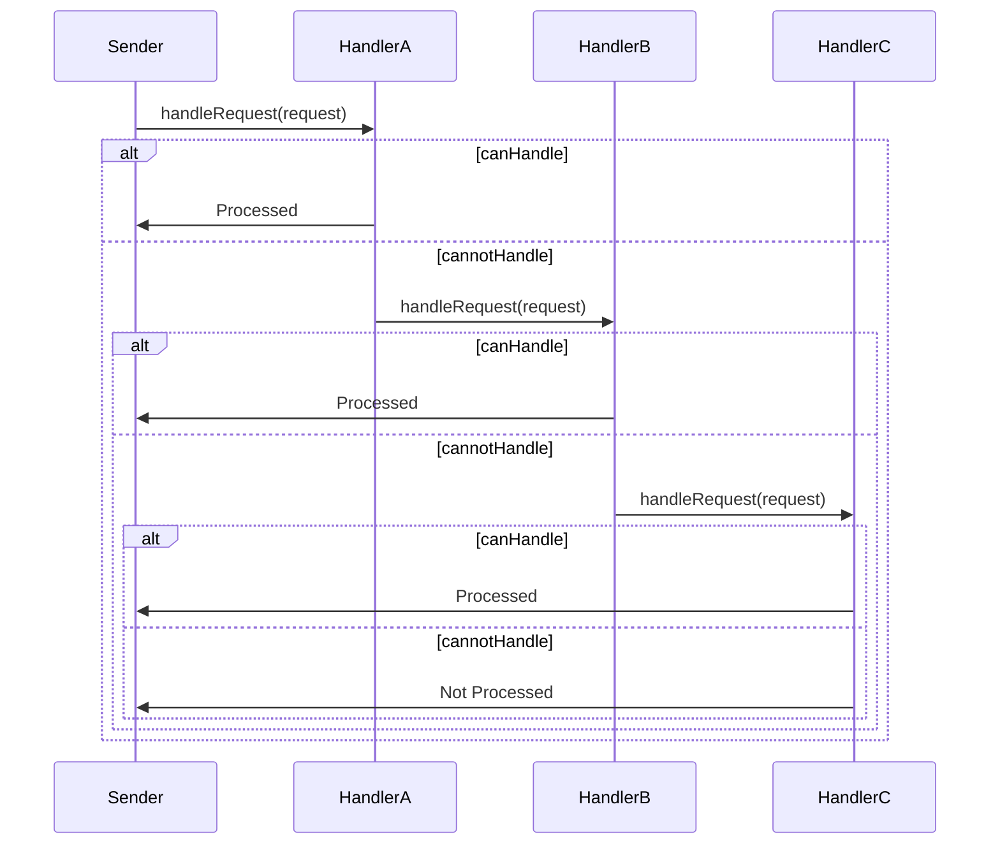

## 5.2.3 Avoiding Coupling Between Senders and Receivers

In the realm of software design, particularly when implementing the Chain of Responsibility pattern, one of the most critical aspects is avoiding tight coupling between request senders and receivers. This decoupling is essential for creating flexible, maintainable, and scalable systems. In this section, we will explore why decoupling is crucial, discuss strategies to achieve it, and provide practical examples to illustrate these concepts.

### Why Decoupling is Important

Decoupling in software design refers to the separation of components so that changes in one component do not necessitate changes in others. In the context of the Chain of Responsibility pattern, decoupling senders from receivers allows for:

- **Flexibility**: New handlers can be added or existing ones modified without affecting the sender.
- **Maintainability**: Easier to manage and update individual components.
- **Scalability**: Systems can grow by adding new handlers without altering the core logic.
- **Reusability**: Handlers can be reused across different parts of the application or even in different projects.

### Design Strategies to Minimize Coupling

To achieve decoupling in the Chain of Responsibility pattern, several design strategies can be employed:

#### 1. Use of Interfaces or Abstract Classes

Interfaces and abstract classes provide a contract that handlers must adhere to, allowing different implementations to be swapped in and out seamlessly.

```java
// Define a common interface for all handlers
public interface Handler {
    void setNextHandler(Handler handler);
    void handleRequest(Request request);
}

// Concrete handler implementing the interface
public class ConcreteHandlerA implements Handler {
    private Handler nextHandler;

    @Override
    public void setNextHandler(Handler handler) {
        this.nextHandler = handler;
    }

    @Override
    public void handleRequest(Request request) {
        if (canHandle(request)) {
            // Handle the request
        } else if (nextHandler != null) {
            nextHandler.handleRequest(request);
        }
    }

    private boolean canHandle(Request request) {
        // Logic to determine if this handler can process the request
        return false;
    }
}
```

#### 2. Use of Abstract Classes

Abstract classes can provide a base implementation for common functionality, reducing code duplication and enforcing a consistent approach across handlers.

```java
public abstract class AbstractHandler implements Handler {
    protected Handler nextHandler;

    @Override
    public void setNextHandler(Handler handler) {
        this.nextHandler = handler;
    }

    protected void passToNext(Request request) {
        if (nextHandler != null) {
            nextHandler.handleRequest(request);
        }
    }
}
```

#### 3. Dependency Injection

Dependency Injection (DI) can be used to inject dependencies into handlers, further decoupling the sender from the receiver by removing the need for the sender to know about the specific handlers.

```java
public class RequestProcessor {
    private final Handler initialHandler;

    // Constructor injection
    public RequestProcessor(Handler initialHandler) {
        this.initialHandler = initialHandler;
    }

    public void process(Request request) {
        initialHandler.handleRequest(request);
    }
}
```

#### 4. Configuration-Based Chains

Using configuration files or dependency injection frameworks (like Spring) to define the chain of handlers can decouple the chain configuration from the code, allowing changes without recompilation.

```xml
<!-- Spring configuration example -->
<bean id="handlerA" class="com.example.ConcreteHandlerA"/>
<bean id="handlerB" class="com.example.ConcreteHandlerB">
    <property name="nextHandler" ref="handlerC"/>
</bean>
<bean id="handlerC" class="com.example.ConcreteHandlerC"/>
```

### Examples of Decoupled Sender and Receiver Interactions

Let's explore a practical example where we decouple the sender and receiver using the Chain of Responsibility pattern.

#### Example: Logging System

Imagine a logging system where different log levels (INFO, DEBUG, ERROR) are handled by different handlers. Each handler decides whether to process the log message or pass it to the next handler.

```java
// Request class representing a log message
public class LogRequest {
    private String message;
    private LogLevel level;

    public LogRequest(String message, LogLevel level) {
        this.message = message;
        this.level = level;
    }

    public String getMessage() {
        return message;
    }

    public LogLevel getLevel() {
        return level;
    }
}

// Enum for log levels
public enum LogLevel {
    INFO, DEBUG, ERROR
}

// Concrete handler for INFO level
public class InfoLogHandler extends AbstractHandler {
    @Override
    public void handleRequest(LogRequest request) {
        if (request.getLevel() == LogLevel.INFO) {
            System.out.println("INFO: " + request.getMessage());
        } else {
            passToNext(request);
        }
    }
}

// Concrete handler for DEBUG level
public class DebugLogHandler extends AbstractHandler {
    @Override
    public void handleRequest(LogRequest request) {
        if (request.getLevel() == LogLevel.DEBUG) {
            System.out.println("DEBUG: " + request.getMessage());
        } else {
            passToNext(request);
        }
    }
}

// Concrete handler for ERROR level
public class ErrorLogHandler extends AbstractHandler {
    @Override
    public void handleRequest(LogRequest request) {
        if (request.getLevel() == LogLevel.ERROR) {
            System.out.println("ERROR: " + request.getMessage());
        } else {
            passToNext(request);
        }
    }
}
```

#### Setting Up the Chain

```java
public class Logger {
    private Handler handlerChain;

    public Logger() {
        // Create handlers
        Handler infoHandler = new InfoLogHandler();
        Handler debugHandler = new DebugLogHandler();
        Handler errorHandler = new ErrorLogHandler();

        // Set up the chain
        infoHandler.setNextHandler(debugHandler);
        debugHandler.setNextHandler(errorHandler);

        this.handlerChain = infoHandler;
    }

    public void log(String message, LogLevel level) {
        handlerChain.handleRequest(new LogRequest(message, level));
    }
}
```

#### Using the Logger

```java
public class Application {
    public static void main(String[] args) {
        Logger logger = new Logger();

        logger.log("This is an info message.", LogLevel.INFO);
        logger.log("This is a debug message.", LogLevel.DEBUG);
        logger.log("This is an error message.", LogLevel.ERROR);
    }
}
```

### How Decoupling Facilitates Easier Addition or Modification of Handlers

Decoupling senders and receivers in the Chain of Responsibility pattern allows for seamless addition or modification of handlers. Here's how:

- **Adding New Handlers**: New handlers can be introduced without altering existing handlers or the sender. Simply create a new handler class and insert it into the chain.
- **Modifying Existing Handlers**: Changes to a handler's logic do not affect other handlers or the sender, as long as the interface contract is maintained.
- **Reordering Handlers**: Handlers can be reordered by changing the chain setup, without modifying the handler implementations.
- **Removing Handlers**: A handler can be removed from the chain without impacting the rest of the system.

### Visualizing the Chain of Responsibility

To better understand the flow of requests through the chain, let's visualize the process using a sequence diagram.



### Try It Yourself

To deepen your understanding, try modifying the example code:

1. **Add a new log level**: Create a new handler for a `WARN` log level and integrate it into the chain.
2. **Change the order of handlers**: Experiment with different orders of handlers and observe the behavior.
3. **Implement a fallback handler**: Add a handler that processes requests not handled by any other handler.

### Knowledge Check

- Why is decoupling important in the Chain of Responsibility pattern?
- How can interfaces help in minimizing coupling between senders and receivers?
- What are the benefits of using configuration-based chains?

### Embrace the Journey

Remember, mastering design patterns is a journey. As you experiment with these concepts, you'll gain a deeper understanding of how to build flexible and maintainable systems. Keep exploring, stay curious, and enjoy the process!

## Quiz Time!



### Why is decoupling important in the Chain of Responsibility pattern?

- [x] It enhances flexibility, maintainability, and scalability.
- [ ] It makes the code more complex and harder to understand.
- [ ] It reduces the number of classes needed in the system.
- [ ] It ensures that every request is handled by multiple handlers.

> **Explanation:** Decoupling is crucial because it allows for easier addition, modification, and removal of handlers, enhancing the system's flexibility, maintainability, and scalability.

### What is one way to minimize coupling between senders and receivers?

- [x] Use interfaces or abstract classes.
- [ ] Use global variables to share data.
- [ ] Hard-code the chain of handlers.
- [ ] Avoid using any design patterns.

> **Explanation:** Using interfaces or abstract classes provides a contract that handlers must adhere to, allowing different implementations to be swapped in and out seamlessly.

### How does dependency injection help in decoupling?

- [x] It injects dependencies into handlers, removing the need for the sender to know about specific handlers.
- [ ] It makes the sender directly responsible for creating handlers.
- [ ] It increases the coupling between sender and receiver.
- [ ] It eliminates the need for handlers altogether.

> **Explanation:** Dependency injection helps decouple the sender from the receiver by removing the need for the sender to know about specific handlers, thus promoting flexibility.

### What is a benefit of using configuration-based chains?

- [x] Chains can be changed without recompilation.
- [ ] Chains become more rigid and harder to modify.
- [ ] It eliminates the need for handlers.
- [ ] It reduces the number of classes in the system.

> **Explanation:** Configuration-based chains allow the chain configuration to be changed without recompilation, enhancing flexibility and maintainability.

### What happens when a handler cannot process a request?

- [x] It passes the request to the next handler in the chain.
- [ ] It stops the processing of the request.
- [ ] It throws an exception.
- [ ] It modifies the request and tries again.

> **Explanation:** If a handler cannot process a request, it typically passes the request to the next handler in the chain, allowing for a flexible processing flow.

### Which of the following is a correct statement about handlers in the Chain of Responsibility?

- [x] Handlers can be reordered without modifying their implementations.
- [ ] Handlers must always be processed in the order they are created.
- [ ] Handlers cannot be removed once added.
- [ ] Handlers must be aware of the sender's implementation.

> **Explanation:** Handlers can be reordered by changing the chain setup, without modifying the handler implementations, providing flexibility in processing.

### How does using abstract classes help in minimizing coupling?

- [x] They provide a base implementation for common functionality, reducing code duplication.
- [ ] They make the code more complex and harder to understand.
- [ ] They eliminate the need for interfaces.
- [ ] They force all handlers to have the same implementation.

> **Explanation:** Abstract classes provide a base implementation for common functionality, reducing code duplication and enforcing a consistent approach across handlers.

### What is the role of a fallback handler?

- [x] To process requests not handled by any other handler.
- [ ] To handle all requests before passing them to other handlers.
- [ ] To modify the request before processing.
- [ ] To log all requests regardless of processing.

> **Explanation:** A fallback handler is designed to process requests that are not handled by any other handler in the chain, ensuring that no request goes unprocessed.

### Can handlers be reused across different parts of the application?

- [x] True
- [ ] False

> **Explanation:** Handlers can be reused across different parts of the application or even in different projects, enhancing reusability and maintainability.

### Is it possible to add new handlers without altering existing ones?

- [x] True
- [ ] False

> **Explanation:** New handlers can be added without altering existing ones, as long as they adhere to the interface or abstract class contract, promoting flexibility.


