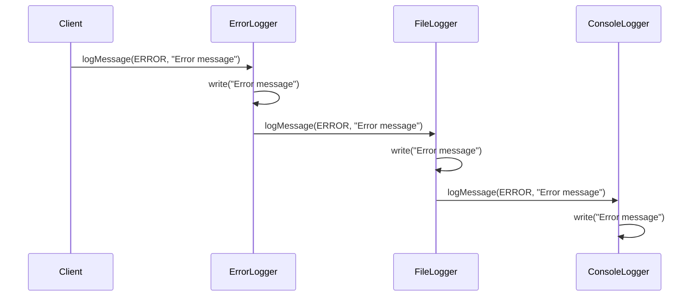

## 5.2.4 Use Cases and Examples

The Chain of Responsibility pattern is a powerful tool in the software engineer's toolkit, allowing for the decoupling of request senders and receivers. This pattern is particularly useful in scenarios where multiple objects might handle a request, but the handler is not explicitly specified. Let's delve into some practical use cases and examples to understand how this pattern can be effectively employed.

### Real-World Use Cases

#### 1. Logging Systems

Logging is a critical aspect of software development, providing insights into application behavior and aiding in debugging. The Chain of Responsibility pattern is often used in logging frameworks to manage log messages of varying severity levels. 

##### How Logging Frameworks Use This Pattern

In a logging system, different log levels (e.g., DEBUG, INFO, WARN, ERROR) might require different handling. For instance, DEBUG messages might be written to a file, while ERROR messages might be sent to a monitoring system. By using the Chain of Responsibility pattern, we can create a chain of log handlers, each responsible for a specific level of logging.

**Code Example: Logging System**

```java
abstract class Logger {
    public static int DEBUG = 1;
    public static int INFO = 2;
    public static int ERROR = 3;

    protected int level;
    protected Logger nextLogger;

    public void setNextLogger(Logger nextLogger) {
        this.nextLogger = nextLogger;
    }

    public void logMessage(int level, String message) {
        if (this.level <= level) {
            write(message);
        }
        if (nextLogger != null) {
            nextLogger.logMessage(level, message);
        }
    }

    abstract protected void write(String message);
}

class ConsoleLogger extends Logger {
    public ConsoleLogger(int level) {
        this.level = level;
    }

    @Override
    protected void write(String message) {
        System.out.println("Console::Logger: " + message);
    }
}

class ErrorLogger extends Logger {
    public ErrorLogger(int level) {
        this.level = level;
    }

    @Override
    protected void write(String message) {
        System.err.println("Error::Logger: " + message);
    }
}

class FileLogger extends Logger {
    public FileLogger(int level) {
        this.level = level;
    }

    @Override
    protected void write(String message) {
        // Simulate writing to a file
        System.out.println("File::Logger: " + message);
    }
}

// Client code
public class ChainPatternDemo {
    private static Logger getChainOfLoggers() {
        Logger errorLogger = new ErrorLogger(Logger.ERROR);
        Logger fileLogger = new FileLogger(Logger.INFO);
        Logger consoleLogger = new ConsoleLogger(Logger.DEBUG);

        errorLogger.setNextLogger(fileLogger);
        fileLogger.setNextLogger(consoleLogger);

        return errorLogger;
    }

    public static void main(String[] args) {
        Logger loggerChain = getChainOfLoggers();

        loggerChain.logMessage(Logger.DEBUG, "This is a debug message.");
        loggerChain.logMessage(Logger.INFO, "This is an info message.");
        loggerChain.logMessage(Logger.ERROR, "This is an error message.");
    }
}
```

**Explanation:**

- **Logger Class**: An abstract class that defines the structure for logging. It holds a reference to the next logger in the chain.
- **Concrete Loggers**: `ConsoleLogger`, `ErrorLogger`, and `FileLogger` implement the `Logger` class and provide specific logging mechanisms.
- **Chain Setup**: The client code sets up the chain by linking loggers. The `ErrorLogger` is the first in the chain, followed by `FileLogger` and `ConsoleLogger`.
- **Log Message Handling**: Each logger checks if it can handle the message based on the level and passes it to the next logger if necessary.

#### 2. Event Handling Systems

Event handling is another domain where the Chain of Responsibility pattern shines. In graphical user interfaces (GUIs), events such as mouse clicks or keyboard inputs need to be processed by various components. This pattern allows events to be passed along a chain of handlers until one of them processes it.

##### UI Event Propagation Using Chain of Responsibility

In a typical GUI application, events are propagated through a hierarchy of components. Each component in the hierarchy can choose to handle the event or pass it to the next component. This is a natural fit for the Chain of Responsibility pattern.

**Code Example: UI Event Handling**

```java
abstract class UIComponent {
    protected UIComponent nextComponent;

    public void setNextComponent(UIComponent nextComponent) {
        this.nextComponent = nextComponent;
    }

    public void handleEvent(String event) {
        if (canHandleEvent(event)) {
            processEvent(event);
        } else if (nextComponent != null) {
            nextComponent.handleEvent(event);
        }
    }

    protected abstract boolean canHandleEvent(String event);
    protected abstract void processEvent(String event);
}

class Button extends UIComponent {
    @Override
    protected boolean canHandleEvent(String event) {
        return "click".equals(event);
    }

    @Override
    protected void processEvent(String event) {
        System.out.println("Button handled the event: " + event);
    }
}

class TextBox extends UIComponent {
    @Override
    protected boolean canHandleEvent(String event) {
        return "input".equals(event);
    }

    @Override
    protected void processEvent(String event) {
        System.out.println("TextBox handled the event: " + event);
    }
}

// Client code
public class UIEventDemo {
    public static void main(String[] args) {
        UIComponent button = new Button();
        UIComponent textBox = new TextBox();

        button.setNextComponent(textBox);

        button.handleEvent("click");
        button.handleEvent("input");
    }
}
```

**Explanation:**

- **UIComponent Class**: An abstract class that defines the structure for event handling. It holds a reference to the next component in the chain.
- **Concrete Components**: `Button` and `TextBox` implement the `UIComponent` class and provide specific event handling mechanisms.
- **Chain Setup**: The client code sets up the chain by linking components. The `Button` is the first in the chain, followed by `TextBox`.
- **Event Handling**: Each component checks if it can handle the event and processes it if possible. If not, it passes the event to the next component.

### Try It Yourself

Encourage experimentation by suggesting modifications to the code examples. For instance, try adding a new logger or UI component to the chain and observe how it affects the handling of messages or events. This hands-on approach will deepen your understanding of the Chain of Responsibility pattern.

### Visualizing the Chain of Responsibility

To better understand the flow of requests through the chain, let's visualize the process using a sequence diagram.



**Diagram Explanation:**

- The client sends an error message to the `ErrorLogger`.
- The `ErrorLogger` processes the message and passes it to the `FileLogger`.
- The `FileLogger` processes the message and passes it to the `ConsoleLogger`.
- Each logger in the chain processes the message according to its level.

### Additional Use Cases

#### 3. Request Processing in Web Servers

Web servers often use the Chain of Responsibility pattern to process HTTP requests. Different middleware components can handle authentication, logging, and data validation. Each component in the chain can decide whether to process the request or pass it to the next component.

#### 4. Command Execution in Command-Line Interfaces

In command-line interfaces (CLIs), commands can be processed using the Chain of Responsibility pattern. Each command handler in the chain can decide whether to execute the command or pass it to the next handler.

#### 5. Access Control Systems

Access control systems can use this pattern to manage permissions. Each handler in the chain can check if the user has the necessary permissions to perform an action and either grant access or pass the request to the next handler.

### Knowledge Check

Let's reinforce our understanding of the Chain of Responsibility pattern with some questions and exercises.

- **Question**: How does the Chain of Responsibility pattern help in decoupling request senders and receivers?
- **Exercise**: Modify the logging system example to include a `DatabaseLogger` that logs messages to a database. Ensure it is correctly integrated into the chain.
- **Challenge**: Implement a chain of responsibility for a simple command-line application that processes commands like `add`, `remove`, and `list`.

### Summary

The Chain of Responsibility pattern is a versatile design pattern that provides a flexible way to handle requests. By decoupling request senders and receivers, it allows for dynamic request handling and easy addition of new handlers. Whether you're building a logging framework, a GUI application, or a web server, this pattern can help you manage complexity and enhance maintainability.

### Embrace the Journey

Remember, mastering design patterns is a journey. As you continue to explore and experiment with the Chain of Responsibility pattern, you'll discover new ways to apply it in your projects. Stay curious, keep experimenting, and enjoy the process of becoming a more skilled software engineer.

## Quiz Time!



### What is the primary benefit of using the Chain of Responsibility pattern?

- [x] It decouples request senders and receivers.
- [ ] It ensures all requests are handled by the first handler.
- [ ] It simplifies the implementation of complex algorithms.
- [ ] It guarantees that all handlers will process the request.

> **Explanation:** The Chain of Responsibility pattern decouples request senders and receivers, allowing for flexible request handling.

### In the logging system example, what role does the `setNextLogger` method play?

- [x] It sets the next logger in the chain.
- [ ] It initializes the logger's level.
- [ ] It writes the log message to the console.
- [ ] It processes the log message directly.

> **Explanation:** The `setNextLogger` method sets the next logger in the chain, allowing the request to be passed along.

### How does the Chain of Responsibility pattern handle requests?

- [x] By passing them along a chain of handlers.
- [ ] By processing them in parallel.
- [ ] By sending them to a central handler.
- [ ] By discarding them if not handled.

> **Explanation:** The Chain of Responsibility pattern handles requests by passing them along a chain of handlers until one processes it.

### What is a common use case for the Chain of Responsibility pattern in GUIs?

- [x] Event handling and propagation.
- [ ] Rendering graphics.
- [ ] Managing user sessions.
- [ ] Storing user preferences.

> **Explanation:** In GUIs, the Chain of Responsibility pattern is commonly used for event handling and propagation.

### Which of the following is NOT a benefit of the Chain of Responsibility pattern?

- [ ] Decoupling request senders and receivers.
- [ ] Flexibility in adding new handlers.
- [x] Ensuring all requests are processed.
- [ ] Simplifying request handling logic.

> **Explanation:** The Chain of Responsibility pattern does not guarantee that all requests will be processed, as they may be passed along the chain without a handler.

### What is the role of the `canHandleEvent` method in the UI event handling example?

- [x] It determines if the component can handle the event.
- [ ] It processes the event directly.
- [ ] It sets the next component in the chain.
- [ ] It logs the event to the console.

> **Explanation:** The `canHandleEvent` method determines if the component can handle the event, allowing it to process or pass it along.

### How can you modify the logging system to include a `DatabaseLogger`?

- [x] By creating a new `DatabaseLogger` class and adding it to the chain.
- [ ] By modifying the `ConsoleLogger` class.
- [ ] By changing the log levels.
- [ ] By removing the `ErrorLogger` from the chain.

> **Explanation:** To include a `DatabaseLogger`, create a new class and add it to the chain, ensuring it handles appropriate log levels.

### What is a potential drawback of the Chain of Responsibility pattern?

- [x] Requests may go unhandled if no handler processes them.
- [ ] It tightly couples request senders and receivers.
- [ ] It requires a central handler for all requests.
- [ ] It limits the number of handlers that can be used.

> **Explanation:** A potential drawback is that requests may go unhandled if no handler in the chain processes them.

### Which design pattern is often used in conjunction with the Chain of Responsibility for logging?

- [x] Decorator Pattern
- [ ] Singleton Pattern
- [ ] Factory Pattern
- [ ] Observer Pattern

> **Explanation:** The Decorator Pattern is often used with the Chain of Responsibility for logging to add additional responsibilities dynamically.

### True or False: The Chain of Responsibility pattern ensures that every request will be processed by at least one handler.

- [ ] True
- [x] False

> **Explanation:** False. The Chain of Responsibility pattern does not guarantee that every request will be processed, as it may pass through all handlers without being handled.


