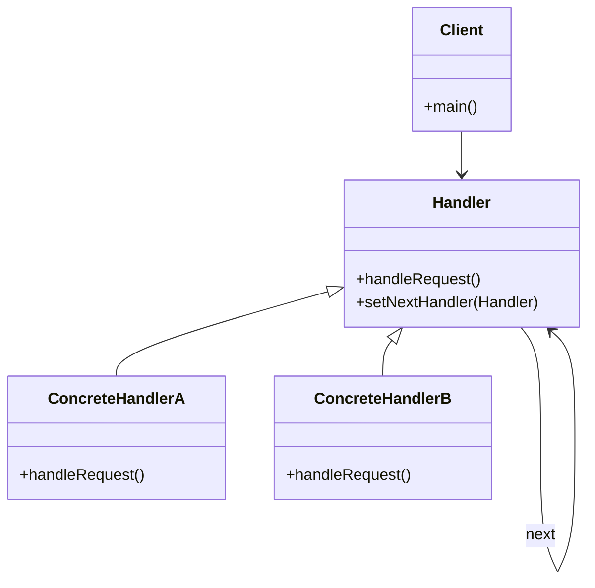
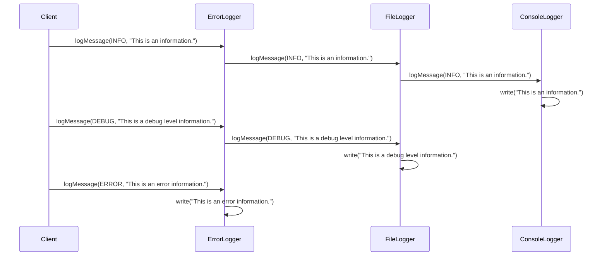

## 5.2 Chain of Responsibility Pattern

The Chain of Responsibility pattern is a behavioral design pattern that allows a request to be passed along a chain of handlers. Each handler in the chain has the opportunity to process the request or pass it along to the next handler. This pattern is particularly useful in scenarios where multiple objects might handle a request, promoting loose coupling between the sender and receivers of requests.

### Understanding the Chain of Responsibility Pattern

#### Intent of the Pattern

The primary intent of the Chain of Responsibility pattern is to decouple the sender of a request from its receivers by giving more than one object a chance to handle the request. This is achieved by chaining the receiving objects and passing the request along the chain until an object handles it.

#### Problem Solved by the Pattern

In many systems, a request needs to be processed by one of several handlers. For example, in a logging system, different log levels might require different handling strategies. Without the Chain of Responsibility pattern, the sender would need to know about all possible handlers and decide which one to use. This creates tight coupling between the sender and the receivers.

By implementing the Chain of Responsibility pattern, we can eliminate this tight coupling. The sender only needs to know the start of the chain, and each handler in the chain decides whether to process the request or pass it along.

### Structure of the Chain of Responsibility Pattern

The Chain of Responsibility pattern involves several key components:

- **Handler**: An interface or abstract class defining the method to handle requests and a reference to the next handler.
- **ConcreteHandler**: A class that implements the handler interface and processes requests it can handle. If it cannot handle a request, it forwards it to the next handler.
- **Client**: The client creates and configures the chain of handlers and sends requests to the chain.

#### UML Diagram

Below is a UML diagram illustrating the structure of the Chain of Responsibility pattern:



### Real-World Analogy

Consider a customer service call center. When a customer calls with an issue, the call is first handled by a front-line representative. If the issue is too complex, the call is escalated to a supervisor, and if necessary, further escalated to a manager. This escalation process is a real-world example of the Chain of Responsibility pattern, where each level in the hierarchy has the opportunity to handle the request.

### Implementing the Chain of Responsibility Pattern in Java

Let's implement a simple logging system using the Chain of Responsibility pattern. In this system, we have three levels of logging: INFO, DEBUG, and ERROR. Each level has its own handler.

```java
// Abstract handler
abstract class Logger {
    public static int INFO = 1;
    public static int DEBUG = 2;
    public static int ERROR = 3;
    
    protected int level;
    protected Logger nextLogger;
    
    public void setNextLogger(Logger nextLogger) {
        this.nextLogger = nextLogger;
    }
    
    public void logMessage(int level, String message) {
        if (this.level <= level) {
            write(message);
        }
        if (nextLogger != null) {
            nextLogger.logMessage(level, message);
        }
    }
    
    abstract protected void write(String message);
}

// Concrete handlers
class ConsoleLogger extends Logger {
    public ConsoleLogger(int level) {
        this.level = level;
    }
    
    @Override
    protected void write(String message) {
        System.out.println("Standard Console::Logger: " + message);
    }
}

class ErrorLogger extends Logger {
    public ErrorLogger(int level) {
        this.level = level;
    }
    
    @Override
    protected void write(String message) {
        System.err.println("Error Console::Logger: " + message);
    }
}

class FileLogger extends Logger {
    public FileLogger(int level) {
        this.level = level;
    }
    
    @Override
    protected void write(String message) {
        System.out.println("File::Logger: " + message);
    }
}

// Client
public class ChainPatternDemo {
    private static Logger getChainOfLoggers() {
        Logger errorLogger = new ErrorLogger(Logger.ERROR);
        Logger fileLogger = new FileLogger(Logger.DEBUG);
        Logger consoleLogger = new ConsoleLogger(Logger.INFO);
        
        errorLogger.setNextLogger(fileLogger);
        fileLogger.setNextLogger(consoleLogger);
        
        return errorLogger;
    }
    
    public static void main(String[] args) {
        Logger loggerChain = getChainOfLoggers();
        
        loggerChain.logMessage(Logger.INFO, "This is an information.");
        loggerChain.logMessage(Logger.DEBUG, "This is a debug level information.");
        loggerChain.logMessage(Logger.ERROR, "This is an error information.");
    }
}
```

### Explanation of the Code

- **Logger**: This is the abstract handler class. It defines the `logMessage` method and a reference to the next logger in the chain.
- **ConsoleLogger, ErrorLogger, FileLogger**: These are concrete handler classes that implement the `write` method to handle messages at different levels.
- **ChainPatternDemo**: This is the client class that sets up the chain of loggers and sends messages to the chain.

### Benefits of the Chain of Responsibility Pattern

1. **Loose Coupling**: The sender of a request is decoupled from the receivers, as it only needs to know the start of the chain.
2. **Flexibility**: Handlers can be added, removed, or reordered without affecting the client.
3. **Responsibility Sharing**: Multiple handlers can process a request, allowing for shared responsibility.

### Potential Drawbacks

1. **Uncertain Handling**: There is no guarantee that a request will be handled, as it might pass through all handlers without being processed.
2. **Performance Overhead**: The request might pass through many handlers, which can impact performance.
3. **Complexity**: Setting up and managing the chain can become complex, especially in large systems.

### Try It Yourself

To experiment with the Chain of Responsibility pattern, try modifying the code example above:

- Add a new logger level, such as `WARN`, and implement a corresponding handler.
- Change the order of the handlers in the chain and observe how it affects the output.
- Implement a mechanism to ensure that at least one handler processes each request.

### Visualizing the Chain of Responsibility Pattern

Let's visualize the flow of a request through the chain using a sequence diagram:



### Knowledge Check

- **Question**: What is the primary benefit of using the Chain of Responsibility pattern?
  - **Answer**: It promotes loose coupling between the sender and receivers of a request.
  
- **Question**: How does the Chain of Responsibility pattern handle requests?
  - **Answer**: It passes the request along a chain of handlers until one of them handles it.

### Further Reading

For more information on the Chain of Responsibility pattern, consider exploring the following resources:

- [Design Patterns: Elements of Reusable Object-Oriented Software](https://en.wikipedia.org/wiki/Design_Patterns) by Erich Gamma, Richard Helm, Ralph Johnson, and John Vlissides.
- [Java Design Patterns](https://www.journaldev.com/1827/java-design-patterns-example-tutorial) on JournalDev.

### Embrace the Journey

Remember, this is just the beginning. As you progress, you'll build more complex and interactive systems using the Chain of Responsibility pattern. Keep experimenting, stay curious, and enjoy the journey!

## Quiz Time!



### What is the main purpose of the Chain of Responsibility pattern?

- [x] To decouple senders and receivers of requests.
- [ ] To ensure a request is handled by multiple handlers.
- [ ] To guarantee that every request is processed.
- [ ] To simplify the request handling process.

> **Explanation:** The main purpose is to decouple senders and receivers, allowing multiple objects to handle a request without the sender needing to know which object will handle it.


### In the Chain of Responsibility pattern, what happens if no handler processes the request?

- [ ] The request is automatically handled by the last handler.
- [x] The request is not processed.
- [ ] The request is sent back to the sender.
- [ ] An error is thrown.

> **Explanation:** If no handler processes the request, it simply goes unhandled, as there is no default processing mechanism.


### Which of the following is a benefit of the Chain of Responsibility pattern?

- [x] Loose coupling between sender and receivers.
- [ ] Guaranteed request handling.
- [ ] Simplified handler implementation.
- [ ] Reduced number of classes.

> **Explanation:** The pattern promotes loose coupling, as the sender does not need to know the details of the handlers.


### How does the Chain of Responsibility pattern promote flexibility?

- [x] By allowing handlers to be added, removed, or reordered without affecting the client.
- [ ] By ensuring all requests are handled.
- [ ] By reducing the number of handlers required.
- [ ] By simplifying the client code.

> **Explanation:** Handlers can be added, removed, or reordered easily, which makes the system flexible.


### What is a potential drawback of the Chain of Responsibility pattern?

- [x] Uncertain request handling.
- [ ] Increased coupling between sender and receivers.
- [ ] Simplified request processing.
- [ ] Reduced flexibility.

> **Explanation:** There is no guarantee that a request will be handled, which can be a drawback in some scenarios.


### In the provided Java example, which class is responsible for setting up the chain of loggers?

- [x] ChainPatternDemo
- [ ] Logger
- [ ] ConsoleLogger
- [ ] ErrorLogger

> **Explanation:** The `ChainPatternDemo` class sets up the chain of loggers in the `getChainOfLoggers` method.


### What is the role of the `nextLogger` variable in the Java implementation?

- [x] To hold the reference to the next handler in the chain.
- [ ] To store the log message.
- [ ] To determine the log level.
- [ ] To execute the log writing.

> **Explanation:** The `nextLogger` variable holds the reference to the next handler, allowing the request to be passed along the chain.


### Which method in the Logger class is responsible for processing the request?

- [ ] setNextLogger
- [x] logMessage
- [ ] write
- [ ] handleRequest

> **Explanation:** The `logMessage` method processes the request and determines whether to pass it to the next handler.


### What real-world analogy was used to explain the Chain of Responsibility pattern?

- [x] Customer service call center.
- [ ] Assembly line in a factory.
- [ ] Library book borrowing system.
- [ ] Online shopping cart system.

> **Explanation:** The analogy of a customer service call center was used, where calls are escalated through different levels.


### True or False: The Chain of Responsibility pattern guarantees that a request will be handled.

- [ ] True
- [x] False

> **Explanation:** The pattern does not guarantee that a request will be handled; it depends on the handlers in the chain.


