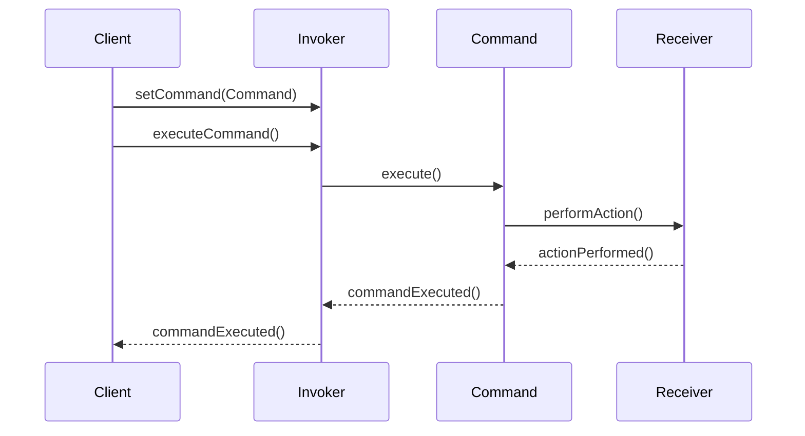

## 5.3.1 Implementing Command in Java

The Command Pattern is a behavioral design pattern that turns a request into a stand-alone object containing all information about the request. This transformation allows for parameterization of methods with different requests, queuing of requests, and logging the history of requests. It also provides support for undoable operations. In this section, we will delve into the implementation of the Command Pattern in Java, exploring its components, benefits, and practical applications.

### Understanding the Command Pattern

Before we dive into the implementation, let's break down the core components of the Command Pattern:

1. **Command Interface**: This defines the interface for executing an operation.
2. **Concrete Command**: This class implements the Command interface and defines the binding between the action and the Receiver.
3. **Receiver**: This is the component that knows how to perform the work needed to carry out the request.
4. **Invoker**: This class is responsible for executing the command.
5. **Client**: This creates and configures the ConcreteCommand with the appropriate Receiver.

### Step-by-Step Implementation in Java

Let's walk through the process of implementing the Command Pattern in Java with a practical example: a simple text editor that can perform operations like writing text, undoing the last operation, and redoing it.

#### Step 1: Define the Command Interface

The Command interface is the core of the Command Pattern. It declares a method for executing a command.

```java
// Command.java
public interface Command {
    void execute();
    void undo();
}
```

Here, we have defined two methods: `execute()` to perform the action and `undo()` to revert it.

#### Step 2: Create Concrete Command Classes

Concrete Command classes implement the Command interface and define the relationship between the action and the Receiver.

```java
// WriteCommand.java
public class WriteCommand implements Command {
    private TextEditor textEditor;
    private String text;

    public WriteCommand(TextEditor textEditor, String text) {
        this.textEditor = textEditor;
        this.text = text;
    }

    @Override
    public void execute() {
        textEditor.write(text);
    }

    @Override
    public void undo() {
        textEditor.undoWrite();
    }
}
```

In this example, `WriteCommand` is a Concrete Command that writes text to a `TextEditor`. It holds a reference to the `TextEditor` (Receiver) and the text to be written.

#### Step 3: Implement the Receiver

The Receiver is the component that performs the actual work. In our example, it's the `TextEditor`.

```java
// TextEditor.java
public class TextEditor {
    private StringBuilder currentText = new StringBuilder();
    private Stack<String> history = new Stack<>();

    public void write(String text) {
        history.push(currentText.toString());
        currentText.append(text);
    }

    public void undoWrite() {
        if (!history.isEmpty()) {
            currentText = new StringBuilder(history.pop());
        }
    }

    public String getText() {
        return currentText.toString();
    }
}
```

The `TextEditor` class maintains the current text and a history stack to support undo operations.

#### Step 4: Create the Invoker

The Invoker class is responsible for executing commands. It can store a command and execute it later.

```java
// TextEditorInvoker.java
public class TextEditorInvoker {
    private Command command;

    public void setCommand(Command command) {
        this.command = command;
    }

    public void executeCommand() {
        command.execute();
    }

    public void undoCommand() {
        command.undo();
    }
}
```

The `TextEditorInvoker` class holds a reference to a Command and can execute or undo it.

#### Step 5: Implement the Client

The Client is responsible for creating and configuring commands with the appropriate Receivers.

```java
// Client.java
public class Client {
    public static void main(String[] args) {
        TextEditor textEditor = new TextEditor();
        Command writeCommand = new WriteCommand(textEditor, "Hello, World!");

        TextEditorInvoker invoker = new TextEditorInvoker();
        invoker.setCommand(writeCommand);

        invoker.executeCommand();
        System.out.println("Text after writing: " + textEditor.getText());

        invoker.undoCommand();
        System.out.println("Text after undo: " + textEditor.getText());
    }
}
```

In the `Client` class, we create a `TextEditor`, a `WriteCommand`, and a `TextEditorInvoker`. We then execute and undo the command, demonstrating the Command Pattern in action.

### Visualizing the Command Pattern

To better understand the flow of the Command Pattern, let's visualize it using a sequence diagram.



**Diagram Description**: This sequence diagram illustrates the interaction between the Client, Invoker, Command, and Receiver. The Client sets a command in the Invoker, which then executes the command, causing the Receiver to perform the action.

### Benefits of the Command Pattern

The Command Pattern offers several advantages:

- **Decoupling**: It decouples the object that invokes the operation from the one that knows how to perform it.
- **Flexibility**: Commands can be parameterized, queued, logged, and undone.
- **Extensibility**: New commands can be added without changing existing code.

### Try It Yourself

Experiment with the provided code by adding new commands, such as `DeleteCommand` or `ReplaceCommand`. Implement these commands in a similar manner and observe how the Invoker can execute them without knowing their details.

### Knowledge Check

- **Question**: What are the main components of the Command Pattern?
- **Challenge**: Implement a `RedoCommand` for the text editor.

### Further Reading

For more information on the Command Pattern, consider exploring the following resources:

- [Refactoring Guru: Command Pattern](https://refactoring.guru/design-patterns/command)
- [Java Design Patterns: Command Pattern](https://java-design-patterns.com/patterns/command/)

### Summary

In this section, we explored the Command Pattern, a powerful tool for encapsulating requests as objects in Java. By understanding and implementing this pattern, you can create flexible, maintainable, and extensible software systems. Remember, this is just the beginning. As you progress, you'll build more complex and interactive applications. Keep experimenting, stay curious, and enjoy the journey!

## Quiz Time!



### What is the primary purpose of the Command Pattern?

- [x] To encapsulate a request as an object
- [ ] To create a single instance of a class
- [ ] To allow incompatible interfaces to work together
- [ ] To define a family of algorithms

> **Explanation:** The Command Pattern encapsulates a request as an object, allowing for parameterization and queuing of requests.

### Which component of the Command Pattern is responsible for executing the command?

- [ ] Client
- [x] Invoker
- [ ] Receiver
- [ ] Concrete Command

> **Explanation:** The Invoker is responsible for executing the command in the Command Pattern.

### In the Command Pattern, what role does the Receiver play?

- [ ] It creates and configures commands
- [ ] It stores and executes commands
- [x] It performs the actual work needed to carry out the request
- [ ] It defines the interface for executing operations

> **Explanation:** The Receiver performs the actual work needed to carry out the request in the Command Pattern.

### What method is typically included in a Command interface?

- [ ] run()
- [x] execute()
- [ ] start()
- [ ] process()

> **Explanation:** The `execute()` method is typically included in a Command interface to perform the action.

### How does the Command Pattern support undo operations?

- [x] By implementing an undo() method in the Command interface
- [ ] By using a single instance of a class
- [ ] By adapting incompatible interfaces
- [ ] By defining multiple algorithms

> **Explanation:** The Command Pattern supports undo operations by implementing an `undo()` method in the Command interface.

### What is the role of the Client in the Command Pattern?

- [x] To create and configure commands with the appropriate Receivers
- [ ] To execute commands
- [ ] To perform the actual work needed to carry out the request
- [ ] To define the interface for executing operations

> **Explanation:** The Client creates and configures commands with the appropriate Receivers in the Command Pattern.

### Which of the following is a benefit of using the Command Pattern?

- [x] Decoupling the Invoker from the Receiver
- [ ] Reducing the number of classes
- [ ] Increasing the complexity of the system
- [ ] Limiting the flexibility of the system

> **Explanation:** The Command Pattern decouples the Invoker from the Receiver, increasing flexibility and maintainability.

### What is the purpose of the Invoker in the Command Pattern?

- [ ] To perform the actual work needed to carry out the request
- [x] To execute commands
- [ ] To create and configure commands
- [ ] To define the interface for executing operations

> **Explanation:** The Invoker's purpose is to execute commands in the Command Pattern.

### What is a common use case for the Command Pattern?

- [x] Implementing undo and redo functionality
- [ ] Creating a single instance of a class
- [ ] Adapting incompatible interfaces
- [ ] Defining a family of algorithms

> **Explanation:** A common use case for the Command Pattern is implementing undo and redo functionality.

### True or False: The Command Pattern can be used to log the history of requests.

- [x] True
- [ ] False

> **Explanation:** True. The Command Pattern can be used to log the history of requests, as it encapsulates requests as objects.


