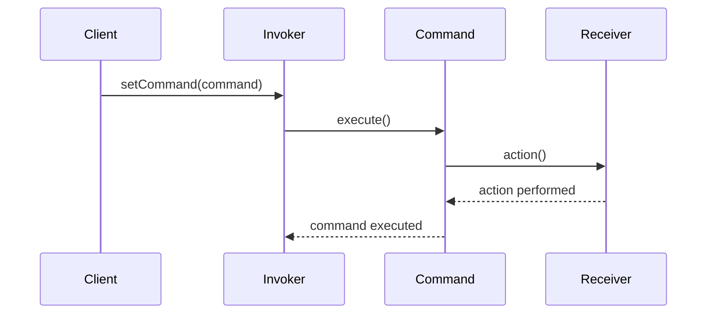
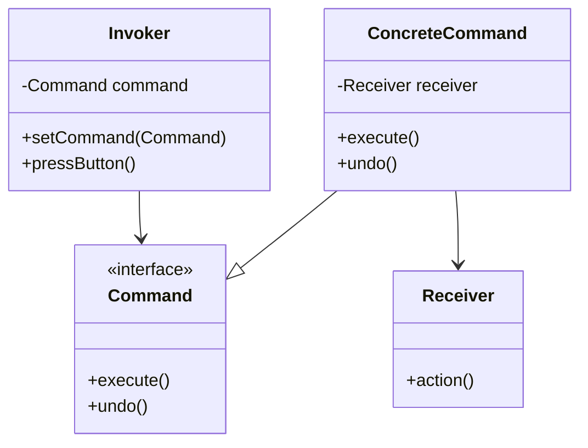

## 5.3.2 Invoker, Command, and Receiver Roles

The Command Pattern is a behavioral design pattern that turns a request into a stand-alone object containing all information about the request. This transformation allows for parameterization of clients with queues, requests, and operations, as well as logging the requests. In this section, we will delve into the three primary roles within the Command Pattern: the Invoker, the Command, and the Receiver. Each plays a critical part in the pattern's functionality, and understanding these roles is essential for implementing the Command Pattern effectively in Java.

### Understanding the Command Pattern

Before diving into the individual roles, let's briefly revisit the Command Pattern itself. The pattern encapsulates a request as an object, thereby allowing for parameterization of clients with different requests, queuing of requests, and logging of the requests. It also provides support for undoable operations.

In the Command Pattern, the key components are:

- **Command**: An interface or abstract class that declares a method for executing a command.
- **Concrete Command**: A class that implements the Command interface and defines the binding between a Receiver object and an action.
- **Invoker**: The object that knows how to execute a command, but not how the command is implemented.
- **Receiver**: The object that performs the actual work when the command is executed.

Let's explore each of these components in detail.

### The Invoker Role

The Invoker is responsible for initiating the request. It does not know how the command is executed or what the command does; it simply knows how to execute it. The Invoker holds a reference to the Command object and calls its `execute()` method.

#### Responsibilities of the Invoker

1. **Execute Commands**: The primary responsibility of the Invoker is to execute commands. It triggers the execution of the command by calling its `execute()` method.
2. **Manage Command History**: In some implementations, the Invoker may also maintain a history of executed commands to support undo operations.
3. **Decouple Client and Receiver**: By using the Command Pattern, the Invoker decouples the client that issues the request from the receiver that performs the action.

#### Code Example: Invoker

```java
// Invoker class
public class RemoteControl {
    private Command command;

    public void setCommand(Command command) {
        this.command = command;
    }

    public void pressButton() {
        command.execute();
    }
}
```

In this example, `RemoteControl` acts as the Invoker. It holds a reference to a `Command` and calls the `execute()` method when the button is pressed.

### The Command Role

The Command role is central to the Command Pattern. It defines the interface for executing an operation. The Command interface typically includes an `execute()` method, and sometimes an `undo()` method for reversible commands.

#### Command Interface

The Command interface declares a method for executing a command. This interface is implemented by all concrete command classes.

```java
// Command interface
public interface Command {
    void execute();
    void undo(); // Optional, for reversible commands
}
```

#### Concrete Command Classes

Concrete Command classes implement the Command interface and define the binding between a Receiver object and an action. Each concrete command class corresponds to a specific action on a Receiver.

```java
// Concrete Command class
public class LightOnCommand implements Command {
    private Light light;

    public LightOnCommand(Light light) {
        this.light = light;
    }

    @Override
    public void execute() {
        light.turnOn();
    }

    @Override
    public void undo() {
        light.turnOff();
    }
}
```

In this example, `LightOnCommand` is a concrete command that turns on a light. It holds a reference to a `Light` object (the Receiver) and calls its `turnOn()` method when executed.

### The Receiver Role

The Receiver is the component that performs the actual work when a command is executed. It contains the business logic to perform the action requested by the command.

#### Responsibilities of the Receiver

1. **Perform Actions**: The Receiver knows how to perform the operations associated with carrying out a request.
2. **Encapsulate Business Logic**: The Receiver encapsulates the business logic required to perform the action.
3. **Provide Methods for Commands**: The Receiver provides methods that can be called by concrete command classes to perform actions.

#### Code Example: Receiver

```java
// Receiver class
public class Light {
    public void turnOn() {
        System.out.println("The light is on.");
    }

    public void turnOff() {
        System.out.println("The light is off.");
    }
}
```

In this example, `Light` is the Receiver. It provides methods to turn the light on and off, which are called by the `LightOnCommand` and `LightOffCommand` classes.

### Interaction Among Invoker, Command, and Receiver

The interaction among the Invoker, Command, and Receiver is central to the Command Pattern. The Invoker holds a reference to a Command object, which in turn holds a reference to a Receiver. When the Invoker calls the `execute()` method on the Command, the Command calls the appropriate method on the Receiver to perform the action.

#### Sequence Diagram

Let's visualize the interaction among these components using a sequence diagram.



In this sequence diagram, the Client sets a command on the Invoker. The Invoker then calls the `execute()` method on the Command, which in turn calls the appropriate method on the Receiver to perform the action.

### Try It Yourself

To better understand the Command Pattern, try modifying the code examples provided. Here are some suggestions:

- **Add More Commands**: Implement additional commands, such as `LightOffCommand`, and test them with the Invoker.
- **Implement Undo Functionality**: Modify the Invoker to maintain a history of commands and implement undo functionality.
- **Create a Complex Receiver**: Create a more complex Receiver with multiple actions, and implement corresponding commands.

### Visualizing the Command Pattern

To further illustrate the Command Pattern, let's create a class diagram that shows the relationships among the Invoker, Command, and Receiver.



This class diagram shows the structure of the Command Pattern. The Invoker holds a reference to a Command, which is implemented by ConcreteCommand classes. The ConcreteCommand classes hold a reference to a Receiver, which performs the actual work.

### Knowledge Check

Let's pause for a moment to reflect on what we've learned. Consider the following questions:

- What is the primary responsibility of the Invoker in the Command Pattern?
- How does the Command interface facilitate the decoupling of the Invoker and Receiver?
- Why is the Receiver an essential component of the Command Pattern?

### Summary

In this section, we explored the roles of the Invoker, Command, and Receiver within the Command Pattern. We learned how the Invoker initiates requests, the Command encapsulates the request, and the Receiver performs the actual work. By understanding these roles, we can effectively implement the Command Pattern in Java to create flexible and decoupled systems.

### Further Reading

For more information on the Command Pattern and its applications, consider exploring the following resources:

- [Design Patterns: Elements of Reusable Object-Oriented Software](https://en.wikipedia.org/wiki/Design_Patterns) by Erich Gamma, Richard Helm, Ralph Johnson, and John Vlissides
- [Java Design Patterns](https://www.journaldev.com/1827/java-design-patterns-example-tutorial) by JournalDev
- [Refactoring Guru: Command Pattern](https://refactoring.guru/design-patterns/command)

## Quiz Time!



### What is the primary role of the Invoker in the Command Pattern?

- [x] To execute commands
- [ ] To perform business logic
- [ ] To define command interfaces
- [ ] To act as a Receiver

> **Explanation:** The Invoker's primary role is to execute commands by calling their `execute()` method.

### What does the Command interface typically define?

- [x] An `execute()` method
- [ ] A `perform()` method
- [ ] A `run()` method
- [ ] A `start()` method

> **Explanation:** The Command interface typically defines an `execute()` method, which is implemented by concrete command classes.

### What is the role of the Receiver in the Command Pattern?

- [ ] To execute commands
- [ ] To manage command history
- [x] To perform the actual work
- [ ] To define command interfaces

> **Explanation:** The Receiver performs the actual work when a command is executed, encapsulating the business logic.

### How does the Command Pattern facilitate undo operations?

- [x] By maintaining a history of executed commands
- [ ] By using reversible Receivers
- [ ] By defining a `redo()` method
- [ ] By storing command states

> **Explanation:** The Command Pattern can facilitate undo operations by maintaining a history of executed commands, allowing them to be undone.

### Which component in the Command Pattern knows how to perform the action?

- [ ] Invoker
- [ ] Command
- [x] Receiver
- [ ] Client

> **Explanation:** The Receiver knows how to perform the action associated with a command.

### What is the relationship between the Invoker and the Command?

- [x] The Invoker holds a reference to the Command
- [ ] The Command holds a reference to the Invoker
- [ ] They are independent of each other
- [ ] They are the same object

> **Explanation:** The Invoker holds a reference to the Command and calls its `execute()` method to perform actions.

### How does the Command Pattern decouple the Invoker and Receiver?

- [x] By using a Command interface
- [ ] By using a shared context
- [ ] By direct communication
- [ ] By using a common superclass

> **Explanation:** The Command Pattern decouples the Invoker and Receiver by using a Command interface that encapsulates the request.

### What is an optional method that can be included in the Command interface?

- [x] `undo()`
- [ ] `start()`
- [ ] `stop()`
- [ ] `reset()`

> **Explanation:** An optional `undo()` method can be included in the Command interface for reversible commands.

### What is a common use case for the Command Pattern?

- [x] Implementing undo functionality
- [ ] Managing database connections
- [ ] Optimizing performance
- [ ] Handling exceptions

> **Explanation:** The Command Pattern is commonly used to implement undo functionality by maintaining a history of executed commands.

### True or False: The Command Pattern requires the Invoker to know the details of how the command is executed.

- [ ] True
- [x] False

> **Explanation:** False. The Command Pattern allows the Invoker to execute commands without knowing the details of how they are executed.



Remember, this is just the beginning. As you progress, you'll build more complex and interactive systems using the Command Pattern. Keep experimenting, stay curious, and enjoy the journey!
