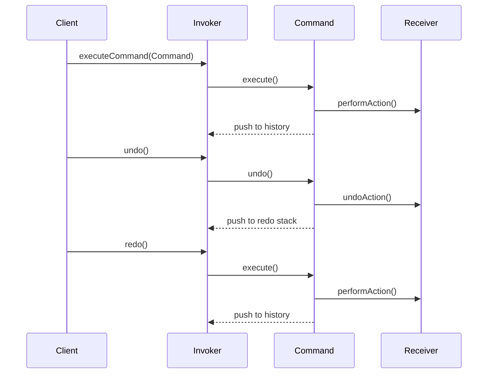

## 5.3.3 Implementing Undo and Redo

In this section, we delve into the intricacies of implementing undo and redo functionality using the Command Pattern in Java. The Command Pattern is a behavioral design pattern that turns a request into a stand-alone object that contains all information about the request. This transformation allows for parameterization of clients with queues, requests, and operations, and supports undoable actions.

### Understanding the Command Pattern

The Command Pattern encapsulates a request as an object, thereby allowing for parameterization of clients with queues, requests, and operations. It also provides support for undoable operations. This pattern is particularly useful in scenarios where you need to issue requests to objects without knowing anything about the operation being requested or the receiver of the request.

#### Key Components of the Command Pattern

1. **Command Interface**: Declares an interface for executing an operation.
2. **Concrete Command**: Defines a binding between a Receiver object and an action. Implements the Command interface by invoking the corresponding operation(s) on the Receiver.
3. **Client**: Creates a ConcreteCommand object and sets its receiver.
4. **Invoker**: Asks the command to carry out the request.
5. **Receiver**: Knows how to perform the operations associated with carrying out a request.

### Implementing Undo and Redo

To implement undo and redo functionality, we need to maintain a history of commands that have been executed. This history allows us to reverse the effects of a command (undo) or reapply it (redo).

#### Storing Command History

The command history is typically maintained as a stack. When a command is executed, it is pushed onto the stack. To undo a command, we pop it from the stack and execute its undo operation. For redo functionality, we can maintain a separate stack or list to keep track of undone commands.

#### Code Example: Command Pattern with Undo and Redo

Let's explore a practical example of implementing undo and redo functionality in Java using the Command Pattern. We'll create a simple text editor application that supports typing text, undoing the last action, and redoing an undone action.

```java
// Command interface
interface Command {
    void execute();
    void undo();
}

// Receiver class
class TextEditor {
    private StringBuilder text = new StringBuilder();

    public void addText(String newText) {
        text.append(newText);
    }

    public void removeText(int length) {
        if (length <= text.length()) {
            text.delete(text.length() - length, text.length());
        }
    }

    public String getText() {
        return text.toString();
    }
}

// Concrete Command for adding text
class AddTextCommand implements Command {
    private TextEditor editor;
    private String textToAdd;

    public AddTextCommand(TextEditor editor, String textToAdd) {
        this.editor = editor;
        this.textToAdd = textToAdd;
    }

    @Override
    public void execute() {
        editor.addText(textToAdd);
    }

    @Override
    public void undo() {
        editor.removeText(textToAdd.length());
    }
}

// Invoker class
class CommandManager {
    private Stack<Command> commandHistory = new Stack<>();
    private Stack<Command> redoStack = new Stack<>();

    public void executeCommand(Command command) {
        command.execute();
        commandHistory.push(command);
        redoStack.clear(); // Clear redo stack on new command
    }

    public void undo() {
        if (!commandHistory.isEmpty()) {
            Command command = commandHistory.pop();
            command.undo();
            redoStack.push(command);
        }
    }

    public void redo() {
        if (!redoStack.isEmpty()) {
            Command command = redoStack.pop();
            command.execute();
            commandHistory.push(command);
        }
    }
}

// Client code
public class TextEditorApp {
    public static void main(String[] args) {
        TextEditor editor = new TextEditor();
        CommandManager commandManager = new CommandManager();

        Command addHello = new AddTextCommand(editor, "Hello");
        Command addWorld = new AddTextCommand(editor, " World");

        commandManager.executeCommand(addHello);
        commandManager.executeCommand(addWorld);

        System.out.println("Text after commands: " + editor.getText());

        commandManager.undo();
        System.out.println("Text after undo: " + editor.getText());

        commandManager.redo();
        System.out.println("Text after redo: " + editor.getText());
    }
}
```

### Explanation of the Code

- **Command Interface**: The `Command` interface declares methods for executing and undoing operations.
- **Concrete Command**: The `AddTextCommand` class implements the `Command` interface and provides the logic for adding and removing text.
- **Receiver**: The `TextEditor` class performs the actual operations of adding and removing text.
- **Invoker**: The `CommandManager` class manages the execution of commands and maintains the history for undo and redo operations.
- **Client**: The `TextEditorApp` class demonstrates the use of the Command Pattern to perform and undo text operations.

### Managing State Restoration

When implementing undo and redo functionality, it's crucial to manage state restoration carefully. Each command should encapsulate enough information to reverse its effects. This often involves storing the state before the command execution and restoring it during the undo operation.

#### Considerations for Commands that Modify State

1. **State Preservation**: Ensure that each command can restore the system to its previous state. This may involve storing additional state information within the command.
2. **Complex Commands**: For complex commands that affect multiple objects or have side effects, consider using a Memento pattern to capture and restore state.
3. **Performance**: Be mindful of the performance implications of maintaining a command history, especially in applications with frequent state changes.

### Visualizing the Command Pattern with Undo/Redo

To better understand the flow of the Command Pattern with undo and redo functionality, let's visualize it using a sequence diagram.



### Try It Yourself

To deepen your understanding, try modifying the code example to add new features:

- **Implement a `RemoveTextCommand`**: Create a new command class that removes a specified number of characters from the text and supports undo and redo.
- **Add a `ClearTextCommand`**: Implement a command that clears all text in the editor and can be undone and redone.
- **Enhance the `TextEditor`**: Add functionality to support more complex text operations, such as replacing text or changing text case.

### Knowledge Check

Before we conclude, let's reinforce our understanding with a few questions:

- How does the Command Pattern facilitate undo and redo functionality?
- What is the role of the Invoker in the Command Pattern?
- Why is it important to clear the redo stack when executing a new command?

### Conclusion

Implementing undo and redo functionality using the Command Pattern in Java provides a robust and flexible solution for managing reversible operations. By encapsulating requests as objects, we can easily maintain a history of commands and support complex state restoration. As you continue to explore design patterns, remember that the Command Pattern is just one tool in your toolkit for building maintainable and scalable software systems.

## Quiz Time!



### How does the Command Pattern support undoable actions?

- [x] By encapsulating requests as objects that can be stored and reversed.
- [ ] By directly modifying the state of the application.
- [ ] By using a single global variable to track changes.
- [ ] By executing commands in reverse order.

> **Explanation:** The Command Pattern encapsulates requests as objects, allowing them to be stored in a history stack and reversed through undo operations.

### What is the primary role of the Invoker in the Command Pattern?

- [x] To manage the execution and history of commands.
- [ ] To directly perform actions on the receiver.
- [ ] To create new command objects.
- [ ] To handle user input and output.

> **Explanation:** The Invoker is responsible for managing the execution of commands and maintaining a history for undo and redo operations.

### Why is it important to clear the redo stack when executing a new command?

- [x] To ensure that redo operations only apply to undone commands.
- [ ] To improve the performance of the application.
- [ ] To prevent memory leaks.
- [ ] To maintain a fixed size for the command history.

> **Explanation:** Clearing the redo stack ensures that redo operations apply only to commands that have been undone, maintaining the integrity of the command history.

### Which component in the Command Pattern knows how to perform the operations associated with carrying out a request?

- [x] Receiver
- [ ] Invoker
- [ ] Command
- [ ] Client

> **Explanation:** The Receiver is the component that knows how to perform the operations associated with carrying out a request.

### What is a potential performance consideration when maintaining a command history?

- [x] The memory usage of storing a large number of commands.
- [ ] The speed of executing individual commands.
- [ ] The complexity of the command interface.
- [ ] The number of clients using the system.

> **Explanation:** Maintaining a large command history can increase memory usage, especially in applications with frequent state changes.

### What is the purpose of the `undo` method in the Command interface?

- [x] To reverse the effects of a command.
- [ ] To execute the command again.
- [ ] To delete the command from history.
- [ ] To modify the command's parameters.

> **Explanation:** The `undo` method is used to reverse the effects of a command, restoring the system to its previous state.

### How can complex commands that affect multiple objects be managed?

- [x] By using a Memento pattern to capture and restore state.
- [ ] By executing them in a separate thread.
- [ ] By combining them into a single command object.
- [ ] By ignoring their side effects.

> **Explanation:** The Memento pattern can be used to capture and restore the state of complex commands that affect multiple objects.

### What is the benefit of using the Command Pattern for undo and redo functionality?

- [x] It provides a structured way to manage reversible operations.
- [ ] It simplifies the user interface design.
- [ ] It reduces the need for error handling.
- [ ] It eliminates the need for a command history.

> **Explanation:** The Command Pattern provides a structured way to manage reversible operations, making it easier to implement undo and redo functionality.

### In the provided code example, what does the `CommandManager` class do?

- [x] It manages the execution and history of commands.
- [ ] It performs the actual text operations.
- [ ] It defines the command interface.
- [ ] It creates new command objects.

> **Explanation:** The `CommandManager` class manages the execution of commands and maintains the history for undo and redo operations.

### True or False: The Command Pattern can only be used for text editing applications.

- [ ] True
- [x] False

> **Explanation:** False. The Command Pattern is versatile and can be used in various applications beyond text editing, wherever reversible operations are needed.


