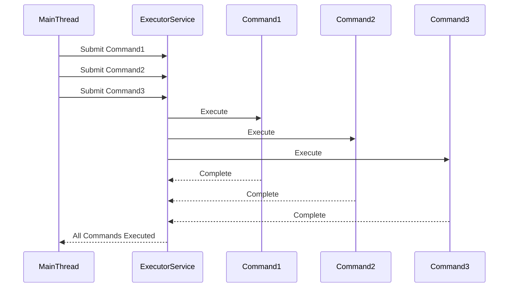

## 5.3.4 Command Pattern in Multithreading

In the realm of software design, the Command pattern is a behavioral design pattern that encapsulates a request as an object, thereby allowing for parameterization of clients with queues, requests, and operations. When applied to multithreading, the Command pattern can significantly enhance concurrency by enabling the asynchronous execution of commands. In this section, we will explore how the Command pattern can be leveraged in Java to execute commands in separate threads, manage thread safety, and implement asynchronous command execution.

### Enhancing Concurrency with the Command Pattern

Concurrency is a critical aspect of modern software development, allowing multiple tasks to be executed simultaneously, thereby improving the efficiency and responsiveness of applications. The Command pattern aids in achieving concurrency by decoupling the sender of a request from its receiver, allowing commands to be queued and executed asynchronously.

#### Key Concepts

- **Command Object**: Encapsulates all the information needed to perform an action or trigger an event. This includes the method to call, the method's arguments, and the object that implements the method.
- **Invoker**: Responsible for executing the command. In a multithreaded environment, the invoker can be a thread or a thread pool.
- **Receiver**: The object that performs the actual work when the command is executed.

By using the Command pattern, we can create a system where commands are executed in parallel, improving the application's throughput and responsiveness.

### Executing Commands in Separate Threads

One of the primary advantages of using the Command pattern in a multithreaded environment is the ability to execute commands in separate threads. This can be achieved using Java's `Thread` class or the `ExecutorService` framework, which provides a higher-level API for managing threads.

#### Example: Basic Command Execution in a Separate Thread

Let's start with a simple example where we execute a command in a separate thread using Java's `Thread` class.

```java
// Command Interface
interface Command {
    void execute();
}

// Concrete Command
class PrintCommand implements Command {
    private String message;

    public PrintCommand(String message) {
        this.message = message;
    }

    @Override
    public void execute() {
        System.out.println("Executing command: " + message);
    }
}

// Invoker
class CommandExecutor implements Runnable {
    private Command command;

    public CommandExecutor(Command command) {
        this.command = command;
    }

    @Override
    public void run() {
        command.execute();
    }
}

// Main class to demonstrate command execution in a separate thread
public class CommandPatternDemo {
    public static void main(String[] args) {
        Command printCommand = new PrintCommand("Hello, World!");
        Thread thread = new Thread(new CommandExecutor(printCommand));
        thread.start();
    }
}
```

In this example, we define a `Command` interface with an `execute` method. The `PrintCommand` class implements this interface and prints a message when executed. The `CommandExecutor` class implements `Runnable` and executes the command in its `run` method. Finally, we create a new thread to execute the command.

### Using Thread Pools for Command Execution

While using individual threads for each command can work for simple applications, it is not scalable for applications that require executing a large number of commands. This is where thread pools come into play. Java's `ExecutorService` framework provides a way to manage a pool of threads, allowing for efficient execution of commands.

#### Example: Command Execution Using Thread Pools

Let's extend our previous example to use a thread pool for executing commands.

```java
import java.util.concurrent.ExecutorService;
import java.util.concurrent.Executors;

// Command Interface
interface Command {
    void execute();
}

// Concrete Command
class PrintCommand implements Command {
    private String message;

    public PrintCommand(String message) {
        this.message = message;
    }

    @Override
    public void execute() {
        System.out.println("Executing command: " + message);
    }
}

// Main class to demonstrate command execution using thread pool
public class CommandPatternWithThreadPool {
    public static void main(String[] args) {
        ExecutorService executorService = Executors.newFixedThreadPool(3);

        Command command1 = new PrintCommand("Hello, World!");
        Command command2 = new PrintCommand("Concurrency in Java");
        Command command3 = new PrintCommand("Command Pattern");

        executorService.submit(() -> command1.execute());
        executorService.submit(() -> command2.execute());
        executorService.submit(() -> command3.execute());

        executorService.shutdown();
    }
}
```

In this example, we use `Executors.newFixedThreadPool(3)` to create a thread pool with three threads. We then submit three commands to the executor service, which manages the execution of these commands using the available threads in the pool.

### Thread Safety Considerations

When implementing the Command pattern in a multithreaded environment, thread safety is a crucial consideration. Commands may access shared resources, leading to potential race conditions and data inconsistencies. To ensure thread safety, we must synchronize access to shared resources or use concurrent data structures provided by the `java.util.concurrent` package.

#### Example: Ensuring Thread Safety

Let's modify our command implementation to include a shared resource and demonstrate how to ensure thread safety.

```java
import java.util.concurrent.ExecutorService;
import java.util.concurrent.Executors;
import java.util.concurrent.atomic.AtomicInteger;

// Command Interface
interface Command {
    void execute();
}

// Concrete Command
class IncrementCommand implements Command {
    private AtomicInteger counter;

    public IncrementCommand(AtomicInteger counter) {
        this.counter = counter;
    }

    @Override
    public void execute() {
        int newValue = counter.incrementAndGet();
        System.out.println("Counter incremented to: " + newValue);
    }
}

// Main class to demonstrate thread-safe command execution
public class ThreadSafeCommandExecution {
    public static void main(String[] args) {
        ExecutorService executorService = Executors.newFixedThreadPool(3);
        AtomicInteger counter = new AtomicInteger(0);

        for (int i = 0; i < 10; i++) {
            executorService.submit(new IncrementCommand(counter)::execute);
        }

        executorService.shutdown();
    }
}
```

In this example, we use `AtomicInteger` to ensure thread-safe increments of a shared counter. The `incrementAndGet` method is atomic, meaning it is executed as a single, indivisible operation, preventing race conditions.

### Asynchronous Command Execution in Java

Asynchronous execution is a powerful feature that allows commands to be executed without blocking the main thread, improving the responsiveness of applications. Java provides several mechanisms for asynchronous execution, including `CompletableFuture`, which allows for non-blocking asynchronous programming.

#### Example: Asynchronous Command Execution with CompletableFuture

Let's explore how to use `CompletableFuture` for asynchronous command execution.

```java
import java.util.concurrent.CompletableFuture;

// Command Interface
interface Command {
    void execute();
}

// Concrete Command
class AsyncCommand implements Command {
    private String taskName;

    public AsyncCommand(String taskName) {
        this.taskName = taskName;
    }

    @Override
    public void execute() {
        System.out.println("Executing async command: " + taskName);
    }
}

// Main class to demonstrate asynchronous command execution
public class AsyncCommandExecution {
    public static void main(String[] args) {
        Command asyncCommand = new AsyncCommand("Data Processing");

        CompletableFuture.runAsync(() -> asyncCommand.execute())
            .thenRun(() -> System.out.println("Command execution completed"));

        System.out.println("Main thread continues to run...");
    }
}
```

In this example, we use `CompletableFuture.runAsync` to execute the command asynchronously. The `thenRun` method is used to specify an action to be performed once the command execution is complete. This allows the main thread to continue running without waiting for the command to finish.

### Visualizing Command Pattern in Multithreading

To better understand the flow of command execution in a multithreaded environment, let's visualize the process using a sequence diagram.



This diagram illustrates how commands are submitted to an `ExecutorService`, which manages their execution using available threads. Each command is executed independently, and the main thread is notified once all commands have been executed.

### Try It Yourself

To deepen your understanding of the Command pattern in multithreading, try modifying the examples provided:

1. **Add More Commands**: Create additional command classes that perform different tasks, such as file operations or network requests, and execute them using a thread pool.

2. **Experiment with Thread Pool Sizes**: Change the size of the thread pool and observe how it affects the execution of commands.

3. **Implement Error Handling**: Introduce error handling in your command execution logic to manage exceptions gracefully.

4. **Use CompletableFuture for Complex Workflows**: Chain multiple `CompletableFuture` instances to create complex asynchronous workflows.

5. **Visualize Your Workflow**: Use Mermaid.js to create your own sequence diagrams for the command execution process.

### Knowledge Check

Before we wrap up, let's reinforce the key concepts covered in this section:

- **Concurrency**: The ability to execute multiple tasks simultaneously, improving efficiency and responsiveness.
- **Command Pattern**: Encapsulates a request as an object, allowing for parameterization and queuing of requests.
- **Thread Safety**: Ensuring that shared resources are accessed safely in a multithreaded environment.
- **Asynchronous Execution**: Executing commands without blocking the main thread, improving application responsiveness.

### References and Further Reading

- [Java Concurrency in Practice](https://www.amazon.com/Java-Concurrency-Practice-Brian-Goetz/dp/0321349601) by Brian Goetz
- [Java 8 in Action](https://www.amazon.com/Java-8-Action-lambdas-functional/dp/1617291994) by Raoul-Gabriel Urma
- [Oracle's Java Concurrency Tutorial](https://docs.oracle.com/javase/tutorial/essential/concurrency/)
- [CompletableFuture Documentation](https://docs.oracle.com/javase/8/docs/api/java/util/concurrent/CompletableFuture.html)

### Embrace the Journey

Remember, mastering design patterns and concurrency in Java is a journey. As you continue to explore and experiment with these concepts, you'll gain deeper insights into building efficient, scalable, and maintainable applications. Keep experimenting, stay curious, and enjoy the journey!

## Quiz Time!



### What is the primary advantage of using the Command pattern in a multithreaded environment?

- [x] It allows commands to be queued and executed asynchronously.
- [ ] It simplifies the code by reducing the number of classes.
- [ ] It ensures all commands are executed in a single thread.
- [ ] It eliminates the need for thread synchronization.

> **Explanation:** The Command pattern allows commands to be queued and executed asynchronously, enhancing concurrency and efficiency.

### Which Java class is commonly used to manage a pool of threads for executing commands?

- [ ] Thread
- [x] ExecutorService
- [ ] CompletableFuture
- [ ] Runnable

> **Explanation:** `ExecutorService` is used to manage a pool of threads, allowing for efficient execution of commands.

### How can thread safety be ensured when using shared resources in command execution?

- [ ] By using global variables
- [ ] By avoiding the use of threads
- [x] By synchronizing access or using concurrent data structures
- [ ] By executing commands sequentially

> **Explanation:** Thread safety can be ensured by synchronizing access to shared resources or using concurrent data structures like `AtomicInteger`.

### What is the role of `CompletableFuture` in asynchronous command execution?

- [ ] It blocks the main thread until the command is executed.
- [x] It allows commands to be executed without blocking the main thread.
- [ ] It ensures commands are executed in a specific order.
- [ ] It simplifies error handling in synchronous execution.

> **Explanation:** `CompletableFuture` allows commands to be executed asynchronously, without blocking the main thread.

### In the provided example, what method is used to execute a command asynchronously with `CompletableFuture`?

- [ ] executeAsync()
- [x] runAsync()
- [ ] submit()
- [ ] start()

> **Explanation:** The `runAsync()` method is used to execute a command asynchronously with `CompletableFuture`.

### What is a key benefit of using thread pools over individual threads for command execution?

- [x] Improved scalability and resource management
- [ ] Simplified code structure
- [ ] Guaranteed execution order
- [ ] Reduced need for error handling

> **Explanation:** Thread pools improve scalability and resource management by reusing threads for executing commands.

### Which of the following is a correct statement about the Command pattern?

- [x] It encapsulates a request as an object.
- [ ] It requires commands to be executed in the order they are created.
- [ ] It eliminates the need for an invoker.
- [ ] It is only applicable in single-threaded environments.

> **Explanation:** The Command pattern encapsulates a request as an object, allowing for flexible execution and management.

### What is the purpose of the `AtomicInteger` class in the thread-safe command execution example?

- [ ] To simplify the code structure
- [x] To ensure atomic operations on a shared counter
- [ ] To manage thread creation
- [ ] To execute commands asynchronously

> **Explanation:** `AtomicInteger` ensures atomic operations on a shared counter, preventing race conditions.

### Which method is used to shut down an `ExecutorService` after command execution?

- [ ] terminate()
- [x] shutdown()
- [ ] stop()
- [ ] close()

> **Explanation:** The `shutdown()` method is used to shut down an `ExecutorService` after command execution.

### True or False: The Command pattern can only be used for synchronous command execution.

- [ ] True
- [x] False

> **Explanation:** False. The Command pattern can be used for both synchronous and asynchronous command execution.


