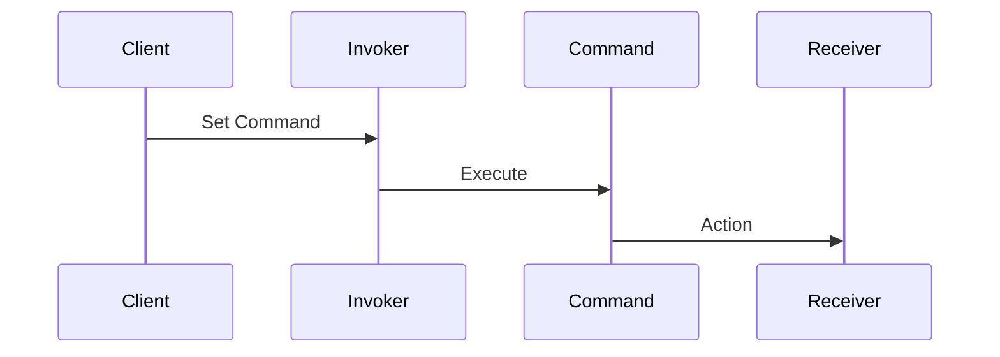

## 5.3.5 Use Cases and Examples

The Command pattern is a behavioral design pattern that turns a request into a stand-alone object containing all information about the request. This transformation allows for parameterizing methods with different requests, delaying or queueing a request's execution, and supporting undoable operations. In this section, we will delve into practical applications of the Command pattern, focusing on GUI actions and macro recording, and provide comprehensive examples to illustrate these concepts.

### Understanding the Command Pattern

Before diving into specific use cases, let's briefly recap the Command pattern's structure. The pattern involves several key components:

- **Command Interface**: Declares an interface for executing operations.
- **Concrete Command**: Implements the Command interface and defines the binding between a Receiver object and an action.
- **Receiver**: Knows how to perform the operations associated with carrying out a request.
- **Invoker**: Asks the command to carry out the request.
- **Client**: Creates a ConcreteCommand object and sets its receiver.

This pattern is particularly useful in scenarios where you need to decouple the sender of a request from its receiver, allowing for more flexible and reusable code.

### Use Case 1: GUI Actions

One of the most common applications of the Command pattern is in graphical user interface (GUI) frameworks. In a GUI, user actions such as button clicks, menu selections, or keyboard shortcuts need to be handled in a flexible and decoupled manner. The Command pattern provides a way to encapsulate these actions as command objects, enabling easy management and extension of user interactions.

#### Implementing GUI Actions with the Command Pattern

Consider a simple text editor application with basic functionalities like copy, paste, and undo. Each of these actions can be represented as a command object. Let's explore how this can be implemented in Java.

```java
// Command interface
interface Command {
    void execute();
}

// Receiver class
class TextEditor {
    private String clipboard;
    private String text;

    public void copy(String text) {
        clipboard = text;
        System.out.println("Copied to clipboard: " + clipboard);
    }

    public void paste() {
        if (clipboard != null) {
            text += clipboard;
            System.out.println("Pasted: " + text);
        }
    }

    public void undo() {
        // Undo logic here
        System.out.println("Undo operation performed");
    }
}

// Concrete Command classes
class CopyCommand implements Command {
    private TextEditor editor;
    private String text;

    public CopyCommand(TextEditor editor, String text) {
        this.editor = editor;
        this.text = text;
    }

    @Override
    public void execute() {
        editor.copy(text);
    }
}

class PasteCommand implements Command {
    private TextEditor editor;

    public PasteCommand(TextEditor editor) {
        this.editor = editor;
    }

    @Override
    public void execute() {
        editor.paste();
    }
}

class UndoCommand implements Command {
    private TextEditor editor;

    public UndoCommand(TextEditor editor) {
        this.editor = editor;
    }

    @Override
    public void execute() {
        editor.undo();
    }
}

// Invoker class
class Menu {
    private Command copyCommand;
    private Command pasteCommand;
    private Command undoCommand;

    public Menu(Command copy, Command paste, Command undo) {
        this.copyCommand = copy;
        this.pasteCommand = paste;
        this.undoCommand = undo;
    }

    public void clickCopy() {
        copyCommand.execute();
    }

    public void clickPaste() {
        pasteCommand.execute();
    }

    public void clickUndo() {
        undoCommand.execute();
    }
}

// Client code
public class CommandPatternDemo {
    public static void main(String[] args) {
        TextEditor editor = new TextEditor();
        Command copy = new CopyCommand(editor, "Hello, World!");
        Command paste = new PasteCommand(editor);
        Command undo = new UndoCommand(editor);

        Menu menu = new Menu(copy, paste, undo);

        menu.clickCopy();
        menu.clickPaste();
        menu.clickUndo();
    }
}
```

In this example, the `TextEditor` class acts as the receiver, while `CopyCommand`, `PasteCommand`, and `UndoCommand` are concrete implementations of the `Command` interface. The `Menu` class serves as the invoker, executing commands based on user interactions.

#### Benefits of Using the Command Pattern in GUIs

- **Decoupling**: The Command pattern decouples the object that invokes the operation from the one that knows how to perform it. This separation allows for more flexible and maintainable code.
- **Extensibility**: Adding new commands (e.g., a "Cut" command) is straightforward and doesn't require modifying existing code.
- **Undo/Redo Functionality**: Commands can be stored in a history list, enabling undo and redo operations.

### Use Case 2: Macro Recording

Another powerful application of the Command pattern is in macro recording, where a sequence of operations is recorded and can be played back later. This functionality is common in applications like text editors, graphic design tools, and spreadsheet software.

#### Implementing Macro Recording with the Command Pattern

Let's extend our text editor example to support macro recording. We'll create a `MacroCommand` class that records and executes a sequence of commands.

```java
// MacroCommand class
class MacroCommand implements Command {
    private List<Command> commands = new ArrayList<>();

    public void addCommand(Command command) {
        commands.add(command);
    }

    @Override
    public void execute() {
        for (Command command : commands) {
            command.execute();
        }
    }
}

// Client code for macro recording
public class MacroCommandDemo {
    public static void main(String[] args) {
        TextEditor editor = new TextEditor();
        Command copy = new CopyCommand(editor, "Hello, Macro!");
        Command paste = new PasteCommand(editor);
        Command undo = new UndoCommand(editor);

        MacroCommand macro = new MacroCommand();
        macro.addCommand(copy);
        macro.addCommand(paste);
        macro.addCommand(undo);

        // Execute macro
        macro.execute();
    }
}
```

In this implementation, the `MacroCommand` class aggregates multiple commands and executes them in sequence. This approach allows users to record a series of actions and replay them with a single command, enhancing productivity and automation.

#### Benefits of Macro Recording

- **Automation**: Users can automate repetitive tasks by recording and replaying macros.
- **Consistency**: Ensures that complex sequences of operations are performed consistently.
- **Flexibility**: Users can modify macros by adding or removing commands without altering the underlying application logic.

### Visualizing the Command Pattern

To better understand the flow of the Command pattern, let's visualize the interactions between its components using a sequence diagram.



In this diagram, the `Client` sets the command on the `Invoker`, which then calls the `execute` method on the `Command`. The `Command` interacts with the `Receiver` to perform the desired action.

### Try It Yourself

To deepen your understanding of the Command pattern, try modifying the code examples provided:

1. **Add a New Command**: Implement a "Cut" command for the text editor. Ensure it integrates seamlessly with the existing commands.
2. **Enhance Macro Functionality**: Modify the `MacroCommand` class to support undoing the entire macro sequence.
3. **GUI Integration**: Create a simple Java Swing application that uses buttons to trigger the commands. Observe how the Command pattern simplifies event handling.

### Knowledge Check

- **What are the key components of the Command pattern?**
- **How does the Command pattern facilitate undo/redo functionality?**
- **In what ways can the Command pattern improve GUI application design?**

### Conclusion

The Command pattern is a versatile and powerful tool for managing actions and requests in software applications. By encapsulating requests as command objects, developers can achieve greater flexibility, extensibility, and maintainability in their code. Whether you're building a GUI application or implementing macro recording, the Command pattern provides a robust framework for handling complex interactions.

### Quiz Time!



### What is the primary purpose of the Command pattern?

- [x] To encapsulate a request as an object
- [ ] To manage database connections
- [ ] To optimize memory usage
- [ ] To handle exceptions

> **Explanation:** The Command pattern encapsulates a request as an object, allowing for parameterization and queuing of requests.

### Which component in the Command pattern is responsible for executing the command?

- [ ] Client
- [ ] Invoker
- [x] Command
- [ ] Receiver

> **Explanation:** The Command component is responsible for executing the command by invoking the appropriate method on the Receiver.

### How does the Command pattern benefit GUI applications?

- [x] It decouples the sender of a request from its receiver
- [ ] It reduces memory usage
- [ ] It simplifies database interactions
- [ ] It enhances security

> **Explanation:** The Command pattern decouples the sender of a request from its receiver, making GUI applications more flexible and maintainable.

### What is a common use case for the Command pattern?

- [x] Macro recording
- [ ] Data encryption
- [ ] Network communication
- [ ] File compression

> **Explanation:** Macro recording is a common use case for the Command pattern, as it allows for recording and replaying sequences of commands.

### How can the Command pattern support undo functionality?

- [x] By storing commands in a history list
- [ ] By using a database
- [ ] By implementing a cache
- [ ] By creating a backup file

> **Explanation:** The Command pattern supports undo functionality by storing commands in a history list, allowing for reversal of executed commands.

### What role does the Invoker play in the Command pattern?

- [x] It asks the command to carry out the request
- [ ] It performs the actual operation
- [ ] It creates the command object
- [ ] It manages system resources

> **Explanation:** The Invoker asks the command to carry out the request, acting as an intermediary between the Client and the Command.

### Which of the following is NOT a benefit of using the Command pattern?

- [ ] Decoupling sender and receiver
- [ ] Supporting undo functionality
- [ ] Enhancing code readability
- [x] Reducing code size

> **Explanation:** While the Command pattern offers many benefits, reducing code size is not typically one of them. It often involves additional classes and interfaces.

### In the context of the Command pattern, what is a Receiver?

- [ ] The object that creates the command
- [x] The object that knows how to perform the operation
- [ ] The object that stores command history
- [ ] The object that manages user input

> **Explanation:** The Receiver is the object that knows how to perform the operation associated with the command.

### What is the advantage of using a MacroCommand?

- [x] It allows for executing a sequence of commands
- [ ] It simplifies command creation
- [ ] It reduces memory usage
- [ ] It enhances security

> **Explanation:** A MacroCommand allows for executing a sequence of commands, enabling automation and consistency in operations.

### True or False: The Command pattern can only be used in GUI applications.

- [ ] True
- [x] False

> **Explanation:** False. The Command pattern is versatile and can be used in various contexts beyond GUI applications, such as macro recording and task scheduling.



Remember, this is just the beginning. As you progress, you'll build more complex and interactive applications using the Command pattern. Keep experimenting, stay curious, and enjoy the journey!
