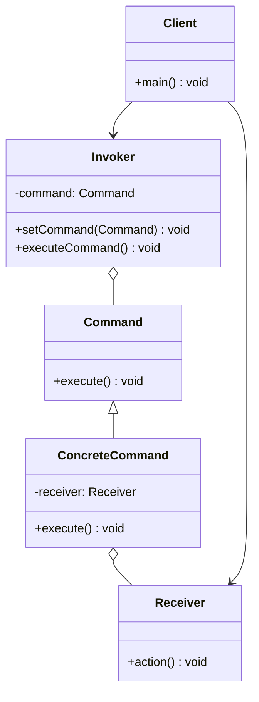
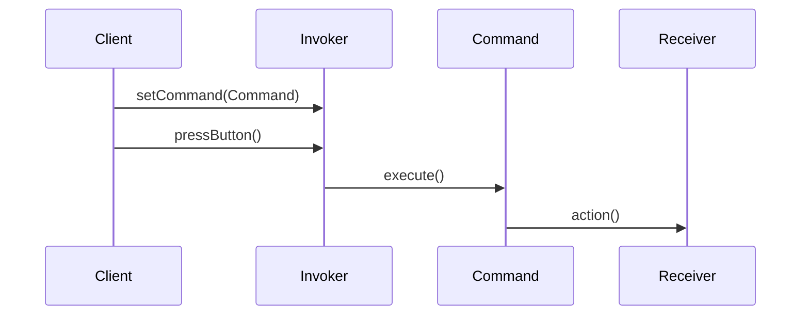

## 5.3 Command Pattern

In the realm of software design patterns, the Command Pattern stands out as a versatile solution for encapsulating requests. This pattern transforms requests into objects, allowing for parameterization of clients with queues, requests, and operations. By doing so, it decouples the sender of a request from its receiver, providing a flexible architecture that supports undo/redo operations, request logging, and more.

### Understanding the Command Pattern

The Command Pattern is a behavioral design pattern that encapsulates a request as an object, thereby allowing for parameterization of clients with different requests, queuing of requests, and logging of the requests. It also provides support for undoable operations.

#### Intent of the Command Pattern

The primary intent of the Command Pattern is to decouple the object that invokes the operation from the object that performs the operation. This separation allows for greater flexibility and control over how and when operations are executed.

#### Problem Addressed by the Command Pattern

In many software applications, there is a need to issue requests to objects without knowing anything about the operation being requested or the receiver of the request. This requirement can arise in various scenarios, such as:

- **User Interface Actions**: In GUI applications, user actions like button clicks need to trigger specific operations without the GUI knowing the details of those operations.
- **Undo/Redo Functionality**: Applications often require the ability to undo and redo operations, necessitating a way to store and manage these operations.
- **Macro Recording**: Some applications allow users to record a sequence of operations and replay them later.
- **Request Queuing**: In distributed systems, requests might need to be queued for later execution.

The Command Pattern addresses these challenges by encapsulating requests as objects, thus allowing them to be manipulated, stored, and executed independently of the request sender.

### Key Components of the Command Pattern

The Command Pattern involves several key components, each playing a crucial role in the pattern's implementation:

1. **Command**: This is an interface or abstract class that declares a method for executing a command. Concrete implementations of this interface encapsulate the details of the request.

2. **ConcreteCommand**: This class implements the Command interface and defines the binding between a Receiver object and an action. It invokes the corresponding operation(s) on the Receiver.

3. **Invoker**: This class is responsible for executing commands. It maintains a reference to the Command object and can trigger its execution. The Invoker does not know the details of the command's implementation.

4. **Receiver**: This class knows how to perform the operations associated with carrying out a request. Any class can act as a Receiver.

5. **Client**: The client creates ConcreteCommand objects and sets their Receiver. It also assigns commands to the Invoker.

### UML Diagram of the Command Pattern

To better understand the relationships between these components, let's examine a UML diagram of the Command Pattern:



### Implementing the Command Pattern in Java

Let's delve into a practical implementation of the Command Pattern in Java. We'll create a simple example where a remote control (Invoker) can execute commands to turn on and off a light (Receiver).

#### Step 1: Define the Command Interface

First, we define the `Command` interface, which declares the `execute` method.

```java
// Command.java
public interface Command {
    void execute();
}
```

#### Step 2: Create Concrete Command Classes

Next, we create concrete command classes that implement the `Command` interface. These classes will encapsulate the actions to be performed on the Receiver.

```java
// LightOnCommand.java
public class LightOnCommand implements Command {
    private Light light;

    public LightOnCommand(Light light) {
        this.light = light;
    }

    @Override
    public void execute() {
        light.turnOn();
    }
}

// LightOffCommand.java
public class LightOffCommand implements Command {
    private Light light;

    public LightOffCommand(Light light) {
        this.light = light;
    }

    @Override
    public void execute() {
        light.turnOff();
    }
}
```

#### Step 3: Implement the Receiver

The `Light` class acts as the Receiver, containing the actual operations that can be performed.

```java
// Light.java
public class Light {
    public void turnOn() {
        System.out.println("The light is on.");
    }

    public void turnOff() {
        System.out.println("The light is off.");
    }
}
```

#### Step 4: Create the Invoker

The `RemoteControl` class acts as the Invoker, which will execute the commands.

```java
// RemoteControl.java
public class RemoteControl {
    private Command command;

    public void setCommand(Command command) {
        this.command = command;
    }

    public void pressButton() {
        command.execute();
    }
}
```

#### Step 5: Assemble the Components in the Client

Finally, the `Client` sets up the commands and the invoker.

```java
// Client.java
public class Client {
    public static void main(String[] args) {
        Light light = new Light();
        Command lightOn = new LightOnCommand(light);
        Command lightOff = new LightOffCommand(light);

        RemoteControl remote = new RemoteControl();

        remote.setCommand(lightOn);
        remote.pressButton(); // Output: The light is on.

        remote.setCommand(lightOff);
        remote.pressButton(); // Output: The light is off.
    }
}
```

### Advantages of the Command Pattern

The Command Pattern offers several advantages that make it a valuable tool in software design:

- **Decoupling**: By encapsulating requests as objects, the Command Pattern decouples the sender of a request from its receiver, promoting flexibility and reducing dependencies.
- **Undo/Redo Functionality**: The pattern supports undoable operations by storing command objects and reversing their effects.
- **Request Queuing**: Commands can be queued for later execution, enabling asynchronous processing and improved performance.
- **Logging and Auditing**: Commands can be logged for auditing purposes, providing a history of executed operations.
- **Macro Recording**: The pattern facilitates macro recording by allowing sequences of commands to be stored and replayed.

### Enhancing the Command Pattern

While the basic implementation of the Command Pattern is powerful, it can be further enhanced to support additional features such as undo/redo functionality and command history.

#### Implementing Undo/Redo Functionality

To implement undo/redo functionality, we need to extend the Command interface to include an `undo` method. Concrete commands will implement this method to reverse their actions.

```java
// Command.java
public interface Command {
    void execute();
    void undo();
}

// LightOnCommand.java
public class LightOnCommand implements Command {
    private Light light;

    public LightOnCommand(Light light) {
        this.light = light;
    }

    @Override
    public void execute() {
        light.turnOn();
    }

    @Override
    public void undo() {
        light.turnOff();
    }
}

// LightOffCommand.java
public class LightOffCommand implements Command {
    private Light light;

    public LightOffCommand(Light light) {
        this.light = light;
    }

    @Override
    public void execute() {
        light.turnOff();
    }

    @Override
    public void undo() {
        light.turnOn();
    }
}
```

#### Tracking Command History

To track command history, we can maintain a stack of executed commands in the Invoker. This stack allows us to perform undo operations by popping commands from the stack and invoking their `undo` method.

```java
// RemoteControl.java
import java.util.Stack;

public class RemoteControl {
    private Command command;
    private Stack<Command> commandHistory = new Stack<>();

    public void setCommand(Command command) {
        this.command = command;
    }

    public void pressButton() {
        command.execute();
        commandHistory.push(command);
    }

    public void pressUndo() {
        if (!commandHistory.isEmpty()) {
            Command lastCommand = commandHistory.pop();
            lastCommand.undo();
        }
    }
}
```

### Try It Yourself

Now that we've explored the Command Pattern, let's encourage you to experiment with the code. Try modifying the code examples to add new commands, such as a `DimLightCommand` that dims the light. Implement the undo functionality for this new command and observe how it integrates with the existing system.

### Visualizing the Command Pattern

To further enhance your understanding, let's visualize the flow of the Command Pattern using a sequence diagram. This diagram illustrates the interactions between the Client, Invoker, Command, and Receiver.



### Knowledge Check

Before we conclude, let's reinforce your understanding with a few questions:

- What is the primary intent of the Command Pattern?
- How does the Command Pattern support undo/redo functionality?
- What are the roles of the Invoker, Command, and Receiver in the pattern?

### Conclusion

The Command Pattern is a powerful tool for encapsulating requests and decoupling the sender from the receiver. By transforming requests into objects, it provides flexibility, supports undo/redo operations, and enables request queuing and logging. As you continue your journey in software design, remember to leverage the Command Pattern to build flexible and maintainable systems.

## Quiz Time!



### What is the primary intent of the Command Pattern?

- [x] To decouple the sender of a request from its receiver
- [ ] To couple the sender and receiver tightly
- [ ] To simplify the user interface design
- [ ] To enhance database performance

> **Explanation:** The Command Pattern's primary intent is to decouple the sender of a request from its receiver, allowing for flexible request handling.

### Which component in the Command Pattern is responsible for executing commands?

- [ ] Receiver
- [ ] Client
- [x] Invoker
- [ ] Command

> **Explanation:** The Invoker is responsible for executing commands in the Command Pattern.

### How does the Command Pattern support undo functionality?

- [x] By implementing an `undo` method in the Command interface
- [ ] By using a separate undo manager
- [ ] By storing commands in a database
- [ ] By logging all operations

> **Explanation:** The Command Pattern supports undo functionality by implementing an `undo` method in the Command interface, allowing commands to reverse their actions.

### What is the role of the Receiver in the Command Pattern?

- [ ] To execute commands
- [x] To perform operations associated with a request
- [ ] To log command history
- [ ] To manage command queues

> **Explanation:** The Receiver performs the operations associated with a request in the Command Pattern.

### Which of the following is NOT an advantage of the Command Pattern?

- [ ] Supports undo/redo functionality
- [ ] Enables request queuing
- [ ] Facilitates macro recording
- [x] Increases coupling between sender and receiver

> **Explanation:** The Command Pattern decreases coupling between sender and receiver, which is one of its advantages.

### In the Command Pattern, which class is responsible for creating ConcreteCommand objects?

- [x] Client
- [ ] Invoker
- [ ] Receiver
- [ ] Command

> **Explanation:** The Client is responsible for creating ConcreteCommand objects and setting their Receivers.

### What does the Invoker maintain a reference to in the Command Pattern?

- [ ] Receiver
- [x] Command
- [ ] Client
- [ ] ConcreteCommand

> **Explanation:** The Invoker maintains a reference to the Command object in the Command Pattern.

### How can the Command Pattern facilitate macro recording?

- [x] By storing sequences of commands for later execution
- [ ] By using a separate macro manager
- [ ] By integrating with a database
- [ ] By logging all user actions

> **Explanation:** The Command Pattern facilitates macro recording by storing sequences of commands for later execution.

### Which method is used to execute a command in the Command Pattern?

- [x] execute()
- [ ] run()
- [ ] start()
- [ ] perform()

> **Explanation:** The `execute()` method is used to execute a command in the Command Pattern.

### True or False: The Command Pattern can be used to log requests for auditing purposes.

- [x] True
- [ ] False

> **Explanation:** True. The Command Pattern can log requests for auditing purposes, providing a history of executed operations.



Remember, this is just the beginning. As you progress, you'll build more complex and interactive systems using the Command Pattern. Keep experimenting, stay curious, and enjoy the journey!
