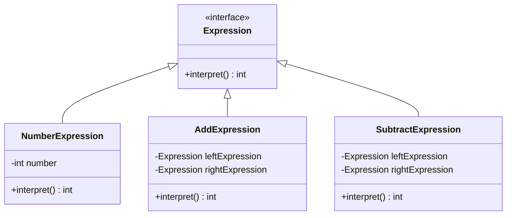

## 5.4.1 Implementing Interpreter in Java

The Interpreter design pattern is a powerful tool for defining a grammar for a language and interpreting sentences in that language. This pattern is particularly useful when you need to evaluate expressions or commands that are defined in a simple language. In this section, we will delve into the implementation of the Interpreter pattern in Java, providing you with a comprehensive guide to parsing and interpreting expressions.

### Understanding the Interpreter Pattern

The Interpreter pattern is a behavioral design pattern that defines a representation for a language's grammar along with an interpreter that uses the representation to interpret sentences in the language. This pattern is commonly used in scenarios where you need to evaluate expressions, parse commands, or interpret scripts.

#### Key Concepts

- **Grammar**: A set of rules that define the structure of valid sentences in a language.
- **Abstract Syntax Tree (AST)**: A tree representation of the abstract syntactic structure of source code.
- **Terminal and Non-Terminal Expressions**: In the context of the Interpreter pattern, terminal expressions represent the basic elements of the language, while non-terminal expressions represent the rules or grammar of the language.

### Step-by-Step Implementation

Let's walk through the process of implementing the Interpreter pattern in Java, focusing on parsing and interpreting simple arithmetic expressions.

#### Step 1: Define the Grammar

The first step in implementing the Interpreter pattern is to define the grammar for the language you want to interpret. For this example, we'll define a simple grammar for arithmetic expressions that includes addition and subtraction.

```plaintext
Expression ::= Number | Expression '+' Expression | Expression '-' Expression
Number ::= [0-9]+
```

#### Step 2: Create the Expression Interface

The `Expression` interface will define the `interpret` method, which will be implemented by all concrete expression classes.

```java
public interface Expression {
    int interpret();
}
```

#### Step 3: Implement Terminal Expressions

Terminal expressions are the basic building blocks of the language. In our example, the `NumberExpression` class represents terminal expressions.

```java
public class NumberExpression implements Expression {
    private int number;

    public NumberExpression(int number) {
        this.number = number;
    }

    @Override
    public int interpret() {
        return number;
    }
}
```

#### Step 4: Implement Non-Terminal Expressions

Non-terminal expressions define the grammar rules. We'll create two classes, `AddExpression` and `SubtractExpression`, to handle addition and subtraction.

```java
public class AddExpression implements Expression {
    private Expression leftExpression;
    private Expression rightExpression;

    public AddExpression(Expression leftExpression, Expression rightExpression) {
        this.leftExpression = leftExpression;
        this.rightExpression = rightExpression;
    }

    @Override
    public int interpret() {
        return leftExpression.interpret() + rightExpression.interpret();
    }
}

public class SubtractExpression implements Expression {
    private Expression leftExpression;
    private Expression rightExpression;

    public SubtractExpression(Expression leftExpression, Expression rightExpression) {
        this.leftExpression = leftExpression;
        this.rightExpression = rightExpression;
    }

    @Override
    public int interpret() {
        return leftExpression.interpret() - rightExpression.interpret();
    }
}
```

#### Step 5: Parse and Interpret Expressions

Now that we have our expression classes, we need to parse a string representation of an expression and interpret it. We'll create a simple parser to convert a string into an expression tree.

```java
public class ExpressionParser {
    public static Expression parse(String expression) {
        String[] tokens = expression.split(" ");
        Stack<Expression> stack = new Stack<>();

        for (String token : tokens) {
            if (token.equals("+")) {
                Expression right = stack.pop();
                Expression left = stack.pop();
                Expression add = new AddExpression(left, right);
                stack.push(add);
            } else if (token.equals("-")) {
                Expression right = stack.pop();
                Expression left = stack.pop();
                Expression subtract = new SubtractExpression(left, right);
                stack.push(subtract);
            } else {
                Expression number = new NumberExpression(Integer.parseInt(token));
                stack.push(number);
            }
        }

        return stack.pop();
    }
}
```

#### Step 6: Test the Interpreter

Let's test our interpreter with a simple expression.

```java
public class InterpreterDemo {
    public static void main(String[] args) {
        String expression = "5 3 + 2 -";
        Expression parsedExpression = ExpressionParser.parse(expression);
        int result = parsedExpression.interpret();
        System.out.println("Result: " + result); // Output: Result: 6
    }
}
```

### Recursion in Interpreting Nested Expressions

The Interpreter pattern often involves recursion, especially when dealing with nested expressions. In our example, the `interpret` method of non-terminal expressions recursively calls the `interpret` method of their child expressions.

This recursive approach allows the interpreter to evaluate complex expressions by breaking them down into simpler sub-expressions. Each sub-expression is interpreted independently, and the results are combined to produce the final result.

### Visualizing the Interpreter Pattern

To better understand the flow of the Interpreter pattern, let's visualize the process using a class diagram.



This diagram illustrates the relationships between the different expression classes and the `Expression` interface.

### Try It Yourself

Now that you have a basic understanding of the Interpreter pattern, try modifying the code to support multiplication and division. Here's a hint: you'll need to create `MultiplyExpression` and `DivideExpression` classes similar to `AddExpression` and `SubtractExpression`.

### Knowledge Check

- What is the role of terminal and non-terminal expressions in the Interpreter pattern?
- How does recursion facilitate the interpretation of nested expressions?
- Can you think of other scenarios where the Interpreter pattern might be useful?

### Further Reading

For more information on the Interpreter pattern and its applications, consider exploring the following resources:

- [Design Patterns: Elements of Reusable Object-Oriented Software](https://en.wikipedia.org/wiki/Design_Patterns) by Erich Gamma, Richard Helm, Ralph Johnson, and John Vlissides.
- [Java Design Patterns](https://www.journaldev.com/1827/java-design-patterns-example-tutorial) on JournalDev.

### Conclusion

The Interpreter pattern is a versatile tool for evaluating expressions and commands in a defined language. By defining a grammar and implementing terminal and non-terminal expressions, you can create powerful interpreters capable of parsing and interpreting complex expressions. As you continue to explore design patterns, remember to experiment with different implementations and adapt them to your specific needs.

## Quiz Time!



### What is the primary purpose of the Interpreter pattern?

- [x] To define a grammar for a language and interpret sentences in that language.
- [ ] To provide a simplified interface to a complex subsystem.
- [ ] To decouple an abstraction from its implementation.
- [ ] To allow incompatible interfaces to work together.

> **Explanation:** The Interpreter pattern is used to define a grammar for a language and interpret sentences in that language.

### Which class in the example represents terminal expressions?

- [x] NumberExpression
- [ ] AddExpression
- [ ] SubtractExpression
- [ ] ExpressionParser

> **Explanation:** The `NumberExpression` class represents terminal expressions, which are the basic elements of the language.

### What method must all classes implementing the Expression interface define?

- [x] interpret()
- [ ] parse()
- [ ] evaluate()
- [ ] execute()

> **Explanation:** All classes implementing the `Expression` interface must define the `interpret()` method.

### How are non-terminal expressions represented in the example?

- [x] By the AddExpression and SubtractExpression classes
- [ ] By the NumberExpression class
- [ ] By the ExpressionParser class
- [ ] By the InterpreterDemo class

> **Explanation:** Non-terminal expressions are represented by the `AddExpression` and `SubtractExpression` classes, which define the grammar rules.

### What is the role of the ExpressionParser class in the example?

- [x] To parse a string representation of an expression into an expression tree.
- [ ] To evaluate the final result of an expression.
- [ ] To define the grammar rules for the language.
- [ ] To represent terminal expressions.

> **Explanation:** The `ExpressionParser` class is responsible for parsing a string representation of an expression into an expression tree.

### What is the output of the InterpreterDemo class when the expression "5 3 + 2 -" is interpreted?

- [x] 6
- [ ] 8
- [ ] 0
- [ ] 10

> **Explanation:** The expression "5 3 + 2 -" is interpreted as (5 + 3) - 2, which equals 6.

### Which pattern is often used in conjunction with the Interpreter pattern to handle complex expressions?

- [x] Composite Pattern
- [ ] Singleton Pattern
- [ ] Factory Pattern
- [ ] Adapter Pattern

> **Explanation:** The Composite pattern is often used with the Interpreter pattern to handle complex expressions by representing them as a tree structure.

### What is a common use case for the Interpreter pattern?

- [x] Evaluating arithmetic expressions
- [ ] Managing object creation
- [ ] Simplifying complex subsystems
- [ ] Decoupling abstraction from implementation

> **Explanation:** A common use case for the Interpreter pattern is evaluating arithmetic expressions.

### How does recursion facilitate the interpretation of nested expressions?

- [x] By allowing each sub-expression to be interpreted independently.
- [ ] By simplifying the grammar rules.
- [ ] By reducing the number of classes needed.
- [ ] By eliminating the need for a parser.

> **Explanation:** Recursion allows each sub-expression to be interpreted independently, facilitating the interpretation of nested expressions.

### True or False: The Interpreter pattern is only useful for arithmetic expressions.

- [ ] True
- [x] False

> **Explanation:** False. The Interpreter pattern can be used for various types of expressions and commands, not just arithmetic expressions.


