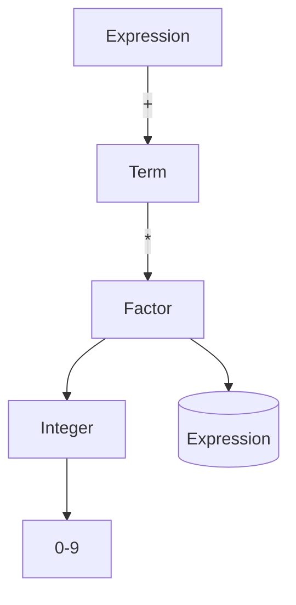

## 5.4.2 Defining Grammar with BNF

In this section, we delve into the fascinating world of defining grammars using Backus-Naur Form (BNF), a notation technique for context-free grammars, which is instrumental in the design and implementation of programming languages. As expert software engineers, understanding BNF is crucial for implementing the Interpreter Pattern effectively in Java. This section will guide you through the essentials of BNF, provide examples of defining a simple language grammar, and illustrate how these specifications translate into Java classes.

### What is BNF?

Backus-Naur Form (BNF) is a formal notation used to describe the syntax of languages, particularly programming languages. It provides a way to express the grammar of a language in a concise and clear manner. BNF is composed of a set of production rules, each defining how a symbol in the language can be constructed from other symbols.

#### Key Concepts of BNF

- **Non-Terminal Symbols**: These are symbols that can be replaced by other symbols. They are usually represented in angle brackets, e.g., `<expression>`.
- **Terminal Symbols**: These are the basic symbols from which strings are formed. They cannot be replaced further and are often represented as literals or tokens.
- **Production Rules**: These define how non-terminal symbols can be replaced by sequences of non-terminal and terminal symbols. A rule is written as `<non-terminal> ::= expression`.

### Defining a Simple Language Grammar Using BNF

To illustrate the use of BNF, let's define a simple arithmetic expression language. This language will support addition and multiplication of integers.

```bnf
<expression> ::= <term> | <expression> "+" <term>
<term> ::= <factor> | <term> "*" <factor>
<factor> ::= <integer> | "(" <expression> ")"
<integer> ::= "0" | "1" | "2" | "3" | "4" | "5" | "6" | "7" | "8" | "9"
```

#### Explanation of the Grammar

- **Expression**: An expression can be a term or an expression followed by a plus sign and another term.
- **Term**: A term can be a factor or a term followed by a multiplication sign and another factor.
- **Factor**: A factor can be an integer or an expression enclosed in parentheses.
- **Integer**: An integer is any single-digit number from 0 to 9.

### Translating BNF Specifications into Java Classes

Once we have defined the grammar using BNF, the next step is to translate these specifications into Java classes. Each non-terminal symbol can be represented by a class, and each production rule can be implemented as a method within these classes.

#### Java Class Structure

Let's create Java classes to represent the grammar rules defined above. We'll start by defining an abstract class `Expression` and then create concrete classes for `Term`, `Factor`, and `Integer`.

```java
abstract class Expression {
    abstract int interpret();
}

class Term extends Expression {
    private Expression left;
    private Expression right;
    private String operator;

    public Term(Expression left, Expression right, String operator) {
        this.left = left;
        this.right = right;
        this.operator = operator;
    }

    @Override
    int interpret() {
        switch (operator) {
            case "+":
                return left.interpret() + right.interpret();
            case "*":
                return left.interpret() * right.interpret();
            default:
                throw new UnsupportedOperationException("Operator not supported");
        }
    }
}

class Factor extends Expression {
    private Expression expression;

    public Factor(Expression expression) {
        this.expression = expression;
    }

    @Override
    int interpret() {
        return expression.interpret();
    }
}

class IntegerExpression extends Expression {
    private int value;

    public IntegerExpression(int value) {
        this.value = value;
    }

    @Override
    int interpret() {
        return value;
    }
}
```

### Implementing the Grammar Rules

With the classes in place, we can now implement the grammar rules. The `interpret` method in each class will evaluate the expression according to the rules defined in the BNF.

#### Example: Evaluating an Expression

Let's see how we can evaluate an expression like "3 + 5 * (2 + 4)" using our classes.

```java
public class InterpreterDemo {
    public static void main(String[] args) {
        Expression expression = new Term(
            new IntegerExpression(3),
            new Term(
                new IntegerExpression(5),
                new Factor(
                    new Term(
                        new IntegerExpression(2),
                        new IntegerExpression(4),
                        "+"
                    )
                ),
                "*"
            ),
            "+"
        );

        System.out.println("Result: " + expression.interpret());
    }
}
```

### Visualizing the Grammar

To better understand the structure of our grammar, let's visualize it using a diagram.



**Diagram Description**: This diagram represents the hierarchy of our grammar. An `Expression` can be a `Term`, which can be a `Factor`, which can be an `Integer` or another `Expression`.

### Try It Yourself

Now that we've walked through defining and implementing a simple grammar, it's time to experiment. Try modifying the grammar to include subtraction and division. Update the Java classes accordingly and test your implementation.

### References and Further Reading

- [Backus-Naur Form on Wikipedia](https://en.wikipedia.org/wiki/Backus%E2%80%93Naur_form)
- [Java Language Specification](https://docs.oracle.com/javase/specs/)
- [Design Patterns: Elements of Reusable Object-Oriented Software](https://en.wikipedia.org/wiki/Design_Patterns)

### Knowledge Check

- What are the key components of BNF?
- How does BNF help in defining programming languages?
- Can you extend the given grammar to support additional operations?
- How would you handle syntax errors in the interpreter?

### Embrace the Journey

Remember, mastering BNF and the Interpreter Pattern is a journey. As you continue to explore and experiment, you'll gain deeper insights into how languages are constructed and interpreted. Keep pushing the boundaries of your understanding and enjoy the process of learning and discovery!

## Quiz Time!



### What is a non-terminal symbol in BNF?

- [x] A symbol that can be replaced by other symbols
- [ ] A symbol that cannot be replaced further
- [ ] A literal or token
- [ ] A terminal symbol

> **Explanation:** Non-terminal symbols are placeholders that can be expanded into sequences of terminal and non-terminal symbols.

### What role do terminal symbols play in BNF?

- [ ] They define the grammar rules
- [x] They are the basic symbols from which strings are formed
- [ ] They are placeholders for other symbols
- [ ] They are always enclosed in angle brackets

> **Explanation:** Terminal symbols are the basic building blocks of strings in the language, representing the actual characters or tokens.

### How is a production rule represented in BNF?

- [x] `<non-terminal> ::= expression`
- [ ] `<non-terminal> -> expression`
- [ ] `non-terminal : expression`
- [ ] `expression ::= <non-terminal>`

> **Explanation:** BNF uses the `::=` symbol to define production rules, indicating how a non-terminal can be expanded.

### What does the `interpret` method do in the Java classes?

- [ ] It defines the grammar rules
- [ ] It parses the input string
- [x] It evaluates the expression according to the grammar rules
- [ ] It compiles the expression into bytecode

> **Explanation:** The `interpret` method evaluates the expression based on the grammar rules defined in the BNF.

### Which class in the Java example represents a single-digit number?

- [ ] `Expression`
- [ ] `Term`
- [ ] `Factor`
- [x] `IntegerExpression`

> **Explanation:** The `IntegerExpression` class represents a single-digit number, as defined in the BNF grammar.

### What is the purpose of the `Factor` class in the Java implementation?

- [ ] To represent addition operations
- [x] To handle parentheses and nested expressions
- [ ] To evaluate integer values
- [ ] To perform multiplication operations

> **Explanation:** The `Factor` class is used to handle nested expressions and parentheses, allowing for proper evaluation of complex expressions.

### How can you extend the grammar to support subtraction?

- [x] Add a new production rule for subtraction in the `Expression` class
- [ ] Modify the `IntegerExpression` class
- [ ] Change the `interpret` method in the `Factor` class
- [ ] Remove the `Term` class

> **Explanation:** To support subtraction, you would add a new production rule in the `Expression` class to handle the subtraction operator.

### What is the main advantage of using BNF for defining grammars?

- [ ] It simplifies the Java implementation
- [x] It provides a clear and concise way to specify language syntax
- [ ] It eliminates syntax errors
- [ ] It automatically generates Java classes

> **Explanation:** BNF provides a clear and structured way to define the syntax of a language, making it easier to understand and implement.

### True or False: BNF can only be used for programming languages.

- [ ] True
- [x] False

> **Explanation:** BNF can be used to define the grammar of any formal language, not just programming languages.

### How does the `Term` class handle different operations?

- [x] By using the `operator` field to determine the operation
- [ ] By calling the `interpret` method of the `Factor` class
- [ ] By storing multiple expressions
- [ ] By using a switch statement in the `Factor` class

> **Explanation:** The `Term` class uses the `operator` field to determine whether to perform addition or multiplication, as specified in the BNF grammar.


