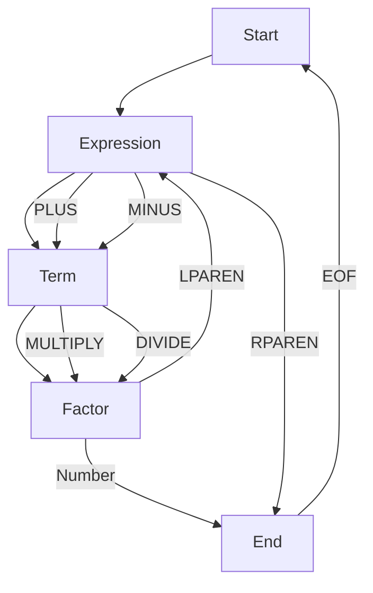

## 5.4.3 Recursive Descent Parsing

Recursive descent parsing is a top-down parsing technique that employs a set of recursive methods to process language constructs according to a defined grammar. This technique is particularly useful for interpreting programming languages, configuration files, or any structured data format. In this section, we'll delve into the concept of recursive descent parsing, demonstrate how to implement recursive parsers in Java, provide examples of parsing expressions using recursive methods, and discuss error handling and validation during parsing.

### Understanding Recursive Descent Parsing

Recursive descent parsing is a straightforward yet powerful method for parsing context-free grammars. It involves writing a set of recursive functions, each corresponding to a non-terminal in the grammar. These functions work together to parse the input string and construct a parse tree or abstract syntax tree (AST).

#### Key Concepts

- **Grammar**: A formal specification of the syntax rules of a language. Grammars are typically expressed in Backus-Naur Form (BNF) or Extended Backus-Naur Form (EBNF).
- **Non-terminal**: A symbol in the grammar that can be expanded into one or more symbols.
- **Terminal**: A symbol in the grammar that represents a literal value in the language.
- **Parse Tree/AST**: A tree representation of the syntactic structure of the input, where each node corresponds to a construct in the language.

### Implementing Recursive Descent Parsers in Java

To implement a recursive descent parser in Java, we need to define a grammar and write a set of recursive methods that adhere to this grammar. Let's consider a simple arithmetic expression grammar:

```
Expression ::= Term (( '+' | '-' ) Term)*
Term       ::= Factor (('*' | '/') Factor)*
Factor     ::= Number | '(' Expression ')'
Number     ::= [0-9]+
```

This grammar describes arithmetic expressions consisting of numbers, addition, subtraction, multiplication, and division, with support for parentheses.

#### Step-by-Step Implementation

1. **Define the Lexer**: The lexer (or tokenizer) breaks the input string into tokens, which are the smallest units of meaning (e.g., numbers, operators, parentheses).

```java
import java.util.ArrayList;
import java.util.List;

enum TokenType {
    NUMBER, PLUS, MINUS, MULTIPLY, DIVIDE, LPAREN, RPAREN, EOF
}

class Token {
    TokenType type;
    String value;

    Token(TokenType type, String value) {
        this.type = type;
        this.value = value;
    }

    @Override
    public String toString() {
        return "Token{" + "type=" + type + ", value='" + value + '\'' + '}';
    }
}

class Lexer {
    private final String text;
    private int pos = 0;
    private char currentChar;

    Lexer(String text) {
        this.text = text;
        this.currentChar = text.charAt(pos);
    }

    private void advance() {
        pos++;
        if (pos > text.length() - 1) {
            currentChar = '\0'; // Indicates end of input
        } else {
            currentChar = text.charAt(pos);
        }
    }

    private void skipWhitespace() {
        while (currentChar != '\0' && Character.isWhitespace(currentChar)) {
            advance();
        }
    }

    private Token number() {
        StringBuilder result = new StringBuilder();
        while (currentChar != '\0' && Character.isDigit(currentChar)) {
            result.append(currentChar);
            advance();
        }
        return new Token(TokenType.NUMBER, result.toString());
    }

    List<Token> tokenize() {
        List<Token> tokens = new ArrayList<>();
        while (currentChar != '\0') {
            if (Character.isWhitespace(currentChar)) {
                skipWhitespace();
                continue;
            }
            if (Character.isDigit(currentChar)) {
                tokens.add(number());
                continue;
            }
            if (currentChar == '+') {
                tokens.add(new Token(TokenType.PLUS, "+"));
                advance();
                continue;
            }
            if (currentChar == '-') {
                tokens.add(new Token(TokenType.MINUS, "-"));
                advance();
                continue;
            }
            if (currentChar == '*') {
                tokens.add(new Token(TokenType.MULTIPLY, "*"));
                advance();
                continue;
            }
            if (currentChar == '/') {
                tokens.add(new Token(TokenType.DIVIDE, "/"));
                advance();
                continue;
            }
            if (currentChar == '(') {
                tokens.add(new Token(TokenType.LPAREN, "("));
                advance();
                continue;
            }
            if (currentChar == ')') {
                tokens.add(new Token(TokenType.RPAREN, ")"));
                advance();
                continue;
            }
            throw new RuntimeException("Unexpected character: " + currentChar);
        }
        tokens.add(new Token(TokenType.EOF, ""));
        return tokens;
    }
}
```

2. **Define the Parser**: The parser uses the tokens generated by the lexer to build an AST. Each method in the parser corresponds to a grammar rule.

```java
class Parser {
    private final List<Token> tokens;
    private int currentTokenIndex = 0;
    private Token currentToken;

    Parser(List<Token> tokens) {
        this.tokens = tokens;
        this.currentToken = tokens.get(currentTokenIndex);
    }

    private void eat(TokenType type) {
        if (currentToken.type == type) {
            currentTokenIndex++;
            if (currentTokenIndex < tokens.size()) {
                currentToken = tokens.get(currentTokenIndex);
            }
        } else {
            throw new RuntimeException("Unexpected token: " + currentToken);
        }
    }

    private Node factor() {
        Token token = currentToken;
        if (token.type == TokenType.NUMBER) {
            eat(TokenType.NUMBER);
            return new NumberNode(Integer.parseInt(token.value));
        } else if (token.type == TokenType.LPAREN) {
            eat(TokenType.LPAREN);
            Node node = expression();
            eat(TokenType.RPAREN);
            return node;
        }
        throw new RuntimeException("Unexpected token: " + token);
    }

    private Node term() {
        Node node = factor();
        while (currentToken.type == TokenType.MULTIPLY || currentToken.type == TokenType.DIVIDE) {
            Token token = currentToken;
            if (token.type == TokenType.MULTIPLY) {
                eat(TokenType.MULTIPLY);
            } else if (token.type == TokenType.DIVIDE) {
                eat(TokenType.DIVIDE);
            }
            node = new BinaryOpNode(node, token, factor());
        }
        return node;
    }

    private Node expression() {
        Node node = term();
        while (currentToken.type == TokenType.PLUS || currentToken.type == TokenType.MINUS) {
            Token token = currentToken;
            if (token.type == TokenType.PLUS) {
                eat(TokenType.PLUS);
            } else if (token.type == TokenType.MINUS) {
                eat(TokenType.MINUS);
            }
            node = new BinaryOpNode(node, token, term());
        }
        return node;
    }

    Node parse() {
        return expression();
    }
}
```

3. **Define the AST Nodes**: These classes represent the nodes of the AST.

```java
abstract class Node {}

class NumberNode extends Node {
    int value;

    NumberNode(int value) {
        this.value = value;
    }

    @Override
    public String toString() {
        return "NumberNode{" + "value=" + value + '}';
    }
}

class BinaryOpNode extends Node {
    Node left;
    Token operator;
    Node right;

    BinaryOpNode(Node left, Token operator, Node right) {
        this.left = left;
        this.operator = operator;
        this.right = right;
    }

    @Override
    public String toString() {
        return "BinaryOpNode{" + "left=" + left + ", operator=" + operator + ", right=" + right + '}';
    }
}
```

### Parsing Expressions Using Recursive Methods

The recursive descent parser we implemented can parse arithmetic expressions and build an AST. Let's see how it works with an example:

```java
public class Main {
    public static void main(String[] args) {
        String input = "3 + 5 * (10 - 4)";
        Lexer lexer = new Lexer(input);
        List<Token> tokens = lexer.tokenize();
        Parser parser = new Parser(tokens);
        Node ast = parser.parse();
        System.out.println(ast);
    }
}
```

When you run this code, it will output the AST representation of the expression `3 + 5 * (10 - 4)`.

### Error Handling and Validation

Error handling is a crucial aspect of parsing. In our parser, we throw a `RuntimeException` when an unexpected token is encountered. However, in a production parser, you would want to provide more informative error messages and possibly recover from certain errors.

#### Strategies for Error Handling

1. **Descriptive Error Messages**: Provide clear and informative error messages that indicate the location and nature of the error.

2. **Error Recovery**: Implement strategies to recover from errors, such as skipping tokens until a known state is reached.

3. **Validation**: Ensure that the input adheres to the grammar rules. This includes checking for unmatched parentheses, invalid characters, etc.

### Visualizing Recursive Descent Parsing

To better understand the flow of recursive descent parsing, let's visualize the process using a flowchart. The following diagram illustrates the recursive calls made by the parser when processing an arithmetic expression.



### Try It Yourself

Now that we've covered the basics of recursive descent parsing, try modifying the code to support additional operators or functions. For example, you could add support for exponentiation or trigonometric functions. Experiment with different grammars and see how the parser handles them.

### Knowledge Check

- Explain the role of the lexer in a recursive descent parser.
- Demonstrate how to extend the parser to support additional operators.
- Discuss the importance of error handling in parsing.

### Further Reading

For more information on parsing techniques and grammars, consider the following resources:

- [The Dragon Book: Compilers: Principles, Techniques, and Tools](https://www.amazon.com/Compilers-Principles-Techniques-Tools-2nd/dp/0321486811)
- [ANTLR: Another Tool for Language Recognition](https://www.antlr.org/)

## Quiz Time!



### What is the primary purpose of recursive descent parsing?

- [x] To parse language constructs using recursive methods
- [ ] To compile code into machine language
- [ ] To optimize code execution
- [ ] To interpret bytecode

> **Explanation:** Recursive descent parsing is used to parse language constructs by employing recursive methods based on a defined grammar.

### Which component breaks the input string into tokens in a recursive descent parser?

- [x] Lexer
- [ ] Parser
- [ ] AST
- [ ] Interpreter

> **Explanation:** The lexer, also known as the tokenizer, is responsible for breaking the input string into tokens, which are the smallest units of meaning.

### What is a non-terminal in the context of grammar?

- [x] A symbol that can be expanded into one or more symbols
- [ ] A literal value in the language
- [ ] A node in the AST
- [ ] A function in the parser

> **Explanation:** A non-terminal is a symbol in the grammar that can be expanded into one or more symbols, representing a construct in the language.

### How does the parser handle unexpected tokens in the provided example?

- [x] Throws a RuntimeException
- [ ] Ignores the token
- [ ] Logs a warning
- [ ] Continues parsing

> **Explanation:** In the provided example, the parser throws a `RuntimeException` when it encounters an unexpected token.

### Which of the following is a strategy for error handling in parsers?

- [x] Descriptive Error Messages
- [ ] Ignoring Errors
- [x] Error Recovery
- [ ] Logging Only

> **Explanation:** Descriptive error messages and error recovery are strategies for handling errors in parsers, providing clarity and robustness.

### What is the role of the AST in parsing?

- [x] Represents the syntactic structure of the input
- [ ] Executes the parsed code
- [ ] Optimizes the input
- [ ] Compiles the input

> **Explanation:** The AST (Abstract Syntax Tree) represents the syntactic structure of the input, capturing the hierarchical relationships between constructs.

### Which Java class is used to represent a token in the lexer?

- [x] Token
- [ ] Node
- [ ] Lexer
- [ ] Parser

> **Explanation:** The `Token` class is used to represent a token in the lexer, encapsulating its type and value.

### What does the `factor()` method in the parser do?

- [x] Parses numbers and expressions within parentheses
- [ ] Parses addition and subtraction
- [ ] Parses multiplication and division
- [ ] Generates the AST

> **Explanation:** The `factor()` method parses numbers and expressions within parentheses, handling the lowest precedence operations.

### How can you extend the parser to support additional operators?

- [x] Add new methods corresponding to the grammar rules
- [ ] Modify the lexer only
- [ ] Change the AST structure
- [ ] Use a different programming language

> **Explanation:** To support additional operators, you can add new methods corresponding to the grammar rules in the parser.

### True or False: Recursive descent parsing is a bottom-up parsing technique.

- [ ] True
- [x] False

> **Explanation:** Recursive descent parsing is a top-down parsing technique, employing recursive methods to process language constructs.



Remember, this is just the beginning. As you progress, you'll build more complex parsers and tackle more sophisticated grammars. Keep experimenting, stay curious, and enjoy the journey!
