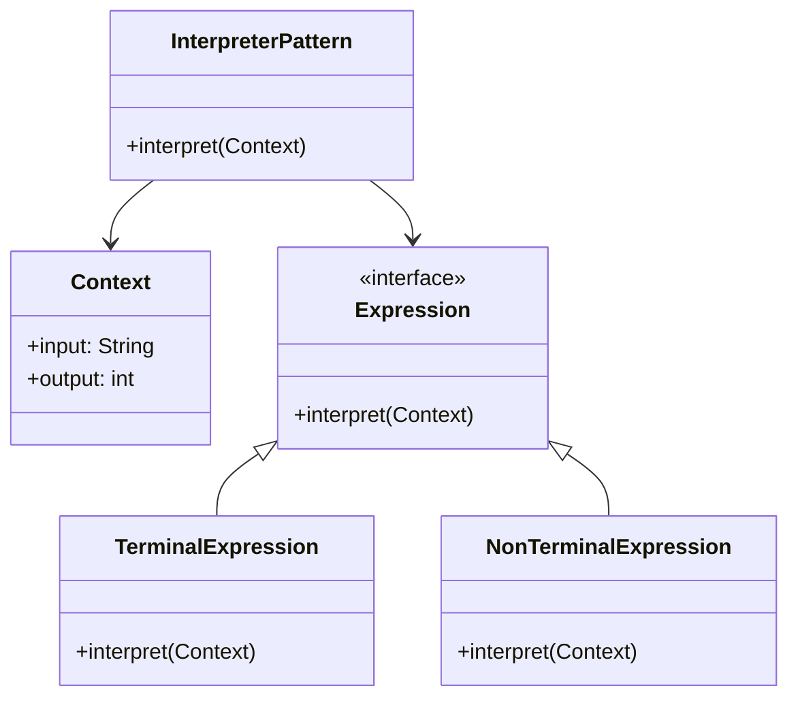
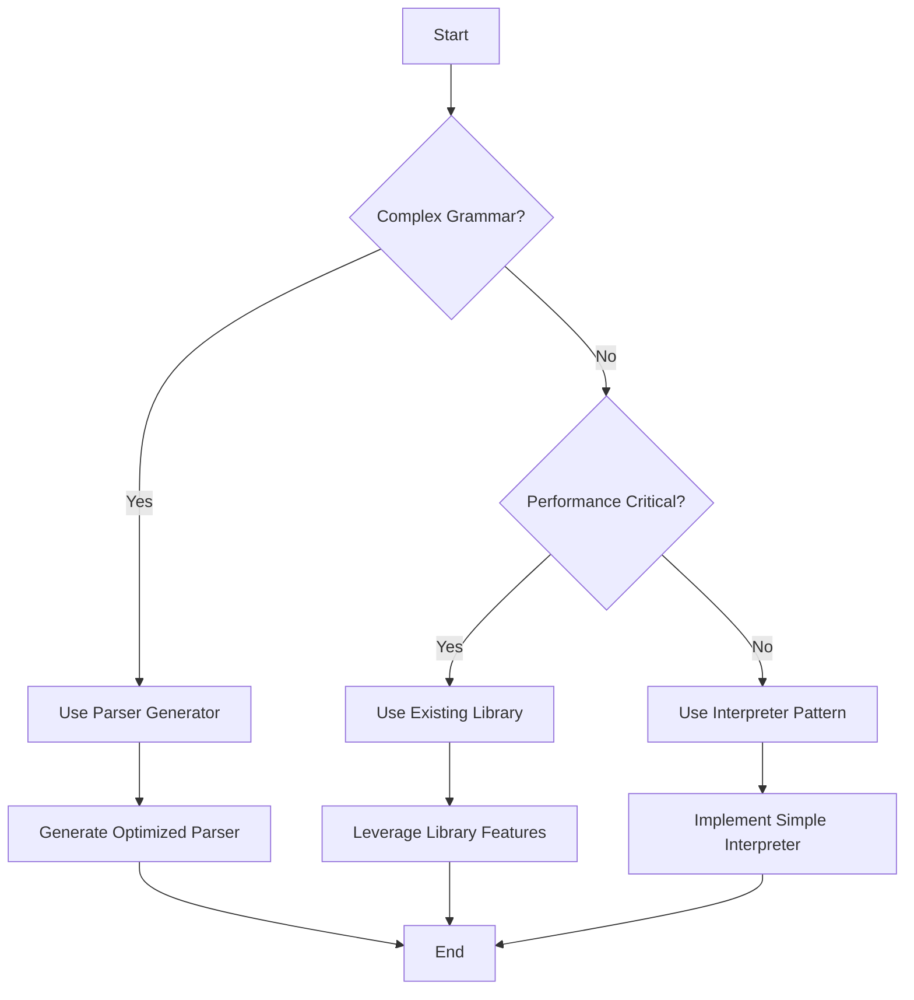

## 5.4.4 Limitations and Alternatives

The Interpreter Pattern is a powerful tool for defining a grammar and interpreting sentences in that grammar. However, like any design pattern, it comes with its own set of limitations and is not always the best fit for every situation. In this section, we will delve into the challenges associated with the Interpreter Pattern, particularly its scalability issues and performance overhead. We will also explore alternative parsing techniques that can be employed in more complex scenarios, providing guidance on selecting the most appropriate strategy for your project needs.

### Understanding the Limitations of the Interpreter Pattern

The Interpreter Pattern is primarily used to interpret expressions in a language or to evaluate sentences in a grammar. While it is useful for simple grammars and straightforward interpretation tasks, it can become cumbersome and inefficient as the complexity of the grammar increases.

#### Scalability Issues with Complex Grammars

One of the primary limitations of the Interpreter Pattern is its scalability. As the grammar becomes more complex, the number of classes required to represent each rule in the grammar increases significantly. This can lead to a proliferation of classes, making the codebase difficult to manage and maintain.

- **Class Proliferation**: Each rule in the grammar is typically represented by a class in the Interpreter Pattern. For complex grammars with many rules, this can result in a large number of classes, each with its own responsibilities. This not only increases the size of the codebase but also makes it more challenging to understand and modify.

- **Maintenance Challenges**: With a large number of classes, maintaining the code becomes a daunting task. Any change in the grammar requires modifications across multiple classes, increasing the risk of introducing errors.

- **Limited Reusability**: The classes in the Interpreter Pattern are often tightly coupled to the specific grammar they are designed to interpret. This limits their reusability in other contexts or projects.

#### Performance Overhead

The Interpreter Pattern can also introduce significant performance overhead, particularly in scenarios where the grammar is complex or the expressions to be interpreted are large.

- **Inefficient Execution**: The pattern involves interpreting expressions by traversing a tree of nodes, each representing a rule in the grammar. This can be inefficient, especially if the tree is deep or if there are many nodes to traverse.

- **Memory Consumption**: The proliferation of classes and objects can lead to increased memory consumption, which can be a concern in resource-constrained environments.

- **Slower Execution Times**: The need to create and manage a large number of objects can result in slower execution times, particularly if the interpretation process is repeated frequently.

### Alternatives to the Interpreter Pattern

Given these limitations, it is important to consider alternative parsing techniques that can offer better performance and scalability for complex grammars. Here are some alternatives to the Interpreter Pattern:

#### Parser Generators

Parser generators are tools that automatically generate parsers from a formal grammar specification. They can handle complex grammars more efficiently than the Interpreter Pattern.

- **ANTLR (Another Tool for Language Recognition)**: ANTLR is a powerful parser generator that can handle complex grammars and generate parsers in multiple programming languages, including Java. It provides a rich set of features for defining grammars and generating efficient parsers.

- **JavaCC (Java Compiler Compiler)**: JavaCC is another popular parser generator for Java. It allows you to define grammars using a simple syntax and generates parsers that can handle complex language constructs.

- **Benefits of Parser Generators**:
  - **Efficiency**: Parser generators produce highly optimized parsers that can handle complex grammars efficiently.
  - **Reduced Code Complexity**: By generating parsers automatically, parser generators reduce the need for manually writing and maintaining a large number of classes.
  - **Flexibility**: Parser generators often support advanced features such as error recovery and syntax highlighting, which can be difficult to implement manually.

#### Existing Libraries

In some cases, using existing libraries for parsing and interpreting expressions can be a more efficient and scalable solution than implementing a custom interpreter.

- **Apache Commons JEXL**: JEXL (Java Expression Language) is a library that provides a simple and efficient way to evaluate expressions in Java. It is particularly useful for applications that require dynamic expression evaluation.

- **MVEL (MVFLEX Expression Language)**: MVEL is a powerful expression language for Java that supports dynamic evaluation of expressions and is designed for high performance.

- **Benefits of Using Libraries**:
  - **Ease of Use**: Libraries provide ready-to-use functionality, reducing the need for custom implementation.
  - **Performance**: Many libraries are optimized for performance and can handle complex expressions efficiently.
  - **Community Support**: Established libraries often have active communities and extensive documentation, making it easier to find support and resources.

#### Custom Parsing Techniques

For projects with specific requirements, custom parsing techniques may be more appropriate than using a generic pattern or library.

- **Recursive Descent Parsing**: This is a top-down parsing technique that can be implemented manually to handle specific grammar rules. It offers flexibility and control over the parsing process but requires careful implementation to avoid common pitfalls such as left recursion.

- **Shunting Yard Algorithm**: Developed by Edsger Dijkstra, this algorithm is used to parse mathematical expressions and convert them from infix notation to postfix notation (Reverse Polish Notation). It is efficient for evaluating arithmetic expressions.

- **Benefits of Custom Parsing**:
  - **Tailored Solutions**: Custom parsing allows you to design a solution that is specifically tailored to the needs of your project.
  - **Control Over Performance**: By implementing your own parsing logic, you have full control over performance optimizations.

### Choosing the Appropriate Parsing Strategy

When deciding on a parsing strategy, it is important to consider the specific needs of your project, including the complexity of the grammar, performance requirements, and available resources. Here are some guidelines to help you choose the most appropriate strategy:

- **Assess the Complexity of the Grammar**: If the grammar is simple and unlikely to change, the Interpreter Pattern may be sufficient. For more complex grammars, consider using a parser generator or existing library.

- **Evaluate Performance Requirements**: If performance is a critical concern, opt for a solution that offers optimized parsing, such as a parser generator or a high-performance library.

- **Consider Maintenance and Scalability**: For projects that require frequent updates or have a large codebase, choose a solution that minimizes maintenance overhead and scales well with complexity.

- **Leverage Existing Tools and Libraries**: Whenever possible, leverage existing tools and libraries to reduce development time and effort. This also allows you to benefit from community support and ongoing improvements.

- **Experiment and Iterate**: Parsing is a complex task, and finding the right solution may require experimentation and iteration. Be open to trying different approaches and refining your strategy based on feedback and performance metrics.

### Visualizing the Alternatives

To better understand the differences between the Interpreter Pattern and alternative parsing techniques, let's visualize the process using a class diagram and a flowchart.

*Diagram 1: Class Diagram of the Interpreter Pattern*

The diagram above illustrates the structure of the Interpreter Pattern, highlighting the relationships between the `InterpreterPattern`, `Context`, `Expression`, `TerminalExpression`, and `NonTerminalExpression` classes.

*Diagram 2: Flowchart for Choosing a Parsing Strategy*

This flowchart provides a decision-making process for selecting a parsing strategy based on the complexity of the grammar and performance requirements.

### Try It Yourself

To gain a deeper understanding of the alternatives to the Interpreter Pattern, try experimenting with different parsing techniques. Here are some suggestions:

- **Modify an Existing Interpreter**: Take an existing implementation of the Interpreter Pattern and try to optimize it for performance. Measure the improvements and identify areas for further enhancement.

- **Implement a Simple Parser Generator**: Use a tool like ANTLR or JavaCC to generate a parser for a simple grammar. Compare the generated parser's performance and complexity with a manually implemented interpreter.

- **Explore Libraries**: Experiment with libraries like Apache Commons JEXL or MVEL to evaluate expressions in Java. Compare their performance and ease of use with custom implementations.

### Knowledge Check

Before moving on, let's review some key takeaways from this section:

- The Interpreter Pattern is useful for simple grammars but may not scale well for complex ones.
- Class proliferation and performance overhead are significant limitations of the Interpreter Pattern.
- Parser generators and existing libraries offer efficient alternatives for handling complex grammars.
- Custom parsing techniques provide flexibility and control but require careful implementation.
- Choosing the right parsing strategy depends on the complexity of the grammar, performance requirements, and available resources.

Remember, this is just the beginning. As you progress, you'll build more complex and efficient parsing solutions. Keep experimenting, stay curious, and enjoy the journey!

## Quiz Time!



### What is a primary limitation of the Interpreter Pattern?

- [x] Scalability issues with complex grammars
- [ ] Lack of flexibility
- [ ] Inability to handle simple grammars
- [ ] Difficulty in understanding syntax

> **Explanation:** The Interpreter Pattern struggles with scalability as the grammar complexity increases, leading to class proliferation and maintenance challenges.

### Which tool is a parser generator that can handle complex grammars?

- [x] ANTLR
- [ ] Apache Commons JEXL
- [ ] MVEL
- [ ] Java Reflection API

> **Explanation:** ANTLR is a parser generator that efficiently handles complex grammars and generates parsers in multiple languages, including Java.

### What is a benefit of using existing libraries for parsing?

- [x] Ease of use and optimized performance
- [ ] Requires extensive custom implementation
- [ ] Limited community support
- [ ] High maintenance overhead

> **Explanation:** Existing libraries provide ready-to-use functionality and are often optimized for performance, reducing the need for custom implementation.

### What is a common performance issue with the Interpreter Pattern?

- [x] Inefficient execution due to tree traversal
- [ ] Lack of support for dynamic expressions
- [ ] Inability to handle arithmetic operations
- [ ] Excessive use of memory

> **Explanation:** The Interpreter Pattern can be inefficient because it involves traversing a tree of nodes, which can be slow if the tree is large or deep.

### Which parsing technique offers full control over performance optimizations?

- [x] Custom parsing techniques
- [ ] Interpreter Pattern
- [ ] Parser generators
- [ ] Existing libraries

> **Explanation:** Custom parsing techniques allow developers to design tailored solutions and optimize performance according to specific project needs.

### What is a benefit of using parser generators?

- [x] Reduced code complexity and efficient parsing
- [ ] Requires manual implementation of parsers
- [ ] Limited to simple grammars
- [ ] High memory consumption

> **Explanation:** Parser generators automatically generate parsers from grammar specifications, reducing code complexity and handling complex grammars efficiently.

### Which library is known for dynamic expression evaluation in Java?

- [x] MVEL
- [ ] ANTLR
- [ ] JavaCC
- [ ] Apache Commons Lang

> **Explanation:** MVEL is a powerful expression language for Java that supports dynamic evaluation of expressions and is designed for high performance.

### What is a key consideration when choosing a parsing strategy?

- [x] Complexity of the grammar and performance requirements
- [ ] Availability of hardware resources
- [ ] Popularity of the parsing technique
- [ ] Number of developers in the team

> **Explanation:** The complexity of the grammar and performance requirements are crucial factors in determining the most suitable parsing strategy.

### Which algorithm is used to convert infix notation to postfix notation?

- [x] Shunting Yard Algorithm
- [ ] Recursive Descent Parsing
- [ ] Bubble Sort Algorithm
- [ ] Dijkstra's Shortest Path Algorithm

> **Explanation:** The Shunting Yard Algorithm, developed by Edsger Dijkstra, is used to parse mathematical expressions and convert them from infix to postfix notation.

### True or False: The Interpreter Pattern is always the best choice for parsing complex grammars.

- [ ] True
- [x] False

> **Explanation:** False. The Interpreter Pattern is not always the best choice for complex grammars due to scalability and performance limitations. Alternatives like parser generators or existing libraries may be more suitable.


