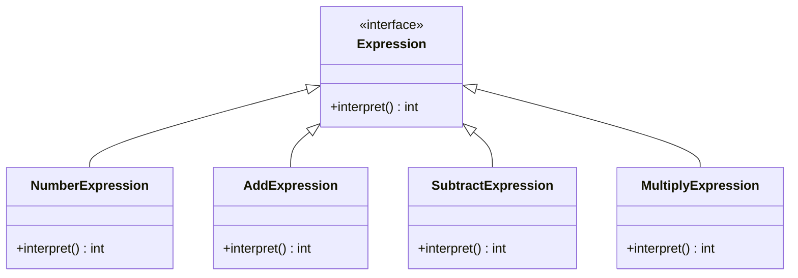

## 5.4.5 Use Cases and Examples

The Interpreter pattern is a powerful tool in the software engineer's toolkit, particularly when it comes to designing systems that require the evaluation of expressions or the execution of instructions defined in a domain-specific language (DSL). This pattern is especially useful in scenarios like scripting engines, mathematical expression evaluators, and configuration parsers. In this section, we will delve into practical applications of the Interpreter pattern, demonstrating its utility through real-world examples and code snippets.

### Real-World Applications of the Interpreter Pattern

The Interpreter pattern is typically applied in situations where there is a need to interpret sentences in a language. This can include:

1. **Scripting Languages**: Many applications incorporate scripting languages to allow users to automate tasks or customize behavior. The Interpreter pattern can be used to parse and execute scripts written in these languages.

2. **Mathematical Expression Evaluation**: Calculators and other applications that require the evaluation of mathematical expressions can benefit from the Interpreter pattern. It allows for the dynamic evaluation of expressions entered by users.

3. **Configuration Files**: Applications often need to read and interpret configuration files. The Interpreter pattern can be used to parse these files and apply the configurations.

4. **Command Processing**: In systems where commands are represented as strings or other data structures, the Interpreter pattern can be used to parse and execute these commands.

5. **Data Validation**: The pattern can be used to validate data against a set of rules defined in a language.

Let's explore some of these use cases in detail, with a focus on scripting languages and mathematical expression evaluation.

### Implementing a Simple Calculator Using the Interpreter Pattern

One of the classic examples of the Interpreter pattern is a simple calculator that can evaluate mathematical expressions. This example will demonstrate how the pattern can be used to parse and evaluate expressions like "3 + 5 * (2 - 4)".

#### Step-by-Step Implementation

1. **Define the Grammar**: The first step is to define the grammar of the language. For our calculator, the grammar might include rules for numbers, operators, and parentheses.

2. **Create Expression Classes**: Each rule in the grammar is represented by a class. For example, we might have classes for `NumberExpression`, `AddExpression`, `SubtractExpression`, etc.

3. **Implement the Interpreter**: Each class implements an `interpret` method that evaluates the expression it represents.

4. **Build the Expression Tree**: Parse the input expression and build a tree of expression objects.

5. **Evaluate the Expression**: Traverse the tree and evaluate the expression.

#### Code Example

Let's look at a Java implementation of a simple calculator using the Interpreter pattern.

```java
// Abstract Expression
interface Expression {
    int interpret();
}

// Terminal Expression for Numbers
class NumberExpression implements Expression {
    private int number;

    public NumberExpression(int number) {
        this.number = number;
    }

    @Override
    public int interpret() {
        return number;
    }
}

// Non-terminal Expression for Addition
class AddExpression implements Expression {
    private Expression leftExpression;
    private Expression rightExpression;

    public AddExpression(Expression leftExpression, Expression rightExpression) {
        this.leftExpression = leftExpression;
        this.rightExpression = rightExpression;
    }

    @Override
    public int interpret() {
        return leftExpression.interpret() + rightExpression.interpret();
    }
}

// Non-terminal Expression for Subtraction
class SubtractExpression implements Expression {
    private Expression leftExpression;
    private Expression rightExpression;

    public SubtractExpression(Expression leftExpression, Expression rightExpression) {
        this.leftExpression = leftExpression;
        this.rightExpression = rightExpression;
    }

    @Override
    public int interpret() {
        return leftExpression.interpret() - rightExpression.interpret();
    }
}

// Client
public class InterpreterDemo {
    public static void main(String[] args) {
        // Example: (3 + 5) - 2
        Expression expression = new SubtractExpression(
            new AddExpression(new NumberExpression(3), new NumberExpression(5)),
            new NumberExpression(2)
        );

        System.out.println("Result: " + expression.interpret()); // Output: 6
    }
}
```

In this example, we define an abstract `Expression` interface with an `interpret` method. We then create concrete classes for numbers and operations like addition and subtraction. The `InterpreterDemo` class builds an expression tree and evaluates it.

### Implementing a Scripting Engine

Another practical application of the Interpreter pattern is in scripting engines, where users can write scripts to automate tasks. Let's implement a simple scripting engine that can execute basic commands.

#### Step-by-Step Implementation

1. **Define the Command Grammar**: Define the syntax of the scripting language, including commands and their parameters.

2. **Create Command Classes**: Each command is represented by a class that implements an `execute` method.

3. **Implement the Interpreter**: The interpreter parses the script and executes each command.

4. **Extend the Language**: Easily add new commands by creating new classes.

#### Code Example

Here's a simple scripting engine that supports a few basic commands.

```java
// Command Interface
interface Command {
    void execute();
}

// Concrete Command for Printing
class PrintCommand implements Command {
    private String message;

    public PrintCommand(String message) {
        this.message = message;
    }

    @Override
    public void execute() {
        System.out.println(message);
    }
}

// Concrete Command for Waiting
class WaitCommand implements Command {
    private int seconds;

    public WaitCommand(int seconds) {
        this.seconds = seconds;
    }

    @Override
    public void execute() {
        try {
            Thread.sleep(seconds * 1000);
        } catch (InterruptedException e) {
            Thread.currentThread().interrupt();
        }
    }
}

// Interpreter
class ScriptInterpreter {
    public void interpret(String script) {
        String[] commands = script.split(";");
        for (String command : commands) {
            if (command.startsWith("print")) {
                String message = command.substring("print".length()).trim();
                new PrintCommand(message).execute();
            } else if (command.startsWith("wait")) {
                int seconds = Integer.parseInt(command.substring("wait".length()).trim());
                new WaitCommand(seconds).execute();
            }
        }
    }
}

// Client
public class ScriptingDemo {
    public static void main(String[] args) {
        String script = "print Hello, World!; wait 2; print Done!";
        ScriptInterpreter interpreter = new ScriptInterpreter();
        interpreter.interpret(script);
    }
}
```

In this example, we define a simple scripting language with `print` and `wait` commands. The `ScriptInterpreter` class parses the script and executes each command. The language can be easily extended by adding new command classes.

### Simplifying the Addition of New Language Features

One of the key benefits of the Interpreter pattern is its ability to simplify the addition of new language features. By encapsulating each feature in its own class, we can add new features without modifying existing code. This makes the system more maintainable and extensible.

#### Example: Adding Multiplication to the Calculator

To add multiplication to our calculator, we simply create a new `MultiplyExpression` class:

```java
// Non-terminal Expression for Multiplication
class MultiplyExpression implements Expression {
    private Expression leftExpression;
    private Expression rightExpression;

    public MultiplyExpression(Expression leftExpression, Expression rightExpression) {
        this.leftExpression = leftExpression;
        this.rightExpression = rightExpression;
    }

    @Override
    public int interpret() {
        return leftExpression.interpret() * rightExpression.interpret();
    }
}
```

We can then use this class to build expressions that include multiplication, without changing any existing code.

### Visualizing the Interpreter Pattern

To better understand the structure of the Interpreter pattern, let's visualize it using a class diagram.



This diagram shows the relationship between the abstract `Expression` interface and its concrete implementations. Each concrete class represents a rule in the grammar and implements the `interpret` method.

### Try It Yourself

To deepen your understanding of the Interpreter pattern, try extending the examples provided:

- **Add New Operations**: Extend the calculator to support division or exponentiation.
- **Enhance the Scripting Engine**: Add new commands to the scripting language, such as conditional statements or loops.
- **Create a Configuration Parser**: Implement a parser that reads and interprets a configuration file format.

### Knowledge Check

Before we wrap up, let's review some key concepts:

- **What is the primary role of the Interpreter pattern?** It provides a way to evaluate sentences in a language by representing each rule in the grammar as a class.
- **How does the Interpreter pattern simplify the addition of new language features?** By encapsulating each feature in its own class, new features can be added without modifying existing code.

### Conclusion

The Interpreter pattern is a versatile design pattern that can be applied to a wide range of problems involving the interpretation of expressions or commands. By encapsulating each rule in the grammar as a class, the pattern provides a flexible and extensible way to evaluate sentences in a language. Whether you're building a calculator, a scripting engine, or a configuration parser, the Interpreter pattern can help you design a system that is both powerful and easy to extend.

## Quiz Time!



### Which of the following is a typical use case for the Interpreter pattern?

- [x] Scripting languages
- [ ] Database transactions
- [ ] Network protocols
- [ ] UI rendering

> **Explanation:** The Interpreter pattern is often used in scripting languages to parse and execute scripts.


### What is the main advantage of using the Interpreter pattern?

- [x] Simplifies the addition of new language features
- [ ] Improves performance
- [ ] Reduces memory usage
- [ ] Enhances security

> **Explanation:** The Interpreter pattern simplifies the addition of new language features by encapsulating each feature in its own class.


### In the provided calculator example, what does the `interpret` method do?

- [x] Evaluates the expression represented by the class
- [ ] Parses the input string
- [ ] Formats the output
- [ ] Logs the operation

> **Explanation:** The `interpret` method evaluates the expression represented by the class, returning the result.


### How can you extend the scripting engine example to support new commands?

- [x] Create new command classes
- [ ] Modify the existing command classes
- [ ] Change the script syntax
- [ ] Update the interpreter's main loop

> **Explanation:** To support new commands, you can create new command classes and update the interpreter to recognize them.


### What is the role of the `Expression` interface in the calculator example?

- [x] Defines a common method for evaluating expressions
- [ ] Stores the result of the expression
- [ ] Parses the input string
- [ ] Logs the evaluation process

> **Explanation:** The `Expression` interface defines a common method for evaluating expressions, which is implemented by concrete classes.


### Which pattern is often used in conjunction with the Interpreter pattern to handle complex parsing?

- [x] Composite Pattern
- [ ] Singleton Pattern
- [ ] Observer Pattern
- [ ] Factory Pattern

> **Explanation:** The Composite Pattern is often used with the Interpreter pattern to handle complex parsing by representing hierarchical structures.


### What is a potential drawback of the Interpreter pattern?

- [x] Can lead to a large number of classes
- [ ] Difficult to implement
- [ ] Poor performance
- [ ] Limited flexibility

> **Explanation:** The Interpreter pattern can lead to a large number of classes, as each rule in the grammar is represented by a class.


### How does the Interpreter pattern relate to domain-specific languages (DSLs)?

- [x] It provides a way to interpret DSLs
- [ ] It is used to compile DSLs
- [ ] It replaces DSLs
- [ ] It is unrelated to DSLs

> **Explanation:** The Interpreter pattern provides a way to interpret DSLs by defining a class for each rule in the language.


### What is the benefit of using the Interpreter pattern for configuration file parsing?

- [x] Allows for flexible and extensible parsing
- [ ] Increases parsing speed
- [ ] Reduces memory usage
- [ ] Simplifies file I/O operations

> **Explanation:** The Interpreter pattern allows for flexible and extensible parsing by representing each configuration rule as a class.


### True or False: The Interpreter pattern is ideal for performance-critical applications.

- [ ] True
- [x] False

> **Explanation:** The Interpreter pattern is not ideal for performance-critical applications due to the potential for a large number of classes and the overhead of interpreting expressions.



Remember, this is just the beginning. As you progress, you'll build more complex and interactive systems using the Interpreter pattern. Keep experimenting, stay curious, and enjoy the journey!
