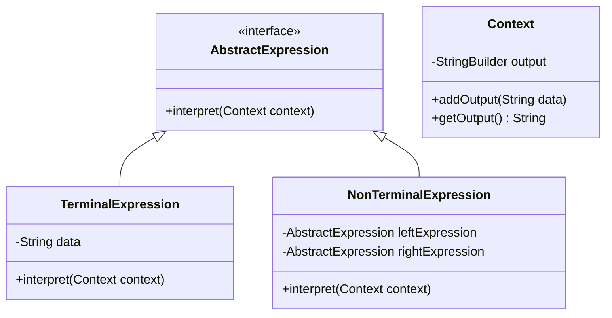
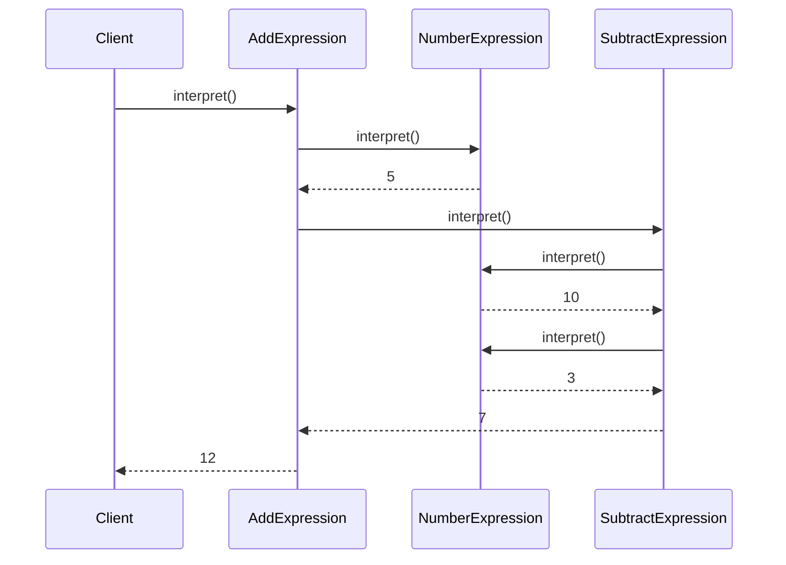

## 5.4 Interpreter Pattern

In the realm of software engineering, the Interpreter Pattern plays a pivotal role in defining a grammar for a language and providing an interpreter to process and execute sentences in that language. This pattern is particularly useful in scenarios where you need to interpret or execute a set of instructions or expressions. Let's delve into the intricacies of the Interpreter Pattern, its structure, and its application in Java.

### Understanding the Interpreter Pattern

The Interpreter Pattern is a behavioral design pattern that provides a way to evaluate language grammar or expression. It is used to interpret sentences in a language, where each sentence is represented as an abstract syntax tree (AST) of expressions. The pattern is particularly useful for implementing small languages or scripting engines, where you can define a grammar and execute commands based on that grammar.

#### Intent of the Interpreter Pattern

The primary intent of the Interpreter Pattern is to define a representation for a grammar of a language and an interpreter that uses this representation to interpret sentences in the language. This pattern is often used in scenarios where you need to parse and evaluate expressions, such as mathematical expressions, configuration files, or domain-specific languages (DSLs).

### Problems Solved by the Interpreter Pattern

The Interpreter Pattern is adept at solving problems related to parsing and interpreting text. Here are some common scenarios where this pattern is beneficial:

- **Expression Evaluation**: Evaluating mathematical expressions or logical conditions.
- **Configuration Parsing**: Interpreting configuration files or scripts.
- **Command Execution**: Executing commands in a scripting language or command-line interface.
- **Domain-Specific Languages (DSLs)**: Implementing small languages tailored to specific problem domains.

### Structure of the Interpreter Pattern

The structure of the Interpreter Pattern involves several key components, each playing a crucial role in interpreting expressions. Let's explore these components:

#### AbstractExpression

The `AbstractExpression` class defines the interface for interpreting expressions. It declares an `interpret` method that all concrete expression classes must implement. This method takes a context as an argument and evaluates the expression based on the context.

```java
public interface AbstractExpression {
    void interpret(Context context);
}
```

#### TerminalExpression

The `TerminalExpression` class represents the leaf nodes in the abstract syntax tree. These are the basic elements of the language, such as numbers or variables, that do not require further interpretation.

```java
public class TerminalExpression implements AbstractExpression {
    private String data;

    public TerminalExpression(String data) {
        this.data = data;
    }

    @Override
    public void interpret(Context context) {
        // Interpret the terminal expression
        context.addOutput(data);
    }
}
```

#### NonTerminalExpression

The `NonTerminalExpression` class represents the composite nodes in the abstract syntax tree. These nodes are composed of other expressions and require recursive interpretation.

```java
public class NonTerminalExpression implements AbstractExpression {
    private AbstractExpression leftExpression;
    private AbstractExpression rightExpression;

    public NonTerminalExpression(AbstractExpression left, AbstractExpression right) {
        this.leftExpression = left;
        this.rightExpression = right;
    }

    @Override
    public void interpret(Context context) {
        // Interpret the non-terminal expression
        leftExpression.interpret(context);
        rightExpression.interpret(context);
    }
}
```

#### Context

The `Context` class contains information that is global to the interpreter. It is used to store and share data between expressions during interpretation.

```java
public class Context {
    private StringBuilder output = new StringBuilder();

    public void addOutput(String data) {
        output.append(data).append(" ");
    }

    public String getOutput() {
        return output.toString();
    }
}
```

### UML Diagram of the Interpreter Pattern

To better understand the structure and relationships between the components of the Interpreter Pattern, let's visualize it using a UML class diagram.



### Implementing the Interpreter Pattern in Java

Let's implement a simple example of the Interpreter Pattern in Java. We'll create a basic interpreter for a language that can evaluate simple mathematical expressions.

#### Step 1: Define the AbstractExpression Interface

First, we define the `AbstractExpression` interface, which declares the `interpret` method.

```java
public interface AbstractExpression {
    int interpret();
}
```

#### Step 2: Implement TerminalExpression for Numbers

Next, we implement the `TerminalExpression` class to represent numbers in our expressions.

```java
public class NumberExpression implements AbstractExpression {
    private int number;

    public NumberExpression(int number) {
        this.number = number;
    }

    @Override
    public int interpret() {
        return number;
    }
}
```

#### Step 3: Implement NonTerminalExpression for Addition

We then implement the `NonTerminalExpression` class to represent addition operations.

```java
public class AddExpression implements AbstractExpression {
    private AbstractExpression leftExpression;
    private AbstractExpression rightExpression;

    public AddExpression(AbstractExpression left, AbstractExpression right) {
        this.leftExpression = left;
        this.rightExpression = right;
    }

    @Override
    public int interpret() {
        return leftExpression.interpret() + rightExpression.interpret();
    }
}
```

#### Step 4: Implement NonTerminalExpression for Subtraction

Similarly, we implement the `NonTerminalExpression` class for subtraction operations.

```java
public class SubtractExpression implements AbstractExpression {
    private AbstractExpression leftExpression;
    private AbstractExpression rightExpression;

    public SubtractExpression(AbstractExpression left, AbstractExpression right) {
        this.leftExpression = left;
        this.rightExpression = right;
    }

    @Override
    public int interpret() {
        return leftExpression.interpret() - rightExpression.interpret();
    }
}
```

#### Step 5: Create the Context and Evaluate Expressions

Finally, we create a context and evaluate expressions using our interpreter.

```java
public class InterpreterDemo {
    public static void main(String[] args) {
        AbstractExpression expression = new AddExpression(
            new NumberExpression(5),
            new SubtractExpression(
                new NumberExpression(10),
                new NumberExpression(3)
            )
        );

        int result = expression.interpret();
        System.out.println("Result: " + result); // Output: Result: 12
    }
}
```

### Limitations of the Interpreter Pattern

While the Interpreter Pattern is powerful, it has some limitations that developers should be aware of:

- **Performance**: The pattern can become inefficient for complex grammars or large expressions due to the recursive nature of interpretation.
- **Scalability**: As the grammar grows, the number of classes required can increase significantly, leading to maintenance challenges.
- **Complexity**: Implementing a full-fledged interpreter for a complex language can be challenging and may require additional patterns or techniques.

### When to Use the Interpreter Pattern

The Interpreter Pattern is suitable in the following scenarios:

- When you have a simple grammar to interpret.
- When you need to evaluate expressions dynamically at runtime.
- When you are implementing a small language or DSL.

However, for more complex languages or performance-critical applications, consider alternatives such as parser generators or other parsing techniques.

### Try It Yourself

To deepen your understanding of the Interpreter Pattern, try modifying the example code to support additional operations, such as multiplication or division. Experiment with different expressions and observe how the interpreter evaluates them.

### Visualizing the Interpreter Pattern

To further illustrate the flow of the Interpreter Pattern, let's visualize the process of interpreting a mathematical expression using a sequence diagram.



### Knowledge Check

Before moving on, take a moment to reflect on what you've learned about the Interpreter Pattern. Consider the following questions:

- How does the Interpreter Pattern help in evaluating expressions?
- What are the key components of the Interpreter Pattern?
- When might the Interpreter Pattern not be the best choice?

### Embrace the Journey

Remember, mastering design patterns is a journey. The Interpreter Pattern is just one of many tools in your software engineering toolkit. As you continue to explore and experiment, you'll gain a deeper understanding of how to apply these patterns effectively in your projects. Keep experimenting, stay curious, and enjoy the journey!

## Quiz Time!



### What is the primary intent of the Interpreter Pattern?

- [x] To define a representation for a grammar of a language and an interpreter to interpret sentences in the language.
- [ ] To provide a way to access elements of a collection sequentially without exposing the underlying representation.
- [ ] To encapsulate a request as an object, allowing parameterization and queuing.
- [ ] To define a one-to-many dependency so that when one object changes state, all its dependents are notified.

> **Explanation:** The Interpreter Pattern is intended to define a grammar and provide an interpreter to process and execute sentences in that language.

### Which class in the Interpreter Pattern represents the leaf nodes in the abstract syntax tree?

- [x] TerminalExpression
- [ ] NonTerminalExpression
- [ ] Context
- [ ] AbstractExpression

> **Explanation:** The TerminalExpression class represents the leaf nodes in the abstract syntax tree, which are the basic elements of the language.

### What is a key limitation of the Interpreter Pattern?

- [x] Performance can become inefficient for complex grammars or large expressions.
- [ ] It cannot be used for evaluating mathematical expressions.
- [ ] It is not suitable for implementing small languages or DSLs.
- [ ] It requires a large number of external libraries.

> **Explanation:** The Interpreter Pattern can become inefficient for complex grammars or large expressions due to its recursive nature.

### In the Interpreter Pattern, what role does the Context class play?

- [x] It contains information that is global to the interpreter and is used to store and share data between expressions.
- [ ] It represents the leaf nodes in the abstract syntax tree.
- [ ] It defines the interface for interpreting expressions.
- [ ] It represents the composite nodes in the abstract syntax tree.

> **Explanation:** The Context class contains global information and is used to store and share data between expressions during interpretation.

### What is the function of the NonTerminalExpression class?

- [x] It represents composite nodes in the abstract syntax tree and requires recursive interpretation.
- [ ] It defines the interface for interpreting expressions.
- [ ] It represents the leaf nodes in the abstract syntax tree.
- [ ] It contains information that is global to the interpreter.

> **Explanation:** The NonTerminalExpression class represents composite nodes in the abstract syntax tree and requires recursive interpretation.

### When is the Interpreter Pattern particularly useful?

- [x] When you need to parse and evaluate expressions, such as mathematical expressions or configuration files.
- [ ] When you need to provide a way to access elements of a collection sequentially.
- [ ] When you need to encapsulate a request as an object.
- [ ] When you need to define a one-to-many dependency for state changes.

> **Explanation:** The Interpreter Pattern is useful for parsing and evaluating expressions, such as mathematical expressions or configuration files.

### What is a potential alternative to the Interpreter Pattern for more complex languages?

- [x] Parser generators or other parsing techniques.
- [ ] Using the Observer Pattern.
- [ ] Implementing a custom collection framework.
- [ ] Utilizing the Singleton Pattern.

> **Explanation:** For more complex languages or performance-critical applications, parser generators or other parsing techniques may be more suitable.

### What is the role of the AbstractExpression interface?

- [x] It declares the interpret method that all concrete expression classes must implement.
- [ ] It represents the leaf nodes in the abstract syntax tree.
- [ ] It contains information that is global to the interpreter.
- [ ] It represents composite nodes in the abstract syntax tree.

> **Explanation:** The AbstractExpression interface declares the interpret method that all concrete expression classes must implement.

### True or False: The Interpreter Pattern is suitable for implementing large, complex languages.

- [ ] True
- [x] False

> **Explanation:** The Interpreter Pattern is not suitable for large, complex languages due to potential performance inefficiencies and scalability issues.

### Which of the following is a common use case for the Interpreter Pattern?

- [x] Implementing a small language or domain-specific language (DSL).
- [ ] Managing concurrent access to resources.
- [ ] Providing a simplified interface to a complex subsystem.
- [ ] Defining a family of algorithms and making them interchangeable.

> **Explanation:** A common use case for the Interpreter Pattern is implementing a small language or domain-specific language (DSL).


