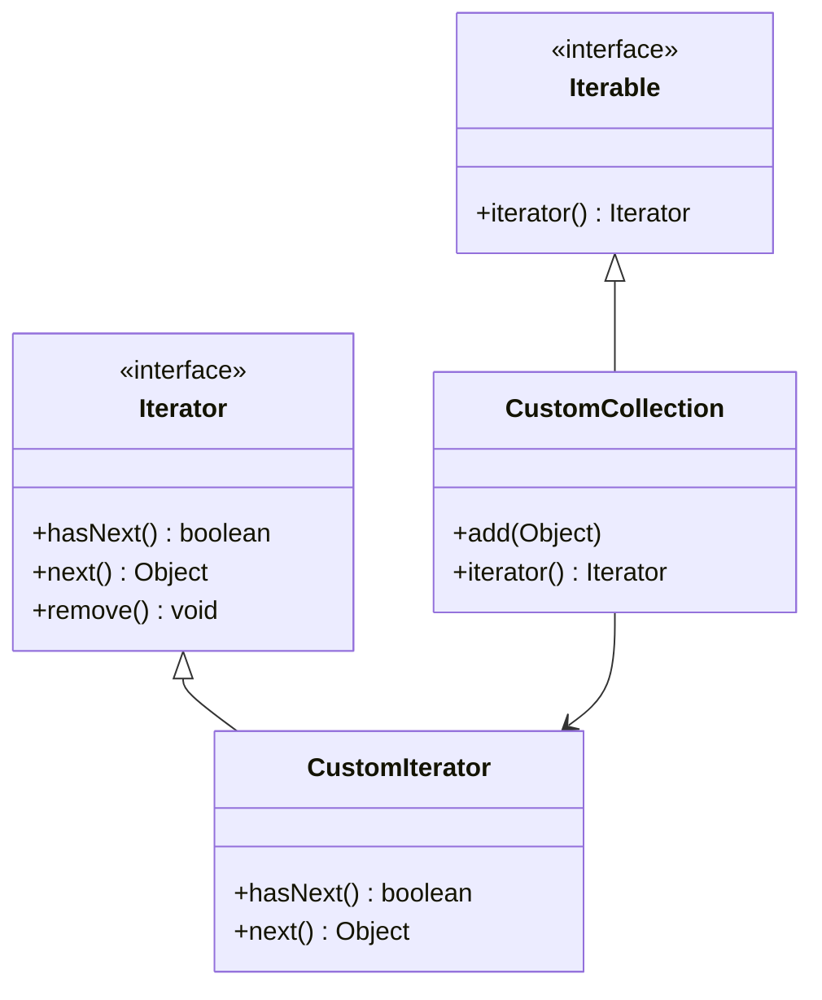

## 5.5.1 Implementing Iterator in Java

In the world of software engineering, efficiently traversing collections is a fundamental task. Java provides a robust mechanism for this through the `Iterator` and `Iterable` interfaces. Understanding and implementing these interfaces not only enhances your ability to work with collections but also aligns with the principles of clean and maintainable code. In this section, we will delve into the intricacies of these interfaces, explore how to implement custom iterators, and discuss best practices for their use.

### Understanding the `Iterator` and `Iterable` Interfaces

Before we dive into implementation, let's first understand what the `Iterator` and `Iterable` interfaces are and how they function within Java's collection framework.

#### The `Iterable` Interface

The `Iterable` interface is a part of the `java.lang` package and is the root interface for all collection classes. It represents a collection of objects that can be iterated over. The primary method in this interface is:

```java
public interface Iterable<T> {
    Iterator<T> iterator();
}
```

- **`iterator()`**: This method returns an `Iterator` over elements of type `T`. It is the only method in the `Iterable` interface and is crucial for enabling the enhanced for-loop (also known as the "for-each" loop) in Java.

#### The `Iterator` Interface

The `Iterator` interface is a part of the `java.util` package and provides methods to iterate over a collection. It includes the following methods:

```java
public interface Iterator<E> {
    boolean hasNext();
    E next();
    default void remove() {
        throw new UnsupportedOperationException("remove");
    }
}
```

- **`hasNext()`**: Returns `true` if the iteration has more elements.
- **`next()`**: Returns the next element in the iteration.
- **`remove()`**: Removes from the underlying collection the last element returned by this iterator (optional operation).

### Implementing Custom Iterators

Now that we have a basic understanding of the `Iterator` and `Iterable` interfaces, let's explore how to implement a custom iterator for a custom collection. This is particularly useful when you need to traverse a non-standard data structure or apply specific iteration logic.

#### Creating a Custom Collection

Suppose we have a simple custom collection called `CustomCollection` that stores elements in an array. We want to create an iterator for this collection.

```java
import java.util.Iterator;

public class CustomCollection<T> implements Iterable<T> {
    private T[] elements;
    private int size = 0;

    @SuppressWarnings("unchecked")
    public CustomCollection(int capacity) {
        elements = (T[]) new Object[capacity];
    }

    public void add(T element) {
        if (size < elements.length) {
            elements[size++] = element;
        } else {
            throw new IllegalStateException("Collection is full");
        }
    }

    @Override
    public Iterator<T> iterator() {
        return new CustomIterator();
    }

    private class CustomIterator implements Iterator<T> {
        private int currentIndex = 0;

        @Override
        public boolean hasNext() {
            return currentIndex < size;
        }

        @Override
        public T next() {
            if (!hasNext()) {
                throw new IllegalStateException("No more elements");
            }
            return elements[currentIndex++];
        }
    }
}
```

In this example, `CustomCollection` implements the `Iterable` interface, which requires the implementation of the `iterator()` method. The `CustomIterator` class implements the `Iterator` interface, providing the logic for `hasNext()` and `next()`.

### Using Enhanced For-Loops with the `Iterable` Interface

The enhanced for-loop in Java provides a clean and concise way to iterate over collections that implement the `Iterable` interface. Let's see how it works with our `CustomCollection`.

```java
public class Main {
    public static void main(String[] args) {
        CustomCollection<String> collection = new CustomCollection<>(5);
        collection.add("Java");
        collection.add("Design");
        collection.add("Patterns");

        for (String element : collection) {
            System.out.println(element);
        }
    }
}
```

In this code, the enhanced for-loop automatically uses the iterator returned by the `iterator()` method of `CustomCollection`, iterating over each element and printing it.

### Best Practices for Iterator Implementation

Implementing iterators involves more than just writing code. It requires adhering to best practices to ensure that your iterators are efficient, robust, and maintainable.

#### Ensure Consistency

- **Consistent State**: Ensure that the iterator's state is consistent with the collection's state. If the collection is modified after the iterator is created, the iterator should reflect these changes or throw a `ConcurrentModificationException`.

#### Implement `remove()` Judiciously

- **Optional Operation**: The `remove()` method is optional. If you choose to implement it, ensure it modifies the underlying collection correctly. If not implemented, it should throw `UnsupportedOperationException`.

#### Avoid Concurrent Modification

- **Fail-Fast Behavior**: Consider implementing fail-fast behavior to detect concurrent modifications. This can be achieved by maintaining a modification count in the collection and checking it in the iterator.

#### Optimize for Performance

- **Efficient Traversal**: Ensure that the iterator traverses the collection efficiently, especially for large datasets. Avoid unnecessary computations or memory allocations.

### Visualizing the Iterator Pattern

To better understand the interaction between the `Iterable` and `Iterator` interfaces, let's visualize the process using a class diagram.



In this diagram, `CustomCollection` implements `Iterable`, and `CustomIterator` implements `Iterator`. The `iterator()` method in `CustomCollection` returns an instance of `CustomIterator`, enabling iteration over the collection.

### Try It Yourself

Now that we've covered the basics, let's encourage you to experiment with the code. Here are a few modifications you can try:

- **Modify the Collection**: Add methods to remove elements from `CustomCollection` and update the iterator accordingly.
- **Implement `remove()`**: Implement the `remove()` method in `CustomIterator` to allow element removal during iteration.
- **Enhance the Iterator**: Add additional methods to `CustomIterator`, such as `reset()`, to reset the iteration.

### References and Links

For further reading and deeper understanding, consider exploring the following resources:

- [Java Documentation on `Iterator`](https://docs.oracle.com/javase/8/docs/api/java/util/Iterator.html)
- [Java Documentation on `Iterable`](https://docs.oracle.com/javase/8/docs/api/java/lang/Iterable.html)
- [Oracle's Java Tutorials on Collections](https://docs.oracle.com/javase/tutorial/collections/index.html)

### Knowledge Check

Let's reinforce what we've learned with a few questions:

- What is the primary purpose of the `Iterable` interface?
- How does the enhanced for-loop utilize the `Iterable` interface?
- Why is it important to implement fail-fast behavior in iterators?

### Embrace the Journey

Remember, mastering the iterator pattern is just one step in your journey as a software engineer. As you continue to explore design patterns, you'll gain deeper insights into writing efficient and maintainable code. Keep experimenting, stay curious, and enjoy the journey!

## Quiz Time!



### What is the primary purpose of the `Iterable` interface in Java?

- [x] To provide a way to iterate over a collection
- [ ] To sort elements in a collection
- [ ] To add elements to a collection
- [ ] To remove elements from a collection

> **Explanation:** The `Iterable` interface provides a way to iterate over a collection by returning an `Iterator`.

### Which method must be implemented when a class implements the `Iterable` interface?

- [x] `iterator()`
- [ ] `hasNext()`
- [ ] `next()`
- [ ] `remove()`

> **Explanation:** The `iterator()` method must be implemented to return an `Iterator` for the collection.

### What does the `hasNext()` method of the `Iterator` interface do?

- [x] Checks if there are more elements to iterate over
- [ ] Returns the next element in the iteration
- [ ] Removes the last element returned by the iterator
- [ ] Adds a new element to the collection

> **Explanation:** The `hasNext()` method checks if there are more elements to iterate over in the collection.

### How does the enhanced for-loop in Java work with the `Iterable` interface?

- [x] It automatically uses the iterator returned by the `iterator()` method
- [ ] It directly accesses elements in the collection
- [ ] It sorts the collection before iterating
- [ ] It requires manual implementation of iteration logic

> **Explanation:** The enhanced for-loop uses the iterator returned by the `iterator()` method to iterate over elements.

### What exception should be thrown if the `remove()` method is not supported by an iterator?

- [x] `UnsupportedOperationException`
- [ ] `IllegalStateException`
- [ ] `ConcurrentModificationException`
- [ ] `NoSuchElementException`

> **Explanation:** If the `remove()` method is not supported, it should throw an `UnsupportedOperationException`.

### Why is it important to implement fail-fast behavior in iterators?

- [x] To detect concurrent modifications to the collection
- [ ] To improve the performance of the iterator
- [ ] To allow adding elements during iteration
- [ ] To enable sorting of the collection

> **Explanation:** Fail-fast behavior helps detect concurrent modifications to the collection, ensuring consistency.

### What is a common use case for implementing a custom iterator?

- [x] Traversing a non-standard data structure
- [ ] Sorting elements in a collection
- [ ] Adding elements to a collection
- [ ] Removing elements from a collection

> **Explanation:** Custom iterators are often implemented to traverse non-standard data structures or apply specific iteration logic.

### Which of the following is a best practice for iterator implementation?

- [x] Ensure the iterator's state is consistent with the collection's state
- [ ] Implement sorting logic within the iterator
- [ ] Allow concurrent modifications without checks
- [ ] Use the iterator to add elements to the collection

> **Explanation:** Ensuring the iterator's state is consistent with the collection's state is a best practice for robust iterator implementation.

### What should you do if a collection is modified after an iterator is created?

- [x] Implement fail-fast behavior or update the iterator to reflect changes
- [ ] Ignore the modifications and continue iterating
- [ ] Automatically sort the collection
- [ ] Allow the iterator to add new elements

> **Explanation:** Implementing fail-fast behavior or updating the iterator to reflect changes ensures consistency.

### True or False: The `Iterable` interface is part of the `java.util` package.

- [ ] True
- [x] False

> **Explanation:** The `Iterable` interface is part of the `java.lang` package, not `java.util`.


