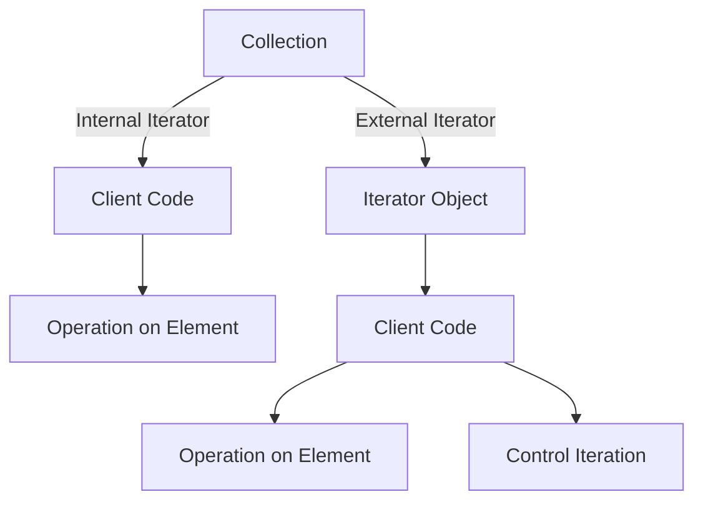

## 5.5.2 Internal vs. External Iterators

In the realm of software design patterns, iterators play a crucial role in providing a standard way to traverse collections of objects. The Iterator Pattern is one of the most commonly used patterns in Java, enabling developers to access elements of a collection sequentially without exposing the underlying representation. Within this pattern, two primary types of iterators exist: internal and external iterators. Understanding the differences between these two can significantly influence how you design and implement your Java applications.

### What are Internal Iterators?

Internal iterators are those where the iteration logic is encapsulated within the collection itself. The collection controls the iteration process, and the client simply provides a block of code to be executed for each element. This approach abstracts the iteration mechanism, allowing the client to focus solely on the operation to be performed on each element.

#### Characteristics of Internal Iterators

- **Control**: The collection controls the iteration process.
- **Abstraction**: The client does not need to manage the iteration state.
- **Simplicity**: Often results in cleaner and more concise client code.
- **Limited Flexibility**: The client cannot easily control the iteration process, such as breaking out of the loop early.

#### Code Example of Internal Iterators

Let's consider a simple example using Java's `forEach` method, which is an internal iterator:

```java
import java.util.Arrays;
import java.util.List;

public class InternalIteratorExample {
    public static void main(String[] args) {
        List<String> names = Arrays.asList("Alice", "Bob", "Charlie");

        // Using an internal iterator with a lambda expression
        names.forEach(name -> System.out.println(name));
    }
}
```

In this example, the `forEach` method abstracts the iteration process. The client provides a lambda expression, which is executed for each element in the list. The iteration logic is hidden from the client, making the code concise and easy to read.

### What are External Iterators?

External iterators, on the other hand, provide the client with control over the iteration process. The client explicitly manages the iteration state, deciding when to move to the next element and when to stop. This approach offers greater flexibility but requires more code to manage the iteration state.

#### Characteristics of External Iterators

- **Control**: The client controls the iteration process.
- **Flexibility**: The client can decide when to stop iterating, skip elements, or iterate in a non-linear fashion.
- **Complexity**: Requires more code to manage the iteration state and handle edge cases.

#### Code Example of External Iterators

Here is an example using Java's `Iterator` interface, which exemplifies an external iterator:

```java
import java.util.Arrays;
import java.util.Iterator;
import java.util.List;

public class ExternalIteratorExample {
    public static void main(String[] args) {
        List<String> names = Arrays.asList("Alice", "Bob", "Charlie");
        Iterator<String> iterator = names.iterator();

        while (iterator.hasNext()) {
            String name = iterator.next();
            System.out.println(name);

            // Additional control: break out of the loop early
            if (name.equals("Bob")) {
                break;
            }
        }
    }
}
```

In this example, the client explicitly controls the iteration process using the `Iterator` interface. The `hasNext` and `next` methods are used to traverse the collection, giving the client the flexibility to break out of the loop when a specific condition is met.

### Comparing Internal and External Iterators

Now that we have a basic understanding of internal and external iterators, let's compare their pros and cons.

#### Pros and Cons of Internal Iterators

**Pros:**

- **Simplicity**: Internal iterators often result in cleaner and more concise code since the iteration logic is abstracted away.
- **Ease of Use**: They are easier to use for simple operations where the entire collection needs to be processed.
- **Readability**: Code using internal iterators is generally more readable, as it focuses on the operation rather than the iteration mechanics.

**Cons:**

- **Limited Control**: The client has limited control over the iteration process, making it difficult to implement complex iteration logic.
- **Performance**: In some cases, internal iterators may introduce performance overhead due to the abstraction layer.

#### Pros and Cons of External Iterators

**Pros:**

- **Flexibility**: External iterators provide greater flexibility, allowing the client to control the iteration process and implement complex logic.
- **Efficiency**: They can be more efficient in scenarios where not all elements need to be processed, as the client can break out of the loop early.

**Cons:**

- **Complexity**: External iterators require more code to manage the iteration state, which can lead to more complex and error-prone code.
- **Readability**: The additional code required for iteration management can reduce readability.

### When to Use Internal vs. External Iterators

The choice between internal and external iterators depends on the specific requirements of your application. Here are some scenarios where one type may be preferred over the other:

#### Use Internal Iterators When:

- You need to perform simple operations on all elements of a collection.
- You want to write concise and readable code.
- The iteration logic is straightforward and does not require early termination or complex control.

#### Use External Iterators When:

- You need fine-grained control over the iteration process.
- You want to implement complex iteration logic, such as skipping elements or breaking out of the loop early.
- Performance is a concern, and you want to minimize overhead by managing the iteration state manually.

### Visualizing Internal vs. External Iterators

To better understand the differences between internal and external iterators, let's visualize the process using a diagram.



**Diagram Description**: This diagram illustrates the flow of control in internal and external iterators. In the internal iterator, the collection directly interacts with the client code, which performs the operation on each element. In the external iterator, the collection provides an iterator object, which the client code uses to control the iteration process and perform operations on each element.

### Try It Yourself

To gain a deeper understanding of internal and external iterators, try modifying the code examples provided:

- **Internal Iterator**: Modify the lambda expression to perform a different operation on each element, such as converting the names to uppercase before printing them.
- **External Iterator**: Add additional logic to skip certain elements or process elements in reverse order.

### References and Further Reading

- [Java 8 forEach Method](https://docs.oracle.com/javase/8/docs/api/java/lang/Iterable.html#forEach-java.util.function.Consumer-)
- [Java Iterator Interface](https://docs.oracle.com/javase/8/docs/api/java/util/Iterator.html)
- [Effective Java by Joshua Bloch](https://www.oreilly.com/library/view/effective-java-3rd/9780134686097/)

### Knowledge Check

Before moving on, let's review some key points:

- Internal iterators abstract the iteration process, making code simpler and more readable.
- External iterators provide greater control and flexibility but require more code to manage the iteration state.
- The choice between internal and external iterators depends on the specific requirements of your application.

## Quiz Time!



### Which type of iterator abstracts the iteration process, making code simpler and more readable?

- [x] Internal Iterator
- [ ] External Iterator
- [ ] Both
- [ ] Neither

> **Explanation:** Internal iterators abstract the iteration process, allowing the client to focus on the operation to be performed on each element, resulting in simpler and more readable code.

### Which type of iterator provides greater control and flexibility over the iteration process?

- [ ] Internal Iterator
- [x] External Iterator
- [ ] Both
- [ ] Neither

> **Explanation:** External iterators provide greater control and flexibility, allowing the client to manage the iteration state and implement complex logic.

### What is a key disadvantage of internal iterators?

- [ ] Complexity
- [x] Limited Control
- [ ] Flexibility
- [ ] Performance

> **Explanation:** A key disadvantage of internal iterators is their limited control, as the client cannot easily manage the iteration process or implement complex logic.

### In which scenario would you prefer using an external iterator?

- [x] When you need fine-grained control over the iteration process
- [ ] When you want to write concise and readable code
- [ ] When the iteration logic is straightforward
- [ ] When you need to perform simple operations on all elements

> **Explanation:** External iterators are preferred when you need fine-grained control over the iteration process and want to implement complex logic.

### Which method in Java exemplifies an internal iterator?

- [ ] Iterator's next()
- [x] forEach
- [ ] hasNext()
- [ ] remove()

> **Explanation:** The `forEach` method in Java exemplifies an internal iterator, where the collection controls the iteration process.

### What is a key advantage of external iterators?

- [ ] Simplicity
- [ ] Abstraction
- [x] Flexibility
- [ ] Readability

> **Explanation:** A key advantage of external iterators is their flexibility, allowing the client to control the iteration process and implement complex logic.

### Which type of iterator is typically more efficient in scenarios where not all elements need to be processed?

- [ ] Internal Iterator
- [x] External Iterator
- [ ] Both
- [ ] Neither

> **Explanation:** External iterators can be more efficient in scenarios where not all elements need to be processed, as the client can break out of the loop early.

### What is the primary role of the `Iterator` interface in Java?

- [x] To provide a way to access elements of a collection sequentially
- [ ] To abstract the iteration process
- [ ] To manage the iteration state internally
- [ ] To simplify client code

> **Explanation:** The primary role of the `Iterator` interface in Java is to provide a way to access elements of a collection sequentially, allowing the client to control the iteration process.

### Which of the following is NOT a characteristic of internal iterators?

- [ ] Control by the collection
- [ ] Simplicity
- [ ] Abstraction
- [x] Flexibility

> **Explanation:** Flexibility is not a characteristic of internal iterators, as they provide limited control over the iteration process.

### True or False: Internal iterators are always preferred over external iterators for all use cases.

- [ ] True
- [x] False

> **Explanation:** False. The choice between internal and external iterators depends on the specific requirements of your application. Internal iterators are preferred for simple operations, while external iterators are preferred for complex iteration logic.



Remember, mastering iterators is just one step in your journey to becoming an expert Java developer. Keep experimenting, stay curious, and enjoy the journey!
