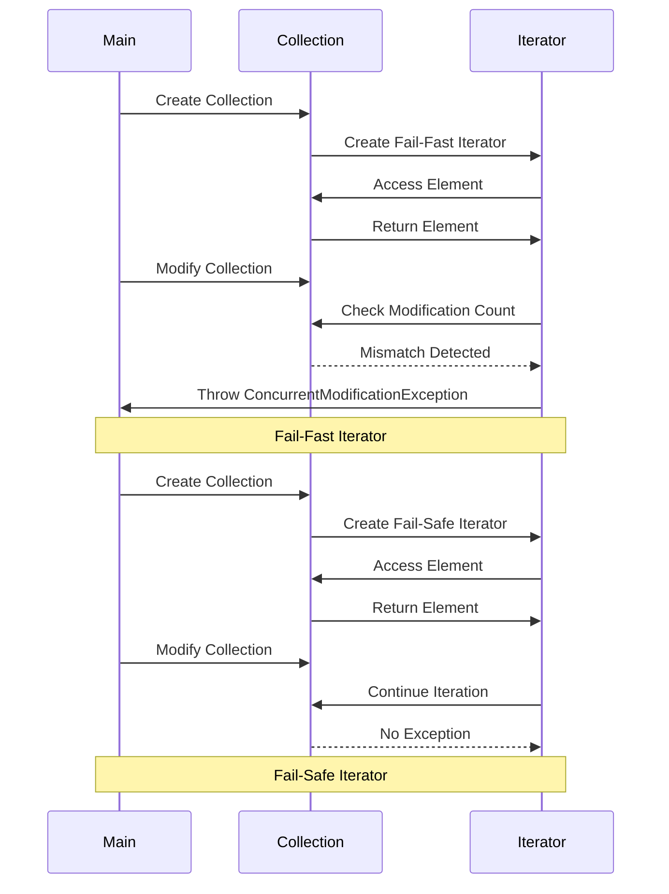

## 5.5.3 Fail-Fast and Fail-Safe Iterators

In the realm of Java programming, iterators play a crucial role in traversing collections. However, when dealing with concurrent modifications, iterators can exhibit different behaviors, primarily categorized as fail-fast and fail-safe. Understanding these behaviors is essential for expert software engineers to ensure robust and error-free applications, especially in multi-threaded environments.

### Understanding Fail-Fast Iterators

Fail-fast iterators are designed to immediately throw a `ConcurrentModificationException` if they detect that the collection has been modified after the iterator was created. This behavior is crucial for maintaining consistency and preventing unpredictable results during iteration.

#### How Fail-Fast Iterators Work

Fail-fast iterators operate directly on the collection and maintain a modification count. Each time the collection is modified (e.g., adding or removing elements), this count is updated. The iterator checks this count during iteration, and if it detects a mismatch, it throws a `ConcurrentModificationException`.

#### Code Example: Fail-Fast Iterator

Let's explore a simple example using an `ArrayList`, which employs a fail-fast iterator:

```java
import java.util.ArrayList;
import java.util.Iterator;
import java.util.ConcurrentModificationException;

public class FailFastExample {
    public static void main(String[] args) {
        ArrayList<String> list = new ArrayList<>();
        list.add("Java");
        list.add("Python");
        list.add("C++");

        Iterator<String> iterator = list.iterator();

        try {
            while (iterator.hasNext()) {
                System.out.println(iterator.next());
                // Modifying the list while iterating
                list.add("JavaScript");
            }
        } catch (ConcurrentModificationException e) {
            System.out.println("ConcurrentModificationException caught!");
        }
    }
}
```

In this example, the `ConcurrentModificationException` is thrown because the list is modified while being iterated over.

#### Collections with Fail-Fast Iterators

Most of the collections in the Java Collections Framework, such as `ArrayList`, `HashSet`, and `HashMap`, provide fail-fast iterators. These iterators are not guaranteed to throw this exception in all cases, but they are designed to do so on a best-effort basis.

### Understanding Fail-Safe Iterators

Fail-safe iterators, in contrast, operate over a copy of the collection. This means that they do not throw `ConcurrentModificationException` because they are not affected by changes in the original collection.

#### How Fail-Safe Iterators Work

Fail-safe iterators create a copy of the collection's data at the time the iterator is created. This copy is then used for iteration, allowing modifications to the original collection without affecting the iteration process.

#### Code Example: Fail-Safe Iterator

Consider the following example using a `CopyOnWriteArrayList`, which provides a fail-safe iterator:

```java
import java.util.concurrent.CopyOnWriteArrayList;
import java.util.Iterator;

public class FailSafeExample {
    public static void main(String[] args) {
        CopyOnWriteArrayList<String> list = new CopyOnWriteArrayList<>();
        list.add("Java");
        list.add("Python");
        list.add("C++");

        Iterator<String> iterator = list.iterator();

        while (iterator.hasNext()) {
            System.out.println(iterator.next());
            // Modifying the list while iterating
            list.add("JavaScript");
        }

        System.out.println("Final list: " + list);
    }
}
```

In this example, the iteration proceeds without any exceptions, and the new element is added to the list. The iterator operates on a snapshot of the list at the time of its creation.

#### Collections with Fail-Safe Iterators

Fail-safe iterators are typically found in concurrent collections such as `CopyOnWriteArrayList`, `CopyOnWriteArraySet`, and `ConcurrentHashMap`. These collections are designed for concurrent access and modification, making them suitable for multi-threaded environments.

### Importance of Concurrent Modification Handling

Concurrent modification handling is vital in multi-threaded applications to avoid data inconsistency and unexpected behavior. Understanding the difference between fail-fast and fail-safe iterators helps developers choose the right collection type based on their specific needs.

#### When to Use Fail-Fast Iterators

Fail-fast iterators are suitable when you need to ensure that no modifications occur during iteration. They are useful in single-threaded applications or when you can control the modification of the collection.

#### When to Use Fail-Safe Iterators

Fail-safe iterators are ideal for multi-threaded environments where collections are frequently modified. They provide a consistent view of the collection without the risk of `ConcurrentModificationException`.

### Visualizing Fail-Fast and Fail-Safe Iterators

To better understand the behavior of fail-fast and fail-safe iterators, let's visualize their operation using a sequence diagram.



### Try It Yourself

To deepen your understanding, try modifying the code examples above:

- **Experiment with Different Collections**: Replace `ArrayList` with `HashSet` or `HashMap` to see how fail-fast iterators behave with different collections.
- **Test Concurrent Modifications**: Use multiple threads to modify the collection while iterating to observe the behavior of fail-fast and fail-safe iterators.
- **Explore Other Concurrent Collections**: Try using `ConcurrentHashMap` and observe how it handles concurrent modifications.

### Key Takeaways

- **Fail-Fast Iterators**: These iterators throw `ConcurrentModificationException` if the collection is modified during iteration. They are suitable for single-threaded environments where modifications can be controlled.
- **Fail-Safe Iterators**: These iterators work on a copy of the collection, allowing modifications without exceptions. They are ideal for multi-threaded environments.
- **Concurrent Modification Handling**: Understanding and handling concurrent modifications is crucial for building robust applications.

### Further Reading

For more information on iterators and concurrent collections, consider exploring the following resources:

- [Java Documentation on Iterators](https://docs.oracle.com/javase/8/docs/api/java/util/Iterator.html)
- [Java Concurrency in Practice](https://jcip.net/)
- [Effective Java by Joshua Bloch](https://www.oreilly.com/library/view/effective-java/9780134686097/)

Remember, mastering iterators and their behaviors is a step towards building efficient and reliable Java applications. Keep experimenting, stay curious, and enjoy the journey!

## Quiz Time!



### What is a fail-fast iterator?

- [x] An iterator that throws `ConcurrentModificationException` if the collection is modified during iteration.
- [ ] An iterator that allows modifications without throwing exceptions.
- [ ] An iterator that operates on a copy of the collection.
- [ ] An iterator that is used only in single-threaded environments.

> **Explanation:** A fail-fast iterator throws `ConcurrentModificationException` if the collection is modified after the iterator is created.

### Which collections typically provide fail-fast iterators?

- [x] `ArrayList`, `HashSet`, `HashMap`
- [ ] `CopyOnWriteArrayList`, `ConcurrentHashMap`
- [ ] `Vector`, `Hashtable`
- [ ] `LinkedList`, `TreeSet`

> **Explanation:** Collections like `ArrayList`, `HashSet`, and `HashMap` provide fail-fast iterators.

### What is a fail-safe iterator?

- [x] An iterator that operates on a copy of the collection, allowing modifications without exceptions.
- [ ] An iterator that throws `ConcurrentModificationException` if the collection is modified.
- [ ] An iterator that is only used in single-threaded environments.
- [ ] An iterator that prevents any modifications to the collection.

> **Explanation:** A fail-safe iterator works on a copy of the collection, allowing modifications without exceptions.

### Which collections typically provide fail-safe iterators?

- [x] `CopyOnWriteArrayList`, `ConcurrentHashMap`
- [ ] `ArrayList`, `HashSet`, `HashMap`
- [ ] `Vector`, `Hashtable`
- [ ] `LinkedList`, `TreeSet`

> **Explanation:** Collections like `CopyOnWriteArrayList` and `ConcurrentHashMap` provide fail-safe iterators.

### Why are fail-safe iterators suitable for multi-threaded environments?

- [x] They operate on a copy of the collection, preventing `ConcurrentModificationException`.
- [ ] They throw exceptions to alert about concurrent modifications.
- [ ] They prevent any modifications to the collection.
- [ ] They are slower and thus safer for concurrent access.

> **Explanation:** Fail-safe iterators work on a snapshot of the collection, allowing concurrent modifications without exceptions.

### What exception do fail-fast iterators throw?

- [x] `ConcurrentModificationException`
- [ ] `IllegalStateException`
- [ ] `NullPointerException`
- [ ] `IndexOutOfBoundsException`

> **Explanation:** Fail-fast iterators throw `ConcurrentModificationException` when the collection is modified during iteration.

### How do fail-fast iterators detect concurrent modifications?

- [x] By maintaining a modification count and checking it during iteration.
- [ ] By locking the collection during iteration.
- [ ] By creating a copy of the collection.
- [ ] By preventing any modifications to the collection.

> **Explanation:** Fail-fast iterators maintain a modification count and check it during iteration to detect changes.

### Can fail-safe iterators be used in single-threaded environments?

- [x] Yes
- [ ] No

> **Explanation:** Fail-safe iterators can be used in single-threaded environments, but they are designed for concurrent modifications.

### What is the main advantage of using fail-safe iterators?

- [x] They allow concurrent modifications without throwing exceptions.
- [ ] They prevent all modifications to the collection.
- [ ] They are faster than fail-fast iterators.
- [ ] They provide more detailed error messages.

> **Explanation:** The main advantage of fail-safe iterators is that they allow concurrent modifications without exceptions.

### True or False: Fail-fast iterators guarantee detection of all concurrent modifications.

- [ ] True
- [x] False

> **Explanation:** Fail-fast iterators do not guarantee detection of all concurrent modifications; they operate on a best-effort basis.


