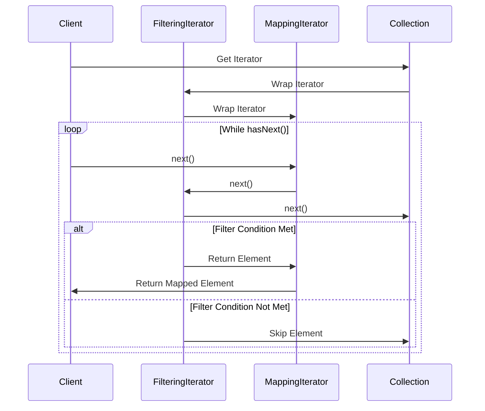

## 5.5.4 Enhancing Iterators

In the realm of software engineering, iterators play a crucial role in providing a standardized way to traverse collections. However, as applications grow more complex, the need arises to enhance these iterators with additional functionalities such as filtering and mapping. This section delves into advanced techniques for enhancing iterators in Java, providing expert developers with the tools to create more flexible and powerful iteration mechanisms. We will also explore how these concepts relate to the Java 8 Streams API, which offers built-in support for such operations.

### Introduction to Enhanced Iterators

Before diving into the specifics of enhancing iterators, let's briefly revisit the concept of iterators. An iterator is an object that enables a programmer to traverse a container, particularly lists. In Java, the `Iterator` interface provides methods like `hasNext()`, `next()`, and `remove()` to facilitate this process.

However, the basic iterator pattern is limited to simple traversal. To perform more complex operations like filtering elements based on certain conditions or transforming elements during iteration, we need to enhance our iterators. This enhancement can be achieved through custom implementations that extend the basic iterator functionality.

### Filtering Iterators

Filtering iterators allow us to traverse a collection while selectively skipping elements that do not meet certain criteria. This is particularly useful when dealing with large datasets where only a subset of the data is relevant.

#### Implementing a Filtering Iterator

To create a filtering iterator, we need to define a condition that determines whether an element should be included in the iteration. This can be achieved by implementing a custom iterator that wraps an existing iterator and applies the filtering logic.

Here is a step-by-step guide to implementing a filtering iterator in Java:

1. **Define the Filter Interface**: Create an interface that represents the filtering condition.

```java
@FunctionalInterface
public interface Filter<T> {
    boolean apply(T item);
}
```

2. **Implement the Filtering Iterator**: Create a class that implements the `Iterator` interface and uses the filter to determine which elements to return.

```java
import java.util.Iterator;
import java.util.NoSuchElementException;

public class FilteringIterator<T> implements Iterator<T> {
    private final Iterator<T> iterator;
    private final Filter<T> filter;
    private T nextItem;
    private boolean nextItemSet = false;

    public FilteringIterator(Iterator<T> iterator, Filter<T> filter) {
        this.iterator = iterator;
        this.filter = filter;
    }

    @Override
    public boolean hasNext() {
        if (nextItemSet) {
            return true;
        }
        while (iterator.hasNext()) {
            T item = iterator.next();
            if (filter.apply(item)) {
                nextItem = item;
                nextItemSet = true;
                return true;
            }
        }
        return false;
    }

    @Override
    public T next() {
        if (!nextItemSet && !hasNext()) {
            throw new NoSuchElementException();
        }
        nextItemSet = false;
        return nextItem;
    }

    @Override
    public void remove() {
        throw new UnsupportedOperationException("Remove not supported");
    }
}
```

3. **Use the Filtering Iterator**: Demonstrate how to use the filtering iterator with a collection.

```java
import java.util.Arrays;
import java.util.List;

public class FilteringIteratorDemo {
    public static void main(String[] args) {
        List<Integer> numbers = Arrays.asList(1, 2, 3, 4, 5, 6, 7, 8, 9, 10);
        Filter<Integer> evenFilter = number -> number % 2 == 0;

        Iterator<Integer> iterator = new FilteringIterator<>(numbers.iterator(), evenFilter);

        while (iterator.hasNext()) {
            System.out.println(iterator.next());
        }
    }
}
```

In this example, the filtering iterator only returns even numbers from the list.

### Mapping Iterators

Mapping iterators transform each element of a collection during iteration. This is useful when you need to apply a function to each element, such as converting a list of strings to uppercase.

#### Implementing a Mapping Iterator

To implement a mapping iterator, we need to define a transformation function that will be applied to each element during iteration.

1. **Define the Mapper Interface**: Create an interface that represents the transformation function.

```java
@FunctionalInterface
public interface Mapper<T, R> {
    R map(T item);
}
```

2. **Implement the Mapping Iterator**: Create a class that implements the `Iterator` interface and applies the mapping function to each element.

```java
import java.util.Iterator;
import java.util.NoSuchElementException;

public class MappingIterator<T, R> implements Iterator<R> {
    private final Iterator<T> iterator;
    private final Mapper<T, R> mapper;

    public MappingIterator(Iterator<T> iterator, Mapper<T, R> mapper) {
        this.iterator = iterator;
        this.mapper = mapper;
    }

    @Override
    public boolean hasNext() {
        return iterator.hasNext();
    }

    @Override
    public R next() {
        if (!hasNext()) {
            throw new NoSuchElementException();
        }
        return mapper.map(iterator.next());
    }

    @Override
    public void remove() {
        throw new UnsupportedOperationException("Remove not supported");
    }
}
```

3. **Use the Mapping Iterator**: Demonstrate how to use the mapping iterator with a collection.

```java
import java.util.Arrays;
import java.util.List;

public class MappingIteratorDemo {
    public static void main(String[] args) {
        List<String> words = Arrays.asList("hello", "world", "java", "iterator");
        Mapper<String, String> toUpperCaseMapper = String::toUpperCase;

        Iterator<String> iterator = new MappingIterator<>(words.iterator(), toUpperCaseMapper);

        while (iterator.hasNext()) {
            System.out.println(iterator.next());
        }
    }
}
```

In this example, the mapping iterator transforms each string to uppercase.

### Combining Filtering and Mapping

In many cases, you may want to apply both filtering and mapping to a collection. This can be achieved by chaining the two iterators together.

#### Example: Chaining Filtering and Mapping

Let's create a combined iterator that first filters elements and then applies a transformation.

```java
import java.util.Arrays;
import java.util.List;

public class CombinedIteratorDemo {
    public static void main(String[] args) {
        List<Integer> numbers = Arrays.asList(1, 2, 3, 4, 5, 6, 7, 8, 9, 10);
        Filter<Integer> evenFilter = number -> number % 2 == 0;
        Mapper<Integer, String> toStringMapper = Object::toString;

        Iterator<Integer> filteredIterator = new FilteringIterator<>(numbers.iterator(), evenFilter);
        Iterator<String> mappedIterator = new MappingIterator<>(filteredIterator, toStringMapper);

        while (mappedIterator.hasNext()) {
            System.out.println(mappedIterator.next());
        }
    }
}
```

This example demonstrates how to filter even numbers and then convert them to strings.

### Java 8 Streams API

With the introduction of Java 8, the Streams API provides a more powerful and flexible way to perform operations like filtering and mapping on collections. Streams allow you to process sequences of elements with operations that can be chained together, offering a more declarative approach compared to traditional iterators.

#### Streams API Example

Here is how you can achieve the same filtering and mapping using Java 8 Streams:

```java
import java.util.Arrays;
import java.util.List;
import java.util.stream.Collectors;

public class StreamsAPIDemo {
    public static void main(String[] args) {
        List<Integer> numbers = Arrays.asList(1, 2, 3, 4, 5, 6, 7, 8, 9, 10);

        List<String> result = numbers.stream()
                .filter(number -> number % 2 == 0)
                .map(Object::toString)
                .collect(Collectors.toList());

        result.forEach(System.out::println);
    }
}
```

The Streams API simplifies the process by allowing you to chain operations like `filter()` and `map()`, making the code more concise and readable.

### Visualizing Enhanced Iterators

To better understand the flow of enhanced iterators, let's visualize the process using a sequence diagram. This diagram illustrates how elements are processed through filtering and mapping iterators.



### Try It Yourself

Experiment with the code examples provided by modifying the filtering and mapping logic. For instance, try creating a filtering iterator that only includes numbers greater than five, or a mapping iterator that squares each number.

### Knowledge Check

- **Question**: What is the primary purpose of a filtering iterator?
  - **Answer**: To selectively skip elements that do not meet certain criteria during iteration.

- **Question**: How does a mapping iterator differ from a filtering iterator?
  - **Answer**: A mapping iterator transforms elements during iteration, while a filtering iterator selectively skips elements.

### Conclusion

Enhancing iterators with filtering and mapping capabilities allows developers to write more expressive and powerful code. By understanding these techniques, you can create custom iterators that suit your specific needs, or leverage the Java 8 Streams API for a more declarative approach. Remember, the key to mastering these concepts is practice and experimentation. Keep exploring and refining your skills to become an expert in Java design patterns.

## Quiz Time!



### What is the primary purpose of a filtering iterator?

- [x] To selectively skip elements that do not meet certain criteria during iteration.
- [ ] To transform elements during iteration.
- [ ] To remove elements from a collection.
- [ ] To sort elements in a collection.

> **Explanation:** A filtering iterator allows you to traverse a collection while skipping elements that do not meet a specified condition.

### How does a mapping iterator differ from a filtering iterator?

- [x] A mapping iterator transforms elements during iteration.
- [ ] A mapping iterator selectively skips elements.
- [ ] A mapping iterator removes elements from a collection.
- [ ] A mapping iterator sorts elements in a collection.

> **Explanation:** A mapping iterator applies a transformation function to each element during iteration, while a filtering iterator skips elements based on a condition.

### Which Java 8 feature provides built-in support for filtering and mapping operations?

- [x] Streams API
- [ ] Collections Framework
- [ ] Iterator Interface
- [ ] Functional Interfaces

> **Explanation:** The Java 8 Streams API provides built-in methods like `filter()` and `map()` for performing filtering and mapping operations on collections.

### What method in the `Iterator` interface checks if there are more elements to iterate over?

- [x] hasNext()
- [ ] next()
- [ ] remove()
- [ ] filter()

> **Explanation:** The `hasNext()` method in the `Iterator` interface returns `true` if there are more elements to iterate over.

### What is the advantage of using Java 8 Streams over traditional iterators?

- [x] Streams provide a more declarative approach to processing collections.
- [ ] Streams require less memory than iterators.
- [ ] Streams are faster than iterators in all cases.
- [ ] Streams can only be used with lists.

> **Explanation:** Java 8 Streams offer a more declarative and readable approach to processing collections by allowing operations to be chained together.

### Which of the following is a correct use of the `map()` method in Java Streams?

- [x] numbers.stream().map(n -> n * 2).collect(Collectors.toList())
- [ ] numbers.stream().filter(n -> n * 2).collect(Collectors.toList())
- [ ] numbers.stream().reduce(n -> n * 2).collect(Collectors.toList())
- [ ] numbers.stream().sort(n -> n * 2).collect(Collectors.toList())

> **Explanation:** The `map()` method is used to apply a transformation function to each element in the stream.

### What does the `filter()` method in Java Streams do?

- [x] It selects elements that satisfy a given condition.
- [ ] It transforms elements in the stream.
- [ ] It removes elements from the stream.
- [ ] It sorts elements in the stream.

> **Explanation:** The `filter()` method in Java Streams is used to select elements that satisfy a specified condition.

### How can you chain filtering and mapping operations in Java Streams?

- [x] By using the `filter()` and `map()` methods in sequence.
- [ ] By using the `reduce()` method.
- [ ] By using the `collect()` method.
- [ ] By using the `sort()` method.

> **Explanation:** In Java Streams, you can chain operations like `filter()` and `map()` to apply multiple transformations and filters in sequence.

### What is the role of the `Mapper` interface in a mapping iterator?

- [x] It defines the transformation function to be applied to each element.
- [ ] It checks if elements meet a certain condition.
- [ ] It removes elements from the collection.
- [ ] It sorts elements in the collection.

> **Explanation:** The `Mapper` interface defines the transformation function that is applied to each element during iteration in a mapping iterator.

### True or False: The Streams API can be used to perform both filtering and mapping operations on collections.

- [x] True
- [ ] False

> **Explanation:** The Streams API in Java 8 provides methods like `filter()` and `map()` to perform filtering and mapping operations on collections.


