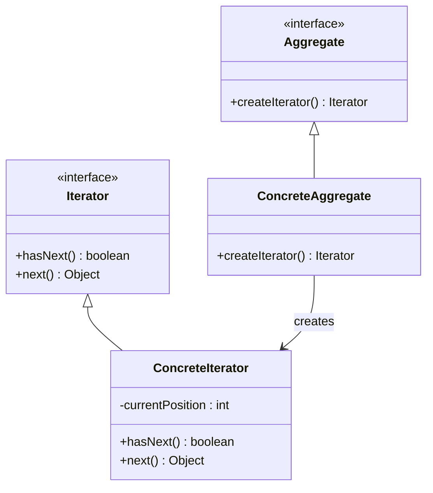

## 5.5.5 Use Cases and Examples

The Iterator Pattern is a powerful tool in software engineering, especially in Java, where it provides a uniform way to traverse elements in a collection without exposing the underlying structure. This pattern is particularly useful in scenarios where you need to navigate complex data structures like trees, graphs, or custom collections. In this section, we'll explore practical applications of the Iterator Pattern, delve into scenarios where custom iterators are necessary, and provide code examples to illustrate their usage.

### Understanding the Iterator Pattern

Before diving into use cases, let's briefly recap the Iterator Pattern. The pattern provides a way to access the elements of an aggregate object sequentially without exposing its underlying representation. In Java, the `Iterator` interface is a part of the Java Collections Framework and provides methods like `hasNext()`, `next()`, and `remove()` to iterate over a collection.

### When to Use Custom Iterators

Custom iterators become necessary when dealing with complex data structures that aren't natively supported by Java's standard collections. Here are some scenarios where custom iterators are particularly useful:

1. **Traversing Non-Linear Data Structures**: Structures like trees and graphs require specialized traversal methods (e.g., depth-first, breadth-first) that aren't directly supported by standard iterators.

2. **Filtering and Transformation**: When you need to filter or transform data during iteration, a custom iterator can encapsulate this logic, keeping client code clean and focused.

3. **Complex Aggregates**: For collections that aggregate multiple data sources or types, a custom iterator can provide a unified way to iterate over all elements.

4. **Lazy Evaluation**: In scenarios where data is fetched or computed on-the-fly, custom iterators can manage state and ensure efficient data access.

### Example 1: Traversing a Binary Tree

Let's start with a classic example: traversing a binary tree. A binary tree is a hierarchical data structure where each node has at most two children. To traverse a binary tree, we often use depth-first traversal methods like in-order, pre-order, or post-order.

#### Code Example: In-Order Traversal of a Binary Tree

```java
import java.util.Iterator;
import java.util.Stack;

// Define a simple binary tree node class
class TreeNode<T> {
    T value;
    TreeNode<T> left;
    TreeNode<T> right;

    TreeNode(T value) {
        this.value = value;
        this.left = null;
        this.right = null;
    }
}

// Custom iterator for in-order traversal
class InOrderIterator<T> implements Iterator<T> {
    private Stack<TreeNode<T>> stack = new Stack<>();

    public InOrderIterator(TreeNode<T> root) {
        pushLeft(root);
    }

    private void pushLeft(TreeNode<T> node) {
        while (node != null) {
            stack.push(node);
            node = node.left;
        }
    }

    @Override
    public boolean hasNext() {
        return !stack.isEmpty();
    }

    @Override
    public T next() {
        TreeNode<T> node = stack.pop();
        pushLeft(node.right);
        return node.value;
    }
}

// Usage example
public class BinaryTreeExample {
    public static void main(String[] args) {
        TreeNode<Integer> root = new TreeNode<>(1);
        root.left = new TreeNode<>(2);
        root.right = new TreeNode<>(3);
        root.left.left = new TreeNode<>(4);
        root.left.right = new TreeNode<>(5);

        Iterator<Integer> iterator = new InOrderIterator<>(root);
        while (iterator.hasNext()) {
            System.out.print(iterator.next() + " ");
        }
    }
}
```

In this example, the `InOrderIterator` class encapsulates the logic for in-order traversal of a binary tree. The `pushLeft` method is used to traverse down the left side of the tree, and the `next` method retrieves the next element in the sequence.

### Example 2: Traversing a Graph

Graphs are more complex than trees, as they can have cycles and multiple paths between nodes. Traversing a graph requires careful management of visited nodes to avoid infinite loops.

#### Code Example: Depth-First Traversal of a Graph

```java
import java.util.*;

class GraphNode<T> {
    T value;
    List<GraphNode<T>> neighbors;

    GraphNode(T value) {
        this.value = value;
        this.neighbors = new ArrayList<>();
    }
}

class DepthFirstIterator<T> implements Iterator<T> {
    private Stack<GraphNode<T>> stack = new Stack<>();
    private Set<GraphNode<T>> visited = new HashSet<>();

    public DepthFirstIterator(GraphNode<T> startNode) {
        stack.push(startNode);
    }

    @Override
    public boolean hasNext() {
        return !stack.isEmpty();
    }

    @Override
    public T next() {
        while (!stack.isEmpty()) {
            GraphNode<T> node = stack.pop();
            if (!visited.contains(node)) {
                visited.add(node);
                for (GraphNode<T> neighbor : node.neighbors) {
                    stack.push(neighbor);
                }
                return node.value;
            }
        }
        throw new NoSuchElementException();
    }
}

// Usage example
public class GraphExample {
    public static void main(String[] args) {
        GraphNode<Integer> node1 = new GraphNode<>(1);
        GraphNode<Integer> node2 = new GraphNode<>(2);
        GraphNode<Integer> node3 = new GraphNode<>(3);
        GraphNode<Integer> node4 = new GraphNode<>(4);

        node1.neighbors.add(node2);
        node1.neighbors.add(node3);
        node2.neighbors.add(node4);
        node3.neighbors.add(node4);

        Iterator<Integer> iterator = new DepthFirstIterator<>(node1);
        while (iterator.hasNext()) {
            System.out.print(iterator.next() + " ");
        }
    }
}
```

In this example, the `DepthFirstIterator` class implements a depth-first traversal of a graph. It uses a stack to manage the traversal order and a set to track visited nodes, ensuring that each node is processed only once.

### Simplifying Client Code with Iterators

The Iterator Pattern simplifies client code by abstracting the traversal logic. Clients can focus on processing elements without worrying about the underlying data structure. This separation of concerns enhances code readability and maintainability.

#### Code Example: Using an Iterator to Process Data

```java
import java.util.Iterator;
import java.util.List;
import java.util.ArrayList;

public class DataProcessor {
    public static void processData(Iterator<Integer> iterator) {
        while (iterator.hasNext()) {
            Integer data = iterator.next();
            // Process data
            System.out.println("Processing: " + data);
        }
    }

    public static void main(String[] args) {
        List<Integer> dataList = new ArrayList<>();
        dataList.add(10);
        dataList.add(20);
        dataList.add(30);

        Iterator<Integer> iterator = dataList.iterator();
        processData(iterator);
    }
}
```

In this example, the `processData` method takes an `Iterator` as a parameter, allowing it to process any collection of integers. This flexibility is a key advantage of the Iterator Pattern, as it decouples data processing from data storage.

### Visualizing the Iterator Pattern

To better understand the flow of the Iterator Pattern, let's visualize it using a class diagram.



**Diagram Description**: This class diagram illustrates the relationship between the `Aggregate` interface, which defines a method for creating an iterator, and the `Iterator` interface, which provides methods for traversing elements. The `ConcreteAggregate` class implements the `Aggregate` interface and creates a `ConcreteIterator` instance, which implements the `Iterator` interface.

### Try It Yourself

To deepen your understanding of the Iterator Pattern, try modifying the examples provided:

1. **Extend the Binary Tree Example**: Implement pre-order and post-order traversal iterators for the binary tree.

2. **Enhance the Graph Example**: Add support for breadth-first traversal by implementing a `BreadthFirstIterator` class.

3. **Filter Data During Iteration**: Modify the `processData` method to filter out even numbers before processing them.

### Knowledge Check

- Explain the benefits of using the Iterator Pattern in client code.
- Describe a scenario where a custom iterator is necessary.
- Implement a custom iterator for a circular linked list.

### Conclusion

The Iterator Pattern is a fundamental design pattern that provides a standardized way to traverse collections. By encapsulating traversal logic within iterators, we can simplify client code and enhance maintainability. Whether you're dealing with simple lists or complex data structures like trees and graphs, the Iterator Pattern is a valuable tool in your software engineering toolkit.

## Quiz Time!



### What is the primary benefit of using the Iterator Pattern?

- [x] It provides a standardized way to traverse collections without exposing their internal structure.
- [ ] It optimizes the performance of data retrieval.
- [ ] It allows for concurrent modifications of collections.
- [ ] It simplifies the creation of new data structures.

> **Explanation:** The Iterator Pattern abstracts the traversal of a collection, allowing clients to access elements without knowing the underlying structure.

### In which scenario is a custom iterator most necessary?

- [x] When traversing complex data structures like graphs or trees.
- [ ] When working with simple arrays.
- [ ] When using standard Java collections like `ArrayList`.
- [ ] When performing basic arithmetic operations.

> **Explanation:** Custom iterators are essential for navigating complex data structures that require specialized traversal logic.

### What method is typically used to check if more elements are available in an iterator?

- [x] `hasNext()`
- [ ] `next()`
- [ ] `remove()`
- [ ] `size()`

> **Explanation:** The `hasNext()` method is used to determine if there are more elements to iterate over.

### How does the Iterator Pattern simplify client code?

- [x] By abstracting the traversal logic, allowing clients to focus on processing elements.
- [ ] By reducing the number of lines of code.
- [ ] By improving the performance of the application.
- [ ] By automatically handling exceptions.

> **Explanation:** The Iterator Pattern separates traversal logic from client code, making it easier to read and maintain.

### Which data structure is used in the provided graph traversal example?

- [x] Stack
- [ ] Queue
- [ ] Array
- [ ] LinkedList

> **Explanation:** A stack is used to implement depth-first traversal in the graph example.

### What is the role of the `pushLeft` method in the binary tree iterator example?

- [x] It traverses the left subtree and pushes nodes onto the stack.
- [ ] It removes nodes from the stack.
- [ ] It initializes the binary tree.
- [ ] It performs a breadth-first traversal.

> **Explanation:** The `pushLeft` method is responsible for traversing the left subtree and preparing nodes for in-order traversal.

### What is a key advantage of using iterators for data processing?

- [x] They decouple data processing from data storage.
- [ ] They increase the speed of data processing.
- [ ] They reduce memory usage.
- [ ] They automatically handle data synchronization.

> **Explanation:** Iterators provide a way to process data independently of how it is stored, enhancing flexibility.

### How can you modify the `processData` method to filter data during iteration?

- [x] By adding a condition inside the loop to skip unwanted elements.
- [ ] By modifying the `Iterator` interface.
- [ ] By changing the data structure.
- [ ] By using a different programming language.

> **Explanation:** Adding a condition inside the iteration loop allows you to filter elements before processing them.

### Which traversal method is used in the binary tree example?

- [x] In-order traversal
- [ ] Pre-order traversal
- [ ] Post-order traversal
- [ ] Level-order traversal

> **Explanation:** The binary tree example demonstrates in-order traversal using a custom iterator.

### True or False: The Iterator Pattern can be used for lazy evaluation of data.

- [x] True
- [ ] False

> **Explanation:** Custom iterators can manage state and fetch or compute data on-the-fly, enabling lazy evaluation.



Remember, mastering the Iterator Pattern is just the beginning. As you continue your journey in software engineering, you'll encounter more complex patterns and scenarios. Keep experimenting, stay curious, and enjoy the process of learning and growing as a developer!
