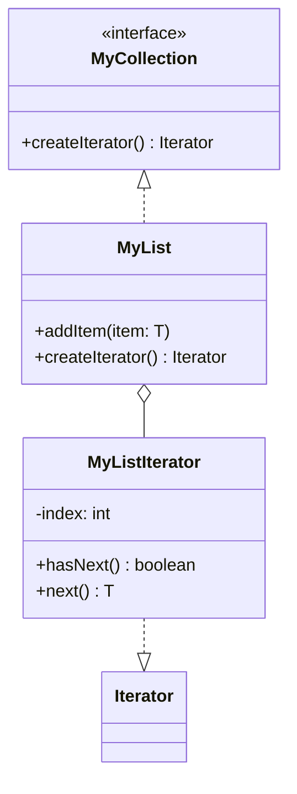

## 5.5 Iterator Pattern

The Iterator Pattern is a fundamental design pattern in software engineering that allows for the traversal of elements in a collection without exposing the underlying representation. This pattern is particularly useful in Java, where collections are a core part of the language. In this section, we will delve into the Iterator Pattern, its purpose, and its implementation in Java. We will also explore how it promotes encapsulation and abstraction, the differences between internal and external iterators, and the benefits of using iterators for uniform access to different collections.

### Understanding the Iterator Pattern

The Iterator Pattern is a behavioral design pattern that provides a way to access the elements of an aggregate object sequentially without exposing its underlying structure. This pattern is essential for collections, as it allows developers to traverse through elements without needing to know the internal workings of the collection.

#### Purpose of the Iterator Pattern

The primary purpose of the Iterator Pattern is to provide a standard way to traverse collections. By using an iterator, you can access elements in a collection one by one, without needing to understand the internal structure of the collection. This promotes a clean separation of concerns, as the collection's implementation details remain hidden from the client code.

### Promoting Encapsulation and Abstraction

Encapsulation and abstraction are two key principles of object-oriented programming that the Iterator Pattern strongly supports.

#### Encapsulation

Encapsulation involves hiding the internal state and behavior of an object, exposing only what is necessary. The Iterator Pattern encapsulates the traversal logic within the iterator itself, allowing the collection to maintain its internal structure privately. This means that changes to the collection's implementation do not affect the client code that uses the iterator.

#### Abstraction

Abstraction involves focusing on the essential qualities of an object rather than its specific characteristics. The Iterator Pattern abstracts the process of traversing a collection, providing a uniform interface for accessing elements. This abstraction allows developers to work with different types of collections in a consistent manner, without needing to understand their specific implementations.

### Internal vs. External Iterators

Iterators can be categorized into two main types: internal and external iterators. Understanding the differences between these two types is crucial for effectively implementing the Iterator Pattern.

#### Internal Iterators

Internal iterators control the iteration process themselves. They are typically implemented as methods within the collection class, and the client code passes a function or a block of code to be executed for each element. Internal iterators are often used in functional programming languages, where functions can be passed as arguments.

**Example of Internal Iterator in Java:**

```java
import java.util.Arrays;
import java.util.List;

public class InternalIteratorExample {
    public static void main(String[] args) {
        List<String> names = Arrays.asList("Alice", "Bob", "Charlie");

        // Using an internal iterator with a lambda expression
        names.forEach(name -> System.out.println(name));
    }
}
```

In this example, the `forEach` method is an internal iterator that takes a lambda expression as an argument and applies it to each element in the list.

#### External Iterators

External iterators, on the other hand, give control of the iteration process to the client code. The client explicitly requests the next element from the iterator and processes it. External iterators are more flexible than internal iterators, as they allow for more complex iteration logic.

**Example of External Iterator in Java:**

```java
import java.util.ArrayList;
import java.util.Iterator;
import java.util.List;

public class ExternalIteratorExample {
    public static void main(String[] args) {
        List<String> names = new ArrayList<>();
        names.add("Alice");
        names.add("Bob");
        names.add("Charlie");

        Iterator<String> iterator = names.iterator();
        while (iterator.hasNext()) {
            String name = iterator.next();
            System.out.println(name);
        }
    }
}
```

In this example, the `Iterator` interface provides methods for traversing the list, allowing the client to control the iteration process.

### Benefits of Using Iterators

The Iterator Pattern offers several benefits, particularly in the context of Java collections:

#### Uniform Access to Collections

Iterators provide a consistent interface for accessing elements in different types of collections. Whether you're working with a list, a set, or a map, you can use an iterator to traverse the elements in a uniform manner.

#### Simplified Collection Traversal

By abstracting the traversal logic into an iterator, the client code becomes simpler and more readable. The iterator handles the complexity of accessing elements, allowing the client to focus on processing them.

#### Enhanced Flexibility

Iterators offer flexibility in how collections are traversed. With external iterators, you can implement complex iteration logic, such as skipping elements or iterating in reverse order. This flexibility is not possible with simple for-each loops.

#### Improved Encapsulation

By using iterators, you can keep the internal structure of a collection hidden from the client code. This encapsulation allows you to change the collection's implementation without affecting the code that uses it.

### Implementing the Iterator Pattern in Java

Let's explore how to implement the Iterator Pattern in Java. We'll create a simple collection class and an iterator to traverse its elements.

#### Step 1: Define the Collection Interface

First, we define an interface for our collection. This interface includes a method to create an iterator.

```java
public interface MyCollection<T> {
    Iterator<T> createIterator();
}
```

#### Step 2: Implement the Collection Class

Next, we implement the collection class. This class will store elements and provide an iterator for traversing them.

```java
import java.util.ArrayList;
import java.util.Iterator;
import java.util.List;

public class MyList<T> implements MyCollection<T> {
    private List<T> items = new ArrayList<>();

    public void addItem(T item) {
        items.add(item);
    }

    @Override
    public Iterator<T> createIterator() {
        return new MyListIterator();
    }

    private class MyListIterator implements Iterator<T> {
        private int index = 0;

        @Override
        public boolean hasNext() {
            return index < items.size();
        }

        @Override
        public T next() {
            if (!hasNext()) {
                throw new NoSuchElementException();
            }
            return items.get(index++);
        }
    }
}
```

In this implementation, `MyList` is a simple collection class that stores elements in an `ArrayList`. The `createIterator` method returns an instance of `MyListIterator`, which implements the `Iterator` interface.

#### Step 3: Use the Iterator

Finally, we use the iterator to traverse the elements in the collection.

```java
public class IteratorPatternDemo {
    public static void main(String[] args) {
        MyList<String> myList = new MyList<>();
        myList.addItem("Alice");
        myList.addItem("Bob");
        myList.addItem("Charlie");

        Iterator<String> iterator = myList.createIterator();
        while (iterator.hasNext()) {
            String name = iterator.next();
            System.out.println(name);
        }
    }
}
```

In this example, we create a `MyList` instance, add some elements, and use the iterator to print each element.

### Visualizing the Iterator Pattern

To better understand the Iterator Pattern, let's visualize the relationship between the collection and the iterator using a class diagram.



In this diagram, `MyCollection` is an interface that defines the `createIterator` method. `MyList` implements this interface and provides an iterator for traversing its elements. `MyListIterator` is a nested class within `MyList` that implements the `Iterator` interface.

### Try It Yourself

Now that we've covered the basics of the Iterator Pattern, it's time to experiment with the code. Here are a few suggestions for modifications:

- **Add More Methods**: Extend the `MyList` class with additional methods, such as `removeItem`, and update the iterator accordingly.
- **Implement Reverse Iteration**: Modify the `MyListIterator` class to support reverse iteration.
- **Create a New Collection Type**: Implement a new collection class, such as a stack or queue, and provide an iterator for it.

### Knowledge Check

Before we conclude, let's review some key concepts:

- **What is the primary purpose of the Iterator Pattern?**
- **How does the Iterator Pattern promote encapsulation and abstraction?**
- **What are the differences between internal and external iterators?**
- **What are the benefits of using iterators in Java?**

### Summary

The Iterator Pattern is a powerful tool for traversing collections in Java. By providing a standard interface for accessing elements, it promotes encapsulation and abstraction, simplifies collection traversal, and enhances flexibility. Whether you're working with lists, sets, or maps, the Iterator Pattern allows you to interact with collections in a consistent and efficient manner.

### Additional Resources

For further reading on the Iterator Pattern and related topics, consider exploring the following resources:

- [Java Collections Framework](https://docs.oracle.com/javase/8/docs/technotes/guides/collections/overview.html)
- [Effective Java by Joshua Bloch](https://www.oreilly.com/library/view/effective-java-3rd/9780134686097/)
- [Design Patterns: Elements of Reusable Object-Oriented Software by Erich Gamma, Richard Helm, Ralph Johnson, and John Vlissides](https://www.oreilly.com/library/view/design-patterns-elements/0201633612/)

Remember, mastering design patterns is an ongoing journey. As you continue to explore and apply these patterns, you'll develop a deeper understanding of their benefits and applications. Keep experimenting, stay curious, and enjoy the journey!

## Quiz Time!



### What is the primary purpose of the Iterator Pattern?

- [x] To provide a way to access elements of a collection sequentially without exposing the underlying representation.
- [ ] To sort elements in a collection.
- [ ] To modify elements in a collection.
- [ ] To delete elements from a collection.

> **Explanation:** The Iterator Pattern is designed to provide a way to traverse elements in a collection without exposing the collection's internal structure.

### How does the Iterator Pattern promote encapsulation?

- [x] By hiding the internal structure of the collection from the client code.
- [ ] By allowing direct access to the collection's elements.
- [ ] By modifying the collection's elements directly.
- [ ] By exposing the collection's internal structure to the client code.

> **Explanation:** The Iterator Pattern encapsulates the traversal logic within the iterator, keeping the collection's internal structure hidden from the client.

### Which of the following is a characteristic of an external iterator?

- [x] The client controls the iteration process.
- [ ] The iterator controls the iteration process.
- [ ] The collection controls the iteration process.
- [ ] The iteration process is automatic.

> **Explanation:** In an external iterator, the client explicitly requests the next element, giving them control over the iteration process.

### What is a benefit of using iterators in Java?

- [x] They provide a uniform interface for accessing elements in different types of collections.
- [ ] They increase the complexity of the code.
- [ ] They expose the internal structure of collections.
- [ ] They limit the flexibility of collection traversal.

> **Explanation:** Iterators offer a consistent interface for traversing different collections, simplifying the process and enhancing flexibility.

### What is the difference between internal and external iterators?

- [x] Internal iterators control the iteration process, while external iterators give control to the client.
- [ ] Internal iterators give control to the client, while external iterators control the iteration process.
- [ ] Both internal and external iterators give control to the client.
- [ ] Both internal and external iterators control the iteration process.

> **Explanation:** Internal iterators manage the iteration process themselves, whereas external iterators allow the client to control the iteration.

### Which method is commonly used in Java to implement internal iterators?

- [x] forEach
- [ ] next
- [ ] hasNext
- [ ] remove

> **Explanation:** The `forEach` method is an example of an internal iterator, as it takes a function and applies it to each element in the collection.

### What is a common use case for the Iterator Pattern?

- [x] Traversing elements in a collection.
- [ ] Sorting elements in a collection.
- [ ] Modifying elements in a collection.
- [ ] Deleting elements from a collection.

> **Explanation:** The Iterator Pattern is primarily used for traversing elements in a collection without exposing its internal structure.

### How does the Iterator Pattern enhance flexibility?

- [x] By allowing complex iteration logic, such as skipping elements or iterating in reverse order.
- [ ] By limiting the iteration logic to simple loops.
- [ ] By exposing the internal structure of collections.
- [ ] By restricting the types of collections that can be traversed.

> **Explanation:** The Iterator Pattern allows for complex iteration logic, providing flexibility in how collections are traversed.

### Which of the following is a benefit of using the Iterator Pattern?

- [x] Simplified collection traversal.
- [ ] Increased code complexity.
- [ ] Exposed internal structure of collections.
- [ ] Limited flexibility in collection traversal.

> **Explanation:** The Iterator Pattern simplifies the process of traversing collections by abstracting the traversal logic.

### True or False: The Iterator Pattern can be used with any type of collection in Java.

- [x] True
- [ ] False

> **Explanation:** The Iterator Pattern provides a uniform interface for accessing elements in any type of collection, making it versatile and widely applicable.


