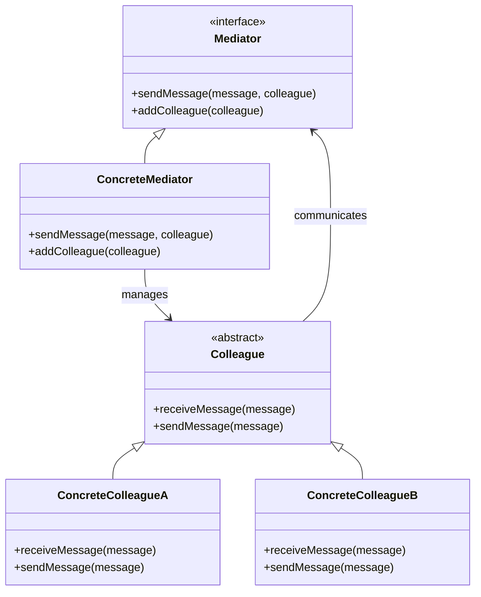

## 5.6.1 Implementing Mediator in Java

In the realm of software design, the Mediator pattern stands out as a powerful tool for managing complex communications between objects. By centralizing interactions, it reduces dependencies and enhances the maintainability of your code. In this section, we will delve into the intricacies of implementing the Mediator pattern in Java, providing you with a comprehensive guide that includes code examples, best practices, and visual aids.

### Understanding the Mediator Pattern

The Mediator pattern is a behavioral design pattern that encapsulates how a set of objects interact. Instead of objects communicating directly with each other, they communicate through a mediator. This reduces the dependencies between communicating objects, promoting loose coupling and enhancing scalability.

#### Key Concepts

- **Mediator**: The central object that facilitates communication between colleague objects.
- **Colleagues**: The objects that interact with each other through the mediator.

### Why Use the Mediator Pattern?

- **Reduced Complexity**: By centralizing communication, the Mediator pattern simplifies the interactions between objects.
- **Loose Coupling**: Colleagues are decoupled from each other, relying on the mediator for communication.
- **Enhanced Maintainability**: Changes to communication logic are localized within the mediator, making the system easier to maintain and extend.

### Implementing the Mediator Pattern in Java

Let's explore how to implement the Mediator pattern in Java through a step-by-step approach, complete with code examples.

#### Step 1: Define the Mediator Interface

The first step is to define an interface for the mediator. This interface will declare methods for communication between colleagues.

```java
// Mediator.java
public interface Mediator {
    void sendMessage(String message, Colleague colleague);
    void addColleague(Colleague colleague);
}
```

#### Step 2: Create the Concrete Mediator

Next, we implement the concrete mediator class. This class will manage the communication between colleagues.

```java
// ConcreteMediator.java
import java.util.ArrayList;
import java.util.List;

public class ConcreteMediator implements Mediator {
    private List<Colleague> colleagues;

    public ConcreteMediator() {
        this.colleagues = new ArrayList<>();
    }

    @Override
    public void sendMessage(String message, Colleague sender) {
        for (Colleague colleague : colleagues) {
            // Don't send the message back to the sender
            if (colleague != sender) {
                colleague.receiveMessage(message);
            }
        }
    }

    @Override
    public void addColleague(Colleague colleague) {
        colleagues.add(colleague);
    }
}
```

#### Step 3: Define the Colleague Class

Colleagues are the objects that communicate via the mediator. Each colleague holds a reference to the mediator.

```java
// Colleague.java
public abstract class Colleague {
    protected Mediator mediator;

    public Colleague(Mediator mediator) {
        this.mediator = mediator;
        mediator.addColleague(this);
    }

    public abstract void receiveMessage(String message);
    public abstract void sendMessage(String message);
}
```

#### Step 4: Implement Concrete Colleagues

Concrete colleagues extend the `Colleague` class and implement the communication logic.

```java
// ConcreteColleagueA.java
public class ConcreteColleagueA extends Colleague {

    public ConcreteColleagueA(Mediator mediator) {
        super(mediator);
    }

    @Override
    public void receiveMessage(String message) {
        System.out.println("Colleague A received: " + message);
    }

    @Override
    public void sendMessage(String message) {
        System.out.println("Colleague A sends: " + message);
        mediator.sendMessage(message, this);
    }
}

// ConcreteColleagueB.java
public class ConcreteColleagueB extends Colleague {

    public ConcreteColleagueB(Mediator mediator) {
        super(mediator);
    }

    @Override
    public void receiveMessage(String message) {
        System.out.println("Colleague B received: " + message);
    }

    @Override
    public void sendMessage(String message) {
        System.out.println("Colleague B sends: " + message);
        mediator.sendMessage(message, this);
    }
}
```

#### Step 5: Demonstrate the Mediator Pattern

Let's see the Mediator pattern in action with a simple demonstration.

```java
// MediatorPatternDemo.java
public class MediatorPatternDemo {
    public static void main(String[] args) {
        Mediator mediator = new ConcreteMediator();

        Colleague colleagueA = new ConcreteColleagueA(mediator);
        Colleague colleagueB = new ConcreteColleagueB(mediator);

        colleagueA.sendMessage("Hello, Colleague B!");
        colleagueB.sendMessage("Hi, Colleague A!");
    }
}
```

**Output:**
```
Colleague A sends: Hello, Colleague B!
Colleague B received: Hello, Colleague B!
Colleague B sends: Hi, Colleague A!
Colleague A received: Hi, Colleague A!
```

### Handling Different Communication Scenarios

The Mediator pattern can handle various communication scenarios, such as:

- **Broadcast Communication**: The mediator sends messages to all colleagues except the sender.
- **Targeted Communication**: The mediator sends messages to specific colleagues based on certain criteria.
- **Conditional Communication**: The mediator applies conditions before sending messages.

#### Example: Targeted Communication

Let's modify the mediator to support targeted communication.

```java
// TargetedMediator.java
public class TargetedMediator implements Mediator {
    private List<Colleague> colleagues;

    public TargetedMediator() {
        this.colleagues = new ArrayList<>();
    }

    @Override
    public void sendMessage(String message, Colleague sender) {
        for (Colleague colleague : colleagues) {
            if (colleague != sender && shouldReceiveMessage(colleague, message)) {
                colleague.receiveMessage(message);
            }
        }
    }

    private boolean shouldReceiveMessage(Colleague colleague, String message) {
        // Implement logic to determine if the colleague should receive the message
        return true; // For simplicity, all colleagues receive the message
    }

    @Override
    public void addColleague(Colleague colleague) {
        colleagues.add(colleague);
    }
}
```

### Best Practices for Designing Mediator Interfaces

- **Keep the Interface Simple**: Define only the necessary methods for communication.
- **Encapsulate Complex Logic**: The mediator should handle complex communication logic, keeping colleagues simple.
- **Promote Loose Coupling**: Ensure that colleagues do not depend on each other, but only on the mediator.
- **Use Descriptive Method Names**: Clearly name methods to reflect their purpose and actions.

### Visualizing the Mediator Pattern

To better understand the Mediator pattern, let's visualize the communication flow using a class diagram.



**Diagram Description**: This class diagram illustrates the relationships between the mediator, concrete mediator, and colleague classes. The mediator manages the communication between colleagues, which communicate through the mediator.

### Try It Yourself

Now that we've covered the basics of implementing the Mediator pattern in Java, try modifying the code examples to experiment with different communication scenarios. For instance, you can:

- Implement a new type of colleague and see how it interacts with existing colleagues.
- Modify the mediator to support conditional message delivery based on message content or sender identity.
- Extend the mediator to log all messages for debugging purposes.

### References and Further Reading

- [Design Patterns: Elements of Reusable Object-Oriented Software](https://en.wikipedia.org/wiki/Design_Patterns) by Erich Gamma, Richard Helm, Ralph Johnson, and John Vlissides.
- [Java Design Patterns](https://www.journaldev.com/1827/java-design-patterns-example-tutorial) - JournalDev
- [Mediator Pattern](https://refactoring.guru/design-patterns/mediator) - Refactoring Guru

### Knowledge Check

Before we conclude, let's reinforce what we've learned with a few questions and exercises.

## Quiz Time!



### What is the primary purpose of the Mediator pattern?

- [x] To centralize communication between objects
- [ ] To enhance object creation
- [ ] To manage object lifecycles
- [ ] To optimize memory usage

> **Explanation:** The Mediator pattern centralizes communication between objects, reducing dependencies and simplifying interactions.

### Which of the following is a benefit of using the Mediator pattern?

- [x] Loose coupling between objects
- [ ] Faster execution time
- [ ] Reduced memory usage
- [ ] Increased object creation speed

> **Explanation:** The Mediator pattern promotes loose coupling by decoupling objects and centralizing communication through a mediator.

### In the Mediator pattern, what role do colleague objects play?

- [x] They communicate through the mediator
- [ ] They manage the mediator
- [ ] They create new objects
- [ ] They optimize memory usage

> **Explanation:** Colleague objects communicate through the mediator, which manages their interactions.

### How does the Mediator pattern enhance maintainability?

- [x] By localizing communication logic within the mediator
- [ ] By reducing the number of classes
- [ ] By increasing execution speed
- [ ] By optimizing memory usage

> **Explanation:** The Mediator pattern enhances maintainability by localizing communication logic within the mediator, making it easier to modify and extend.

### Which method is typically included in a mediator interface?

- [x] sendMessage
- [ ] createObject
- [ ] optimizeMemory
- [ ] manageLifecycle

> **Explanation:** The `sendMessage` method is typically included in a mediator interface to facilitate communication between colleagues.

### What is a common use case for the Mediator pattern?

- [x] Managing complex communication in a chat application
- [ ] Optimizing database queries
- [ ] Enhancing memory allocation
- [ ] Speeding up object creation

> **Explanation:** The Mediator pattern is commonly used to manage complex communication scenarios, such as in chat applications.

### How can the Mediator pattern handle targeted communication?

- [x] By implementing logic to determine message recipients
- [ ] By creating new objects for each message
- [ ] By optimizing memory usage
- [ ] By reducing the number of classes

> **Explanation:** The Mediator pattern can handle targeted communication by implementing logic to determine which colleagues should receive a message.

### What is a best practice for designing mediator interfaces?

- [x] Keep the interface simple
- [ ] Include as many methods as possible
- [ ] Optimize for memory usage
- [ ] Focus on object creation speed

> **Explanation:** A best practice for designing mediator interfaces is to keep them simple, defining only the necessary methods for communication.

### True or False: The Mediator pattern increases the number of dependencies between objects.

- [ ] True
- [x] False

> **Explanation:** False. The Mediator pattern reduces dependencies between objects by centralizing communication through a mediator.

### How does the Mediator pattern promote loose coupling?

- [x] By decoupling colleagues and centralizing communication
- [ ] By increasing the number of classes
- [ ] By optimizing memory usage
- [ ] By speeding up object creation

> **Explanation:** The Mediator pattern promotes loose coupling by decoupling colleagues and centralizing their communication through a mediator.



Remember, mastering the Mediator pattern is just one step in your journey to becoming a design pattern expert. Keep experimenting, stay curious, and enjoy the process of learning and applying these powerful design principles!
