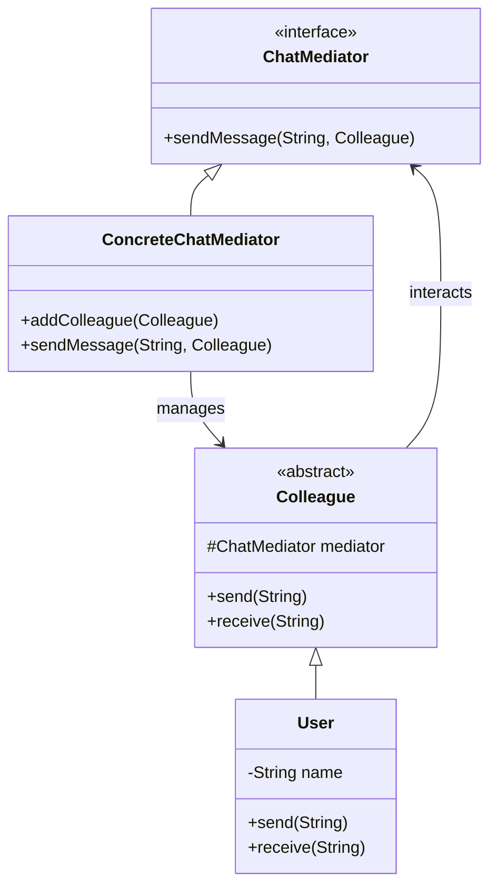
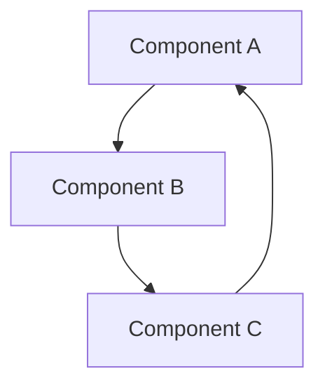
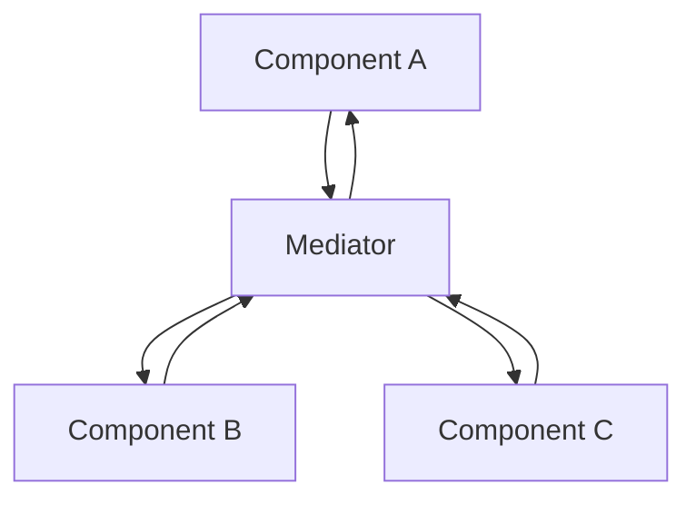

## 5.6.2 Reducing Tight Coupling

In the realm of software engineering, the concept of coupling refers to the degree of direct knowledge that one component has about another. Tight coupling occurs when components are highly dependent on each other, leading to systems that are difficult to maintain, extend, and test. This section delves into how the Mediator pattern can be employed to reduce tight coupling, thereby promoting loose coupling, enhancing modularity, and improving maintainability.

### Understanding Tight Coupling

Tight coupling is a scenario where classes or components are interconnected in such a way that a change in one necessitates changes in the other. This dependency can lead to several drawbacks:

- **Rigidity**: The system becomes difficult to change because a modification in one part requires changes in others.
- **Fragility**: A change in one component can lead to unexpected failures in another.
- **Limited Reusability**: Components are not easily reusable in different contexts because they are designed to work with specific other components.
- **Complex Testing**: Testing becomes cumbersome as it requires setting up multiple interdependent components.

#### Example of Tight Coupling

Consider a simple chat application where different user interface components (like text boxes, buttons, and message displays) directly communicate with each other. This direct communication can lead to a tightly coupled system:

```java
public class ChatBox {
    private TextBox textBox;
    private Button sendButton;
    private MessageDisplay messageDisplay;

    public ChatBox() {
        this.textBox = new TextBox();
        this.sendButton = new Button();
        this.messageDisplay = new MessageDisplay();
        
        sendButton.setOnClickListener(() -> {
            String message = textBox.getText();
            messageDisplay.showMessage(message);
        });
    }
}
```

In this example, `ChatBox` directly interacts with `TextBox`, `Button`, and `MessageDisplay`, making it difficult to modify or replace any component without affecting others.

### Promoting Loose Coupling with the Mediator Pattern

The Mediator pattern addresses the issue of tight coupling by introducing a mediator object that encapsulates how a set of objects interact. Instead of communicating directly, objects interact through the mediator, which reduces the dependencies between them.

#### Key Benefits of the Mediator Pattern

- **Reduced Dependencies**: Objects no longer need to know about the implementation details of other objects.
- **Improved Modularity**: Components can be modified independently as long as they adhere to the mediator's interface.
- **Enhanced Maintainability**: Changes to the system are localized to the mediator, minimizing the impact on other components.
- **Simplified Communication**: The mediator centralizes communication logic, making it easier to understand and maintain.

#### Implementing the Mediator Pattern

Let's refactor the chat application using the Mediator pattern:

```java
// Mediator Interface
public interface ChatMediator {
    void sendMessage(String message, Colleague colleague);
}

// Concrete Mediator
public class ConcreteChatMediator implements ChatMediator {
    private List<Colleague> colleagues;

    public ConcreteChatMediator() {
        this.colleagues = new ArrayList<>();
    }

    public void addColleague(Colleague colleague) {
        colleagues.add(colleague);
    }

    @Override
    public void sendMessage(String message, Colleague colleague) {
        for (Colleague c : colleagues) {
            // message should not be received by the sender
            if (c != colleague) {
                c.receive(message);
            }
        }
    }
}

// Colleague Interface
public abstract class Colleague {
    protected ChatMediator mediator;

    public Colleague(ChatMediator mediator) {
        this.mediator = mediator;
    }

    public abstract void send(String message);
    public abstract void receive(String message);
}

// Concrete Colleague
public class User extends Colleague {
    private String name;

    public User(ChatMediator mediator, String name) {
        super(mediator);
        this.name = name;
    }

    @Override
    public void send(String message) {
        System.out.println(this.name + " sends: " + message);
        mediator.sendMessage(message, this);
    }

    @Override
    public void receive(String message) {
        System.out.println(this.name + " receives: " + message);
    }
}
```

#### Explanation of the Code

- **ChatMediator**: An interface that defines the method for sending messages.
- **ConcreteChatMediator**: Implements the mediator interface and manages communication between colleagues.
- **Colleague**: An abstract class representing an entity that interacts with the mediator.
- **User**: A concrete implementation of a colleague that can send and receive messages.

In this setup, the `User` objects do not communicate directly with each other. Instead, they use the `ConcreteChatMediator` to send and receive messages, reducing direct dependencies.

### Visualizing the Mediator Pattern

Below is a class diagram illustrating the Mediator pattern:



### Comparing Coupled and Decoupled Interactions

To further illustrate the benefits of the Mediator pattern, let's compare the interactions in tightly coupled and decoupled systems:

#### Tightly Coupled Interaction

In a tightly coupled system, components communicate directly, leading to a web of dependencies:



#### Decoupled Interaction with Mediator

With the Mediator pattern, components communicate through a central mediator, reducing dependencies:



### Improving Modularity and Maintainability

By reducing tight coupling, the Mediator pattern significantly enhances the modularity and maintainability of a system:

- **Modularity**: Components can be developed, tested, and maintained independently, as they rely on the mediator for interaction.
- **Maintainability**: Changes to the interaction logic are confined to the mediator, minimizing the impact on individual components.

### Try It Yourself

To gain a deeper understanding of the Mediator pattern, try modifying the example code:

- **Add a New Colleague**: Implement a new type of colleague that interacts with the mediator.
- **Change the Communication Logic**: Modify the mediator to filter messages based on certain criteria.
- **Implement a GUI**: Create a simple graphical user interface for the chat application using Java Swing or JavaFX.

### Knowledge Check

Before we conclude, let's reinforce what we've learned:

- **What is tight coupling, and why is it problematic?**
- **How does the Mediator pattern promote loose coupling?**
- **What are the benefits of using the Mediator pattern in terms of modularity and maintainability?**

### Embrace the Journey

Remember, mastering design patterns like the Mediator pattern is a journey. As you continue to explore and apply these patterns, you'll build more robust and maintainable systems. Keep experimenting, stay curious, and enjoy the journey!

## Quiz Time!



### What is tight coupling?

- [x] A scenario where components are highly dependent on each other
- [ ] A design pattern that promotes loose coupling
- [ ] A method of optimizing code performance
- [ ] A technique for encapsulating data

> **Explanation:** Tight coupling occurs when components are highly dependent on each other, making the system rigid and difficult to maintain.


### How does the Mediator pattern reduce tight coupling?

- [x] By introducing a mediator object to manage interactions
- [ ] By allowing direct communication between components
- [ ] By optimizing code performance
- [ ] By encapsulating data within objects

> **Explanation:** The Mediator pattern reduces tight coupling by introducing a mediator object that manages interactions, reducing direct dependencies between components.


### What is a key benefit of the Mediator pattern?

- [x] Improved modularity
- [ ] Increased code complexity
- [ ] Direct communication between components
- [ ] Reduced performance

> **Explanation:** The Mediator pattern improves modularity by reducing dependencies between components, allowing them to be developed and maintained independently.


### Which of the following is a drawback of tight coupling?

- [x] Limited reusability
- [ ] Enhanced modularity
- [ ] Simplified testing
- [ ] Improved performance

> **Explanation:** Tight coupling limits reusability because components are designed to work with specific other components, making them difficult to reuse in different contexts.


### In the Mediator pattern, who manages the communication between components?

- [x] The mediator object
- [ ] Each individual component
- [ ] A central controller
- [ ] The main application class

> **Explanation:** In the Mediator pattern, the mediator object manages communication between components, reducing direct dependencies.


### What is a common use case for the Mediator pattern?

- [x] Chat applications
- [ ] Sorting algorithms
- [ ] Data encryption
- [ ] File compression

> **Explanation:** The Mediator pattern is commonly used in chat applications to manage communication between different user interface components.


### Which of the following patterns is most similar to the Mediator pattern in terms of reducing dependencies?

- [x] Observer pattern
- [ ] Singleton pattern
- [ ] Factory pattern
- [ ] Builder pattern

> **Explanation:** The Observer pattern is similar to the Mediator pattern in terms of reducing dependencies by decoupling components.


### What is a potential downside of using the Mediator pattern?

- [x] The mediator can become a complex central point
- [ ] Increased coupling between components
- [ ] Reduced modularity
- [ ] Simplified communication logic

> **Explanation:** A potential downside of the Mediator pattern is that the mediator can become a complex central point, making it difficult to manage.


### How does the Mediator pattern affect testing?

- [x] It simplifies testing by reducing dependencies
- [ ] It complicates testing by increasing dependencies
- [ ] It has no impact on testing
- [ ] It requires additional testing frameworks

> **Explanation:** The Mediator pattern simplifies testing by reducing dependencies between components, making it easier to isolate and test individual components.


### True or False: The Mediator pattern is only applicable to graphical user interfaces.

- [ ] True
- [x] False

> **Explanation:** False. While the Mediator pattern is often used in graphical user interfaces, it can be applied to any system where reducing tight coupling is beneficial.


