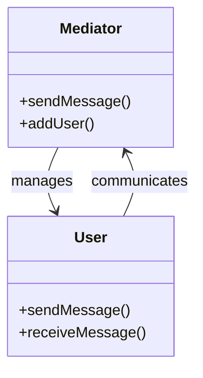
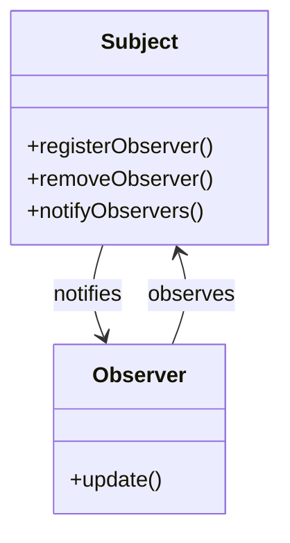

## 5.6.3 Mediator vs. Observer Pattern

In the realm of software design patterns, the Mediator and Observer patterns are both pivotal in managing interactions between objects. While they share the common goal of decoupling components to enhance flexibility and maintainability, they achieve this in distinct ways. This section will delve into the key differences between these two patterns, explore scenarios where one is more suitable than the other, and provide examples to illustrate these differences. We will also discuss how these patterns can sometimes be combined to create robust systems.

### Understanding the Mediator Pattern

The Mediator pattern centralizes complex communications and control logic between objects in a system. Instead of having objects communicate directly with each other, they interact through a mediator object. This pattern is particularly useful in systems where multiple objects interact in complex ways, as it reduces the dependencies between them and simplifies communication.

#### Key Characteristics of the Mediator Pattern

- **Centralized Control**: The mediator acts as a hub for communication, managing interactions between objects.
- **Reduced Coupling**: Objects do not need to know about each other; they only need to know the mediator.
- **Simplified Object Interactions**: By centralizing communication, the mediator can manage complex interactions more easily.

#### Code Example: Mediator Pattern in Java

Let's consider a chat room application where users can send messages to each other. The mediator pattern can be used to manage the communication between users.

```java
// User interface
interface User {
    void sendMessage(String message);
    void receiveMessage(String message);
}

// Concrete User
class ChatUser implements User {
    private String name;
    private ChatMediator mediator;

    public ChatUser(String name, ChatMediator mediator) {
        this.name = name;
        this.mediator = mediator;
    }

    @Override
    public void sendMessage(String message) {
        System.out.println(this.name + " sends: " + message);
        mediator.sendMessage(message, this);
    }

    @Override
    public void receiveMessage(String message) {
        System.out.println(this.name + " receives: " + message);
    }
}

// Mediator interface
interface ChatMediator {
    void sendMessage(String message, User user);
    void addUser(User user);
}

// Concrete Mediator
class ChatRoom implements ChatMediator {
    private List<User> users = new ArrayList<>();

    @Override
    public void sendMessage(String message, User user) {
        for (User u : users) {
            if (u != user) {
                u.receiveMessage(message);
            }
        }
    }

    @Override
    public void addUser(User user) {
        users.add(user);
    }
}

// Usage
public class MediatorPatternDemo {
    public static void main(String[] args) {
        ChatMediator chatRoom = new ChatRoom();

        User user1 = new ChatUser("Alice", chatRoom);
        User user2 = new ChatUser("Bob", chatRoom);
        User user3 = new ChatUser("Charlie", chatRoom);

        chatRoom.addUser(user1);
        chatRoom.addUser(user2);
        chatRoom.addUser(user3);

        user1.sendMessage("Hello everyone!");
    }
}
```

### Understanding the Observer Pattern

The Observer pattern defines a one-to-many dependency between objects so that when one object changes state, all its dependents are notified and updated automatically. This pattern is particularly useful in scenarios where a change in one object needs to be reflected across multiple objects.

#### Key Characteristics of the Observer Pattern

- **Decoupled Notification**: Observers are notified of changes in the subject without the subject needing to know the details of the observers.
- **Dynamic Subscription**: Observers can be added or removed at runtime, providing flexibility.
- **Automatic Updates**: Observers are automatically updated when the subject changes state.

#### Code Example: Observer Pattern in Java

Consider a weather station application where multiple display devices need to be updated whenever the weather data changes.

```java
// Subject interface
interface WeatherSubject {
    void registerObserver(WeatherObserver observer);
    void removeObserver(WeatherObserver observer);
    void notifyObservers();
}

// Observer interface
interface WeatherObserver {
    void update(float temperature, float humidity, float pressure);
}

// Concrete Subject
class WeatherData implements WeatherSubject {
    private List<WeatherObserver> observers;
    private float temperature;
    private float humidity;
    private float pressure;

    public WeatherData() {
        observers = new ArrayList<>();
    }

    public void setMeasurements(float temperature, float humidity, float pressure) {
        this.temperature = temperature;
        this.humidity = humidity;
        this.pressure = pressure;
        notifyObservers();
    }

    @Override
    public void registerObserver(WeatherObserver observer) {
        observers.add(observer);
    }

    @Override
    public void removeObserver(WeatherObserver observer) {
        observers.remove(observer);
    }

    @Override
    public void notifyObservers() {
        for (WeatherObserver observer : observers) {
            observer.update(temperature, humidity, pressure);
        }
    }
}

// Concrete Observer
class CurrentConditionsDisplay implements WeatherObserver {
    private float temperature;
    private float humidity;

    @Override
    public void update(float temperature, float humidity, float pressure) {
        this.temperature = temperature;
        this.humidity = humidity;
        display();
    }

    public void display() {
        System.out.println("Current conditions: " + temperature + "F degrees and " + humidity + "% humidity");
    }
}

// Usage
public class ObserverPatternDemo {
    public static void main(String[] args) {
        WeatherData weatherData = new WeatherData();

        CurrentConditionsDisplay currentDisplay = new CurrentConditionsDisplay();
        weatherData.registerObserver(currentDisplay);

        weatherData.setMeasurements(80, 65, 30.4f);
        weatherData.setMeasurements(82, 70, 29.2f);
    }
}
```

### Key Differences Between Mediator and Observer Patterns

#### 1. Communication Style

- **Mediator Pattern**: Centralizes communication through a mediator object. Objects interact by sending messages to the mediator, which then forwards them to the appropriate recipients.
- **Observer Pattern**: Establishes a direct notification mechanism. The subject notifies all registered observers of changes, and each observer handles the update independently.

#### 2. Coupling

- **Mediator Pattern**: Reduces coupling by having objects communicate through a mediator. This centralization can simplify complex interactions but may lead to a monolithic mediator if not managed carefully.
- **Observer Pattern**: Allows for loose coupling between the subject and observers. Observers can be added or removed dynamically, and the subject does not need to know the details of the observers.

#### 3. Use Cases

- **Mediator Pattern**: Ideal for scenarios where multiple objects need to interact in complex ways, such as GUI components or chat applications.
- **Observer Pattern**: Suitable for scenarios where a change in one object needs to be propagated to multiple dependent objects, such as event handling or data binding.

### Scenarios Where One Pattern is More Appropriate

#### When to Use the Mediator Pattern

- **Complex Interactions**: When multiple objects need to interact in complex ways, and direct communication would lead to a tangled web of dependencies.
- **Centralized Control**: When you want to centralize control logic and manage interactions from a single point.
- **Decoupling Components**: When you need to decouple components to enhance maintainability and scalability.

#### When to Use the Observer Pattern

- **State Changes**: When you need to notify multiple objects of changes in another object’s state.
- **Dynamic Subscription**: When you want to allow observers to subscribe or unsubscribe dynamically.
- **Decoupled Notification**: When you need a decoupled notification mechanism that allows for independent updates.

### Combining Mediator and Observer Patterns

In some cases, it may be beneficial to combine the Mediator and Observer patterns to leverage the strengths of both. For instance, a mediator can be used to manage complex interactions between components, while the observer pattern can be used within each component to handle state changes and updates.

#### Example: Combining Mediator and Observer Patterns

Consider a smart home system where different devices (lights, thermostat, security cameras) interact through a central hub (mediator). Each device can also have its own state changes that need to be communicated to other components (observer).

```java
// Mediator interface
interface SmartHomeMediator {
    void sendCommand(String command, SmartDevice device);
    void addDevice(SmartDevice device);
}

// Observer interface
interface DeviceObserver {
    void update(String state);
}

// Concrete Mediator
class SmartHomeHub implements SmartHomeMediator {
    private List<SmartDevice> devices = new ArrayList<>();

    @Override
    public void sendCommand(String command, SmartDevice device) {
        for (SmartDevice d : devices) {
            if (d != device) {
                d.receiveCommand(command);
            }
        }
    }

    @Override
    public void addDevice(SmartDevice device) {
        devices.add(device);
    }
}

// Smart Device interface
interface SmartDevice {
    void receiveCommand(String command);
    void addObserver(DeviceObserver observer);
    void removeObserver(DeviceObserver observer);
    void notifyObservers();
}

// Concrete Smart Device
class Light implements SmartDevice {
    private List<DeviceObserver> observers = new ArrayList<>();
    private String state;

    @Override
    public void receiveCommand(String command) {
        this.state = command;
        notifyObservers();
    }

    @Override
    public void addObserver(DeviceObserver observer) {
        observers.add(observer);
    }

    @Override
    public void removeObserver(DeviceObserver observer) {
        observers.remove(observer);
    }

    @Override
    public void notifyObservers() {
        for (DeviceObserver observer : observers) {
            observer.update(state);
        }
    }
}

// Usage
public class SmartHomeDemo {
    public static void main(String[] args) {
        SmartHomeMediator hub = new SmartHomeHub();

        SmartDevice light = new Light();
        hub.addDevice(light);

        DeviceObserver lightObserver = new DeviceObserver() {
            @Override
            public void update(String state) {
                System.out.println("Light state changed to: " + state);
            }
        };

        light.addObserver(lightObserver);

        light.receiveCommand("ON");
        hub.sendCommand("OFF", light);
    }
}
```

### Visualizing the Differences

To better understand the differences between the Mediator and Observer patterns, let's visualize their interactions using Mermaid.js diagrams.

#### Mediator Pattern Diagram



#### Observer Pattern Diagram



### Try It Yourself

To deepen your understanding, try modifying the code examples provided:

- **Mediator Pattern**: Add a new type of user with special privileges in the chat room. Implement logic in the mediator to handle these privileges.
- **Observer Pattern**: Implement a new display device in the weather station example that shows the weather forecast based on the current conditions.

### Knowledge Check

Before proceeding, consider these questions:

- What are the main differences between the Mediator and Observer patterns?
- In what scenarios would you choose the Mediator pattern over the Observer pattern?
- How can the two patterns be combined to enhance system design?

### Conclusion

The Mediator and Observer patterns are powerful tools in the software engineer's toolkit, each serving distinct purposes in managing object interactions. By understanding their differences and appropriate use cases, you can design systems that are both flexible and maintainable. Remember, this is just the beginning. As you progress, you'll build more complex and interactive systems. Keep experimenting, stay curious, and enjoy the journey!

## Quiz Time!



### What is the primary purpose of the Mediator pattern?

- [x] To centralize communication between objects
- [ ] To notify multiple objects of state changes
- [ ] To encapsulate a request as an object
- [ ] To define a one-to-many dependency

> **Explanation:** The Mediator pattern centralizes communication between objects, reducing direct dependencies.

### Which pattern is more suitable for managing complex interactions between multiple objects?

- [x] Mediator Pattern
- [ ] Observer Pattern
- [ ] Command Pattern
- [ ] Strategy Pattern

> **Explanation:** The Mediator pattern is ideal for managing complex interactions by centralizing communication through a mediator.

### How does the Observer pattern notify observers of changes?

- [x] By calling update methods on registered observers
- [ ] By sending messages through a mediator
- [ ] By encapsulating requests as objects
- [ ] By using a centralized control object

> **Explanation:** The Observer pattern notifies observers by calling their update methods when the subject's state changes.

### In which scenario would you choose the Observer pattern over the Mediator pattern?

- [x] When you need to notify multiple objects of state changes
- [ ] When you need to centralize control logic
- [ ] When you need to encapsulate requests
- [ ] When you need to manage complex interactions

> **Explanation:** The Observer pattern is suitable for scenarios where multiple objects need to be notified of state changes.

### Can the Mediator and Observer patterns be combined in a system?

- [x] Yes
- [ ] No

> **Explanation:** The Mediator and Observer patterns can be combined to leverage the strengths of both, managing complex interactions and state changes.

### What is a key benefit of using the Mediator pattern?

- [x] Reduced coupling between objects
- [ ] Automatic updates to observers
- [ ] Encapsulation of requests
- [ ] Dynamic subscription of observers

> **Explanation:** The Mediator pattern reduces coupling by having objects communicate through a mediator.

### Which pattern allows for dynamic subscription and unsubscription of observers?

- [x] Observer Pattern
- [ ] Mediator Pattern
- [ ] Command Pattern
- [ ] Strategy Pattern

> **Explanation:** The Observer pattern allows for dynamic subscription and unsubscription of observers, providing flexibility.

### What is a potential downside of the Mediator pattern?

- [x] The mediator can become a monolithic object
- [ ] Observers cannot be dynamically added
- [ ] It tightly couples objects
- [ ] It does not allow for centralized control

> **Explanation:** A potential downside of the Mediator pattern is that the mediator can become a monolithic object if not managed carefully.

### How does the Mediator pattern affect object dependencies?

- [x] It reduces dependencies between objects
- [ ] It increases dependencies between objects
- [ ] It has no effect on dependencies
- [ ] It creates a one-to-many dependency

> **Explanation:** The Mediator pattern reduces dependencies between objects by centralizing communication through a mediator.

### True or False: The Observer pattern is used to centralize control logic.

- [ ] True
- [x] False

> **Explanation:** False. The Observer pattern is used to notify multiple objects of state changes, not to centralize control logic.


